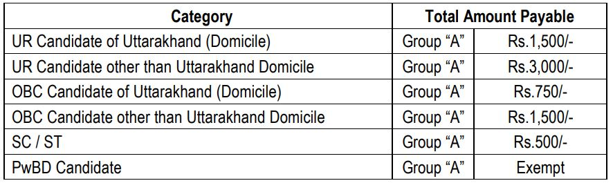

AIIMS Rishikesh Nursing Officer Recruitment 2019: All India Institute of Medical Sciences, Rishikesh Has issued Advertisement for recruitment of Nursing officer. Online Applications are invited from eligible candidates for filling up posts of Nursing Officer (Staff Nurse Grade-II) on Direct Recruitment Basis in All India Institute of Medical Sciences. AIIMS Rishikesh Nursing Officer Online Form 2019 will be accepted online Before 24-12-2019, 11:59 PM.

## **AIIMS Rishikesh Recruitment 2019 For Nursing Officer 372 Vacancies**

<table style="border-collapse: collapse; width: 100%;"><tbody><tr><td style="width: 50%; background-color: #2a5a8e;" colspan="2"><h3 style="text-align: center;"><strong>AIIMS Recruitment 2019</strong></h3></td></tr><tr><td style="width: 50%; text-align: center;">Job Recruitment Board</td><td style="width: 50%; text-align: center;">All India Institute of Medical Sciences, Rishikesh</td></tr><tr><td style="width: 50%; text-align: center;">Advertisement No.</td><td style="width: 50%; text-align: center;">Advt # 2019/256/09/11/2019</td></tr><tr><td style="width: 50%; text-align: center;">Post</td><td style="width: 50%; text-align: center;">Nursing Officer (Staff Nurse Grade-II)</td></tr><tr><td style="width: 50%; text-align: center;">Vacancies</td><td style="width: 50%; text-align: center;">372 Posts</td></tr><tr><td style="width: 50%; text-align: center;">Job Location</td><td style="width: 50%; text-align: center;">AIIMS Rishikesh</td></tr><tr><td style="width: 50%; text-align: center;">Job Type</td><td style="width: 50%; text-align: center;">State Jobs</td></tr><tr><td style="width: 50%; text-align: center;">Application Mode</td><td style="width: 50%; text-align: center;">Online</td></tr></tbody></table>

AIIMS Rishikesh Nursing Officer Recruitment 2019 Notification Published on his Official website on 29 October 2019. AIIMS Rishikesh Jobs Notification Regarding Filling up 372 posts of Nursing Officer. The candidates should possess an essential education qualification such as B.Sc Nursing, Diploma in General Nursing With Two Years Experience. to know More AIIMS Rishikesh Nursing Officer Recruitment Details Like Education Qualification, Experience, Age limits, Salary/Pay Scale, How to Apply, etc Given Below on this Page.

<table style="border-collapse: collapse;"><tbody><tr><td style="width: 50%; background-color: #2a5a8e;" colspan="2"><h3 style="text-align: center;"><strong>AIIMS Important Dates</strong></h3></td></tr><tr><td style="width: 50%; text-align: center;">Starting Date for on-line registration of Applications Form</td><td style="width: 50%; text-align: center;">09-11-2019</td></tr><tr><td style="width: 50%; text-align: center;">Last date of submission of Application Form</td><td style="width: 50%; text-align: center;">24-12-2019</td></tr></tbody></table>

### **AIIMS Rishikesh Vacancy Details**

- Nursing Officer (Staff Nurse Grade-II)Group: ‘B’: 372 Posts

**Category Wise AIIMS Rishikesh Vacancy Details**

### **Eligibility Criteria For AIIMS Rishikesh Nursing Officer**

**Education Qualification**

- B.Sc. (Hons.) Nursing / B.Sc. Nursing from an Indian Nursing Council recognized Institute/University **OR** B.Sc. (Post-certificate) / Post Basic B.Sc. Nursing from an Indian Nursing Council recognized Institute/University
- Registered as Nurses & Midwife in State / Indian Nursing Council.

**OR**

- Diploma in General Nursing Midwifery from an Indian Nursing Council recognized Institute / Board or Council
- Registered as Nurses & Midwife in State/Indian Nursing Council;
- Two years’ experience in a minimum of 50 bedded Hospital

**Age Limits**

- Minimum 21 Years
- Maximum 30 Years

**Age Relaxation**

- SC/ST Candidates: 5 Years
- OBC Candidates: 3 Years
- Orthopedic Physical Handicapped:
    - General Candidates: 10 Years
    - OBC Candidates: 13 Years
    - SC/ST Candidates: 15 Years

### **AIIMS Rishikesh Nursing Officer Salary/Pay Scale**

- Rs. 9300-34800 with Grade pay of Rs. 4600/- \[Level 7 as per 7th CPC (Rs.44900-142400)

### **AIIMS Rishikesh Nursing Officer Selection Process**

1. Written Test
2. Skill Test
3. Interview

### **Application Fee**

### **AIIMS Rishikesh Nursing Officer Admit Card 2019**

Candidates with the valid application shall be issued call letter & admit card. These can be downloaded by candidates directly from the AIIMS, Rishikesh website by entering With Their ID & Password. Call letters will not be sent by post. This facility would be available on the website 15 days before the actual date of examination.

### **Probation**

- The period of Probation shall be of 2 years.

### **How to Fillup AIIMS Rishikesh Nursing Officer Online Form**

1. Candidates First Go to AIIMS Exams Official Website: https://www.aiimsexams.org
2. Find AIIMS Rishikesh Nursing Officer Recruitment  Notification and Click on.
3. Register On AIIMS Exams website and Get Candidates ID and Password.
4. Log in With your ID & Password.
5. Fillup Required Information.
6. Upload Documents & Images.
7. Pay Application Fee Via Online.
8. Submit Application.
9. Download & Save Application For Future Use.
10. Done.

### **Important For AIIMS Rishikesh Nursing Officer Recruitment**

- AIIMS Rishikesh Nursing Officer Online Form 2019: [Registration](https://cdn3.digialm.com//EForms/configuredHtml/1675/63534/Registration.html "AIIMS, Rishikesh") | [Login](https://cdn3.digialm.com//EForms/configuredHtml/1675/63534/login.html "AIIMS, Rishikesh")
- Download AIIMS Rishikesh Nursing Officer Recruitment 2019 Notification PDF: [Click Here](https://freegovtjobalert.in/wp-content/uploads/2019/10/Notification-AIIMS-Rishikesh-Nursing-Officer-372-Posts.pdf)
- AIIMS Rishikesh Official Website: [Click Here](http://aiimsrishikesh.edu.in/)

**Instruction for Candidates**

- In the case of Permanent Government Employees who have rendered not less than 3 years regular and continuous service in the relevant field as on closing date for receipt of the application, relaxable up to a maximum period of 5 years.
- Relaxation in upper age limit in favor of Contractual employees of AIIMS Rishikesh considered for a period of his or her continuous service in AIIMS Rishikesh in the equivalent post or up to 5 years, whichever is less, as a one-time dispensation.
- Relaxation to the upper age limit in favor of Ex-servicemen will be as per the Govt. of India rule.
- No documents including printed/hard copy of online application form are required to be sent by post. However, applicants are advised to keep one printed/hard copy of their application forms for submission at the time of the Interview.
- Candidates are required to give their preferences amongst three choices of centers. The exact center will be given at the time of the issue of the admit card. An effort will be made to allot centers to a candidate according to their given preferences. However, in case of non-availability of a slot at their preferred choices, the closest other centers will be allotted. The decision of AIIMS, Rishikesh will be final in this regard.
- Applicants in regular employment must submit a “NO OBJECTION CERTIFICATE” from employers at the time of the Interview.
