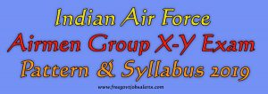

**Indian Air Force airmen Exam Pattern & Syllabus 2019**: IAF Has Published the Notification for the Recruitment of airmen Group X Y. If You Are Interested in This Post, You Can Apply Online Before 15 July 2019. Please Read the Notification Before Applying Online. you Can Find Here, Indian Air Force airmen Syllabus 2019, IAF Airmen Exam Syllabus Written Test 2019, Air Force Group X Syllabus 2019, Check Indian Air Force airmen Exam Pattern airmen Syllabus, airmen Exam Pattern & Syllabus 2019, IAF airmen Exam Syllabus 2019, Indian Air Force Group Y Syllabus 2019 Download. You Can Check the Official Notification for Full Detail.

\[caption id="attachment\_283" align="aligncenter" width="645"\] Airman Exam Pattern & Syllabus\[/caption\]

> ## Indian air force recruitment 2019 for Airmen in Group X-Y [Apply Online Now](https://freegovtjobalert.in/indian-air-force-recruitment-2019airmen-in-group-x-y/) 

## Indian Air Force airmen Exam Pattern

SEQUENCE OF EXAMINATION:

1. Written Test
2. Document Verification
3. Physical Fitness Test (PFT)
4. Adaptation Test-1
5. Adaptation Test-2
6. Medical Examination

> ## Airmen Group X-Y Written Test/ Online Test

<table style="border-collapse: collapse; width: 74.5624%; height: 176px;"><tbody><tr style="height: 22px;"><td style="width: 33.3333%; text-align: center; height: 22px; background-color: #2a5a8e;"><strong>Name of Post</strong></td><td style="width: 33.3333%; text-align: center; height: 22px; background-color: #2a5a8e;"><strong>Time Duration</strong></td><td style="width: 33.3333%; text-align: center; height: 22px; background-color: #2a5a8e;" width="289"><strong>Syllabus/Subjects</strong></td></tr><tr style="height: 44px;"><td style="width: 33.3333%; text-align: center; height: 44px;">Group ‘X’ Trades</td><td style="width: 33.3333%; text-align: center; height: 44px;">60 Minutes</td><td style="width: 33.3333%; text-align: center; height: 44px;">English, Physics, and Mathematics</td></tr><tr style="height: 44px;"><td style="width: 33.3333%; text-align: center; height: 44px;">Group ‘Y’ Trades</td><td style="width: 33.3333%; text-align: center; height: 44px;">45 Minutes</td><td style="width: 33.3333%; text-align: center; height: 44px;">English, Reasoning &amp; General Awareness (RAGA)</td></tr><tr style="height: 66px;"><td style="width: 33.3333%; text-align: center; height: 66px;">Both Group ‘X&amp;Y’ Trades</td><td style="width: 33.3333%; text-align: center; height: 66px;">85 Minutes</td><td style="width: 33.3333%; text-align: center; height: 66px;">English, Physics and Mathematics and Reasoning &amp; General Awareness (RAGA)</td></tr></tbody></table>

Marking pattern for Online Test:-

1. One mark for every correct answer.
2. Nil (0) marks for unattempted question.
3. 0.25 marks shall be deducted for each wrong answer.

> ## Airmen in Group X-Y Document Verification

After the declaration of the result of Phase-I (Online) Test, a cut off will be applied based on the marks scored by the candidates in the Phase-I Test and SHORTLISTED candidates will be sent a **new admit card on their Registered e-mail ID** for phase - II test at an Airmen Selection Centre. This admit card for phase – II exam can also be downloaded online under candidate’s login on CASB web portal [**www.airmenselection.cdac.in**](http://www.airmenselection.cdac.in). Candidates have to report at the stipulated date and time for Phase – II at the designated Airmen Selection Centre along with following documents:-

1. Colour print out of Admit Card for phase – II.
2. Colour Print out of duly filled application form downloaded on completion of online registration.
3. HB Pencil, Eraser, Sharpener, Glue stick, Stapler and Black/Blue Ball Point Pen for writing.
4. Eight copies of unattested recent (which was used for the online application registration) passport size colour photograph.
5. Original and four self-attested photocopies of Matriculation Passing Certificate (required for verification of Candidate’s Name, Father’s Name and his Date of Birth).
6. Original and four self-attested photocopies of Matriculation Marks Sheet (only applicable for three years Diploma Course holders when English is not a subject in Diploma Course).
7. Original and four self-attested photocopies of Intermediate/10+2/Equivalent Examination Passing Certificate and Marks Sheet. OR Original and four self-attested photocopies of Three years Diploma Course Passing Certificate and Marks Sheets of all semesters.
8. Certificate for SOAFP (Son of Air Force Personnel), a certificate for sons of serving/retired/ deceased Air Force civilian employees paid out of defence estimates are to be downloaded as the case may be, from the download section of CASB web portal and brought along while reporting for phase –II of the examination.
9. For Candidates discharged from Indian Army/Indian Navy/Any other Government Organisation. Original and four Self-attested photocopies of Discharge Certificate (as issued from Indian Army/Indian Navy/Government Organisation).
10. Original Phase - I admit card used during Phase – I test bearing Air Force seal and invigilator’s signature.
11. NOC in original and 4 self-attested photocopies from the employer for candidates presently serving in any government organization (if applicable).
12. Original and four self-attested photocopies of NCC ‘A’, ‘B’ or ‘C’ certificate (if applicable).

> ## Indian Air Force airmen Physical Fitness Test (PFT)

Names of the shortlisted candidates, who qualify the Online Test, shall be displayed on the CASB Web Portal **www.airmenselection.cdac.in** and on a stipulated date shall be called at designated Airmen Selection Centre for Physical Fitness Test (PFT)

- 1.6 Km run to be completed within 06 minutes 30 seconds.
- 10 Push-ups
- 10 Sit-ups 
- 20 Squats

(Note: Candidates are advised to bring their sports shoes and shorts/Track pants.)

> ## Adaptation Test-1

All candidates who pass the Physical Fitness Test (PFT) shall have to undertake Adaptability Test-I (objective type is written test) which is to assess the suitability of a candidate for employment in the IAF which involves deployment in varied geographic terrain, weather and operational conditions.

> ## Adaptation Test-2

All candidates who pass Adaptability Test - I shall have to undertake Adaptability Test- II as per policy in vogue. Adaptability Test- II is to select candidates who can adapt to the environment of the Indian Air Force and are able to adjust to the military way of life.

> ## Medical Examination

Candidates who qualify Adaptability Test-II shall be issued with medical appointment letter at respective ASCs. It can also be downloaded under candidates login on CASB web portal **www.airmenselection.cdac.in** for their medical examination at designated Medical Boarding Centre (MBC) on the specified date. Medical Examination shall be conducted by Air Force Medical Team as per IAF medical standards and policy in vogue on subject issue.

A medical examination would also include Baseline Investigation of:-

1.Blood Haemogram - Hb, TLC, DLC

2.Urine RE/ME

3.Biochemistry

- Blood Sugar Fasting & PP
- Serum Cholesterol
- Urea, Uric acid, Creatinine
- LFT—Serum Bilirubin, SGOT, SGPT

4.X- Ray chest (PA view)

5.ECG (R)

6.Tests for Narcotic Drug and Psychotropic Substance Abuse

> ## Indian Air Force airmen Group X-Y Syllabus 2019

## Air Force Group X Syllabus 2019

<table style="border-collapse: collapse; width: 84.3284%; height: 683px;"><tbody><tr style="height: 21px;"><td style="width: 29.4871%; text-align: center; height: 21px; background-color: #2a5a8e;"><strong>ENGLISH</strong></td><td style="width: 37.1795%; text-align: center; height: 21px; background-color: #2a5a8e;"><strong>PHYSICS</strong></td><td style="width: 33.3333%; text-align: center; height: 21px; background-color: #2a5a8e;"><strong>MATHEMATICS</strong></td></tr><tr style="height: 645px;"><td style="width: 29.4871%; text-align: left; height: 645px;"><ul><li>Comprehension-A small passage followed by questions.</li><li>Composition</li><li>Grammar</li><li>Idioms and Phrases</li><li>Direct/Indirect sentences: Narration change</li><li>Active and Passive Voices</li></ul></td><td style="width: 37.1795%; text-align: left; height: 645px;"><ul><li>Physical World &amp; Measurement</li><li>Kinematics</li><li>Laws of Motion</li><li>Work, Energy &amp; Power</li><li>Motion of System of particles &amp; Rigid Body</li><li>Gravitation</li><li>Properties of Bulk Matter</li><li>Thermodynamics</li><li>Behaviour of Perfect Gas &amp; Kinetic Theory of gases</li><li>Oscillations &amp; Waves</li><li>Electrostatics</li><li>Current Electricity</li><li>Magnetic effect of current &amp; Magnetism</li><li>Electromagnetic Induction and Alternating current</li><li>Electromagnetic Waves</li><li>Optics</li><li>Dual Nature of Matter</li><li>Atoms and Nuclei</li><li>Electronic Devices</li><li>Communication Systems</li></ul></td><td style="width: 33.3333%; text-align: left; height: 645px;"><ul><li>Sets, Relations, functions</li><li>Trigonometric functions</li><li>Inverse Trigonometric functions</li><li>Complex Numbers</li><li>Quadratic Equations</li><li>Sequence &amp; Series (AP &amp; GP)</li><li>Permutation</li><li>Combination</li><li>Binomial Theorem</li><li>Coordinate geometry – Straight line, Circles, Parabola, Ellipse, Hyperbola</li><li>Exponential Series</li><li>Logarithmic Series</li><li>Matrices</li><li>Determinants</li><li>Limit &amp; Continuity</li><li>Differentiation</li><li>Application of Differentiation</li><li>Indefinite Integrals</li><li>Definite Integrals</li><li>Application of Integration</li><li>Differential Equations</li><li>Probability Statistics</li></ul></td></tr></tbody></table>

## Air Force Group Y Syllabus 2019

<table style="border-collapse: collapse; width: 83.9528%; height: 594px;"><tbody><tr><td style="width: 23.6596%; text-align: center; background-color: #2a5a8e;" rowspan="2"><strong>ENGLISH</strong></td><td style="width: 84.6737%; text-align: center; background-color: #2a5a8e;" colspan="3"><strong>RAGA</strong></td></tr><tr><td style="width: 34.6737%; text-align: center; background-color: #2a5a8e;"><strong>Reasoning (Verbal and Non-Verbal)</strong></td><td style="width: 24.8834%; text-align: center; background-color: #2a5a8e;"><strong>Mathematics</strong></td><td style="width: 25.1166%; text-align: center; background-color: #2a5a8e;"><strong>GK and CA</strong></td></tr><tr><td style="width: 23.6596%; text-align: left;"><ul><li>Comprehension-A small passage followed by questions.</li><li>Composition</li><li>Grammar</li><li>Idioms and Phrases</li><li>Direct/Indirect sentences: Narration change</li><li>Active and Passive Voices</li></ul></td><td style="width: 34.6737%; text-align: left;"><ul><li>Numerical Series</li><li>Distance and Direction Sense Test</li><li>Mathematical Operations (Assigning Value to Arithmetic Sign)</li><li>Number Ranking &amp; Time Sequence Test</li><li>Assign Artificial Values to Mathematical Digit</li><li>Inserting Correct Mathematical Digit</li><li>Human Relation</li><li>Coding and Decoding</li><li>Odd Man Out</li><li>Mutual Relation Problem</li><li>Tallest Youngest Relation</li><li>Dictionary Words</li><li>Analogy</li><li>Non-Verbal Reasoning</li><li>Number Coding</li><li>Number Puzzle</li></ul></td><td style="width: 24.8834%; text-align: left;"><ul><li>Ratio and proportion</li><li>Average</li><li>LCM, HCF</li><li>Profit and Loss</li><li>Time, Distance and Speed</li><li>Percentage</li><li>Simplification of Numbers</li><li>Fraction</li><li>Area of Triangle, Square and Rectangle</li><li>Surface area and Volume of Cuboid, Cylinder, Cone and Sphere</li><li>Probability</li><li>Simple Trigonometry</li></ul></td><td style="width: 25.1166%; text-align: left;"><ul><li>General Science</li><li>Civics</li><li>Geography</li><li>Current Events</li><li>History</li><li>Basic Computer Operation</li></ul></td></tr></tbody></table>

## Indian Air Force Airmen Group X-Y Important Link

<table style="border-collapse: collapse; width: 84.014%; height: 133px;"><tbody><tr><td style="width: 50%; text-align: center;"><strong>Indian air force recruitment 2019 for Airmen in Group X-Y</strong></td><td style="width: 50%; text-align: center;"><a href="https://freegovtjobalert.in/indian-air-force-recruitment-2019airmen-in-group-x-y/" target="_blank" rel="noopener noreferrer"><strong>Click Here</strong></a></td></tr><tr><td style="width: 50%; text-align: center;"><strong>Admit Card</strong></td><td style="width: 50%; text-align: center;">Click Here</td></tr><tr><td style="width: 50%; text-align: center;"><strong>Exam Date</strong></td><td style="width: 50%; text-align: center;">21 SEPTEMBER TO 24 SEPTEMBER 2019</td></tr><tr><td style="width: 50%; text-align: center;"><strong>Official Website</strong></td><td style="width: 50%; text-align: center;"><strong><a href="http://indianairforce.nic.in">http://indianairforce.nic.in</a></strong></td></tr></tbody></table>

> More Govt Jobs **[Click Here](https://freegovtjobalert.in)**
