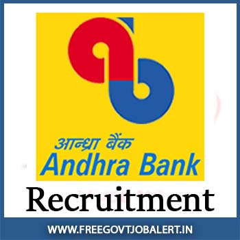

**Andhra Bank Recruitment 2019**: Andhra Bank has published the notification for filling a sub staff vacancy. as per notification total 22 vacancies announced in Andhra bank recruitment notification 2019. Good News For those candidates who searching for 10th Pass bank jobs or 10th pass jobs in Andhra Pradesh. Andhra Pradesh has invited via an offline application from Interested and eligible candidates. Andhra Pradesh Recruitment Sub Staff Application Form download from Andhra Pradesh bank official website at www.andhrabank.in. Applicants can apply offline Before Date 31-08-2019.

## Andhra Bank Sub Staff Vacancy Details

<table style="height: 654px; width: 84.9475%; border-collapse: collapse; border-style: double;"><tbody><tr style="height: 80px;"><td style="width: 100%; text-align: center; height: 50px;" colspan="2">Andhra Bank Recruitment 2019

Andhra Bank sub staff vacancy

22 Vacancies</td></tr><tr style="height: 30px;"><td style="width: 100%; height: 30px; background-color: #2a5a8e; text-align: center;" colspan="2"><h3><strong>&nbsp;Important Dates</strong></h3></td></tr><tr style="height: 22px;"><td style="width: 50%; text-align: center; height: 22px;">Starting Date for Registration</td><td style="width: 50%; text-align: center; height: 22px;">Started</td></tr><tr style="height: 22px;"><td style="width: 50%; text-align: center; height: 22px;">Last Date for Registration</td><td style="width: 50%; text-align: center; height: 22px;"><strong>31-08-2019</strong></td></tr><tr style="height: 30px;"><td style="width: 100%; height: 30px; background-color: #2a5a8e; text-align: center;" colspan="2"><h3><strong>&nbsp;Vacancy Details</strong></h3></td></tr><tr style="height: 22px;"><td style="text-align: center; height: 22px; width: 50%;">Job Recruitment Board</td><td style="text-align: center; width: 50%;">Andhra Bank Requriment</td></tr><tr><td style="text-align: center; width: 50%;">Post Name</td><td style="text-align: center; width: 50%;">Sub Staff Post</td></tr><tr><td style="text-align: center; width: 50%;">No of Vacancies</td><td style="text-align: center; width: 50%;">22 Posts</td></tr><tr><td style="text-align: center; width: 50%;">Job Category</td><td style="text-align: center; width: 50%;"><a href="https://freegovtjobalert.in/bank-jobs-recruitment/" target="_blank" rel="noopener noreferrer">Bank Jobs</a></td></tr><tr><td style="text-align: center; width: 50%;">Job Location</td><td style="text-align: center; width: 50%;">Across Andhra Pradesh</td></tr><tr><td style="text-align: center; width: 50%;">Application Mode</td><td style="text-align: center; width: 50%;">Offline</td></tr><tr><td style="width: 100%; background-color: #2a5a8e; text-align: center;" colspan="2"><strong>Zone Wise Vacancy Details</strong></td></tr><tr><td style="text-align: center; width: 100%;" colspan="2"><ul><li style="text-align: left;">Visakhapatnam: 7 Vacancies</li><li style="text-align: left;">Vizianagaram District: 9 vacancies</li><li style="text-align: left;">Srikakulam District: 6 vacancies.</li></ul></td></tr><tr style="height: 30px;"><td style="width: 100%; height: 30px; background-color: #2a5a8e; text-align: center;" colspan="2"><h3><strong>Eligibility Criteria&nbsp;</strong></h3></td></tr><tr style="height: 14px;"><td style="width: 50%; text-align: center; height: 14px;"><strong>Education Qualification</strong></td><td style="width: 50%; text-align: center; height: 14px;"><strong>Age Limits</strong></td></tr><tr style="height: 30px;"><td style="width: 50%; text-align: center; height: 30px;"><ul><li style="text-align: left;">10th Pass</li><li style="text-align: left;">Know Local Language</li><li style="text-align: left;">Basic Reading/Writing knowledge of English and local language</li></ul></td><td style="width: 50%; text-align: center; height: 30px;"><ul><li style="text-align: left;">Minimum 18 Years</li><li style="text-align: left;">Maximum 25 Years</li></ul>
<strong>Age Relaxing:</strong>

<ul><li style="text-align: left;">SC/ST Category: 5 years</li><li style="text-align: left;">OBC Category: 3 years</li><li style="text-align: left;">Persons with Disability: 10 years.</li><li style="text-align: left;">Ex-servicemen: 3 years&nbsp;</li><li style="text-align: left;">Widows, Divorced Women, and women legally separated from their husbands: 9 Years</li></ul></td></tr><tr><td style="width: 100%; background-color: #2a5a8e; text-align: center;" colspan="2"><h3><strong>Salary/Pay Scale</strong></h3></td></tr><tr><td style="width: 100%; text-align: center;" colspan="2">Rs. 9560 to Rs. 18545 Per Month</td></tr><tr style="height: 30px;"><td style="width: 100%; height: 30px; background-color: #2a5a8e; text-align: center;" colspan="2"><h3><strong>Application Fee&nbsp;</strong></h3></td></tr><tr style="height: 30px;"><td style="width: 100%; text-align: center; height: 30px;" colspan="2">None</td></tr><tr style="height: 30px;"><td style="width: 100%; height: 30px; background-color: #2a5a8e; text-align: center;" colspan="2"><h3><strong>Important Links&nbsp;</strong></h3></td></tr><tr style="height: 10px;"><td style="width: 50%; text-align: center; height: 10px;"><strong>Sub Staff Application Form&nbsp;</strong></td><td style="width: 50%; text-align: center; height: 10px;"><a href="https://freegovtjobalert.in/wp-content/uploads/2019/08/sub-staff-application.pdf" target="_blank" rel="noopener noreferrer"><strong>Download</strong></a></td></tr><tr><td style="width: 50%; text-align: center;"><strong>More Details</strong></td><td style="width: 50%; text-align: center;"><a href="https://www.andhrabank.in/English/substaff-recruitment.aspx" target="_blank" rel="noopener noreferrer"><strong>Click Here</strong></a></td></tr><tr style="height: 36px;"><td style="width: 50%; text-align: center; height: 23px;"><strong>Notification</strong></td><td style="width: 50%; text-align: center; height: 23px;"><a href="https://freegovtjobalert.in/wp-content/uploads/2019/08/Sub-Staff-Recruitment-General-Guidelines.pdf" target="_blank" rel="noopener noreferrer"><strong>Click Here&nbsp;</strong></a></td></tr><tr style="height: 10px;"><td style="width: 50%; text-align: center; height: 10px;"><strong>&nbsp;Official Website</strong></td><td style="width: 50%; text-align: center; height: 10px;"><a href="https://www.andhrabank.in" target="_blank" rel="noopener noreferrer"><strong>Click Here&nbsp;</strong></a></td></tr></tbody></table>

### Andhra Bank Sub Staff Recruitments:

- SC/ST Category: The candidates should submit caste certificate issued by the competent authority.
- OBC Category: The candidates should submit their latest caste certificate (not more than one year from the date of Notification) issued by the competent authority which contains the Non-creamy layer clause. Their caste should be included in the central list of other backward classes. Otherwise, their candidature under OBC category shall not be considered.
- Persons with Disability: Percentage of Disability should not be less than 40% in any case. A Certificate to that effect issued by a Medical Board / Medical Authority constituted by the Central / State Government should be enclosed.
- Interested candidates may submit their applications directly to Zonal Office at the following address in the prescribed format with all attested copies of certificates in support of age, qualification along with Transfer Certificate/School Leaving Certificate from the Institution last studied, caste, place of domicile, Disability, etc.

### How To Apply for Andhra Bank sub staff post-2019?

1. first Candidates Goto Andhra bank Official Website: [www.andhrabank.in](https://www.andhrabank.in/)
2. open home page of Andhra bank find and click on **Recruitment.**
3. Find **Click Here Sub Staff Recruitment**
4. Now you can see **Sub Staff Recruitment- Application**
5. Click On and **Download Form**
6. Fillup Form and Attach photo
7. Attach Documents With Form and submit to the following Address.

<table style="border-collapse: collapse; width: 63.1088%; height: 213px;"><tbody><tr style="height: 188px;"><td style="width: 50%; height: 188px;"><strong>Visakhapatnam:</strong>

The Zonal Manager, Andhra Bank, HR Department, Zonal office, Seethammadhara, Visakhapatnam-530013</td><td style="width: 50%; height: 188px;"><strong>Vizianagaram &amp; Srikakulam:</strong>

The Zonal Manager, Andhra Bank, HR Department, Zonal Office Srikakulam, Venkatapuram Junction, Near Simhadwaram Srikakulam -532005</td></tr></tbody></table>

> More [Free Govt Job Alert](https://freegovtjobalert.in)
