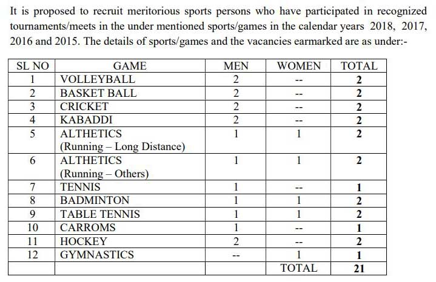

**AP Income Tax Department Recruitment 2019**: Income Tax Department of Andhra Pradesh has published Notification for a fill-up 21 Post of Inspector of income tax, Tax Assistant, Stenographer English, Multi Tasking Staff. Good Chance for those candidates who searching 12th Pass Jobs In Andhra Pradesh. The Principal Chief Commissioner Of Incom Tax, Andhra Pradesh & Telangana, Hyderabad has invited Application For recruitment of Meritorious Sports Person in Different Games. Interested Candidates Can Apply Before 13-09-2019.

## AP Income Tax Department Recruitment 2019-21 Various Posts Vacancies Details

<table style="height: 521px; width: 84.9475%; border-collapse: collapse; border-style: double;"><tbody><tr style="height: 80px;"><td style="width: 100%; text-align: center; height: 50px;" colspan="2"><strong>Andhra Pradesh Income Tax Department</strong>

AP Income Tax Department Recruitment

21 Various Vacancies</td></tr><tr style="height: 30px;"><td style="width: 100%; height: 30px; background-color: #2a5a8e; text-align: center;" colspan="2"><h3><strong>&nbsp;Important Dates</strong></h3></td></tr><tr style="height: 22px;"><td style="width: 50%; text-align: center; height: 22px;">Starting Date for Application Form</td><td style="width: 50%; text-align: center; height: 22px;"><strong>26-08-2019</strong></td></tr><tr style="height: 22px;"><td style="width: 50%; text-align: center; height: 22px;">Last Date for Application Form</td><td style="width: 50%; text-align: center; height: 22px;"><strong>13-09-2019</strong></td></tr><tr style="height: 22px;"><td style="width: 50%; text-align: center; height: 64px;">Last Date For Jammu &amp; Kashmir, North Eastern Region, Lakshadweep, and Andaman &amp; Nicobar Islands Candidates</td><td style="width: 50%; text-align: center; height: 64px;"><strong>20-09-2019</strong></td></tr><tr style="height: 30px;"><td style="width: 100%; height: 30px; background-color: #2a5a8e; text-align: center;" colspan="2"><h3><strong>&nbsp;Vacancy Details</strong></h3></td></tr><tr style="height: 22px;"><td style="text-align: center; height: 22px; width: 50%;">Job Recruitment Board</td><td style="text-align: center; width: 50%; height: 22px;">AP Income Tax Department</td></tr><tr style="height: 22px;"><td style="text-align: center; width: 50%; height: 22px;">Post name</td><td style="text-align: center; width: 50%; height: 22px;">Various Posts</td></tr><tr style="height: 22px;"><td style="text-align: center; width: 50%; height: 22px;">No of Vacancies</td><td style="text-align: center; width: 50%; height: 22px;">21 Posts</td></tr><tr style="height: 22px;"><td style="text-align: center; width: 50%; height: 22px;">Job Location</td><td style="text-align: center; width: 50%; height: 22px;"><a href="https://freegovtjobalert.in/andhra-pradesh-ap-govt-job/" target="_blank" rel="noopener noreferrer">Andhra Pradesh</a></td></tr><tr style="height: 22px;"><td style="text-align: center; width: 50%; height: 22px;">Application Mode</td><td style="text-align: center; width: 50%; height: 22px;">Offline</td></tr><tr style="height: 30px;"><td style="width: 100%; height: 30px; background-color: #2a5a8e; text-align: center;" colspan="2"><h3><strong>Eligibility Criteria&nbsp;</strong></h3></td></tr><tr style="height: 30px;"><td style="width: 100%; text-align: center; height: 30px;" colspan="2"><table style="border-collapse: collapse; width: 100%; height: 151px;"><tbody><tr style="height: 44px;"><td style="width: 27.9509%; height: 44px;"><strong>Post Name</strong></td><td style="width: 16.1001%; height: 44px;"><strong>No of Vacancies</strong></td><td style="width: 42.5874%; height: 44px;"><strong>Education Qualification</strong></td><td style="width: 13.3616%; height: 44px;"><strong>Age Limits</strong></td></tr><tr style="height: 10px;"><td style="width: 27.9509%; height: 10px;">Inspector of Income Tax</td><td style="width: 16.1001%; height: 10px;">02</td><td style="width: 42.5874%; height: 10px;">Graduation from a recognized University</td><td style="width: 13.3616%; height: 10px;">18-30 Years</td></tr><tr style="height: 26px;"><td style="width: 27.9509%; height: 26px;">Tax Assistants (TA)</td><td style="width: 16.1001%; height: 26px;">08</td><td style="width: 42.5874%; height: 26px;">Graduation from a recognized University</td><td style="width: 13.3616%; height: 26px;">18-27 Years</td></tr><tr style="height: 36px;"><td style="width: 27.9509%; height: 36px;">Stenographer English) Grade-II (PB-I)</td><td style="width: 16.1001%; height: 36px;">02</td><td style="width: 42.5874%; height: 36px;">10+2 or equivalent from a recognized Board or University</td><td style="width: 13.3616%; height: 36px;">18-27 Years</td></tr><tr style="height: 35px;"><td style="width: 27.9509%; height: 35px;">Multi-Tasking Staff (MTS)</td><td style="width: 16.1001%; height: 35px;">09</td><td style="width: 42.5874%; height: 35px;">Matriculation or equivalent</td><td style="width: 13.3616%; height: 35px;">18-25 Years</td></tr></tbody></table></td></tr><tr style="height: 30px;"><td style="width: 100%; height: 30px; background-color: #2a5a8e; text-align: center;" colspan="2"><h3><strong>Application Fee&nbsp;</strong></h3></td></tr><tr style="height: 30px;"><td style="width: 100%; text-align: center; height: 30px;" colspan="2">General Candidates: Rs. 100/-

SC/ST/Women Candidates: Nil

(Fee Payment by way of Demand Draft in favor of “ZAO, CBDT, Hyderabad”)</td></tr><tr style="height: 30px;"><td style="width: 100%; height: 30px; background-color: #2a5a8e; text-align: center;" colspan="2"><h3><strong>Important Links&nbsp;</strong></h3></td></tr><tr style="height: 10px;"><td style="width: 50%; text-align: center; height: 10px;"><strong>Application Form</strong></td><td style="width: 50%; text-align: center; height: 10px;"><a href="https://freegovtjobalert.in/wp-content/uploads/2019/08/INCOME-TAX-DEPARTMENT-ANDHRA-PRADESH-INCOME-TAX-DEPARTMENT-AP.pdf" target="_blank" rel="noopener noreferrer"><strong>Download</strong></a></td></tr><tr style="height: 36px;"><td style="width: 50%; text-align: center; height: 23px;"><strong>Notification</strong></td><td style="width: 50%; text-align: center; height: 23px;"><a href="https://freegovtjobalert.in/wp-content/uploads/2019/08/INCOME-TAX-DEPARTMENT-ANDHRA-PRADESH-INCOME-TAX-DEPARTMENT-AP.pdf" target="_blank" rel="noopener noreferrer"><strong>Click Here</strong></a></td></tr><tr><td style="width: 50%; text-align: center;"><strong>Short Notice</strong></td><td style="width: 50%; text-align: center;"><a href="https://freegovtjobalert.in/wp-content/uploads/2019/08/AP-Income-Tax-Department-Recruitment-2019-21-Various-Posts-Vacancies-Short-Notice.pdf" target="_blank" rel="noopener noreferrer"><strong>Click Here</strong></a></td></tr><tr style="height: 10px;"><td style="width: 50%; text-align: center; height: 10px;"><strong>&nbsp;Official Website</strong></td><td style="width: 50%; text-align: center; height: 10px;"><a href="https://www.incometaxhyderabad.gov.in/" target="_blank" rel="noopener noreferrer"><strong>Click Here&nbsp;</strong></a></td></tr></tbody></table>

\[caption id="attachment\_807" align="aligncenter" width="653"\] AP Income Tax Department\[/caption\]

### How To Fill up AP Income Tax Department Application Form?

1. Download Application Form Here
2. The application should be filled up in Block Letters in English using ink pen or ballpoint pen preferably black/blue ink.
3. The applicant should clearly indicate the post to which he/she is applying for by marking (√) in the appropriate box mentioned in the application form. (If any candidate submits more than one application, all the applications will be summarily rejected.)
4. The applicant should submit his/her 4 recent passport size color photographs. 1 a photograph should be affixed in the space provided in the application and the remaining 3 photographs should be attached to the application after writing the name of the candidate on the backside of the photograph.
5. One self-addressed postcard should be enclosed.
6. Fee Payment by Demand Draft in favor of “ZAO, CBDT, Hyderabad”.
7. Posting Address is given below: Deputy Commissioner of Income-tax (HQrs) (Admn.), O/o.Principal Chief Commissioner of Income-tax, Andhra Pradesh & Telangana, Room No,1022, B-Block, Income Tax Towers, AC Guards, Hyderabad-500004
