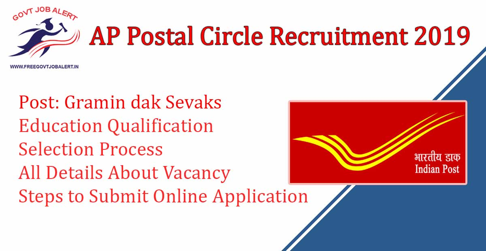
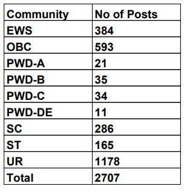

AP Postal Circle Recruitment 2019: Indian Post-Andhra Pradesh Postal Circle has recently published the notification for the recruitment of the Post of Gramin Dak Sevak. As Per AP Postal Circle Recruitment Notification 2019 A total of 2707 Vacancies are there. Good Chance for Those Candidates Who Searching Post office Jobs In Andhra Pradesh. Eligible Candidates can Apply Online For ap postal recruitment 2019 Before 21-11-2019.

## AP Postal Circle Recruitment 2019 For Gramin Dak Sevak Post

<table style="border-collapse: collapse; width: 100%;"><tbody><tr><td style="width: 50%; background-color: #2a5a8e;" colspan="2"><h3 style="text-align: center;">AP Postal Circle Recruitment 2019</h3></td></tr><tr><td style="width: 50%; text-align: center;">Job Recruitment Board</td><td style="width: 50%; text-align: center;">Indian Post Office</td></tr><tr><td style="width: 50%; text-align: center;">Advertisement No.</td><td style="width: 50%; text-align: center;">RE/APCO/3-11/2019</td></tr><tr><td style="width: 50%; text-align: center;">Post</td><td style="width: 50%; text-align: center;">Gramin Dak Sevaks</td></tr><tr><td style="width: 50%; text-align: center;">Vacancies</td><td style="width: 50%; text-align: center;">2707</td></tr><tr><td style="width: 50%; text-align: center;">Job Location</td><td style="width: 50%; text-align: center;">AP Postal Circle</td></tr><tr><td style="width: 50%; text-align: center;">Job Type</td><td style="width: 50%; text-align: center;">Post Office Jobs</td></tr><tr><td style="width: 50%; text-align: center;">Application Mode</td><td style="width: 50%; text-align: center;">Online</td></tr></tbody></table>

AP Post Office GDS Recruitment 2019 Notification has to Publish on His Official website on 15th October 2019. Applicants, you Can get All AP Post Gramin Dak Sevak Notification Details From Here. Also, We Provide Direct Apply Online Link For Easy to apply for AP Postal Circle Recruitment GDS Post. To know about AP Post Office Vacancy Details Like Education Qualification, Age Limits, Salary, Application Fee, How to apply, etc. Given Below on this page.

<table style="border-collapse: collapse;"><tbody><tr><td style="width: 50%; background-color: #2a5a8e; text-align: center;" colspan="2"><h3>Important Dates</h3></td></tr><tr><td style="width: 50%; text-align: center;">Starting date for Online Registration</td><td style="width: 50%; text-align: center;">15-10-2019</td></tr><tr><td style="width: 50%; text-align: center;">Last date for Online Registration</td><td style="width: 50%; text-align: center;">14-11-2019</td></tr><tr><td style="width: 50%; text-align: center;">Starting Date for Submission of online application</td><td style="width: 50%; text-align: center;">22-10-2019</td></tr><tr><td style="width: 50%; text-align: center;">Last Date for Submission of online application</td><td style="width: 50%; text-align: center;">21-11-2019</td></tr></tbody></table>

### AP Post GDS Vacancy Details

1. Branch Postmaster(BPM)
2. Assistant Branch Postmaster(ABPM)
3. Dak Sevak

Category Wise AP Post Office Vacancy Details

### AP Postal Circle Recruitment Eligibility Criteria

Education Qualification:

- Secondary School Examination pass certificate of 10th standard with passing marks in Mathematics and English.
- Compulsory knowledge of Local Language.

Age Limits:

- Minimum: 18 Years
- Maximum:
    - General Candidates: 40 Years
    - SC/ST Candidates: 45 Years
    - OBC Candaeits: 43 Years
    - Persons with Disabilities (PwD): 50 Years
    - Persons with Disabilities (PwD) + OBC: 53 Years
    - Persons with Disabilities (PwD) + SC/ST: 55 Years

### AP Post Office Jobs Salary

<table style="border-collapse: collapse; width: 100%; height: 50px;"><tbody><tr style="height: 64px;"><td style="width: 17.4967%; height: 10px; text-align: center; background-color: #2a5a8e;">Post</td><td style="width: 41.3505%; height: 10px; text-align: center; background-color: #2a5a8e;">Minimum TRCA for 4 Hours/Level 1 in TRCA Slab</td><td style="width: 41.1527%; height: 10px; text-align: center; background-color: #2a5a8e;">Minimum TRCA for 5 Hours/Level 2 in TRCA slab</td></tr><tr style="height: 20px;"><td style="width: 17.4967%; height: 20px; text-align: center;">BPM</td><td style="width: 41.3505%; height: 20px; text-align: center;">Rs.12,000/-</td><td style="width: 41.1527%; height: 20px; text-align: center;">Rs.14,500/-</td></tr><tr style="height: 20px;"><td style="width: 17.4967%; height: 20px; text-align: center;">ABPM/Dak Sevak</td><td style="width: 41.3505%; height: 20px; text-align: center;">Rs.10,000/-</td><td style="width: 41.1527%; height: 20px; text-align: center;">Rs.12,000/-</td></tr></tbody></table>

### AP Post Office Exam Selection Process

- Selection will be made as per the automatically generated merit list as per the rules based on the candidate's online submitted applications.
- No weight will be given for higher educational qualifications. Only marks obtained in 10th standard of approved Boards aggregated to percentage to the accuracy of 4 decimals will be the criteria for finalizing the selection.

### How to Apply For AP postal circle GDS recruitment 2019

The only online application will be accepted by the candidate. The candidate who desires to apply online will have to register himself/herself in the portal through https://indiapost.gov.in or http://appost.in/gdsonline

1. Go to Indian Post Office Official Website: http://www.appost.in/
2. First Registration on India Post Office Site
3. Pay Application Fee(Online/Offline)
4. Click on Apply Online
5. Fill Indian Post Office Application Form
6. Upload Documents
7. Submit Application
8. Download & Save For Future Use.
9. Done

Candidates can Visit www.appost.In For ap postal upcoming notification 2019, latest postal jobs in ap 2019 to 2020, Merit list, AP Postal Result, AP Post Recruitment Updates. Keep Visit Ragulaly our website or allow notification for all Lastest Jobs Updates.

### AP Post Office Recruitment Important Links

- Direct Apply Online For AP Post Office Recruitment 2019: [Registration](https://indiapostgdsonline.in/phase4/fee.aspx) | Apply Online (22-10-2019)
- AP Post Office Recruitment Notification 2019 PDF: [Click Here](https://freegovtjobalert.in/wp-content/uploads/2019/10/AP-Post-Office-Recruitment-Notification-2019-PDF.pdf)
- AP Post Office Official Website: [Click Here](http://www.appost.in/)

Indian Post Office Jobs:

- [Telangana Postal Circle Recruitment 2019 | 970 TS Postal GDS Notification](https://freegovtjobalert.in/telangana-postal-circle-recruitment-gds/)
- [Chhattisgarh Postal Circle Recruitment 2019 | 1799 CG GDS Vacancy](https://freegovtjobalert.in/chhattisgarh-postal-circle-recruitment-gds/)
- [Maharashtra Postal Circle Recruitment 2019 | 3650 Gramin Dak Sevak Vacancies](https://freegovtjobalert.in/maharashtra-postal-circle-recruitment-gds-gramin-dak-sevak/)
