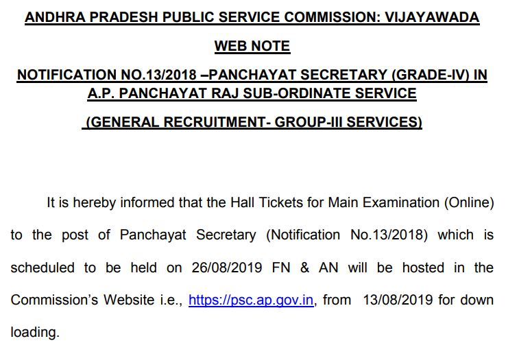

**APPSC Panchayat Secretary Recruitment 2019**: Andhra Pradesh Public Service Commission (APPSC) has published a notification for Recruitment of panchayat Secretary vacancies in Andhra Pradesh panchayat raj subordinate service**(APPSC Panchayat Secretary Admit Card)**. Total 1051 Vacancies in Panchayat Secretary. Those Candidates can ready For Main Exam of Panchayat Secretary (Grade-IV) who qualified in Screening test in offline mode. as per notification Main Exam Date 02-08-2019 but now Main Exam Date Change and Now Main Exam Date 26-08-2019. **APPSC Panchayat Secretary Hall Ticket Released Download Now** and Check **Panchayat Secretary Main Exam date**.

> APPSC Panchayat Secretary Main Exam **[Hall Ticket Here](https://psc.ap.gov.in/(S(ygttcu4ke1xabgqr0ef5jrzk))/UI/CandidateLoginPages/LoginNew.aspx)**

## APPSC Panchayat Secretary Admit Card 2019

<table style="border-collapse: collapse; width: 80.1634%; height: 340px;"><tbody><tr><td style="width: 50%; background-color: #2a5a8e;" colspan="2"><h3 style="text-align: center;"><strong>APPSC Panchayat Secretary Vacancy Details</strong></h3></td></tr><tr><td style="width: 50%; text-align: center;">Job Recruitment Board</td><td style="width: 50%; text-align: center;">Andhra Pradesh Public Service Commission (APPSC)</td></tr><tr><td style="width: 50%; text-align: center;">Post Name</td><td style="width: 50%; text-align: center;">Panchayat Secretary (Grade-IV)</td></tr><tr><td style="width: 50%; text-align: center;">No of Vacancies</td><td style="width: 50%; text-align: center;">1051 Posts</td></tr><tr><td style="width: 50%; text-align: center;">Date of Screening Test in offline mode</td><td style="width: 50%; text-align: center;">21-04-2019</td></tr><tr><td style="width: 50%; text-align: center;">Panchayat Secretary Main Exam Date</td><td style="width: 50%; text-align: center;">26-08-2019</td></tr><tr><td style="width: 50%; text-align: center;">Main Exam Admit Card</td><td style="width: 50%; text-align: center;">13-08-2019</td></tr><tr><td style="width: 50%; text-align: center;">Download Admit Card</td><td style="width: 50%; text-align: center;"><a href="https://psc.ap.gov.in/(S(ygttcu4ke1xabgqr0ef5jrzk))/UI/CandidateLoginPages/LoginNew.aspx" target="_blank" rel="noopener noreferrer">Click Here</a></td></tr><tr><td style="width: 50%; text-align: center;">Job Location</td><td style="width: 50%; text-align: center;"><a href="https://freegovtjobalert.in/andhra-pradesh-ap-govt-job/" target="_blank" rel="noopener noreferrer">Andhra Pradesh</a></td></tr><tr><td style="width: 50%; text-align: center;">Official Website</td><td style="width: 50%; text-align: center;"><a href="https://psc.ap.gov.in/(S(mppe4dbd1i01p2elurpdev3d))/Default.aspx" target="_blank" rel="noopener noreferrer">Click Here</a></td></tr></tbody></table>

### **APPSC Panchayat Secretary Mains Examination & Hall Ticket**

Appsc Panchayat Secretary Mains Exam Hall Ticket 2019 Released on 13-08-2019. You Can Get All Information About Appsc Admit Card 2019 Are Mentioned in This Article. Applicants Can Download Panchayat Secretary Admit Card from Official Website at Psc.ap.gov.in. Also, Candidates Can Download Admit Card in One Click from Given Link in This Page.

### **Available details on APPSC Panchayat Secretary Main Exam Admit Card 2019**

To say candidates who preparing for Panchayat Secretary Main Exam that Exam hall ticket Downloading start on 13th august 2019. Download Panchayat secretary admits card 2019 and checks all Following details on the hall ticket:

- Full Name of the Applicant
- Father’s or Mother’s Name
- Gender (Male/ Female)
- Category (ST/ SC/ BC & Other)
- Applicant Photograph
- Candidate Date of Birth
- Applicant Roll Number
- Examination Name
- Exam Date and Time
- Time Duration of the Exam
- Exam Centre Name and Code
- the signature of candidate and exam counsellor
- instructions for the examination
- Check Centre Address

### **Selection Process of Panchayat Secretary post**

1. Screening Test in Offline Mode.
2. Mains Exam in Online Mode.
3. Interview.

### **How To APPSC Panchayat Secretary Admit Card 2019?**

1. Applicant first Goto Andhra Pradesh Public Service Commission Official Website: psc.ap.gov.in
2. Find "HallTickets for Mains Examination Panchayat Secretary (Grade-IV) in A.P. Panchayat Raj Subordinate Service (General Recruitment-Group-III Services) - Notification No.13/2018 are available for download (Published on 13/08/2019)"
3. After finding, you can see **Click Here** Button on the right side of Notification.
4. Click on.
5. now login with your User ID & Password.
6. After login, you can download Panchyat Secretary Admit card and printout some copies for future use.

> APPSC Panchayat Secretary Main Exam Admit Card 2019 (Released)- [Download Now](https://psc.ap.gov.in/(S(ygttcu4ke1xabgqr0ef5jrzk))/UI/CandidateLoginPages/LoginNew.aspx)
