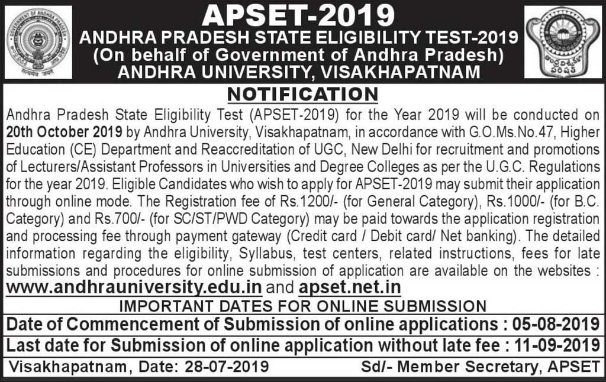

**APSET 2019**: Andhra Pradesh Government Has published Short Notice for Andhra Pradesh State Eligibility Test 2019. **AP SET Notification** Publiesdh on Date 28-07-2019. **Andhra Pradesh State Eligibility Test 2019 Notice** Conducted by Andhra Pradesh University, Vishakhapatnam. Those candidates Are Eligible Who Complet Master Degree. Andhra Pradesh State Eligibility Test 2019 Application Form Start on date 05-08-2019 to 11-09-2019. Otherwise, you can apply After 11-09-2019 to 03-10-2019 with Late Fee. candidates can get All Details About **APSET 2019 Vacancy** like Education Qualification, Late Fee With Dates, **APSET Syllabus**, Exam Date, Etc. Given in this page below.

## APSET 2019- Apply Online For Andhra Pradesh State Eligibility Test

<table style="height: 654px; width: 84.9475%; border-collapse: collapse; border-style: double;"><tbody><tr style="height: 80px;"><td style="width: 100%; text-align: center; height: 50px;" colspan="2">Andhra University

Andhra Pradesh State Eligibility Test 2019</td></tr><tr style="height: 30px;"><td style="width: 100%; height: 30px; background-color: #2a5a8e; text-align: center;" colspan="2"><h3><strong>&nbsp;Important Dates</strong></h3></td></tr><tr style="height: 22px;"><td style="width: 50%; text-align: center; height: 22px;"><strong>APSET Notification</strong></td><td style="width: 50%; text-align: center; height: 22px;">28-07-2019</td></tr><tr style="height: 22px;"><td style="width: 50%; text-align: center; height: 22px;">Submission of Online Applications</td><td style="width: 50%; text-align: center; height: 22px;">05-08-2019</td></tr><tr><td style="width: 50%; text-align: center;">Last date for Submission of Online Applications Without Late Fee (Only Registration Fee)</td><td style="width: 50%; text-align: center;">11-09-2019</td></tr><tr><td style="width: 50%; text-align: center;">With a Late fee of Rs. 1,000+Registration Fee</td><td style="width: 50%; text-align: center;">19-09-2019</td></tr><tr><td style="width: 50%; text-align: center;">With a Late fee of Rs. 2,000+Registration Fee</td><td style="width: 50%; text-align: center;">26-09-2019</td></tr><tr><td style="width: 50%; text-align: center;">With a Late fee of Rs. 5,000+Registration Fee (Examination center at Visakhapatnam only)</td><td style="width: 50%; text-align: center;">03-10-2019</td></tr><tr><td style="width: 50%; text-align: center;">Date of Examination</td><td style="width: 50%; text-align: center;">20-10-2019</td></tr><tr style="height: 30px;"><td style="width: 100%; height: 30px; background-color: #2a5a8e; text-align: center;" colspan="2"><h3><strong>&nbsp;Vacancy Details</strong></h3></td></tr><tr style="height: 22px;"><td style="width: 100%; text-align: center; height: 22px;" colspan="2">Andhra Pradesh State Eligibility Test 2019</td></tr><tr style="height: 30px;"><td style="width: 100%; height: 30px; background-color: #2a5a8e; text-align: center;" colspan="2"><h3><strong>Education Qualification</strong></h3></td></tr><tr style="height: 30px;"><td style="width: 50%; text-align: center; height: 30px;" colspan="2">Candidates Pass Master Degree or Equivalent Examination From Universities/Institutions.</td></tr><tr style="height: 30px;"><td style="width: 100%; height: 30px; background-color: #2a5a8e; text-align: center;" colspan="2"><h3><strong>Application Fee&nbsp;</strong></h3></td></tr><tr style="height: 30px;"><td style="width: 100%; text-align: center; height: 30px;" colspan="2"><ul><li style="text-align: left;">General Candidates<strong>: Rs. 1200/-&nbsp;</strong></li><li style="text-align: left;">BC Candidates<strong>: Rs. 1000/-&nbsp;</strong></li><li style="text-align: left;">SC/ST/PWD Candidates<strong>: Rs. 700/-</strong></li><li style="text-align: left;">Candidates can pay Application via Online(Credit/ Debit card/ Net-banking)</li></ul></td></tr><tr style="height: 30px;"><td style="width: 100%; height: 30px; background-color: #2a5a8e; text-align: center;" colspan="2"><h3><strong>Important Links&nbsp;</strong></h3></td></tr><tr style="height: 10px;"><td style="width: 50%; text-align: center; height: 10px;"><strong>Apply Online&nbsp;</strong></td><td style="width: 50%; text-align: center; height: 10px;"><strong><a style="color: #ff0000;" title="AP SET" href="https://apset.net.in/reg_step1.aspx" target="_blank" rel="noopener noreferrer">Registration</a> |&nbsp;<a style="color: #ff0000;" title="AP SET" href="https://apset.net.in/loginstu.aspx" target="_blank" rel="noopener noreferrer">Login</a></strong></td></tr><tr><td style="width: 50%; text-align: center;"><strong>Important Dates</strong></td><td style="width: 50%; text-align: center;"><a href="https://apset.net.in/idates.aspx" target="_blank" rel="noopener noreferrer"><strong>Check Here</strong></a></td></tr><tr style="height: 36px;"><td style="width: 50%; text-align: center; height: 23px;"><strong>Notification</strong></td><td style="width: 50%; text-align: center; height: 23px;"><a href="https://freegovtjobalert.in/wp-content/uploads/2019/08/APSET-Notification.jpg" target="_blank" rel="noopener noreferrer"><strong>Click Here</strong></a></td></tr><tr style="height: 10px;"><td style="width: 50%; text-align: center; height: 10px;"><strong>&nbsp;Official Website</strong></td><td style="width: 50%; text-align: center; height: 10px;"><a href="https://apset.net.in/" target="_blank" rel="noopener noreferrer"><strong>Click Here</strong></a></td></tr></tbody></table>

**Short Notice for Andhra Pradesh State Eligibility Test 2019**

### How To Apply APSET Application Online Form 2019?

1. First Candiaedtes Goto **APSET Official Website**: [https://apset.net.in](https://apset.net.in)
2. Click On [Login](https://apset.net.in/loginstu.aspx) and Login with Your Email & Password(If You're on First time apply so can First Click on [Registration](https://apset.net.in/reg_step1.aspx) and Fillup your Information, Register your self)
3. After, Login Fill Your Education details
4. Upload Photos (Photo-15 to 50kb, Signature- 5 to 20Kb, Certificat- 50 to 300kb)
5. Pay Application Fee Via Online.
6. Download & Save Your application for future use.
7. Done
