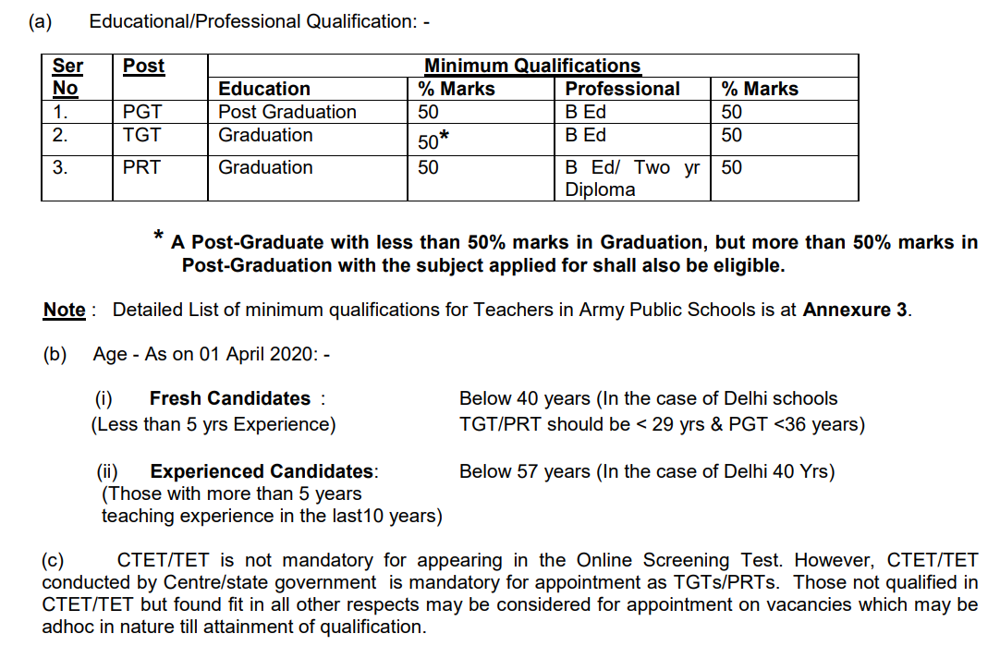

**Army Public School Recruitment 2019** Has Published A notification For **APS Teacher Vacancy.** There are 137 Army Public Schools (APS) located in various Cantonments and Military Stations across India. These schools are administered and managed by local Army authorities and affiliated to CBSE through Army Welfare Education Society (AWES). There are approximately **8000 teachers** on the rolls of these schools. Out of these, a large number get turned over every year due to various reasons. Vacancies could be \`regular’ or of \`fixed term’ nature which shall be informed along with the announcement of vacancies. Regular appointments would be liable to transfer. To know About **army public school vacancy 2019** Details like Qualification, **army public school teacher salary**, Selection Process, Application Fee, **army public school teacher recruitment syllabus**, Etc. Given in this page below

## Army Public School Teacher Vacancy Details

<table style="height: 754px; width: 84.8356%; border-collapse: collapse; border-style: double;"><tbody><tr style="height: 80px;"><td style="width: 100%; text-align: center; height: 50px;" colspan="2">Army Public School Recruitment 2019

Teacher Recruitment

8000 Vacancies</td></tr><tr style="height: 30px;"><td style="width: 100%; height: 30px; background-color: #2a5a8e; text-align: center;" colspan="2"><h3><strong>&nbsp;Important Dates</strong></h3></td></tr><tr style="height: 22px;"><td style="width: 49.8682%; text-align: center; height: 22px;">Starting Date for Registration</td><td style="width: 50.1318%; text-align: center; height: 22px;"><strong>01-09-2019</strong></td></tr><tr style="height: 22px;"><td style="width: 49.8682%; text-align: center; height: 22px;">Last Date for Registration</td><td style="width: 50.1318%; text-align: center; height: 22px;"><strong>22-09-2019</strong></td></tr><tr style="height: 25px;"><td style="width: 49.8682%; text-align: center; height: 25px;">Admit Card</td><td style="width: 50.1318%; text-align: center; height: 25px;"><strong>04-10-2019</strong></td></tr><tr style="height: 25px;"><td style="width: 49.8682%; text-align: center; height: 25px;">Date For Exam</td><td style="width: 50.1318%; text-align: center; height: 25px;"><strong>19/20-10-2019</strong></td></tr><tr style="height: 25px;"><td style="width: 49.8682%; text-align: center; height: 25px;">Result</td><td style="width: 50.1318%; text-align: center; height: 25px;"><strong>30-10-2019</strong></td></tr><tr style="height: 30px;"><td style="width: 100%; height: 30px; background-color: #2a5a8e; text-align: center;" colspan="2"><h3><strong>APS Teacher Vacancy Details</strong></h3></td></tr><tr style="height: 22px;"><td style="text-align: center; height: 22px; width: 49.8682%;">Job Recruitment Board</td><td style="text-align: center; width: 50.1318%; height: 22px;">Army Public School</td></tr><tr style="height: 22px;"><td style="text-align: center; width: 49.8682%; height: 22px;">Post</td><td style="text-align: center; width: 50.1318%; height: 22px;">Teachers Posts</td></tr><tr style="height: 22px;"><td style="text-align: center; width: 49.8682%; height: 22px;">No of Vacancies</td><td style="text-align: center; width: 50.1318%; height: 22px;">8000</td></tr><tr style="height: 22px;"><td style="text-align: center; width: 49.8682%; height: 22px;">Job Location</td><td style="text-align: center; width: 50.1318%; height: 22px;">Across India</td></tr><tr style="height: 22px;"><td style="text-align: center; width: 49.8682%; height: 22px;">Application Mode</td><td style="text-align: center; width: 50.1318%; height: 22px;">Online</td></tr><tr style="height: 30px;"><td style="width: 100%; height: 30px; background-color: #2a5a8e; text-align: center;" colspan="2"><h3><strong>Eligibility Criteria&nbsp;</strong></h3></td></tr><tr style="height: 30px;"><td style="text-align: center; height: 30px; width: 100%;" colspan="2"></td></tr><tr style="height: 22px;"><td style="width: 100%; height: 22px; background-color: #2a5a8e; text-align: center;" colspan="2"><strong>APS Selection Procedure</strong></td></tr><tr style="height: 128px;"><td style="width: 100%; text-align: center; height: 128px;" colspan="2">
The selection of teachers will be done in three stages:-

<ol><li style="text-align: left;">Screening Exam</li><li style="text-align: left;">Interview.</li><li style="text-align: left;">Evaluation of Teaching Skills and Computer Proficiency</li></ol></td></tr><tr style="height: 30px;"><td style="width: 100%; height: 30px; background-color: #2a5a8e; text-align: center;" colspan="2"><h3><strong>Application Fee&nbsp;</strong></h3></td></tr><tr style="height: 30px;"><td style="width: 100%; text-align: center; height: 30px;" colspan="2"><ul><li style="text-align: left;">Rs 500/- (Non-Refundable)</li><li style="text-align: left;">Payment Mode: Payment options are Debit/Credit Cards/ Net banking.&nbsp;</li></ul></td></tr><tr style="height: 30px;"><td style="width: 100%; height: 30px; background-color: #2a5a8e; text-align: center;" colspan="2"><h3><strong>Important Links&nbsp;</strong></h3></td></tr><tr><td style="width: 49.8682%; text-align: center;"><strong>Download Admit Card</strong></td><td style="width: 50.1318%; text-align: center;"><a style="color: #0000ff;" href="https://freegovtjobalert.in/aps-teacher-admit-card/" target="_blank" rel="noopener noreferrer"><strong>Click Here</strong></a></td></tr><tr style="height: 10px;"><td style="width: 49.8682%; text-align: center; height: 10px;"><strong>Apply Online&nbsp;</strong></td><td style="width: 50.1318%; text-align: center; height: 10px;"><strong><a title="Army Public School" href="http://aps-csb.in/Candidate/GeneralInstructions.aspx" target="_blank" rel="noopener noreferrer">Registration</a> |&nbsp;<a title="Army Public School" href="http://aps-csb.in/Candidate/ExistingUser.aspx" target="_blank" rel="noopener noreferrer">Login</a></strong></td></tr><tr><td style="width: 49.8682%; text-align: center;"><strong>Register Step</strong></td><td style="width: 50.1318%; text-align: center;"><a href="https://freegovtjobalert.in/wp-content/uploads/2019/09/RegisterStep.pdf" target="_blank" rel="noopener noreferrer"><strong>Click Here</strong></a></td></tr><tr style="height: 25px;"><td style="width: 49.8682%; text-align: center; height: 25px;"><strong>Old Question Paper</strong></td><td style="width: 50.1318%; text-align: center; height: 25px;"><a href="https://freegovtjobalert.in/wp-content/uploads/2019/09/Old-Question-Paper-Army-Public-School-TGT-PRT-PGT.pdf" target="_blank" rel="noopener noreferrer"><strong>Click here</strong></a></td></tr><tr style="height: 25px;"><td style="width: 49.8682%; text-align: center; height: 25px;"><strong>Exam City</strong></td><td style="width: 50.1318%; text-align: center; height: 25px;"><a href="https://freegovtjobalert.in/wp-content/uploads/2019/09/Exam-Cities-Army-Public-School-TGT-PRT-PGT.pdf" target="_blank" rel="noopener noreferrer"><strong>Click Here</strong></a></td></tr><tr><td style="width: 49.8682%; text-align: center;"><strong>Selection Process</strong></td><td style="width: 50.1318%; text-align: center;"><a href="https://freegovtjobalert.in/army-public-school-selection-process-for-aps-teacher-vacancy/" target="_blank" rel="noopener noreferrer"><strong>Click Here</strong></a></td></tr><tr><td style="width: 49.8682%; text-align: center;"><strong>Syllabus And Exam Pattern</strong></td><td style="width: 50.1318%; text-align: center;"><a href="https://freegovtjobalert.in/army-public-school-teacher-syllabus-2019-pdf-pgt-tgt-prt-exam-pattern/" target="_blank" rel="noopener noreferrer"><strong>Click Here</strong></a></td></tr><tr style="height: 36px;"><td style="width: 49.8682%; text-align: center; height: 23px;"><strong>Notification</strong></td><td style="width: 50.1318%; text-align: center; height: 23px;"><a href="https://freegovtjobalert.in/wp-content/uploads/2019/09/Notification-Army-Public-School-TGT-PGT-PRT-Posts.pdf" target="_blank" rel="noopener noreferrer"><strong>Click Here</strong></a></td></tr><tr style="height: 10px;"><td style="width: 49.8682%; text-align: center; height: 10px;"><strong>&nbsp;Official Website</strong></td><td style="width: 50.1318%; text-align: center; height: 10px;"><strong><a href="http://aps-csb.in/College/Index_New.aspx" target="_blank" rel="noopener noreferrer">Click Here</a></strong></td></tr></tbody></table>

### How To Appy For Army Public School (APS) Teacher Vacancy?

1. First Eligible Candidates Goto APS Official Website: [http://aps-csb.in](http://aps-csb.in)
2. Click On Existing User Login and Login With your Login ID & Password (if you don't have Login id Then First Register on APS Site)
3. Fill up the personal information or the application form.
4. The system will then ask the candidates to pay the exam fee ON-LINE.
5. After payment of fee, the candidates will be asked by the system to attach the following documents:- (i) Photographs and signatures (ii) Proof of date of birth (iii) Certificates of academic qualifications.
6. Once registration is completed, the candidates will get a confirmation that registration is successful.
7. Candidates will also be informed through e-mail and SMS regarding the same.
8. Done
