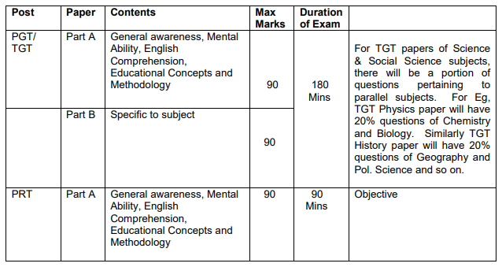

Army Public School Teacher Syllabus 2019 With Exam Pattern Is Here, These Details Are Important For Those Candidates Who Apply For APS Teacher Vacancy and Finding Real army public school teacher recruitment syllabus 2019. Army Public School Teacher PGT, TGT, PRT Exam pattern is Important For Preparing of Exam. So All Applied Candidates Can Get Army Public School Teacher Syllabus in this Page also get Army Public School Selection Processes From Our Website [freegovtjobalert.in](https://freegovtjobalert.in).

## **Army Public School Teacher Syllabus & Exam Pattern**

<table style="border-collapse: collapse; width: 94.6035%; height: 286px;"><tbody><tr><td style="width: 50%; text-align: center;" colspan="2"><a href="https://freegovtjobalert.in/army-public-school-recruitment-2019-apply-online-8000-aps-teacher-vacancy/" target="_blank" rel="noopener noreferrer"><strong>APS Teacher Vacancy Details</strong></a></td></tr><tr><td style="width: 50%; text-align: center;">Job Recruitment Board</td><td style="width: 50%; text-align: center;">Army Public School</td></tr><tr><td style="width: 50%; text-align: center;">Post Name</td><td style="width: 50%; text-align: center;">Teacher (PGT, TGT, PRT)</td></tr><tr><td style="width: 50%; text-align: center;">Total Vacancies</td><td style="width: 50%; text-align: center;">8000</td></tr><tr><td style="width: 50%; text-align: center;">Job Location</td><td style="width: 50%; text-align: center;">Anywhere in India</td></tr><tr><td style="width: 50%; text-align: center;">Application Mode</td><td style="width: 50%; text-align: center;">Online</td></tr><tr><td style="width: 50%; text-align: center;">Selection Process</td><td style="width: 50%; text-align: center;"><a href="https://freegovtjobalert.in/army-public-school-selection-process-for-aps-teacher-vacancy/" target="_blank" rel="noopener noreferrer">Click Here</a></td></tr><tr><td style="width: 50%; text-align: center;">Official Website</td><td style="width: 50%; text-align: center;"><a title="Army Public School" href="http://aps-csb.in/College/Index_New.aspx" target="_blank" rel="noopener noreferrer">Click Here</a></td></tr></tbody></table>

### **Army Public School Teacher Exam Pattern 2019 For PGT, TGT, PRT**

- Scores will be normalized to 100.
- There will be negative marking.1/4 marks will be deducted for each wrong answer.
- Part A & B will be available together and the candidates have the freedom to answer questions in the order in which they prefer.
- To qualify, the candidate must score a minimum of 50 % marks in each part.

### **Army Public School Teacher Syllabus 2019 PDF**

Applied candidates get APS Teacher Syllabus 2019 For TGT, PGT, PRT. During the Exam Preparation time all candidates Finding Syllabus and Try to Success in Exam But Some Candidates Pass And Some Not Because don't have Proper Syllabus For Exam. Candidates can Download Army Public School Teachers 2019 Syllabus PDF From Here.

**Army Public School Teachers Syllabus - General Awareness**

- General Polity including Indian Constitution
- Scientific Research etc
- Sports
- Culture
- Geography
- Economic Scene
- General Science
- Science & Technology
- General Policy
- Indian History
- Indian National Movement
- Countries & Capitals
- Current Affairs – UP, National & International
- Awards and Honours
- Books and Authors
- Science – Inventions & Discoveries
- Critical Days
- International & National Organizations
- Indian Economy
- Sports
- Abbreviations
- Budget and Five Year Plans

**Army Public School Teachers Syllabus - Mental Ability**

- Alphabet test
- Sitting Arrangements
- Relationship Concepts
- Mathematical Operations
- Arithmetic Reasoning
- Logical Venn Diagrams
- Inserting Missing Characters
- Number, Ranking and Time Sequence Test
- Series
- Judgment
- Coding-Decoding
- Blood Relations
- Direction sense test
- Eligibility Test
- Analogy
- Classification
- Visual Memory

**Army Public School Teachers Syllabus - English Comprehension**

- Fill in the blanks with articles
- Comprehension
- Proficiency in the language
- Spot the error
- Verb
- Sentences rearrangement
- Preposition
- Fill in the blanks
- Adverb
- Subject-verb agreement
- Error Correction/ recognition
- Tenses
- Answering questions based on the unseen passage
- Vocabulary
- Synonyms
- Homonyms
- Sentence structure
- Antonyms usage
- Grammar

**Army Public School Teachers Syllabus - Educational Concepts and Methodology**

- Nature of the Child
- Knowledge of The Subject
- The Effects Of The Teacher And His/ Her Teaching
- Needs Analysis
- Strategies-based instruction.
- General Principal of Teaching
- Teaching Formulae
- Qualities of a Teacher
- Teaching Methodologies
- Technology and language teaching.
- Methods to Present the Subject to Student
- Teaching Methods
- Materials development and syllabus design.
- Teacher education and critical pedagogy.
- Sociocultural Theory of language learning.
- Classroom Management.
- English for Specific Purposes (ESP)/ English for Academic Purposes (EAP).
- Integrated language skills.
- Reflective language teaching.

> Download Army Public School Teacher Syllabus 2019 PDF [Click Here](https://freegovtjobalert.in/wp-content/uploads/2019/09/Download-Army-Public-School-Teacher-PGT-TGT-PRT-Syllabus-2019.pdf)
