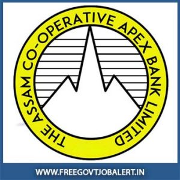

**Assam Co-operative Apex Bank Recruitment 2019**: The Assam Co-operative Apex Bank Ltd. is invited candidates who completed graduation For bank manager/ branch manager in the bank under officer Grade-D. Interested candidates must fulfill the following eligibility criteria and can apply before Date 13-08-2019. candidates can read the notification carefully before applying online.

## Assam Co-operative Apex Bank Manager Vacancy Details

<table style="height: 349px; width: 85.382%; border-collapse: collapse; border-style: double;"><tbody><tr style="height: 100px;"><td style="width: 100.512%; text-align: center; height: 38px;" colspan="2">The Assam Co-operative Apex Bank Ltd.

Assam Bank Jobs 2019
10 Manager/ Branch Manager Vacancy
</td></tr><tr style="height: 30px;"><td style="width: 100.512%; height: 30px; background-color: #2a5a8e; text-align: center;" colspan="2"><h3><strong>&nbsp;Important Dates</strong></h3></td></tr><tr style="height: 22px;"><td style="width: 50%; text-align: center; height: 22px;">Last Date for Registration</td><td style="width: 50.5115%; text-align: center; height: 22px;"><strong>13-08-2019(5:00 P.M)</strong></td></tr><tr style="height: 30px;"><td style="width: 100.512%; height: 30px; background-color: #2a5a8e; text-align: center;" colspan="2"><h3><strong>&nbsp;Vacancy Details</strong></h3></td></tr><tr style="height: 22px;"><td style="width: 100.512%; text-align: center; height: 22px;" colspan="2"><strong>Manager/Branch Manager under Officer Grade-D</strong>

No. of Vacancy: 10

<strong>Payscale</strong>: Rs. 36,220/- to Rs. 86,200/-

<strong>Grade Pay:</strong> Rs. 9,100

<strong>Experience:</strong> 5 Years Experience in Banking in officers/ Executive Grade.</td></tr><tr style="height: 30px;"><td style="width: 100.512%; height: 30px; background-color: #2a5a8e; text-align: center;" colspan="2"><h3><strong>Eligibility Criteria&nbsp;</strong></h3></td></tr><tr style="height: 14px;"><td style="width: 50%; text-align: center; height: 14px;"><strong>Education Qualification</strong></td><td style="width: 50.5115%; text-align: center; height: 14px;"><strong>Age Limits</strong></td></tr><tr style="height: 30px;"><td style="width: 50%; text-align: center; height: 30px;">Graduate with minimum 50% marks or Post Graduate in any discipline preferably CAIIB or C.A., MBA, ICWAI, I.C.S.I.</td><td style="width: 50.5115%; text-align: center; height: 30px;">Minimum 28 years Maximum 35 years(In case of candidates belonging to reserved category, the age limit will be relaxed as per rules followed by the State Govt.)</td></tr><tr style="height: 30px;"><td style="width: 100.512%; height: 30px; background-color: #2a5a8e; text-align: center;" colspan="2"><h3><strong>Application Fee&nbsp;</strong></h3></td></tr><tr style="height: 30px;"><td style="width: 100.512%; text-align: center; height: 30px;" colspan="2">Application Fee: Rs. 600/-

(The Application form should be accompanied by a Demand Draft )</td></tr><tr style="height: 30px;"><td style="width: 100.512%; height: 30px; background-color: #2a5a8e; text-align: center;" colspan="2"><h3><strong>Important Links&nbsp;</strong></h3></td></tr><tr style="height: 10px;"><td style="width: 50%; text-align: center; height: 10px;"><strong>Application Form</strong></td><td style="width: 50.5115%; text-align: center; height: 10px;"><a style="color: #ff0000;" href="https://freegovtjobalert.in/wp-content/uploads/2019/08/Assam-Co-operative-Apex-Bank-Manager_APPLICATION_FORM.pdf" target="_blank" rel="noopener noreferrer"><strong>Download Form</strong></a></td></tr><tr style="height: 36px;"><td style="width: 50%; text-align: center; height: 23px;"><strong>Notification</strong></td><td style="width: 50.5115%; text-align: center; height: 23px;"><a style="color: #ff0000;" href="https://freegovtjobalert.in/wp-content/uploads/2019/08/Assam-Co-operative-Apex-Bank-Manager-Vacancy-Notification.pdf" target="_blank" rel="noopener noreferrer"><strong>Click Here&nbsp;</strong></a></td></tr><tr style="height: 10px;"><td style="width: 50%; text-align: center; height: 10px;"><strong>&nbsp;Official Website</strong></td><td style="width: 50.5115%; text-align: center; height: 10px;"><a style="color: #ff0000;" href="http://www.apexbankassam.com/" target="_blank" rel="noopener noreferrer"><strong>Click Here</strong></a></td></tr></tbody></table>

### How To Apply For Assam Co-operative Apex Bank Manager Post?

1. Candidates complying with the above criteria may apply by downloading the Application form from the Bank’s website www.apexbankassam.com
2. The Application form needs to be filled up in capital letters and duly signed by the Applicant.
3. 1(one) copy of recent passport size photograph should be pasted on the application in the space specified with signature across it and 1(one) copy should be enclosed.
4. Applications must be accompanied by self-attested copies of educational qualifications from H.S.L.C. onwards both pass certificate & mark sheets, experience certificate, Age certificate, certificate of computer efficiency and other qualifications, etc.
5. Application forms accompanied by necessary enclosures have to be sent by Registered / Speed Post/ Hand Delivery only in a sealed envelope superscribed with “Post applied for (Name of the Post)” to the following address: **The Managing Director** **The Assam Co-operative Apex Bank Ltd.** **H.O., Panbazar, H.B. Road,** **Guwahati-781001, Kamrup (M), Assam**
6. Selected candidates will be required to produce a valid discharge certificate from the present employer before joining the service (In case of in-service candidates).

### General Conditions for Assam Co-operative Apex Bank Manager Candidates:

- The Applicant must be Indian National.
- Candidates who are in service must apply through proper channel.
- Candidature of an Applicant may be rejected at any stage if his/ her certificates/ testimonials etc.are not found to be in order or as per the Bank’s requirement.
- Application received after the last date of submission will neither be entertained nor returned.
- Candidates will not be admissible for Traveling Allowance (TA) for appearing in the Written Test/ Interview.

**Other Bank Jobs:**

- [JDCC bank Recruitment 2019 | Clerk (Support Staff) 220 Vacancies](https://freegovtjobalert.in/jdcc-bank-recruitment-2019-clerk-support-staff-220-vacancies/)
- [Bank of Maharashtra – 46 Specialist Officers Vacancy 2019](https://freegovtjobalert.in/bank-of-maharashtra-specialist-officers-vacancy/)
- [IBPS Probationary Officer/ Management Trainee 4336 IBPS PO MT Vacancies](https://freegovtjobalert.in/ibps-crp-po-mt-ix-vacancies/)
