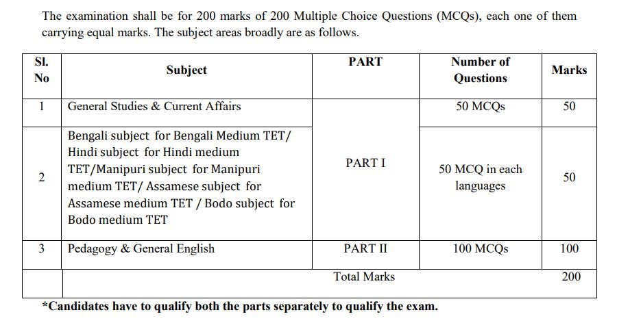
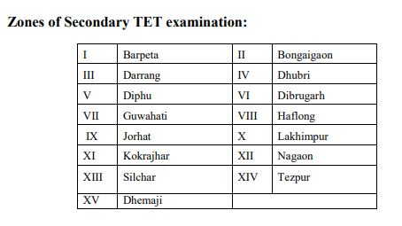

Assam TET Notification 2019: Secondary Education Department of Assam Has Released Notification For TET Exam. It is for general information that the Govt. of Assam is going to conduct medium wise TET for secondary level in pursuance to our earlier advertisement vide No RMSA/Special TET/842/2017/80 dated 31/07/17. Thereby online applications are invited from the eligible candidates who are permanent residents of Assam.

## **Assam TET Notification 2019**

<table style="border-collapse: collapse; width: 100%;"><tbody><tr><td style="width: 50%; background-color: #2a5a8e; text-align: center;" colspan="2"><strong>Assam TET Recruitment 2019</strong></td></tr><tr><td style="width: 50%; text-align: center;">Job Recruitment Board</td><td style="width: 50%; text-align: center;">Secondary Education Department of Assam</td></tr><tr><td style="width: 50%; text-align: center;">Notification No.</td><td style="width: 50%; text-align: center;">RMSA/Special TET/842/2017/172</td></tr><tr><td style="width: 50%; text-align: center;">Post</td><td style="width: 50%; text-align: center;">Assam TET-2019 For (Secondary level)</td></tr><tr><td style="width: 50%; text-align: center;">Vacancies</td><td style="width: 50%; text-align: center;">-</td></tr><tr><td style="width: 50%; text-align: center;">Job Location</td><td style="width: 50%; text-align: center;"><a href="https://freegovtjobalert.in/assam-govt-job/" target="_blank" rel="noopener noreferrer">Assam</a></td></tr><tr><td style="width: 50%; text-align: center;">Job Type</td><td style="width: 50%; text-align: center;">Teaching Jobs</td></tr><tr><td style="width: 50%; text-align: center;">Application Mode</td><td style="width: 50%; text-align: center;">Online</td></tr></tbody></table>

 

<table style="border-collapse: collapse;"><tbody><tr><td style="width: 50%; background-color: #2a5a8e; text-align: center;" colspan="2"><h3><strong>Assam TET Exam Dates</strong></h3></td></tr><tr><td style="width: 50%; text-align: center;">Starting Date of Online Application</td><td style="width: 50%; text-align: center;">15-11-2019</td></tr><tr><td style="width: 50%; text-align: center;">Last Date of Online Application</td><td style="width: 50%; text-align: center;">25-11-2019 Extended to 30-11-2019</td></tr><tr><td style="width: 50%; text-align: center;">Last Date For Payment of Fee</td><td style="width: 50%; text-align: center;">28-11-2019 Extended to 04-12-2019</td></tr><tr><td style="width: 50%; text-align: center;">Assam TET Exam Date</td><td style="width: 50%; text-align: center;">22-12-2019</td></tr></tbody></table>

### **Assam High School TET Education Qualification**

**Graduate Teacher:-**

- Graduate/Post Graduate from recognized university at least 50% marks either in Graduation or in post-graduation and Bachelor of Education(B.Ed) from National Council for Teachers Education recognized institution, but Degrees obtain from off-campus and distance education institution shall not be considered as valid.

**Hindi Teacher:-**

- B.A with 50% marks and having Hindi as one of the subjects with 50% marks or postgraduate degree in Arts with 50% marks provided that he/she has passed BA with one of the subjects as Hindi with 50% marks in Hindi.

**Classical Teacher (Arabic, Sanskrit, Urdu, Persian etc):-**

- MM with 50% marks/ 50% marks in the concerned subject and degree qualification with 50% marks or postgraduate degree in Arts with 50% marks from any recognized university, but Degrees obtain from off-campus and distance education institution shall not be considered as valid.

**Classical Teacher (Assamese Language, Manipuri Language):-**

- B.A with Honours/ Major in concerned subject with 50% marks and B.T. /B.Ed. degree from any recognized University. But Degrees obtain from off-campus and distance education institution shall not be considered as valid.

### **Assam TET Exam Structure & content**

### **Minimum qualifying marks for passing Assam TET**

- To qualify in TET Examination the candidate must score at least 60% marks. However, 5% relaxation in marks will be given for candidates belonging to SC/ST/OBC/MOBC/PWD.
- The candidate whose degree of physical disability is more than 40% is only eligible to apply, under the PWD/PH.
- Notwithstanding the minimum prescribed marks secured in TET Examination, the number of candidates declared as TET Examination qualified would be a maximum of double the number of vacancies of Teachers and such candidates will be determined as per merit position.

### **Assam TET Certificate Validity**

- All candidates who pass the TET will be awarded a certificate.
- The validity of the certificate shall be for a maximum period of 7(Seven) years from the date of issue of the certificate by the Empowered Committee, Government of Assam subject to the condition that the candidate otherwise fulfills the eligibility criteria prescribed for recruitment to the services in the Government of Assam.

### **Assam TET Application Fee**

- Application Fee Rs. 400/-
- Payment Mode: Fee can be paid online through SBI Collect.

### **How to Apply for Assam TET Exam**

1. Applications must be submitted in online mode only at the official website http://ssa.assam.gov.in
2. Click On Apply Online Button.
3. Click on the Application Form.
4. Fill up the Application Form.
5. Upload Candidates Photo & Signature Photos.
6. Pay Application Fee.
7. Submit Application.
8. Done

### **Important Links For Assam TET 2019 Exam**

- Assam High School TET Exam Online Form 2019: [Click Here](http://formonline.net/RMSA_SPECIAL_TET/webpages/TetSecondary.html)
- Download Assam High School TET Exam 2019 Notification: [Assam](https://ssa.assam.gov.in/sites/default/files/swf_utility_folder/departments/ssam_medhassu_in_oid_5/latest/tet_regen_ad_assamese.pdf) | [Bengali](https://ssa.assam.gov.in/sites/default/files/swf_utility_folder/departments/ssam_medhassu_in_oid_5/latest/tet_regen_ad_bengali.pdf "Assam TET") | [Bodo](https://ssa.assam.gov.in/sites/default/files/swf_utility_folder/departments/ssam_medhassu_in_oid_5/latest/tet_regen_ad_bodo.pdf "Assam TET") | [Hindi](https://ssa.assam.gov.in/sites/default/files/swf_utility_folder/departments/ssam_medhassu_in_oid_5/latest/tet_regen_ad_hindi.pdf "Assam TET") | [Manipuri](https://ssa.assam.gov.in/sites/default/files/swf_utility_folder/departments/ssam_medhassu_in_oid_5/latest/tet_regen_ad_manipuri.pdf "Assam TET")
- Assam TET Exam Syllabus Medium Wise: [Download PDF](https://ssa.assam.gov.in/sites/default/files/swf_utility_folder/departments/ssam_medhassu_in_oid_5/latest/syllabus_tet_medium_tet.pdf)
- Assam Secondary Education Official Website: [Click Here](https://ssa.assam.gov.in/)
