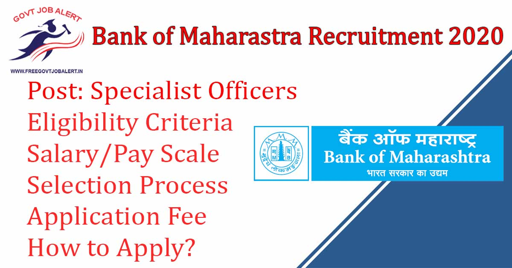
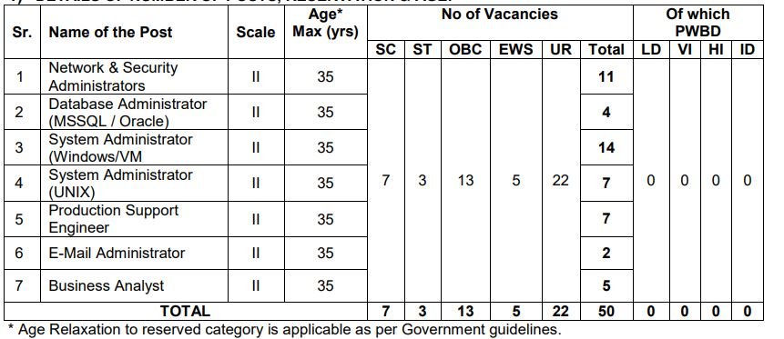
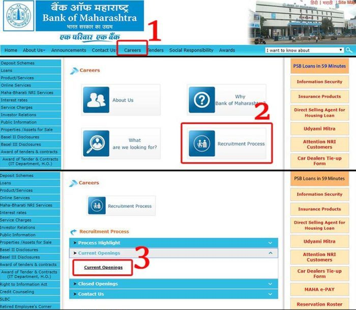

Bank of Maharashtra SO Recruitment 2019: Bank Of Maharastra Has Going to fill up Specialist Officer Vacancy. BOM invites Online Application From Eligible Candidates of Specialist Officer in Scale-II in Information Technology Department For Project 2020-21. As Per Bank of Maharashtra Specialist Officer Recruitment 2019 Notification, A Total Of 50 Vacancy is There. Bank of Maharashtra Specialist Officer Recruitment Online Form 2019 has to Start on 16th December 2019 at www.bankofmaharashtra.in.

## **Bank of Maharashtra Specialist Officers Vacancy Details 2019**

<table style="border-collapse: collapse; width: 100%;"><tbody><tr><td style="width: 50%; background-color: #2a5a8e; text-align: center;" colspan="2"><h3><strong>Bank of Maharastra Recruitment 2019</strong></h3></td></tr><tr><td style="width: 50%; text-align: center;">Job Recruitment Board</td><td style="width: 50%; text-align: center;">Bank of Maharashtra</td></tr><tr><td style="width: 50%; text-align: center;">Notification No.</td><td style="width: 50%; text-align: center;">AX1/ ST/RP/I.T Officers/2020-21</td></tr><tr><td style="width: 50%; text-align: center;">Post</td><td style="width: 50%; text-align: center;">Specialist Officers</td></tr><tr><td style="width: 50%; text-align: center;">Vacancies</td><td style="width: 50%; text-align: center;">50</td></tr><tr><td style="width: 50%; text-align: center;">Job Location</td><td style="width: 50%; text-align: center;">Anywhere in India</td></tr><tr><td style="width: 50%; text-align: center;">Job Type</td><td style="width: 50%; text-align: center;">Bank Jobs</td></tr><tr><td style="width: 50%; text-align: center;">Application Mode</td><td style="width: 50%; text-align: center;">Online</td></tr></tbody></table>

Bank of Maharastra Recruitment 2019 Notification PDF and Apply Online Link Available on his official website. Those Candidates are Eligible to apply who have completed B.E/B.Tech in Computer Science. Applicants must Age Not More Than 35 Years. The selected candidates will be posted to Head Office, Pune or anywhere in India, depending on the requirement of the Bank. Good Chance For Those Candidates who are Finding Bank Jobs In Maharashtra. They can Fill up BOM SO Online Application Form Before the Last Date.

<table style="border-collapse: collapse;"><tbody><tr><td style="width: 50%; background-color: #2a5a8e; text-align: center;" colspan="2"><h3><strong>BOM SO Exam Dates</strong></h3></td></tr><tr><td style="width: 50%; text-align: center;">Starting Date of Online Application</td><td style="width: 50%; text-align: center;">16-12-2019</td></tr><tr><td style="width: 50%; text-align: center;">Last Date of Online Application</td><td style="width: 50%; text-align: center;">31-12-2019</td></tr></tbody></table>

Bank of Maharashtra SO Recruitment 2019 Details Like Education Qualification, Experience, Age Limits, Application Fee, Salary, Probation Period, Selection Process, How to apply, etc. - given below.

### **Bank of Maharashtra Specialist Officers Vacancy Details**

- Bank Of Maharastra Specialist Officer Vacancy: 50 Posts

### **Bank of Maharashtra SO Recruitment Eligibility Criteria**

Age Limits

Maximum:

- General Candidates: 35 Years
- OBC Candidates: 38 Years
- SC/ST Candidates: 40 Years 
- PWBD Candidates: 45 Years

Education Qualification

<table style="border-collapse: collapse; width: 100%;"><tbody><tr><td style="width: 27.276%; text-align: center; background-color: #2a5a8e;"><strong>Post Name</strong></td><td style="width: 39.3906%; text-align: center; background-color: #2a5a8e;"><strong>Qualification</strong></td><td style="width: 33.3333%; text-align: center; background-color: #2a5a8e;"><strong>Experience</strong></td></tr><tr><td style="width: 27.276%; text-align: center;">Network &amp; Security Administrator</td><td style="width: 39.3906%; text-align: center;">B. Tech / B.E in Computer Science / Electronics / Electronics &amp; Communications. [Minimum 55% marks in aggregate]</td><td style="width: 33.3333%; text-align: center;">Minimum 3 years’ experience, preferably in Banking Projects.</td></tr><tr><td style="width: 27.276%; text-align: center;">Database Administrator (MSSQL/Oracle)</td><td style="width: 39.3906%; text-align: center;">B. Tech / B.E in Computer Science / I.T / Electronics / MCA /MSc Computer Science. [Minimum 55% marks in aggregate].</td><td style="width: 33.3333%; text-align: center;">Minimum 3 years’ experience in Oracle / MSSQL Database Administration / Database Operation, preferably in Banking Projects.</td></tr><tr><td style="width: 27.276%; text-align: center;">System Administrator (Windows / VM)</td><td style="width: 39.3906%; text-align: center;">B. Tech / B.E in Computer Science / I.T / Electronics / MCA / MSc Computer Science. [Minimum 55% marks in aggregate].</td><td style="width: 33.3333%; text-align: center;">Minimum 3 years’ experience in System / Server administration, preferably in Banking Projects.</td></tr><tr><td style="width: 27.276%; text-align: center;">System Administrator (UNIX).</td><td style="width: 39.3906%; text-align: center;">B. Tech / B.E in Computer Science / I.T / Electronics / MCA /MSc Computer Science. [Minimum 55% marks in aggregate].</td><td style="width: 33.3333%; text-align: center;">Minimum 3 years’ experience in UNIX System / Server administration, preferably in Banking Projects.</td></tr><tr><td style="width: 27.276%; text-align: center;">Product Support Engineer.</td><td style="width: 39.3906%; text-align: center;">B. Tech / B.E in Computer Science / I.T / Electronics / MCA /MSc Computer Science. [Minimum 55% marks in aggregate].</td><td style="width: 33.3333%; text-align: center;">Minimum 3 years’ experience in UNIX / Oracle Database Operations, preferably in Banking Projects.</td></tr><tr><td style="width: 27.276%; text-align: center;">E-Mail Administrator.</td><td style="width: 39.3906%; text-align: center;">B. Tech / B.E in Computer Science / I.T / Electronics / MCA /M. Sc Computer Science. [Minimum 55% marks in aggregate].</td><td style="width: 33.3333%; text-align: center;">Minimum 3 years’ experience in E-Mail Server administration/configuration on Banking Projects.</td></tr><tr><td style="width: 27.276%; text-align: center;">Business Analyst.</td><td style="width: 39.3906%; text-align: center;">B. Tech / B.E in Computer Science / I.T / M. Sc Computer Science, MCA / M. Tech / M.E in Computer Science / IT. [Minimum 55% marks in aggregate].</td><td style="width: 33.3333%; text-align: center;">Minimum 2-year experience as a Business Analyst, preferably in a banking project.</td></tr></tbody></table>

### **Bank of Maharashtra Specialist Officers Salary/Pay Scale**

- The scale of Pay – Scale-II
- Rs. 31705 -1145/1-32850 -1310/10 – 45950 (Subject to revision).

### **Probation Period Fro Bank of Maharashtra Specialist Officers Jobs**

- The selected candidates will be on probation for one year from the date of joining the Bank. There is a mandatory provision of executing a service bond by selected candidates.

### **Bank of Maharashtra Specialist Officers Selection Process**

- The applications received will be screened, and deserving candidates shall be shortlisted for **Interview** process based on their qualifications, experience, suitability, etc.
- Final Selection will be based on marks secured by the candidates in the personal interview

### **Application Fee For Bank of Maharashtra Specialist Officers 2019**

- UR/EWS/OBC Candidates: Rs. 1180/-
- SC/ST Candidates: Rs. 118/-
- PWBD candidates: No Fee
- Payment Mode: Online

### **How to Apply For Bank of Maharashtra Specialist Officers Vacancy 2019**

1. Go to Official Website: [www.bankofmaharashtra.in](https://www.bankofmaharashtra.in)
    
    \[caption id="attachment\_589" align="aligncenter" width="700"\] Bank of Maharashtra\[/caption\]
2. find and Click **Careers**,
3. then click on the **Recruitment process**,
4. Click On **Current Openings**,
5. Now, find the recruitment of specialist officers notification and click on the **apply online** button.
6. Then, Enter your registration number and password and click on the submit button. (if you don't have registration number then click on "Click here for New Registration" and first register)
7. Now Fill up the Application Form.
8. Upload Recruited Documents/Images.
9. Pay Application Fee Via online.
10. Submit Application.
11. Done

### **Bank of Maharashtra Specialist Officers Vacancy Important Links** 

- Bank of Maharashtra Specialist Officer Online Form 2019: Click Here
- Download Bank of Maharastra 50 SO Vacancy Notification 2019 PDF: [Click Here](https://www.bankofmaharashtra.in/writereaddata/documentlibrary/d139f5e0-5690-4b97-872a-b283a645fc40.pdf)
- Bank of Maharastra Official Website: [Click Here](https://www.bankofmaharashtra.in/)

Candidates can visit www.bankofmaharashtra.in to get more details about Bank of Maharashtra SO Recruitment 2019-20. To More Information About Bank of Maharastra upcoming vacancies 2020, latest Updates, Admit Card, Result, Etc. It will be published on the official website. Also, visit Regularly our website [www.freegovtjobalert.in](https://freegovtjobalert.in "Free Govt job Alert") for getting the Latest job Updates.
