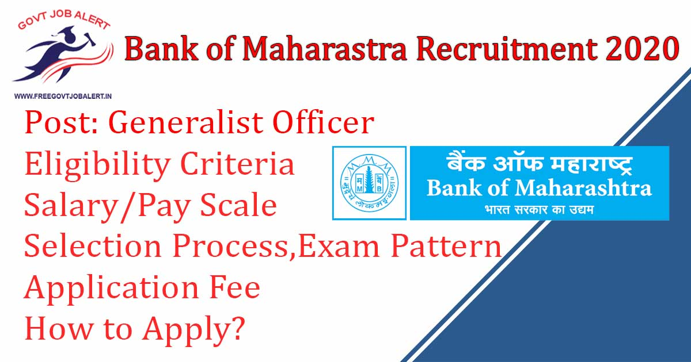
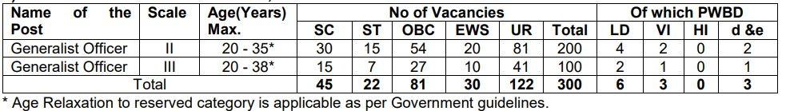
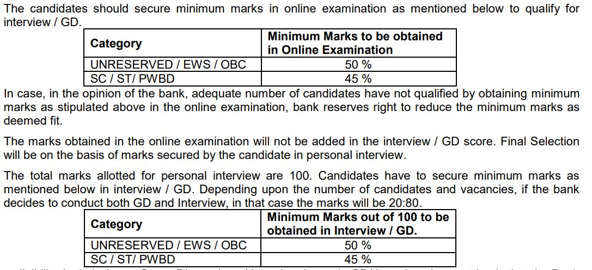
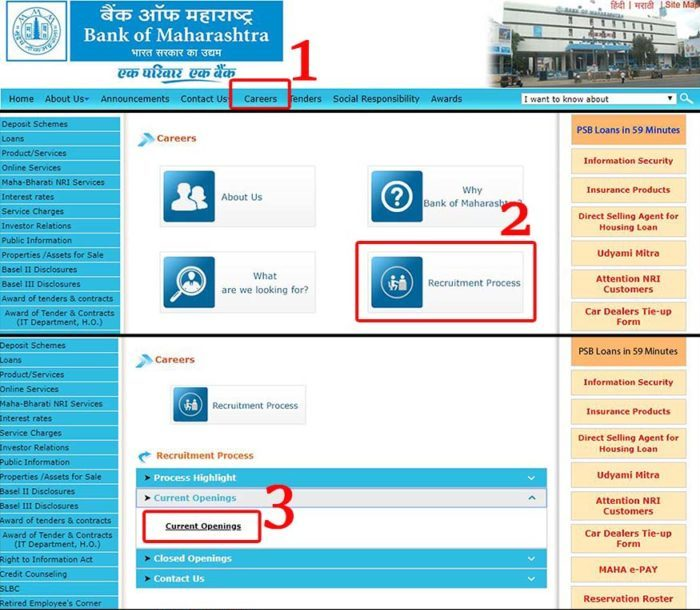
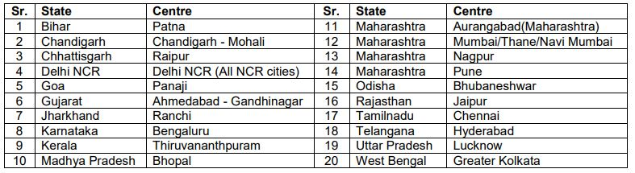

**Bank Of Maharastra Generalist Officer Recruitment 2020**: Bank Of Maharastra Has Going to fill up Generalist Officer Vacancy. BOM invites Online Application From Eligible Candidates of Generalist Officer in Scale-II & Scale-III For Project 2019-20. As Per Bank of Maharashtra Generalist Officer Recruitment 2019 Notification, A Total Of 300 Vacancy is There. Bank of Maharashtra Generalist Officer Recruitment Online Form 2019 has to Start on 11th December 2019 at www.bankofmaharashtra.in.

## **Bank Of Maharastra Generalist Officer Recruitment 2019**

<table style="border-collapse: collapse; width: 100%;"><tbody><tr><td style="width: 50%; background-color: #2a5a8e; text-align: center;" colspan="2"><h3><strong>Bank Of Maharastra Recruitment 2019</strong></h3></td></tr><tr><td style="width: 50%; text-align: center;">Job Recruitment Board</td><td style="width: 50%; text-align: center;">Bank Of Maharastra</td></tr><tr><td style="width: 50%; text-align: center;">Notification No.</td><td style="width: 50%; text-align: center;">AX1/ ST/RP/GENERALIST OFFICER/2019-20</td></tr><tr><td style="width: 50%; text-align: center;">Post</td><td style="width: 50%; text-align: center;">Generalist Officer</td></tr><tr><td style="width: 50%; text-align: center;">Vacancies</td><td style="width: 50%; text-align: center;">300</td></tr><tr><td style="width: 50%; text-align: center;">Job Location</td><td style="width: 50%; text-align: center;">Anywhere in India</td></tr><tr><td style="width: 50%; text-align: center;">Job Type</td><td style="width: 50%; text-align: center;">Bank Jobs</td></tr><tr><td style="width: 50%; text-align: center;">Application Mode</td><td style="width: 50%; text-align: center;">Online</td></tr></tbody></table>

Bank of Maharastra Recruitment 2019 Notification PDF and Apply Online Link Available on his official website. Those Candidates are Eligible to apply who have completed Bachelor’s Degree in any discipline with knowledge in computers. Applicants must Age Not More Than 38 Years. The selected candidates will be posted to Head Office, Pune or anywhere in India, depending on the requirement of the Bank. Good Chance For Those Candidates who are Finding Bank Jobs In Maharashtra. They can Fill up BOM GO Online Application Form Before the Last Date.

<table style="border-collapse: collapse;"><tbody><tr><td style="width: 50%; background-color: #2a5a8e; text-align: center;" colspan="2"><h3><strong>Bank Of Maharastra GO Exam Dates</strong></h3></td></tr><tr><td style="width: 50%; text-align: center;">Starting Date of Online Application</td><td style="width: 50%; text-align: center;">11-12-2019</td></tr><tr><td style="width: 50%; text-align: center;">Last Date of Online Application</td><td style="width: 50%; text-align: center;">31-12-2019</td></tr><tr><td style="width: 50%; text-align: center;">Date of Online Examination</td><td style="width: 50%; text-align: center;">Tentatively in February / March 2020</td></tr><tr><td style="width: 50%; text-align: center;">Date of GD / Interview</td><td style="width: 50%; text-align: center;">Will be informed separately</td></tr></tbody></table>

Bank of Maharashtra GO Recruitment 2019 Details Like Education Qualification, Experience, Age Limits, Application Fee, Salary, Probation Period, Selection Process, How to apply, etc. - given below.

### **Bank Of Maharastra Generalist Officer Vacancy 2019 Details**

- **Bank Of Maharastra Generalist Officer Vacancy 2020: 300 Posts**

### **Bank Of Maharastra Generalist Officer Recruitment 2019 Eligibility Criteria**

<table style="border-collapse: collapse; width: 100%;"><tbody><tr><td style="width: 14.6108%; text-align: center; background-color: #2a5a8e;"></td><td style="width: 42.3642%; text-align: center; background-color: #2a5a8e;"><strong>MMGS Scale-II</strong></td><td style="width: 43.0249%; text-align: center; background-color: #2a5a8e;"><strong>MMGS Scale – III</strong></td></tr><tr><td style="width: 14.6108%; text-align: center;">Qualification</td><td style="width: 85.3891%; text-align: center;" colspan="2"><ul><li style="text-align: left;">Bachelor’s Degree in any discipline with knowledge of computers.</li><li style="text-align: left;">Passing of JAIIB and CAIIB is desirable.</li><li style="text-align: left;">A professional qualification like MBA (Finance) /CA/ICWA/CFA/FRM/ from a recognized University/ Institution/ Board recognized by Govt. of India / approved by Govt. Regulatory bodies are desirable.</li><li style="text-align: left;">The minimum marks shall be 60% with a Bachelor’s degree in the aggregate of all semesters/ years.</li></ul></td></tr><tr><td style="width: 14.6108%; text-align: center;">Experience</td><td style="width: 42.3642%; text-align: center;">Post Qualification Work Experience of 2 years as an officer in any Scheduled Commercial Bank.

Experience in Credit-related areas / Branch Head / Incharge is desirable.</td><td style="width: 43.0249%; text-align: center;">Post Qualification Work Experience of 5 years as an officer in any Scheduled Commercial Bank.

He / She should have worked in processing credit proposals, Branch Head, Incharge of functional departments, Forex, etc.,</td></tr><tr><td style="width: 14.6108%; text-align: center;">Age Limits</td><td style="width: 42.3642%; text-align: center;">Maximum 35 years.</td><td style="width: 43.0249%; text-align: center;">Maximum 38 years.</td></tr></tbody></table>

- For Age Relaxing Plese Check Notification

### **Salary/Pay Scale For Bank Of Maharastra Generalist Officer Recruitment 2019**

**Scale of Pay Scale-II**

- Rs. 31705 -1145/1-32850 -1310/10 – 45950 (Subject to revision).

**Scale of Pay Scale-III**

- Rs. 42020 – 1310/5 – 48570 – 1460/2 – 51490 (Subject to revision)

### **Bank Of Maharastra Generalist Officer Probation Period**

- The selected candidates will be on probation for a period of one year from the date of joining the Bank. There is a mandatory provision of executing a service bond by selected candidates.

### **Selection Process For Bank Of Maharastra Generalist Officer Recruitment 2020**

1. Online Exam
2. Interview

### **Bank Of Maharastra Generalist Officer Recruitment 2019- Exam Pattern**

Examination consisting of Objective Test for 150 marks will be conducted online. The test will have of 4 Sections (with separate timings for each section) as follows: -

<table style="border-collapse: collapse; width: 100%; height: 115px;"><tbody><tr style="height: 20px;"><td style="width: 10.0881%; text-align: center; height: 20px; background-color: #2a5a8e;"><strong>Sr. No</strong></td><td style="width: 28.4802%; text-align: center; height: 20px; background-color: #2a5a8e;"><strong>Name of Test</strong></td><td style="width: 16.3656%; text-align: center; height: 20px; background-color: #2a5a8e;"><strong>Questions</strong></td><td style="width: 25.0661%; text-align: center; height: 20px; background-color: #2a5a8e;"><strong>Maximum Marks</strong></td><td style="width: 20%; text-align: center; height: 20px; background-color: #2a5a8e;"><strong>Duration</strong></td></tr><tr style="height: 20px;"><td style="width: 10.0881%; text-align: center; height: 20px;">1</td><td style="width: 28.4802%; text-align: center; height: 20px;">English Language</td><td style="width: 16.3656%; text-align: center; height: 20px;">30</td><td style="width: 25.0661%; text-align: center; height: 75px;" rowspan="4">Total Maximum Marks 150</td><td style="width: 20%; text-align: center; height: 20px;">20 Minutes</td></tr><tr style="height: 20px;"><td style="width: 10.0881%; text-align: center; height: 20px;">2</td><td style="width: 28.4802%; text-align: center; height: 20px;">Quantitative Aptitude</td><td style="width: 16.3656%; text-align: center; height: 20px;">35</td><td style="width: 20%; text-align: center; height: 20px;">20 Minutes</td></tr><tr style="height: 20px;"><td style="width: 10.0881%; text-align: center; height: 20px;">3</td><td style="width: 28.4802%; text-align: center; height: 20px;">Reasoning Ability</td><td style="width: 16.3656%; text-align: center; height: 20px;">35</td><td style="width: 20%; text-align: center; height: 20px;">20 Minutes</td></tr><tr style="height: 15px;"><td style="width: 10.0881%; text-align: center; height: 15px;">4</td><td style="width: 28.4802%; text-align: center; height: 15px;">Professional Knowledge**</td><td style="width: 16.3656%; text-align: center; height: 15px;">50</td><td style="width: 20%; text-align: center; height: 15px;">60 Minutes</td></tr><tr style="height: 20px;"><td style="width: 38.5683%; text-align: center; height: 20px;" colspan="2">Total</td><td style="width: 16.3656%; text-align: center; height: 20px;">150</td><td style="width: 25.0661%; text-align: center; height: 20px;"></td><td style="width: 20%; text-align: center; height: 20px;">2 Hours</td></tr></tbody></table>

### **Bank Of Maharastra Generalist Officer Recruitment Application Fee**

- UR/EWS/OBC Candidates: Rs. 1180/-
- SC/ST Candidates: Rs. 118/-
- PWBD candidates: No Fee
- Payment Mode: Online

### **How to Apply Bank Of Maharastra Generalist Officer Recruitment 2019**

1. Go to Official Website: [www.bankofmaharashtra.in](https://www.bankofmaharashtra.in)
    
    \[caption id="attachment\_589" align="aligncenter" width="700"\] Bank of Maharashtra\[/caption\]
2. find and Click **Careers**,
3. then click on the **Recruitment process**,
4. Click On **Current Openings**,
5. Now, find the recruitment of Generalist Officer notification and click on the **apply online** button.
6. Then, Enter your registration number and password and click on the submit button. (if you don't have registration number then click on "Click here for New Registration" and first register)
7. Now Fill up the Application Form.
8. Upload Recruited Documents/Images.
9. Pay Application Fee Via online.
10. Submit Application.
11. Done

### **Important Links  For Bank Of Maharastra Generalist Officer Recruitment 2019**

- Bank of Maharashtra Specialist Officer Online Form 2019: [Click Here](https://ibpsonline.ibps.in/bomoffgoct19/)
- Download Bank of Maharastra 300 GO Vacancy Notification 2019 PDF: [Click Here](https://www.bankofmaharashtra.in/writereaddata/documentlibrary/b394acf6-d9b9-436b-98d7-a5803fd49c07.pdf)
- Bank of Maharastra Official Website: [Click Here](https://www.bankofmaharashtra.in/)

### **Bank Of Maharastra Generalist Officer Recruitment 2019 Exam Centers**

Candidates can visit www.bankofmaharashtra.in to get more details about Bank of Maharashtra GO Recruitment 2019-20. To More Information About Bank of Maharastra upcoming vacancies 2020, latest Updates, Admit Card, Result, Etc. It will be published on the official website. Also, visit Regularly our website [www.freegovtjobalert.in](https://freegovtjobalert.in) for getting the Latest job Updates.
