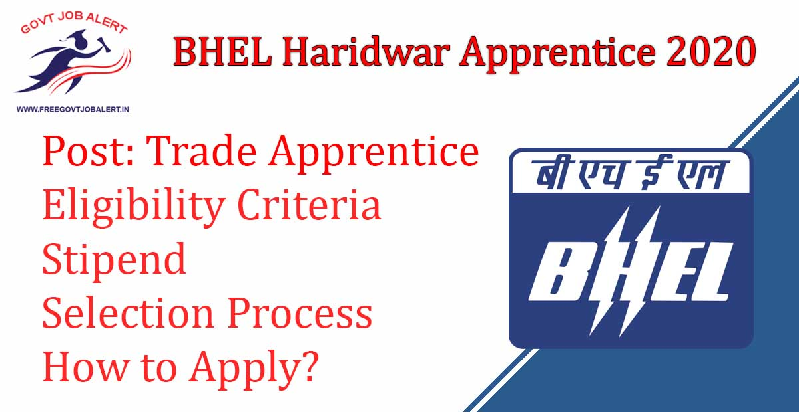
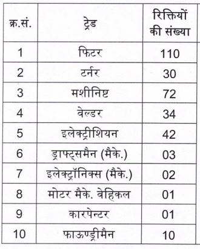

BHEL Haridwar Apprentice 2020: Bharat Heavy Electricals Limited (BHEL), Haridwar (Uttarakhand) has Released Notification Regarding Trade Apprentice Vacancy. BHEL Invites Online Application From Eligible Candidates for April 2020 Batch. As Per BHEL Haridwar Recruitment 2019 A Total of 305 Vacancies in BHEL Haridwar Trade Apprentice. BHEL, Haridwar Apprentice Online Form 2020 Has to Start on 05-12-2019.

## **BHEL Haridwar Apprentice 2020**

<table style="border-collapse: collapse; width: 100%;"><tbody><tr><td style="width: 50%; background-color: #2a5a8e; text-align: center;" colspan="2"><h3><strong>BHEL Recruitment 2019</strong></h3></td></tr><tr><td style="width: 50%; text-align: center;">Job Recruitment Board</td><td style="width: 50%; text-align: center;">Bharat Heavy Electricals Limited (BHEL), Haridwar (Uttarakhand)</td></tr><tr><td style="width: 50%; text-align: center;">Notification No.</td><td style="width: 50%; text-align: center;">Recruitment/Trade Apprentice/April 2020/105</td></tr><tr><td style="width: 50%; text-align: center;">Post</td><td style="width: 50%; text-align: center;">Trade Apprentice</td></tr><tr><td style="width: 50%; text-align: center;">Vacancies</td><td style="width: 50%; text-align: center;">305</td></tr><tr><td style="width: 50%; text-align: center;">Job Location</td><td style="width: 50%; text-align: center;">Haridwar, Uttrakhand</td></tr><tr><td style="width: 50%; text-align: center;">Job Type</td><td style="width: 50%; text-align: center;">Apprentice Jobs</td></tr><tr><td style="width: 50%; text-align: center;">Application Mode</td><td style="width: 50%; text-align: center;">Online</td></tr></tbody></table>

BHEL Recruitment 2019 Notification Published on his Official Website. Those Candidates Are Eligible to apply who Complet High School/ ITI. Applicants Must Age Between 18 to 27 Years. Selected Candidates Will Be Placed in Haridwar, Uttrakhand. Good Chance for those candidates who are Finding 12th Pass jobs in Uttrakhand. Interested & Eligible Candidates Can Fill up BHEL, Haridwar Apprentice Online Form 2020 Before The Last Date.

<table style="border-collapse: collapse; width: 98%; height: 201px;"><tbody><tr style="height: 28px;"><td style="width: 50%; background-color: #2a5a8e; text-align: center; height: 28px;" colspan="2"><h3><strong>BHEL Haridwar Apprentice Important Dates</strong></h3></td></tr><tr style="height: 24px;"><td style="width: 50%; text-align: center; height: 24px;">Starting Date of Online Application</td><td style="width: 50%; text-align: center; height: 24px;">05-12-2019</td></tr><tr style="height: 24px;"><td style="width: 50%; text-align: center; height: 24px;">Last Date of Online Application</td><td style="width: 50%; text-align: center; height: 24px;">19-12-2019</td></tr><tr style="height: 45px;"><td style="width: 50%; text-align: center; height: 45px;">Last Date for Submission of Printout of Application with Documents</td><td style="width: 50%; text-align: center; height: 45px;">27-12-2019</td></tr><tr style="height: 20px;"><td style="width: 50%; text-align: center; height: 20px;">Date for Declaration of Interview</td><td style="width: 50%; text-align: center; height: 20px;">15-02-2020</td></tr><tr style="height: 20px;"><td style="width: 50%; text-align: center; height: 20px;">Dates of Interview</td><td style="width: 50%; text-align: center; height: 20px;">19 to 26-02-2020</td></tr><tr style="height: 20px;"><td style="width: 50%; text-align: center; height: 20px;">Date for Declaration of Final Result</td><td style="width: 50%; text-align: center; height: 20px;">03-03-2020</td></tr><tr style="height: 20px;"><td style="width: 50%; text-align: center; height: 20px;">Date for Joining</td><td style="width: 50%; text-align: center; height: 20px;">27-03-2020 to 11-04-2020</td></tr></tbody></table>

BHEL Haridwar Apprentice 2020 Details Like Education Qualification, Age Limit, Stipend, Selection Process, How to Apply, etc. - Given Below.

### **BHEL Haridwar Apprentice Vacancy Details**

- BHEL Haridwar Trade Apprentice 2020: 305 Posts

### **Eligibility Criteria-BHEL Haridwar ITI Apprentice 2020**

Age Limits

- Minimum: **18 Years**
- Maximum for General: **27 Years**
- Maximum for OBC: **30 Years**
- Maximum for SC/ ST: **32 Years**

Education Qualification

- Candidates Should Have Complete High School/ ITI From Recognized Board.

### **BHEL Haridwar ITI Apprentice 2020-Stipend**

- Selected Candidates Can Get Stipend Rs. 7700/- to Rs. 8050/- P.M

### **Selection Process-BHEL Haridwar Apprentice 2020**

- Selection Process Based on the BHEL Haridwar apprentice 2019 merit list.

### **How to Apply For BHEL Haridwar Apprentice 2020**

1. Candidates Go and Register on Apprenticeship Official Website: www.apprenticeship.gov.in
2. After Register Get NCVT MIS Registration No.
3. Then Go to [Here](https://careers.bhelhwr.co.in/recruitment/TradeAppr/iti_data_entry.jsp)
4. Fill up Application Form
5. Upload Photo & Documents
6. Submit the Application Form and Get Acknowledgment slip
7. Printout and Send to BHEL Haridwar Address via Post.
8. Done

### **BHEL, Haridwar Apprentice 2020 Important Links**

- BHEL Haridwar Apprentice Online Form 2020: [Click Here](https://freegovtjobalert.in/wb-post-office-recruitment-wb-gds-vacancy/)
- Download BHEL Haridwar 305 Apprentice Notification PDF: [Click Here](https://careers.bhelhwr.co.in/recruitment/TradeAppr/Circular.pdf)
- BHEL Haridwar Official Website: [Click Here](https://www.bhelhwr.co.in/) 

Candidates can visit https://www.bhelhwr.co.in to get more details about BHEL Haridwar Apprentice 2020. To More Information About BHEL upcoming vacancies 2020, latest Updates, Admit Card, Syllabus, Result, Etc. It will be published on the official website. Also, visit Regularly our website www.freegovtjobalert.in for getting the Latest job Updates.
