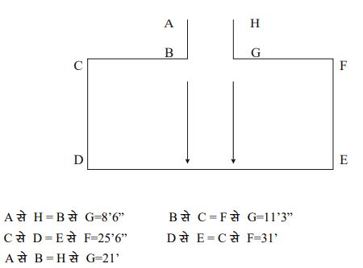

Bihar Police Constable Driver Eligibility Criteria 2019: Bihar police constable Driver recruitment 2019 Notification has published for the Post of Driver Constable for Eligible male & female Candidates. There is a total of 98 vacancies for the recruitment of Constable Driver. Candidates Please check [Bihar Police Constable Vacancy](https://freegovtjobalert.in/bihar-police-constable-driver-recruitment/) Details Before Apply Online. Online Application Submission Last Date is 20-11-2019

## Bihar Police Constable Driver Eligibility Criteria 2019

**Education Qualification:**

- Candidates Should Have Passed their 12th from recognized Board.
- Driving license

**Age Limits:**

- General: 20-25 Years
- OBC (Male): 20-27 Years
- OBC (Female): 20-28 Years
- SC/ST: 20-30 Years

**Physical Standards:**

Male Candidates:

- Height:
    - General Candidates: 165 cm
    - SC/ST: 162 cm
- Chest:
    - General Candidates: 81 cm (expansion: 86 cm)
    - SC/ST Candidates: 79 cm (expansion: 84 cm)

Female Candidates:

- Height: 153 cm

**Physical Endurance Test:**

<table style="border-collapse: collapse; width: 100%;"><tbody><tr><td style="width: 22.8707%; text-align: center; background-color: #2a5a8e;"><strong>Exam</strong></td><td style="width: 36.6373%; text-align: center; background-color: #2a5a8e;"><strong>Male Candidates</strong></td><td style="width: 40.4919%; text-align: center; background-color: #2a5a8e;"><strong>Female Candidates</strong></td></tr><tr><td style="width: 22.8707%; text-align: center;">Race</td><td style="width: 36.6373%; text-align: center;">1.6 K.M in Maximum 7 Minutes</td><td style="width: 40.4919%; text-align: center;">1 K.M in Maximum 7 Minutes</td></tr><tr><td style="width: 22.8707%; text-align: center;">High Jump/Uchi Kud</td><td style="width: 36.6373%; text-align: center;">Minimum 3 feet 6 inch</td><td style="width: 40.4919%; text-align: center;">Minimum 2 feet 6 Inch</td></tr><tr><td style="width: 22.8707%; text-align: center;">Long Jump</td><td style="width: 36.6373%; text-align: center;">Minimum 10 Feet</td><td style="width: 40.4919%; text-align: center;">Minimum 7 Feet</td></tr><tr><td style="width: 22.8707%; text-align: center;">Gola Fek</td><td style="width: 36.6373%; text-align: center;">16 Pound Gola- minimum 14 Feet</td><td style="width: 40.4919%; text-align: center;">12 Pound Gola- Minimum 12 Feet</td></tr></tbody></table>

**Driving Test:**

**Testing Track**

<table style="border-collapse: collapse; width: 100%;"><tbody><tr><td style="width: 33.3333%; background-color: #2a5a8e; text-align: center;" colspan="3"><strong>Jip Driving Test | Maximum 20 Marks</strong></td></tr><tr><td style="width: 33.3333%; text-align: center;"><strong>Time</strong></td><td style="width: 33.3333%; text-align: center;"><strong>Gear Change</strong></td><td style="width: 33.3333%; text-align: center;"><strong>Marks</strong></td></tr><tr><td style="width: 33.3333%; text-align: center;">1 Minutes</td><td style="width: 33.3333%; text-align: center;">3</td><td style="width: 33.3333%; text-align: center;">20</td></tr><tr><td style="width: 33.3333%; text-align: center;">1 Minutes</td><td style="width: 33.3333%; text-align: center;">5</td><td style="width: 33.3333%; text-align: center;">16</td></tr><tr><td style="width: 33.3333%; text-align: center;">1 to minutes</td><td style="width: 33.3333%; text-align: center;">5</td><td style="width: 33.3333%; text-align: center;">12</td></tr><tr><td style="width: 33.3333%; text-align: center;">2 to 3 minutes</td><td style="width: 33.3333%; text-align: center;">5</td><td style="width: 33.3333%; text-align: center;">08</td></tr></tbody></table>

<table style="width: 100%; border-collapse: collapse;"><tbody><tr><td style="width: 171.364%; background-color: #2a5a8e; text-align: center;" colspan="3"><strong>Car Driving Test | Maximum 20 Marks&nbsp;</strong></td></tr><tr><td style="width: 33.2379%; text-align: center;"><strong>Time</strong></td><td style="width: 33.8%; text-align: center;"><strong>Gear Change</strong></td><td style="width: 104.326%; text-align: center;"><strong>Marks</strong></td></tr><tr><td style="width: 33.2379%; text-align: center;">1 Minutes</td><td style="width: 33.8%; text-align: center;">3</td><td style="width: 104.326%; text-align: center;">20</td></tr><tr><td style="width: 33.2379%; text-align: center;">1 Minutes</td><td style="width: 33.8%; text-align: center;">5</td><td style="width: 104.326%; text-align: center;">16</td></tr><tr><td style="width: 33.2379%; text-align: center;">1 to minutes</td><td style="width: 33.8%; text-align: center;">5</td><td style="width: 104.326%; text-align: center;">12</td></tr><tr><td style="width: 33.2379%; text-align: center;">2 to 3 minutes</td><td style="width: 33.8%; text-align: center;">5</td><td style="width: 104.326%; text-align: center;">08</td></tr></tbody></table>

**Bus/Truck Driving Test:**

- Maximum 20 Marks

### **Bihar Police Constable Driver Recruitment 2019 Important links**

- Direct Link To Apply for Bihar Police Constable Driver 2019 - [**Click Here**](http://csbc.bih.nic.in/)
- Download Bihar Police Constable Driver Exam Syllabus PDF: **[Click Here](http://www.csbc.bih.nic.in/Advt/Syllabus-02-2019.pdf)**
- Bihar Police Constable Driver Recruitment Notification 2019 PDF: [**Click Here**](https://freegovtjobalert.in/wp-content/uploads/2019/10/bihar-police-apply-online-for-98-constable-driver-posts-advt-details.pdf)
- CSBC Official website: **[Click Here](http://csbc.bih.nic.in)**
