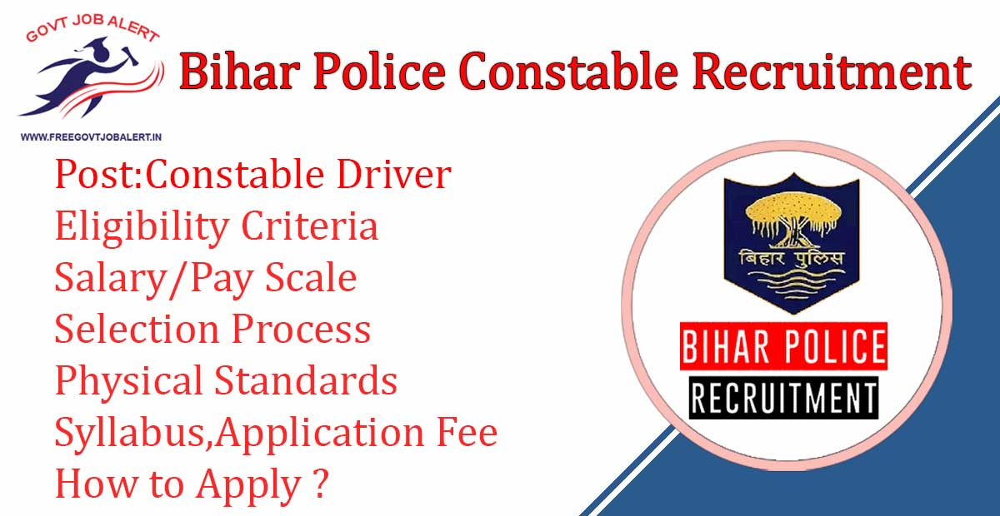
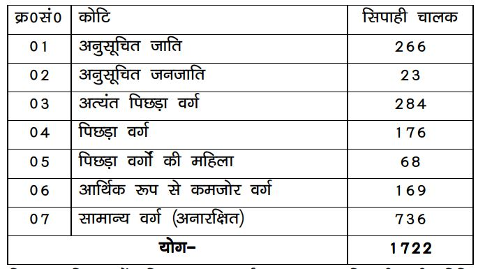
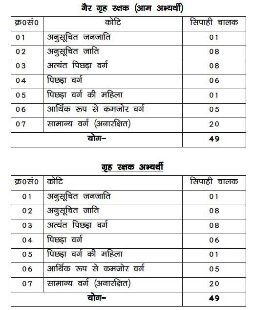

## Bihar Police Constable Driver Recruitment Notification 2020 Details

Bihar Police Constable Driver Recruitment 2019: The Central Selection Board of Constable(CSBC) is Going to fill up Driver Constable Vacancy. CSBC is an Invited online application form for the recruitment post of a police constable in Bihar. As Per Bihar Police Constable Recruitment Notification A total of 1722 Vacancies in Bihar Constable Driver recruitment 2019-20. The Last Date to Fillup Bihar Police Driver Constable Online Form 2019 is 30-12-2019

<table style="border-collapse: collapse; width: 100%;"><tbody><tr><td style="width: 100%; background-color: #2a5a8e; text-align: center;" colspan="2"><h3>Bihar Police Constable Recruitment 2019</h3></td></tr><tr><td style="width: 50%; text-align: center;">Job Recruitment Board</td><td style="width: 50%; text-align: center;">Central Selection Board of Constable</td></tr><tr><td style="width: 50%; text-align: center;">Notification No.</td><td style="width: 50%; text-align: center;">05/2019</td></tr><tr><td style="width: 50%; text-align: center;">Post</td><td style="width: 50%; text-align: center;">Driver Constable</td></tr><tr><td style="width: 50%; text-align: center;">Vacancies</td><td style="width: 50%; text-align: center;">1722</td></tr><tr><td style="width: 50%; text-align: center;">Job Location</td><td style="width: 50%; text-align: center;">Bihar</td></tr><tr><td style="width: 50%; text-align: center;">Job Type/Category</td><td style="width: 50%; text-align: center;">Central Police Jobs</td></tr><tr><td style="width: 50%; text-align: center;">Application Mode</td><td style="width: 50%; text-align: center;">Online</td></tr></tbody></table>

Bihar Police Constable Recruitment 2019 Notification And Apply Online Link Available on Official Website. The Candidates Should Have 12th Pass. Applicants Must Have Age Between 20 to 25 Years. Selected Candidates Will Be Placed in Bihar State. Good Chance For those candidates who looking for Govt Jobs In Bihar. Interested & Eligible Candidates Can Apply Online For Bihar Police Constable Driver Recruitment 2019-20.

<table style="border-collapse: collapse;"><tbody><tr><td style="width: 50%; background-color: #2a5a8e; text-align: center;" colspan="2"><h3>Bihar Police Constable Driver Important Dates</h3></td></tr><tr><td style="width: 50%; text-align: center;">Starting Date of Online Application</td><td style="width: 50%; text-align: center;">30-11-2019</td></tr><tr><td style="width: 50%; text-align: center;">Last Date of Online Application</td><td style="width: 50%; text-align: center;">30-12-2019</td></tr></tbody></table>

Bihar Police Constable Driver Vacancy 2019 details like Education Qualification, Age Limits, Bihar Police Constable Syllabus, Salary, Bihar police Physical test, Etc. Given Below.

### **Bihar police constable vacancy 2019**

- Bihar Police Constable: Driver 1722 Posts

### **Bihar Police Constable Driver Eligibility Criteria**

Bihar Police Driver Constable Exam has conducted by the Central Selection Board of Constable. So, CSBC has Set Minimum Criteria For Applicants.

Education Qualification

- Candidates Should Have Passed their 12th from recognized Board.
- Driving license

Age Limits

- General: 20-25 Years
- OBC (Male): 20-27 Years
- OBC (Female): 20-28 Years
- SC/ST: 20-30 Years

Physical Standards

Male Candidates:

- Height:
    - General Candidates: 165 cm
    - SC/ST: 162 cm
- Chest:
    - General Candidates: 81 cm (expansion: 86 cm)
    - SC/ST Candidates: 79 cm (expansion: 84 cm)

Female Candidates:

- Height: 153 cm

### **Bihar Police Constable Driver Salary/Pay Scale**

- Rs. 5200 - 20200 (Level-3)

### **Bihar Police Constable Driver Selection Process**

1. written Exam
2. Physical Endurance Test/ Physical Standards
3. Driving Test
4. Interview

### **Application Fee For Bihar Police Constable Driver Post**

- General/OBC candidates: Rs. 450
- SC/ST/Ex-Servicemen: Rs. 112
- Payment Mode: Online

### **How to Apply For Bihar Police Constable Driver Post?**

1. Candidates First Go to CSBC Official website: [http://csbc.bih.nic.in/](http://csbc.bih.nic.in/)
2. Register on the Central Selection Board of Constable(With Name, Email, Mobile Number, State, Etc).
3. After Complete Registration Candidates can get Restriction number and Password.
4. Login With Your ID & Password.
5. Then Find Application and Click On Apply Online Button.
6. Fill up details in the Application Form.
7. Upload Candidates images & Candidates Signature Image.
8. then Click on Save and Next Button.
9. Pay Application Fee Via Online.
10. Final Submit Application.
11. Download & save Application for future Use.
12. Done

### **Bihar Police Constable Driver Recruitment 2019 Important links**

- Direct Link To Apply for Bihar Police Constable Driver 2019 - [**Click Here**](https://apply-csbc.com/V1/applicationIndex)
- Download Bihar Police Constable Driver Exam Syllabus PDF: **[Click Here](http://www.csbc.bih.nic.in/Advt/Syllabus-02-2019.pdf)**
- Bihar Police Constable Driver Eligibility Criteria: [**Click Here**](https://freegovtjobalert.in/bihar-police-constable-driver-eligibility/)
- Bihar Police Constable Driver Recruitment Notification 2019 PDF: [**Click Here**](http://csbc.bih.nic.in/Advt/Advt-05-2019-Driver-Constable.pdf)

Candidates can visit http://csbc.bih.nic.in to get more details about Bihar Police Driver Constable Recruitment 2019-20. To More Information About Bihar police upcoming vacancy 2019-20, latest Updates, Admit Card, Syllabus, Result, Etc. It will be published on the official website. Also, visit Regularly our website [www.freegovtjobalert.in](https://freegovtjobalert.in) for getting the Latest job Updates.

* * *

# **Bihar Police Constable Driver Recruitment 2019 Apply Online 98 Vacancies**

**Bihar Police Constable Driver Recruitment 2019**: The Central Selection Board of Constable(CSBC) has Recently Released Notification for fill up Driver Constable Post. CSBC is an Invited online application form for the recruitment post of a police constable in Bihar. As Per Bihar Police Constable Recruitment Notification A total of 98 Vacancies in Bihar Constable Driver recruitment.

## Bihar Police Constable Driver Recruitment Notification 2019 Details

<table style="border-collapse: collapse; width: 100%;"><tbody><tr><td style="width: 100%; background-color: #2a5a8e; text-align: center;" colspan="2"><h3>Bihar Police Constable Recruitment 2019</h3></td></tr><tr><td style="width: 50%; text-align: center;">Job Recruitment Board</td><td style="width: 50%; text-align: center;">Central Selection Board of Constable</td></tr><tr><td style="width: 50%; text-align: center;">Notification No.</td><td style="width: 50%; text-align: center;">03/2019</td></tr><tr><td style="width: 50%; text-align: center;">Post</td><td style="width: 50%; text-align: center;">Driver Constable</td></tr><tr><td style="width: 50%; text-align: center;">Vacancies</td><td style="width: 50%; text-align: center;">98</td></tr><tr><td style="width: 50%; text-align: center;">Job Location</td><td style="width: 50%; text-align: center;">Bihar</td></tr><tr><td style="width: 50%; text-align: center;">Job Type/Category</td><td style="width: 50%; text-align: center;">Central Police Jobs</td></tr><tr><td style="width: 50%; text-align: center;">Application Mode</td><td style="width: 50%; text-align: center;">Online</td></tr></tbody></table>

Good Chance For those candidates who looking for a **12th pass job in Bihar**. Here you can get all information about Bihar Police Constable Driver Vacancy details like Education Qualification, Age Limits, Bihar Police Constable Syllabus, Salary, Bihar police Physical test, Etc. Interested and Eligible candidates can apply online through the Central Selection Board of Constable's Official website.

<table style="border-collapse: collapse;"><tbody><tr><td style="width: 50%; background-color: #2a5a8e; text-align: center;" colspan="2"><h3>Bihar Police Constable Driver Important Dates</h3></td></tr><tr><td style="width: 50%; text-align: center;">Starting Date of Online Application</td><td style="width: 50%; text-align: center;">20-10-2019</td></tr><tr><td style="width: 50%; text-align: center;">Last Date of Online Application</td><td style="width: 50%; text-align: center;">20-11-2019</td></tr></tbody></table>

### **Bihar police constable vacancy 2019**

- Bihar Police Constable: Driver 98 Posts

### **Bihar Police Constable Driver Eligibility Criteria**

Bihar Police Driver Constable Exam has conducted by the Central Selection Board of Constable. So, CSBC has Set Minimum Criteria For Applicants.

Education Qualification

- Candidates Should Have Passed their 12th from recognized Board.
- Driving license

Age Limits

- General: 20-25 Years
- OBC (Male): 20-27 Years
- OBC (Female): 20-28 Years
- SC/ST: 20-30 Years

Physical Standards

Male Candidates:

- Height:
    - General Candidates: 165 cm
    - SC/ST: 162 cm
- Chest:
    - General Candidates: 81 cm (expansion: 86 cm)
    - SC/ST Candidates: 79 cm (expansion: 84 cm)

Female Candidates:

- Height: 153 cm

### **Bihar Police Constable Driver Salary/Pay Scale**

- Rs. 5200 - 20200 (Level-3)

### **Bihar Police Constable Driver Selection Process**

1. written Exam
2. Physical Endurance Test/ Physical Standards
3. Driving Test
4. Interview

### **Application Fee For Bihar Police Constable Driver Post**

- General/OBC candidates: Rs. 450
- SC/ST/Ex-Servicemen: Rs. 112
- Payment Mode: Online

### **How to Apply For Bihar Police Constable Driver Post?**

1. Candidates First Go to CSBC Official website: [http://csbc.bih.nic.in/](http://csbc.bih.nic.in/)
2. Register on the Central Selection Board of Constable(With Name, Email, Mobile Number, State, Etc).
3. After Complete Registration Candidates can get Restriction number and Password.
4. Login With Your ID & Password.
5. Then Find Application and Click On Apply Online Button.
6. Fill up details in the Application Form.
7. Upload Candidates images & Candidates Signature Image.
8. then Click on Save and Next Button.
9. Pay Application Fee Via Online.
10. Final Submit Application.
11. Download & save Application for future Use.
12. Done

### **Bihar Police Constable Driver Recruitment 2019 Important links**

- Direct Link To Apply for Bihar Police Constable Driver 2019 - [**Click Here**](http://csbc.bih.nic.in/)
- Download Bihar Police Constable Driver Exam Syllabus PDF: **[Click Here](http://www.csbc.bih.nic.in/Advt/Syllabus-02-2019.pdf)**
- Bihar Police Constable Driver Eligibility Criteria: [**Click Here**](https://freegovtjobalert.in/bihar-police-constable-driver-eligibility/)
- Bihar Police Constable Driver Recruitment Notification 2019 PDF: [**Click Here**](https://freegovtjobalert.in/wp-content/uploads/2019/10/bihar-police-apply-online-for-98-constable-driver-posts-advt-details.pdf)
- CSBC Official website: **[Click Here](http://csbc.bih.nic.in)**
