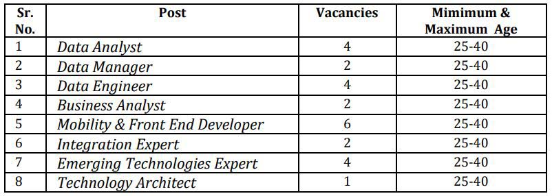

**Bank of Baroda Recruitment 2019**: Bank of Baroda has released a vacancy on contract basis filling up 25 posts. BOB Recruitment for qualified Specialist IT professionals in Mumbai Branch. **Bank of Baroda Recruitment notification 2019** for various Posts in BOB New Subsidiary, who can lead & support by using skills in the area of Design Thinking, process reengineering, architectural design, and core software development. Graduation Completed Candidates can apply for **BOB Various Posts**. Eligible Candidates can apply online on the Bank of Baroda official website www.bankofbaroda.in before 02-09-2019.

## BOB Recruitment for specialist IT Professionals Vacancy Details

<table style="height: 654px; width: 84.9475%; border-collapse: collapse; border-style: double;"><tbody><tr style="height: 80px;"><td style="width: 100%; text-align: center; height: 50px;" colspan="2"><strong>Bank of Baroda</strong>

BOB Recruitment specialist IT Professionals

25 Vacancies at Mumbai</td></tr><tr style="height: 30px;"><td style="width: 100%; height: 30px; background-color: #2a5a8e; text-align: center;" colspan="2"><h3><strong>&nbsp;Important Dates</strong></h3></td></tr><tr style="height: 22px;"><td style="width: 50%; text-align: center; height: 22px;">Starting Date for Registration</td><td style="width: 50%; text-align: center; height: 22px;"><strong>13-08-2019</strong></td></tr><tr style="height: 22px;"><td style="width: 50%; text-align: center; height: 22px;">Last Date for Registration</td><td style="width: 50%; text-align: center; height: 22px;"><strong>02-09-2019</strong></td></tr><tr style="height: 30px;"><td style="width: 100%; height: 30px; background-color: #2a5a8e; text-align: center;" colspan="2"><h3><strong>&nbsp;Vacancy Details</strong></h3></td></tr><tr style="height: 22px;"><td style="text-align: center; height: 22px; width: 50%;">Job Recruitment Board</td><td style="text-align: center; width: 50%;">Bank of Baroda</td></tr><tr><td style="text-align: center; width: 50%;">Post Name</td><td style="text-align: center; width: 50%;">Various Posta</td></tr><tr><td style="text-align: center; width: 50%;">No of Vacancies</td><td style="text-align: center; width: 50%;">25 Posts</td></tr><tr><td style="text-align: center; width: 50%;">Job Category</td><td style="text-align: center; width: 50%;">Bank Jobs</td></tr><tr><td style="text-align: center; width: 50%;">Job Location</td><td style="text-align: center; width: 50%;">Mumbai</td></tr><tr><td style="text-align: center; width: 50%;">Application Mode</td><td style="text-align: center; width: 50%;">Online</td></tr><tr><td style="width: 50%; background-color: #2a5a8e; text-align: center;" colspan="2"><strong>BOB Post Details</strong></td></tr><tr><td style="text-align: center; width: 50%;" colspan="2">

[caption id="attachment_732" align="aligncenter" width="639"] BOB Recruitment for specialist IT Professionals Vacancy[/caption]</td></tr><tr style="height: 30px;"><td style="width: 100%; height: 30px; background-color: #2a5a8e; text-align: center;" colspan="2"><h3><strong>Eligibility Criteria&nbsp;</strong></h3></td></tr><tr style="height: 30px;"><td style="width: 50%; text-align: center; height: 30px;" colspan="2"><table style="border-collapse: collapse; width: 100%; height: 154px;"><tbody><tr style="height: 44px;"><td style="width: 12.9604%; height: 44px;"><strong>Post Name</strong></td><td style="width: 43.2719%; height: 44px;"><strong>Education &amp; Experience</strong></td><td style="width: 18.7677%; height: 44px;"><strong>Proposed CTC</strong></td></tr><tr style="height: 22px;"><td style="width: 12.9604%; height: 22px;">Data Analyst</td><td style="width: 43.2719%; height: 22px;"><ul><li style="text-align: left;">Bachelor's degree in a quantitative field.</li><li style="text-align: left;">Minimum 05 years of experience in Data Analytics, preferably in BFSI domain</li></ul></td><td style="width: 18.7677%; height: 22px;">Annual CTC of Rs. 12-16 Lakhs (All inclusive)</td></tr><tr style="height: 22px;"><td style="width: 12.9604%; height: 22px;">Data Manager</td><td style="width: 43.2719%; height: 22px;"><ul><li style="text-align: left;">A bachelor degree in Engineering in Computer Science / Information Technology / MCA</li><li style="text-align: left;">Minimum 06 years of relevant experience</li></ul></td><td style="width: 18.7677%; height: 22px;">Annual CTC of Rs. 12-16 Lakhs (All inclusive)</td></tr><tr style="height: 22px;"><td style="width: 12.9604%; height: 22px;">Data Engineer</td><td style="width: 43.2719%; height: 22px;"><ul><li style="text-align: left;">A bachelor degree in Engineering in Computer Science / Information Technology / MCA</li><li style="text-align: left;">Minimum 06 years of relevant experience</li></ul></td><td style="width: 18.7677%; height: 22px;">Annual CTC of Rs. 12-16 Lakhs (All inclusive)</td></tr><tr style="height: 22px;"><td style="width: 12.9604%; height: 22px;">Business Analyst</td><td style="width: 43.2719%; height: 22px;"><ul><li style="text-align: left;">A bachelor degree in Engineering in Computer Science / Information Technology / MCA and Post-graduation in Business Management / PGDM</li><li style="text-align: left;">Minimum 06 years of relevant experience</li></ul></td><td style="width: 18.7677%; height: 22px;">Annual CTC of Rs. 12-16 Lakhs (All inclusive)</td></tr><tr style="height: 22px;"><td style="width: 12.9604%; height: 22px;">Mobility &amp; Front End Developer</td><td style="width: 43.2719%; height: 22px;"><ul><li style="text-align: left;">A bachelor degree in Engineering in Computer Science / InformationTechnology / MCA</li><li style="text-align: left;">Minimum 06 years of relevant experience.</li></ul></td><td style="width: 18.7677%; height: 22px;">Annual CTC of Rs. 12-16 Lakhs (All inclusive)</td></tr><tr><td style="width: 12.9604%;">Integration Expert</td><td style="width: 43.2719%;"><ul><li style="text-align: left;">A bachelor degree in Engineering in Computer Science / InformationTechnology / MCA</li><li style="text-align: left;">Minimum 06 years of relevant experience</li></ul></td><td style="width: 18.7677%;">Annual CTC of Rs. 12-16 Lakhs (All inclusive)</td></tr><tr><td style="width: 12.9604%;">Emerging Technologies Expert</td><td style="width: 43.2719%;"><ul><li style="text-align: left;">A bachelor degree in Engineering in Computer Science / InformationTechnology / MCA</li><li style="text-align: left;">Minimum 05 years of relevant experience</li></ul></td><td style="width: 18.7677%;">Annual CTC of Rs. 12-16 Lakhs (All inclusive)</td></tr><tr><td style="width: 12.9604%;">Technology Architect</td><td style="width: 43.2719%;"><ul><li style="text-align: left;">A bachelor degree in Engineering in Computer Science / InformationTechnology / MCA</li><li style="text-align: left;">Minimum 08 years of relevant experience</li></ul></td><td style="width: 18.7677%;">Annual CTC of Rs. 16-20 Lakhs (All inclusive)</td></tr></tbody></table></td></tr><tr style="height: 30px;"><td style="width: 100%; height: 30px; background-color: #2a5a8e; text-align: center;" colspan="2"><h3><strong>Application Fee&nbsp;</strong></h3></td></tr><tr style="height: 30px;"><td style="width: 100%; height: 30px; text-align: left;" colspan="2"><ul><li>For General &amp; OBC candidates : Rs.600/- plus GST &amp; Transaction charges (application fees &amp; intimation charges)</li><li>&nbsp;For SC, ST &amp; PWD candidates : Rs.100/- plus GST &amp; Transaction charges (intimation charges)</li></ul></td></tr><tr style="height: 30px;"><td style="width: 100%; height: 30px; background-color: #2a5a8e; text-align: center;" colspan="2"><h3><strong>Important Links&nbsp;</strong></h3></td></tr><tr style="height: 10px;"><td style="width: 50%; text-align: center; height: 10px;"><strong>Apply Online&nbsp;</strong></td><td style="width: 50%; text-align: center; height: 10px;"><strong><a style="color: #ff0000;" href="https://apps.bobinside.com/bobsuntech/" target="_blank" rel="noopener noreferrer">Click Here</a></strong></td></tr><tr style="height: 36px;"><td style="width: 50%; text-align: center; height: 23px;"><strong>Notification</strong></td><td style="width: 50%; text-align: center; height: 23px;"><a style="color: #ff0000;" href="https://freegovtjobalert.in/wp-content/uploads/2019/08/BOB-Recruitment-for-specialist-IT-Professionals-Vacancy-Notification.pdf" target="_blank" rel="noopener noreferrer"><strong>Click Here&nbsp;</strong></a></td></tr><tr style="height: 10px;"><td style="width: 50%; text-align: center; height: 10px;"><strong>&nbsp;Official Website</strong></td><td style="width: 50%; text-align: center; height: 10px;"><strong><a style="color: #ff0000;" href="https://www.bobibanking.com/" target="_blank" rel="noopener noreferrer">Click Here</a>&nbsp;</strong></td></tr></tbody></table>

### How to Apply for BOB Recruitment Application Form 2019?

1. Candidates First Goto Bank of Baroda Official Website: [www.bankofbaroda.in](https://www.bankofbaroda.in)
2. Goto **Career** Section.
3. Click On **Current Opportunities.**
4. Find **Recruitment of IT professionals on Contract basis for Barodasun Technologies Limited (a fully Owned Subsidiary of Bank of Baroda)-Project 2**
5. Click On [Link for submitting online application form & payment of fees](https://apps.bobinside.com/bobsuntech) 
6. Fill up Application Form
7. After Fill up, Click on submit button and submit an application.
8. Pay Application fee (Online) (Non-refundable)
9. Download & Save Application For Future Use.
10. Done
