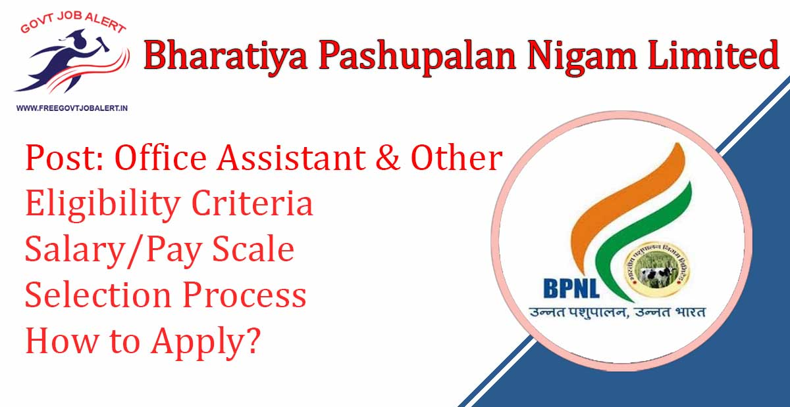
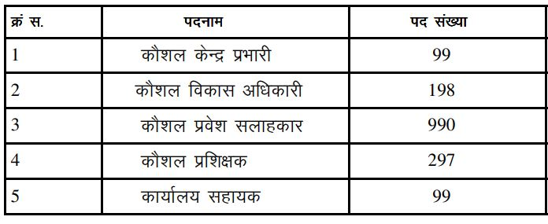

BPNL Recruitment 2019: Bharatiya Pashupalan Nigam Limited (Animal Husbandry Corporation of India Limited) is going to fill up 1683 BPNL Vacancy 2019 in Jaipur. BPNL has Invites Online or Offline Application From Eligible Candidates to fill up BPNL Vacancy 2019. bpnl recruitment 2019 notification has been Published for the post of Skill center In-charge, Skill Development Officer, Skill Admission Consultant, Skill Instructor, Office Assistant Posts. bpnl recruitment 2019 Rajasthan Online/Offline Application is Started on www.bharatiyapashupalan.com 2019.

## **Bhartiya Pashupalan Vacancy 2019**

<table style="border-collapse: collapse; width: 100%;"><tbody><tr><td style="width: 50%; background-color: #2a5a8e; text-align: center;" colspan="2"><strong>BPNL Recruitment 2019</strong></td></tr><tr><td style="width: 50%; text-align: center;">Job Recruitment Board</td><td style="width: 50%; text-align: center;">Bharatiya Pashupalan Nigam Limited</td></tr><tr><td style="width: 50%; text-align: center;">Notification No.</td><td style="width: 50%; text-align: center;">4/BPNL/2019-20</td></tr><tr><td style="width: 50%; text-align: center;">Post</td><td style="width: 50%; text-align: center;">Various&nbsp;</td></tr><tr><td style="width: 50%; text-align: center;">Vacancies</td><td style="width: 50%; text-align: center;">1683</td></tr><tr><td style="width: 50%; text-align: center;">Job Location</td><td style="width: 50%; text-align: center;">Rajasthan State</td></tr><tr><td style="width: 50%; text-align: center;">Job Type</td><td style="width: 50%; text-align: center;">State Govt Jobs</td></tr><tr><td style="width: 50%; text-align: center;">Application Mode</td><td style="width: 50%; text-align: center;">Online/Offline</td></tr></tbody></table>

BPNL Vacancy 2019 Notification and Offline Application is available on his official Website. Candidates Must Have 12th Passed/ Degree. Applicants Should Have Age Between 18 to 45 Years. Selected Candidates Will be Placed in Rajasthan State. Good Chance for Those Candidates Who are Finding 12th Pass Jobs In Rajasthan State.

<table style="border-collapse: collapse;"><tbody><tr><td style="width: 50%; background-color: #2a5a8e; text-align: center;" colspan="2"><h3><strong>BPNL Exam Dates</strong></h3></td></tr><tr><td style="width: 50%; text-align: center;">Last Date of Online Application</td><td style="width: 50%; text-align: center;">15-12-2019</td></tr></tbody></table>

Bhartiya Pashupalan vacancy 2019 Details Like Education Qualification, Age Limits, Selection Process, Salary, How to Apply, etc.- Given Below.

### **BPNL Vacancy 2019 Details**

- Bhartiya Pashupalan vacancy 2019: 1683 Posts

### **BPNL Recruitment 2019 Eligibility Criteria**

Education Qualification

- Candidates Should Have 12th Passed/ Degree From Recognized University.

Age Limits

- **Skill Center In Charge:** 25 – 45 Years.
- **Skill Development Officer:** 21 – 45 Years.
- **Skill Admission Consultant:** 21 – 40 Years.
- **Skill Instructor:** 21 – 40 Years.
- **Office Assistant:** 18 – 35 Years.

### **Salary/Pay Scale For BPNL Recruitment 2019**

<table><tbody><tr><td style="text-align: center; background-color: #2a5a8e;" width="236"><strong>Post Name</strong></td><td style="text-align: center; background-color: #2a5a8e;" width="95"><strong>No. of Posts</strong></td><td style="text-align: center; background-color: #2a5a8e;" width="208"><strong>Salary/Pay Scale</strong></td></tr><tr><td style="text-align: center;" width="236">Skill Center In Charge</td><td style="text-align: center;" width="95">99</td><td style="text-align: center;" width="208">Rs.18000/- Per Month</td></tr><tr><td style="text-align: center;" width="236">Skill Development Officer</td><td style="text-align: center;" width="95">198</td><td style="text-align: center;" width="208">Rs.15000/- Per Month</td></tr><tr><td style="text-align: center;" width="236">Skill Admission Consultant</td><td style="text-align: center;" width="95">990</td><td style="text-align: center;" width="208">Rs.12000/- Per Month</td></tr><tr><td style="text-align: center;" width="236">Skill Instructor</td><td style="text-align: center;" width="95">297</td><td style="text-align: center;" width="208">Rs.10000/- Per Month</td></tr><tr><td style="text-align: center;" width="236">Office Assistant</td><td style="text-align: center;" width="95">99</td><td style="text-align: center;" width="208">Rs.8000/- Per Month</td></tr></tbody></table>

### **Selection Process For BPNL Vacancy 2019**

- Written Examination/Interview

### **How to apply for BPNL Recruitment 2019**

Candidates Can Apply Online or Offline.

Apply Online:

- Candidates go to the official website: http://bharatiyapashupalan.com
- Find and Download Advertisement & Read Carefully.
- Follow the instruction to apply online.
- Fill up and submit the Application Form.

Apply Offline:

- Download BPNL Vacancy Application Form: [Click Here](https://freegovtjobalert.in/wp-content/uploads/2019/12/BPNL-Vacancy-2019-Application-Form.pdf)
- Fill up Application Form
- Attach Photo and Document Copies
- Post on Bhartiya Pashupalan Nigam Limited's Jaipur Address.

### **Important Links For BPNL Vacancy 2019**

- Bhartiya Pashupalan Vacancy Online Application Form 2019: [Click Here](http://pay.bharatiyapashupalan.com/onlinerequirment)
- Download 1683 BPNL Vacancy 2019 Notification PDF: [Click Here](http://www.bharatiyapashupalan.com/home/download/71)
- Bhartiya Pashupalan Official Website: [Click Here](http://bharatiyapashupalan.com)

Candidates can visit http://bharatiyapashupalan.com to get more details about BPNL Recruitment 2019. To More Information About BPNL upcoming vacancy 2020, latest Updates, Admit Card, Syllabus, Result, Etc. It will be published on the official website. Also, visit Regularly our website [www.freegovtjobalert.in](https://freegovtjobalert.in "Free Job Alert") for getting the Latest job Updates.
