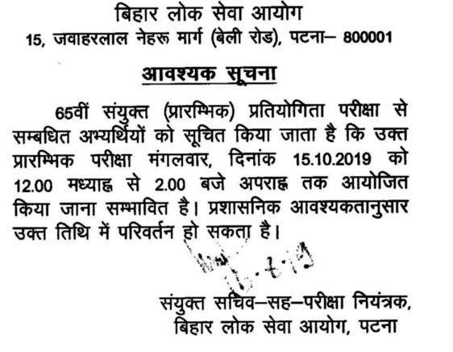

**BPSC Recruitment 2019**: Bihar Public Service Commission Has Invited for the Vacancy of 65th Combined Competitive Exam. Total of 434 Vacancies in This Post So Many Candidates Can Be Applied and Now Waiting for the Exam. Good News for Those Candidates Who Candidates Can Be Applied for this post and Now CCE Exam Date Announced Via Short Notice. in Short Time 65th **CCE Exam Admit Card** Will Be Released and Mentioned Final Exam Date in **CCE Exam Hall Ticket**. Applicant Candidates Can Ready for **CCE Exam and Check** the Official Website for **New Update for CCE Exam.**

## BPSC 65th CCE Prelims Exam Date Announced

<table style="width: 69.1878%; height: 364px;"><tbody><tr style="height: 25px;"><td style="width: 50%; background-color: #2a5a8e; text-align: center; height: 25px;" colspan="2"><strong>65th Combined Competitive Exam Vacancy Details</strong></td></tr><tr style="height: 22px;"><td style="width: 50%; height: 22px; text-align: center;">Job Recruitment board</td><td style="width: 50%; height: 22px; text-align: center;">Bihar public service commission</td></tr><tr style="height: 22px;"><td style="width: 50%; height: 22px; text-align: center;">Post Name</td><td style="width: 50%; height: 22px; text-align: center;">CCE Exam 2019</td></tr><tr style="height: 22px;"><td style="width: 50%; height: 22px; text-align: center;">No of Vacancies</td><td style="width: 50%; height: 22px; text-align: center;">434</td></tr><tr style="height: 22px;"><td style="width: 50%; height: 22px; text-align: center;">CCE Prelims Exam Date</td><td style="width: 50%; height: 22px; text-align: center;">15-10-2019</td></tr><tr style="height: 22px;"><td style="width: 50%; height: 22px; text-align: center;">CCE Exam Admit Card</td><td style="width: 50%; height: 22px; text-align: center;">-</td></tr><tr style="height: 22px;"><td style="width: 50%; height: 22px; text-align: center;">Job Category</td><td style="width: 50%; height: 22px; text-align: center;"><a href="https://freegovtjobalert.in/bihar-govt-job/" target="_blank" rel="noopener noreferrer">Bihar Govt Jobs</a></td></tr><tr style="height: 22px;"><td style="width: 50%; height: 22px; text-align: center;">Job Location</td><td style="width: 50%; height: 22px; text-align: center;">Across Bihar</td></tr><tr style="height: 22px;"><td style="width: 50%; height: 22px; text-align: center;">Official Website</td><td style="width: 50%; height: 22px; text-align: center;"><a href="http://bpsc.bih.nic.in/" target="_blank" rel="noopener noreferrer">bpsc.bih.nic.in</a></td></tr></tbody></table>

**BPSC CCE Exam Date:**

Bihar Public Service Commission (BPSC) has regularly updated about Bihar govt jobs on his Official website at bpsc.bih.nic.in and date 16th august 2019 published a short notice about Combined Competitive Exam and announced an Exam Date. Combined Competitive Exam on Date 15th October 2019. applied candidates can check Notification on BPSC Official Website.

\[caption id="attachment\_709" align="aligncenter" width="496"\] Short Notice BPSC Combined Competitive Exam Date\[/caption\]

**BPSC Combined Competitive Exam:**

As per the official notification, the commission has released the official notification to fulfill the 434 posts of:

- Sub Divisional Officer
- Revenue Officer
- Deputy Superintendent of Police
- Bihar Rural Development Officer
- Block Panchayat Officer
- District Sanapark Officer
- Bihar Education Service
- Labour Enforcement Officer
- Food and Consumer Inspector
- Election Department
- SC/ ST Welfare Department

**65th BPSC Combined Competitive Exam Selection Process:**

1. Preliminary Exam.
2. Mains Exam.
3. Interview.

<table style="border-collapse: collapse; width: 70.8285%; height: 174px;"><tbody><tr><td style="width: 50%; background-color: #2a5a8e; text-align: center;" colspan="2"><strong>BPSC CCE Exam Important Links</strong></td></tr><tr><td style="width: 50%; text-align: center;"><strong>Prelims Exam Date</strong></td><td style="width: 50%; text-align: center;"><a href="https://freegovtjobalert.in/wp-content/uploads/2019/08/Prelims-Date-BPSC-65-CCE-Prelims.pdf" target="_blank" rel="noopener noreferrer"><strong>Click Here</strong></a></td></tr><tr><td style="width: 50%; text-align: center;"><strong>Apply Online</strong></td><td style="width: 50%; text-align: center;"><a title="BPSC" href="https://onlinebpsc.bihar.gov.in/admissionProcess/ApplicantRegistrationForm/ApplicantRegistrationForm?recordid=55" target="_blank" rel="noopener noreferrer"><strong>Registration</strong></a>&nbsp;|&nbsp;<a title="BPSC" href="https://onlinebpsc.bihar.gov.in/main/home" target="_blank" rel="noopener noreferrer"><strong>Login</strong></a></td></tr><tr><td style="width: 50%; text-align: center;"><strong>Notification</strong></td><td style="width: 50%; text-align: center;"><a href="https://freegovtjobalert.in/wp-content/uploads/2019/08/Notification-BPSC-65-CCE-Exam.pdf" target="_blank" rel="noopener noreferrer"><strong>Click Here</strong></a></td></tr><tr><td style="width: 50%; text-align: center;"><strong>Official Website</strong></td><td style="width: 50%; text-align: center;"><a href="http://bpsc.bih.nic.in/" target="_blank" rel="noopener noreferrer"><strong>Click Here</strong></a></td></tr></tbody></table>

> More Govt Jobs: [www.freegovtjobalert.in](https://freegovtjobalert.in)
