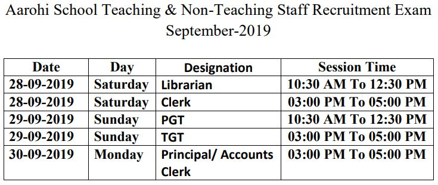
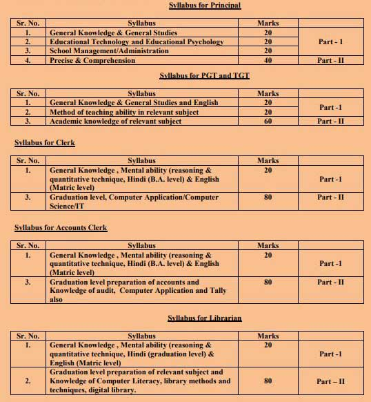

BSEH Recruitment 2019: Board of School Education Haryana Has Conducted Aarohi School Teacher Recruitment Exam. Aarohi school invited online Applications for various Posts of Aarohi School Teaching and Non-Teaching Staff Recruitment Examination 2019. Applied Candidates has waiting for Admit Card and exam dates. and now his waiting is over because recently Aarohi school published Admit Card on Official Website.

## BSEH Aarohi School Admit Card 2019

Aarohi school Admit card Available for download, Aarohi model school Teacher Post Recruitment Examination is from 28 to 30 September 2019. Aarohi School Teacher Vacancy exam is set online Computer-based. Applied candidates can download Thir admit card by using his registration number and Post. Aarohi school teacher exam center is across India and examination Duration will be 120 minutes (2 hours). BSEH Recruitment exam related information mentioned on the admit card.

### Details of BSEH Aarohi School Hall Tickets 2019

<table style="border-collapse: collapse; width: 100%;"><tbody><tr><td style="width: 50%; text-align: center;">Job Recruitment Board</td><td style="width: 50%; text-align: center;">Board of School Education, Haryana</td></tr><tr><td style="width: 50%; text-align: center;">Organization Name</td><td style="width: 50%; text-align: center;">Aarohi School</td></tr><tr><td style="width: 50%; text-align: center;">Post</td><td style="width: 50%; text-align: center;">Various Post</td></tr><tr><td style="width: 50%; text-align: center;">Total Vacancies</td><td style="width: 50%; text-align: center;">895</td></tr><tr><td style="width: 50%; text-align: center;">Exam Type</td><td style="width: 50%; text-align: center;">OMR Based Test</td></tr><tr><td style="width: 50%; text-align: center;">Admit Card</td><td style="width: 50%; text-align: center;">Available Now</td></tr><tr><td style="width: 50%; text-align: center;">Exam Date</td><td style="width: 50%; text-align: center;">28-09-2019 to 30-09-2019</td></tr><tr><td style="width: 50%; text-align: center;">Official Website</td><td style="width: 50%; text-align: center;"><a href="http://www.bseh.org.in/" target="_blank" rel="noopener noreferrer">Click Here</a></td></tr></tbody></table>

Candidates Can Download admit card from the official website or Direct Download From Our Website Freegovtjobalert.in, and get details about admit card, How to Download Aarohi School Admit card/Hall Tickets 2019, Exam Dates, Etc. Keep Ragulerly Visit our website to getting all information about Govt Exam Updates.

### **Aarohi School Exam Date**

Board of School Education Haryana will be Conduct Aarohi School Teacher Examination From Date 28 September to 30 September 2019. Post-Wise Exam Dates and Exam Time Given Below

### **BSEH Examination Center**

The Board of School Education Haryana reserves the right to create an examination center anywhere in the State of Haryana as well as outside Haryana. However, efforts will be made by the Board to allocate examination center except Home District.

### **BSEH AAROHI Exam Scheme 2019 for Various Posts**

### **How to Download BSEH Aarohi School Admit Card?**

1. Candidates Goto BSEH Official Website: [www.bseh.org.in](http://www.bseh.org.in)
2. Find [ADMIT CARD FOR AROHI MODEL SCHOOL EXAM 2019 (TEACHING & NON-TEACHING)](http://aarohirecruitment2019.com/ADMITCARDPRINT.aspx) Click On.
3. Then Enter your Registration number and Select You Applied Post.
4. Then Click On View Button
5. You Can Show/Download Your Admit Card.
6. Download And Print out For Use in Examination hall.
7. Done

> Admit Card For arohi Model school Exam 2019 [DIrect Download](http://aarohirecruitment2019.com/ADMITCARDPRINT.aspx)
