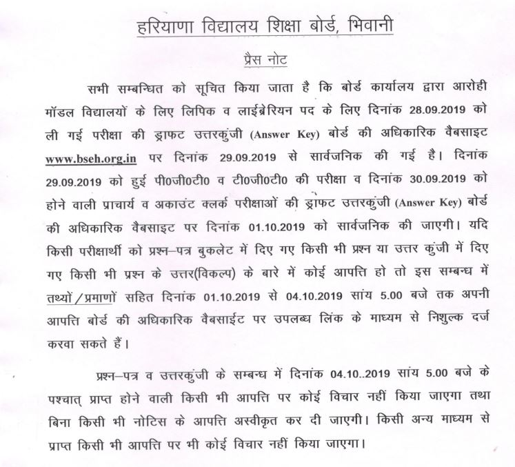

BSEH Aarohi School Answer Key 2019: BSEH Recruitment 2019: Board of School Education Haryana Has Conducted Aarohi School Teacher Recruitment Exam. Aarohi school invited online Applications for various Posts of Aarohi School Teaching and Non-Teaching Staff Recruitment Examination 2019. Those Who Had Given the Examination Are Waiting for the Result, but Their Wait Is Over Because the Board Has Released the Answer Key of Their Examination.

\[caption id="attachment\_1210" align="aligncenter" width="719"\] BSEH Aarohi School Answer Key 2019 Notice\[/caption\]

## BSEH Aarohi School Answer Key 2019

Latest Updates: BSEH Aarohi School Answer Key 2019 has been Released on Official website of the post of Principal, PGT, TGT, Librarian, Clerk, Accounts Clerk. Applicants can download BSEH Aarohi School Exam Answer Key From Official Website or Candidates Get Direct Download Link For BSEH Aarohi School Exam Answer Key From This page. Exam Attended All Applicants can download the BSEH Aarohi School Teaching, Non-Teaching Exam Answer Key PDF 2019.

<table style="border-collapse: collapse; width: 100%;"><tbody><tr><td style="width: 50%; background-color: #2a5a8e;" colspan="2"><h3 style="text-align: center;">BSEH Aarohi School Answer Key Details</h3></td></tr><tr><td style="width: 50%; text-align: center;">Job Recruitment Board</td><td style="width: 50%; text-align: center;">Board of School Education, Haryana</td></tr><tr><td style="width: 50%; text-align: center;">Post</td><td style="width: 50%; text-align: center;">Principal, PGT, TGT, Librarian, Clerk, Accounts Clerk</td></tr><tr><td style="width: 50%; text-align: center;">Vacancies</td><td style="width: 50%; text-align: center;">895</td></tr><tr><td style="width: 50%; text-align: center;">Exam Date</td><td style="width: 50%; text-align: center;">28/29/30-09-2019</td></tr><tr><td style="width: 50%; text-align: center;">Answer Key</td><td style="width: 50%; text-align: center;">30-09-2019</td></tr><tr><td style="width: 50%; text-align: center;">Job Location</td><td style="width: 50%; text-align: center;">Haryana</td></tr></tbody></table>

### Set Wise BSEH Aarohi School Teaching, Non-Teaching Answer Key 2019

In the Examination, All the Papers Are in Different Sets, Then All the Candidates Get Different Sets of Question Paper, Hence the Answer Key for Those Papers Is Also Different. Get All Sets of Answer Keys from Our Website Download Link Given in This Page Below..

### Download BSEH Aarohi School Exam Answer Key 2019 PDF

- BSEH Aarohi School Librarian Answer Key PDF: [**Click Here**](http://bseh.org.in/pdf/liberarian.pdf)
- BSEH Aarohi School Clerk Answer Key PDF: [**Click Here**](http://bseh.org.in/pdf/clerk.pdf)

### How to Download BSEH Aarohi School Exam Answer Key

1. Candidates Goto BSEH Official Website: [http://www.bseh.org.in/](http://www.bseh.org.in/)
2. Find in What's New Section and Click on:
    - [Answer key - AAROHI EXAM 2019- for the post of Librarian](http://bseh.org.in/pdf/liberarian.pdf)   
    - [Answer key -AAROHI EXAM 2019- For the post of Clerk](http://bseh.org.in/pdf/clerk.pdf)   
3. Download & Save PDF.
4. Check and Verify Your Answer.

> Note-(Answer Key For Other Post Will Be Available Soon )

(Candidates Check Regularly Our Website Or Bookmark For Get **[Free Govt Job Alert](https://freegovtjobalert.in)** For All Govt Job, Bank Jobs, Defence Jobs, Railway Recruitment, State Wise jobs, Etc.)
