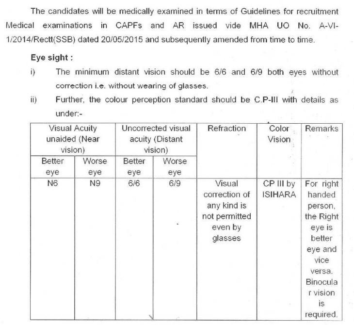

BSF Constable Eligibility Criteria 2019: Board Security Force Has Conducted BSF Constable Exam. They Set Minimum Criteria For BSF Constable Post. Here You can Get Full BSF Constable Eligibility Criteria For Male & Female Candidates.

<table style="border-collapse: collapse; width: 100%;"><tbody><tr><td style="width: 50%; background-color: #2a5a8e; text-align: center;" colspan="2"><strong>BSF Recruitment 2019</strong></td></tr><tr><td style="width: 50%; text-align: center;">Job Recruitment Board</td><td style="width: 50%; text-align: center;">Board Security Force</td></tr><tr><td style="width: 50%; text-align: center;">Post</td><td style="width: 50%; text-align: center;">Constable (GD)</td></tr><tr><td style="width: 50%; text-align: center;">Vacancies</td><td style="width: 50%; text-align: center;">1356</td></tr><tr><td style="width: 50%; text-align: center;">Job Location</td><td style="width: 50%; text-align: center;">Across India</td></tr><tr><td style="width: 50%; text-align: center;">Job Type</td><td style="width: 50%; text-align: center;">Defence Jobs</td></tr><tr><td style="width: 50%; text-align: center;">Application Mode</td><td style="width: 50%; text-align: center;">Offline</td></tr></tbody></table>

The Border Security Force (BSF) Has Published BSF Constable Vacancy Notification on his Official website. As Per BSF Recruitment Notification a Total of 1356 Vacancies are There, in which 1184 Male and 172 Female. Good Chance for those Candidates who Finding Defence Jobs. Candidates should have Matriculation/ 10th Pass. Applicants Should Have Age Between 18 to 23 Years. The Selected Candidates can be Posted anywhere in Indian. Interested & Eligible Candidates Post offline form of www.bsf.nic.in recruitment 2019 Before last Date.

## **BSF Constable Eligibility Criteria 2019**

**Education Qualification**

- Candidates Should have Matriculation/10th Pass From Recognized Board.

**Age Limits**

- Minimum 18 Years
- Maximum:
    - General Candidates: 23 Years
    - OBC Candidates: 25 Years
    - SC/ST Candidates: 27 Years

**Physical Standards**

Height:

- Male: 165 cms
- Female: 155 cms

Chest:

- Male:
    - Unexpanded: 78 cms
    - Expanded: Min. Expansion 5 cms

**Relaxation**

Height

- ST/SC Male: 162.5 cms
- ST/SC Female: 150 cms

Chest:

- ST/SC Male:
    - Unexpanded: 76 cms
    - Expanded: Min. Expansion 5 cms

**Medical Standards**

**BSF Constable Race**

- Male: 5 KMS Complete in 24 Minutes
- Female: 1.6 KMS Complete in 8.30 Minutes

For Ladakh Region

- Male: 1 Mile Race in 6.30 Minutes
- Female: 800 Meters in 4 Minutes

### **BSF Constable Recruitment Important Links**

- [BSF Constable Recruitment 2019-20 | 1356 BSF Constable (GD) Vacancies](https://freegovtjobalert.in/bsf-constable-recruitment/)
- BFS Constable Recruitment Notification & Application Form: [Click Here](http://bsf.nic.in/doc/recruitment/r0116.pdf)
- BSF Official Website: [Click Here](http://bsf.nic.in)
