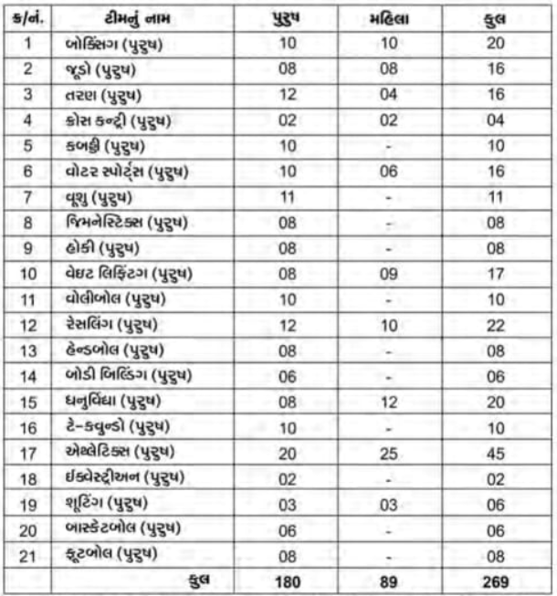
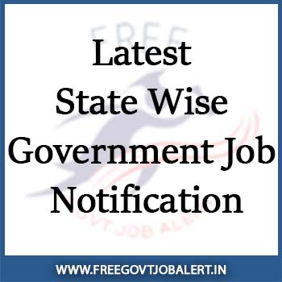

**BSF Constable Recruitment 2022:** Online applications are invited from MALE & FEMALE Indian Citizens for filling up 2788\* vacancies (2651 Vacancies for MALE candidates and 137 Vacancies for FEMALE candidates) for the post of Constable (Tradesman) Exam 2021-22 in Border Security Force. bsf free job alert

<table style="border-collapse: collapse; width: 100%;"><tbody><tr><td style="width: 100%; background-color: #2a5a8e; text-align: center;" colspan="2"><h2><strong>BSF Recruitment 2022</strong></h2></td></tr><tr style="height: 25px;"><td style="width: 50%; text-align: center; height: 25px;">Job Recruitment Board</td><td style="width: 50%; text-align: center;">Border Security Force</td></tr><tr style="height: 25px;"><td style="width: 50%; text-align: center; height: 25px;">Notification No.</td><td style="width: 50%; text-align: center;">9A/Advt/CT(TM)-2021-22/Rectt/BSF/2022/256</td></tr><tr style="height: 25px;"><td style="width: 50%; text-align: center; height: 25px;">Post</td><td style="width: 50%; text-align: center;">Constable (Tradesman)</td></tr><tr style="height: 25px;"><td style="width: 50%; text-align: center; height: 25px;">Vacancies</td><td style="width: 50%; text-align: center;">2788</td></tr><tr style="height: 25px;"><td style="width: 50%; text-align: center; height: 25px;">Job Location</td><td style="width: 50%; text-align: center;">Across India</td></tr><tr style="height: 25px;"><td style="width: 50%; text-align: center; height: 25px;">Job Type</td><td style="width: 50%; text-align: center;">Defence Jobs</td></tr><tr style="height: 25px;"><td style="width: 50%; text-align: center; height: 25px;">Application Mode</td><td style="width: 50%; text-align: center;">online</td></tr></tbody></table>

### **BSF Constable Recruitment 2022**

<table style="border-collapse: collapse; width: 100%; height: 113px;"><tbody><tr style="height: 25px;"><td style="width: 50%; height: 25px; background-color: #2a5a8e; text-align: center;" colspan="2"><h3><strong>Important Dates</strong></h3></td></tr><tr style="height: 24px;"><td style="width: 50%; text-align: center; height: 24px;">Starting Date</td><td style="width: 50%; height: 24px; text-align: center;">16-1-2022</td></tr><tr style="height: 24px;"><td style="width: 50%; text-align: center; height: 24px;">Last Date</td><td style="width: 50%; height: 24px; text-align: center;">1-3-2022 at 11:59 pm</td></tr></tbody></table>

### **BSF Constable Recruitment 2022 Notification Details**

- BSF Male Constable: 2651 Posts
- BSF Female Constable: 137 Posts

### **Eligibility Criteria**

Age Limits

- Minimum 18 Years
- Maximum 27 Years

Age Relaxations:

- Schedule Caste/ Schedule Tribe: 5 Years
- Other Backward Class: 3 Years

Education Qualification

- Matriculation or equivalent from a recognized University or Board.

### **Physical Standard**

- **Weight:** Proportionate to height as per medical standard

<table style="border-collapse: collapse; width: 100%;"><tbody><tr><td style="width: 67.1308%; text-align: center;"><strong>Categories</strong></td><td style="width: 15.7383%; text-align: center;"><strong>Height</strong></td><td style="width: 17.1308%; text-align: center;"><strong>Chest</strong></td></tr><tr><td style="width: 99.9999%; text-align: center;" colspan="3"><strong>Male Candidates</strong></td></tr><tr><td style="width: 67.1308%; text-align: center;">Scheduled Tribes/Adivasis of all States and Union Territories including Nagas and Mizos</td><td style="width: 15.7383%; text-align: center;">162.5 CMS</td><td style="width: 17.1308%; text-align: center;">76-81 CMS</td></tr><tr><td style="width: 67.1308%; text-align: center;">Men belonging to the categories of Garhwalis, standard Kumaonis, Gorkhas, Dogras, Marathas and candidates belonging to the States of Sikkim, Nagaland, Arunachal Pradesh, Manipur, Tripura, Mizoram, Meghalaya, Assam, Himachal Pradesh, Kashmir, Leh &amp; Ladakh regions</td><td style="width: 15.7383%; text-align: center;">165 CMS</td><td style="width: 17.1308%; text-align: center;">78-83 CMS</td></tr><tr><td style="width: 67.1308%; text-align: center;">All others States and Union Territories</td><td style="width: 15.7383%; text-align: center;">167-5 CMS</td><td style="width: 17.1308%; text-align: center;">78-83 CMS</td></tr><tr><td style="width: 99.9999%; text-align: center;" colspan="3"><strong>Female Candidaets</strong></td></tr><tr><td style="width: 67.1308%; text-align: center;">Scheduled Tribes/Adivasis of all States and Union Territories including Nagas and Mizos</td><td style="width: 15.7383%; text-align: center;">150 CMS</td><td style="width: 17.1308%; text-align: center;" rowspan="3">Not Applicable</td></tr><tr><td style="width: 67.1308%; text-align: center;">Men belonging to the categories of Garhwalis, standard Kumaonis, Gorkhas, Dogras, Marathas and candidates belonging to the States of Sikkim, Nagaland, Arunachal Pradesh, Manipur, Tripura, Mizoram, Meghalaya, Assam, Himachal Pradesh, Kashmir, Leh &amp; Ladakh regions</td><td style="width: 15.7383%; text-align: center;">155 CMS</td></tr><tr><td style="width: 67.1308%; text-align: center;">All others States and Union Territories</td><td style="width: 15.7383%; text-align: center;">157 CMS</td></tr></tbody></table>

### **BSF Constable Recruitment Salary /Pay Scale** 

- The Pay Matrix Level-3, Payscale Rs.21,700-69,100/- of 7th CPC (Revised Pay Structure) and other allowances as admissible to Central Govt. employees from time to time

### **Selection Procedure**

1. Physical Standard Test (PST) and Physical Efficiency Test (PET)
2. Written Examination
3. Detailed Medical Examination
4. Final Merit list

### **BSF Constable Recruitment Application Fee**

- UR/General, EWS category or OBC category: Rs. 100/-
- Women candidates and candidates belonging to Scheduled Caste, Scheduled Tribes, BSF serving personnel and Ex-Servicemen are exempted from payment of examination fee.
- Payment Mode: Payment of examination fee will be accepted only through Online mode.

\[su\_button url="https://telegram.me/free\_govtjobalert" target="self" style="default" background="#2a5a8e" color="#FFFFFF" size="3" wide="no" center="no" radius="auto" icon="" icon\_color="#FFFFFF" text\_shadow="none" desc="" download="" onclick="" rel="" title="" id="" class=""\]Get Daily Job Updates On Telegram\[/su\_button\]

### **How to BSF Constable Recruitment 2022 Online apply**

- Candidates must apply online by visiting the BSF website **http://rectt.bsf.gov.in**. No other mode for submission of application will be accepted. Online submission of application form comprises of following BSF online apply steps:- (i) One Time Registration (OTR). (STEP-I) (ii) Filling of online application. (STEP-II) (iii) Payment of examination fee through prescribed digital modes. (STEP-III)

Note: The Applicants Are Requested to Read the Official Notification Carefully Before Apply.

<table style="border-collapse: collapse; width: 100%;"><tbody><tr><td style="width: 100%; background-color: #2a5a8e; text-align: center;" colspan="2"><h4>bsf free job alert Important Links</h4></td></tr><tr style="height: 25px;"><td style="width: 50%; text-align: center; height: 25px;">Apply Online&nbsp;</td><td style="width: 50%; text-align: center; height: 25px;"><a href="https://rectt.bsf.gov.in/registration/basic-details?guid=3d4da058-cf5b-12eb-bafc-fc017s9a1bb9" target="_blank" rel="noopener">Click Here</a></td></tr><tr style="height: 25px;"><td style="width: 50%; text-align: center; height: 25px;">Official Notification</td><td style="width: 50%; text-align: center; height: 25px;"><a href="https://rectt.bsf.gov.in/static/bsf/pdf/Constable%20(Tradesman)%20BSF%20%60GROUP%20C%60%202021-2022.pdf" target="_blank" rel="noopener">Download</a></td></tr><tr style="height: 25px;"><td style="width: 50%; text-align: center; height: 25px;">Official Website</td><td style="width: 50%; text-align: center; height: 25px;"><a href="https://bsf.gov.in/" target="_blank" rel="noopener">Check Here</a></td></tr><tr><td style="width: 50%; text-align: center;">Whatsapp Group</td><td style="width: 50%; text-align: center;"><a href="https://chat.whatsapp.com/BkbmqeRRYWJFMuieHVvHH8" target="_blank" rel="noopener">Click Here</a></td></tr><tr style="height: 25px;"><td style="width: 50%; text-align: center; height: 25px;">Get Free Govt Job Alert On Mobile&nbsp;</td><td style="width: 50%; text-align: center; height: 25px;"><a href="https://telegram.me/free_govtjobalert" target="_blank" rel="noopener">Telegram</a> | <a href="https://www.facebook.com/Freegovtjobalert247/" target="_blank" rel="noopener">Facebook</a> | <a href="https://feedburner.google.com/fb/a/mailverify?uri=Freegovtjobalertin&amp;loc=en_US" target="_blank" rel="noopener noreferrer">Email</a></td></tr></tbody></table>

 

**Latest Jobs:**

\[catlist name="job-notification" numberposts=20 orderby=modified date\]

 

* * *

* * *

**BSF Constable Recruitment 2021:** Board Security Force Has Released Notification Regarding meritorious sports person Constable Bharti. Application Are Invited from the male & Female Candidates for the post of Constable (GD) in Border Security Force. As Per the BSF Recruitment Advertisement, a Total of 269 Vacancies are There, of which 180 are Male and 89 are Female. BSF Constable online Form Starts on 9th August 2021. And 22nd September 2021 is the Last Date For BSF Constable Recruitment 2021.

<table style="border-collapse: collapse; width: 100%;"><tbody><tr><td style="width: 50%; background-color: #2a5a8e; text-align: center;" colspan="2"><strong>BSF Recruitment 2021</strong></td></tr><tr><td style="width: 50%; text-align: center;">Job Recruitment Board</td><td style="width: 50%; text-align: center;">Board Security Force</td></tr><tr><td style="width: 50%; text-align: center;">Post</td><td style="width: 50%; text-align: center;">Constable (GD)</td></tr><tr><td style="width: 50%; text-align: center;">Vacancies</td><td style="width: 50%; text-align: center;">269</td></tr><tr><td style="width: 50%; text-align: center;">Job Location</td><td style="width: 50%; text-align: center;">Across India</td></tr><tr><td style="width: 50%; text-align: center;">Job Type</td><td style="width: 50%; text-align: center;">Defence Jobs</td></tr><tr><td style="width: 50%; text-align: center;">Application Mode</td><td style="width: 50%; text-align: center;">Online</td></tr></tbody></table>

The Border Security Force (BSF) Has Published BSF Constable Vacancy Notification on the official website. Good Chance for those Candidates who Finding Defence Jobs. Candidates should have Matriculation/ 10th Pass. Applicants Should Have Age Between 18 to 23 Years. The Selected Candidates can be Posted anywhere in Indian. Interested & Eligible Candidates Post Online form of www.bsf.nic.in recruitment 2021 Before the last Date. bsf free job alert

<table style="border-collapse: collapse;"><tbody><tr><td style="width: 50%; background-color: #2a5a8e; text-align: center;" colspan="2"><h3><strong>BSF Constable Exam Date</strong></h3></td></tr><tr><td style="width: 50%; text-align: center;">Starting Date&nbsp;</td><td style="width: 50%; text-align: center;">09-08-2021</td></tr><tr><td style="width: 50%; text-align: center;">Last Date&nbsp;</td><td style="width: 50%; text-align: center;">22-09-2021</td></tr></tbody></table>

BSF Constable Recruitment notification 2021 Details Like Education Qualification, Age Limits, Physical Standards, Medical Standards, Salary/Pay Scale, How to Apply, etc Given below.

### **BSF Constable Vacancy Details**

- BSF Constable (GD): 269 Posts

### **BSF Constable Eligibility Criteria**

Education Qualification

- Candidates Should have Matriculation/10th Pass From Recognized Board.

Age Limits

- Minimum 18 Years
- Maximum:
    - General Candidates: 23 Years
    - OBC Candidates: 25 Years
    - SC/ST Candidates: 27 Years

> BSF Constable Eligibility Criteria Full Details: [**Click Here**](https://freegovtjobalert.in/bsf-constable-eligibility-criteria/)

### **BSF Constable Salary/Pay Scale**

- Level - 3 (Rs. 21700 - 69100) in the Pay Matrix as per 7th central Pay Commission.

### **Selection Process For BSF Constable Recruitment**

1. Physical Standards Test
2. Written Test
3. Medical Examination

### **BSF Constable Written Exam Pattern & Syllabus**

- The Written Test Will be Consist of Objective type Multiple Choice Questions.
- The Question Paper Will Consist of 100 Questions of 100 Marks to be Attempted in 2 hours.
- The Questions Paper Will be Set to Assess the General Awareness, General Knowledge, Knowledge of Elementary Mathematics, Analytical Aptitude and Ability to Observe and Distinguish Patterns and Test the Basic Knowledge of the Candidates in English/Hindi.
- The Question Paper Will Be Prepared in Hindi, English, and Urdu.
- The Papers Can be Answered Either in Hindi or in English or In Urdu.

### **Application Fee**

- No Application Fee

### **How to Fill up the BSF Constable Online Application Form**

1. The Candidates Should Visit Official Website @https://rectt.bsf.gov.in/
2. Next, Find & Download the Advertisement and Check Eligibility Criteria Very Carefully.
3. Select the Desired Post from Online Application Section and Click on the Apply Now Button.
4. Fill Registration Along with Some Basic Information Like Name, Date of Birth, Caste, Etc. With Registered Mobile Number and Email.
5. Then Upload Photo, Sign & Photo Identity Card.
6. Last, Submit the Application Form & Download or Take a Printout For Future Use.

Note: The Applicants Are Requested to Read the Official Notification Carefully Before Apply.

<table style="border-collapse: collapse; width: 100%;"><tbody><tr><td style="width: 100%; background-color: #2a5a8e; text-align: center;" colspan="2"><h3>bsf free job alert Important Links</h3></td></tr><tr style="height: 25px;"><td style="width: 50%; text-align: center; height: 25px;">Apply Online&nbsp;</td><td style="width: 50%; text-align: center; height: 25px;"><a href="https://rectt.bsf.gov.in/#bsf-current-openings" target="_blank" rel="noopener">Click Here</a></td></tr><tr style="height: 25px;"><td style="width: 50%; text-align: center; height: 25px;">Official Advertisement</td><td style="width: 50%; text-align: center; height: 25px;"><a href="https://rectt.bsf.gov.in/static/bsf/pdf/Recruitment%20of%20Meritorious%20Sportspersons.pdf" target="_blank" rel="noopener">Download</a></td></tr><tr style="height: 25px;"><td style="width: 50%; text-align: center; height: 25px;">Official Website</td><td style="width: 50%; text-align: center; height: 25px;"><a href="https://bsf.gov.in/" target="_blank" rel="noopener">Check Here</a></td></tr><tr style="height: 25px;"><td style="width: 50%; text-align: center; height: 25px;">Get Free Govt Job Alert On Mobile&nbsp;</td><td style="width: 50%; text-align: center; height: 25px;"><a href="https://telegram.me/free_govtjobalert" target="_blank" rel="noopener">Telegram</a> | <a href="https://www.facebook.com/Free-Govt-Job-Alert-1091006524429779/" target="_blank" rel="noopener noreferrer">Facebook</a> | <a href="https://feedburner.google.com/fb/a/mailverify?uri=Freegovtjobalertin&amp;loc=en_US" target="_blank" rel="noopener noreferrer">Email</a></td></tr></tbody></table>

Candidates can visit http://bsf.nic.in to get more details about the Border Security Force Jobs. Applicants can get all information BSF Defence Jobs latest Updates, Admit Card, Result, Etc. It will be published on the official website. Also, visit Regularly our website [www.freegovtjobalert.in](https://freegovtjobalert.in) to Get the Latest job Updates.

 

<table style="border-collapse: collapse;"><tbody><tr><td style="width: 33.3333%; background-color: #2a5a8e; text-align: center;" colspan="3"><strong>Jobs by Qualification</strong></td></tr><tr><td style="width: 33.3333%; text-align: center;"><a href="https://freegovtjobalert.in/10th-pass-job/" target="_blank" rel="noopener noreferrer">10th Pass</a></td><td style="width: 33.3333%; text-align: center;"><a href="https://freegovtjobalert.in/12th-pass-job/" target="_blank" rel="noopener noreferrer">12th Pass</a></td><td style="width: 33.3333%; text-align: center;"><a href="https://freegovtjobalert.in/qualification/bcom/" target="_blank" rel="noopener noreferrer">B.Com</a></td></tr><tr><td style="width: 33.3333%; text-align: center;"><a href="https://freegovtjobalert.in/qualification/be/" target="_blank" rel="noopener noreferrer">B.E</a></td><td style="width: 33.3333%; text-align: center;"><a href="https://freegovtjobalert.in/qualification/b-sc/" target="_blank" rel="noopener noreferrer">B.Sc</a></td><td style="width: 33.3333%; text-align: center;"><a href="https://freegovtjobalert.in/qualification/btech/" target="_blank" rel="noopener noreferrer">B.Tech</a></td></tr><tr><td style="width: 33.3333%; text-align: center;"><a href="https://freegovtjobalert.in/qualification/ba/" target="_blank" rel="noopener noreferrer">B.A</a></td><td style="width: 33.3333%; text-align: center;"><a href="https://freegovtjobalert.in/qualification/bba/" target="_blank" rel="noopener noreferrer">BBA</a></td><td style="width: 33.3333%; text-align: center;"><a href="https://freegovtjobalert.in/qualification/bca/" target="_blank" rel="noopener noreferrer">BCA</a></td></tr><tr><td style="width: 33.3333%; text-align: center;"><a href="https://freegovtjobalert.in/qualification/b-ed/" target="_blank" rel="noopener noreferrer">B.Ed</a></td><td style="width: 33.3333%; text-align: center;"><a href="https://freegovtjobalert.in/qualification/b-pharma/" target="_blank" rel="noopener noreferrer">B.Pharma</a></td><td style="width: 33.3333%; text-align: center;"><a href="https://freegovtjobalert.in/qualification/charted-accountant/" target="_blank" rel="noopener noreferrer">C.A/ ICWA</a></td></tr><tr><td style="width: 33.3333%; text-align: center;"><a href="https://freegovtjobalert.in/qualification/iti/" target="_blank" rel="noopener noreferrer">I.T.I</a></td><td style="width: 33.3333%; text-align: center;"><a href="https://freegovtjobalert.in/qualification/llb/" target="_blank" rel="noopener noreferrer">LLB</a></td><td style="width: 33.3333%; text-align: center;"><a href="https://freegovtjobalert.in/qualification/ma/" target="_blank" rel="noopener noreferrer">M.A</a></td></tr><tr><td style="width: 33.3333%; text-align: center;"><a href="https://freegovtjobalert.in/qualification/mba-jobs/" target="_blank" rel="noopener noreferrer">M.B.A</a></td><td style="width: 33.3333%; text-align: center;"><a href="https://freegovtjobalert.in/qualification/mca/" target="_blank" rel="noopener noreferrer">M.C.A</a></td><td style="width: 33.3333%; text-align: center;"><a href="https://freegovtjobalert.in/qualification/m-com/" target="_blank" rel="noopener noreferrer">M.Com</a></td></tr><tr><td style="width: 33.3333%; text-align: center;"><a href="https://freegovtjobalert.in/qualification/md/" target="_blank" rel="noopener noreferrer">M.D</a></td><td style="width: 33.3333%; text-align: center;"><a href="https://freegovtjobalert.in/qualification/me/" target="_blank" rel="noopener noreferrer">M.E</a></td><td style="width: 33.3333%; text-align: center;"><a href="https://freegovtjobalert.in/qualification/m-sc/" target="_blank" rel="noopener noreferrer">M.Sc</a></td></tr><tr><td style="width: 33.3333%; text-align: center;"><a href="https://freegovtjobalert.in/qualification/m-tech/" target="_blank" rel="noopener noreferrer">M.Tech</a></td><td style="width: 33.3333%; text-align: center;"><a href="https://freegovtjobalert.in/qualification/m-ed/" target="_blank" rel="noopener noreferrer">M.Ed</a></td><td style="width: 33.3333%; text-align: center;"><a href="https://freegovtjobalert.in/qualification/msw/" target="_blank" rel="noopener noreferrer">MSW</a></td></tr><tr><td style="width: 33.3333%; text-align: center;"><a href="https://freegovtjobalert.in/qualification/m-phil/" target="_blank" rel="noopener noreferrer">M.Phil</a></td><td style="width: 33.3333%; text-align: center;"><a href="https://freegovtjobalert.in/qualification/mbbs/" target="_blank" rel="noopener noreferrer">MBBS</a></td><td style="width: 33.3333%; text-align: center;"><a href="https://freegovtjobalert.in/qualification/ph-d/" target="_blank" rel="noopener noreferrer">Ph.D</a></td></tr><tr><td style="width: 33.3333%; text-align: center;"><a href="https://freegovtjobalert.in/qualification/pgdca/" target="_blank" rel="noopener noreferrer">PGDCA</a></td><td style="width: 33.3333%; text-align: center;"><a href="https://freegovtjobalert.in/qualification/diploma/" target="_blank" rel="noopener noreferrer">Diploma</a></td><td style="width: 33.3333%; text-align: center;"><a href="https://freegovtjobalert.in/qualification/graduate/" target="_blank" rel="noopener noreferrer">Graduate</a></td></tr><tr><td style="width: 33.3333%; text-align: center;"><a href="https://freegovtjobalert.in/engineering-jobs/" target="_blank" rel="noopener noreferrer">Engineering Jobs</a></td><td style="width: 33.3333%; text-align: center;"><a href="https://freegovtjobalert.in/qualification/pg-diploma/" target="_blank" rel="noopener noreferrer">PG Diploma</a></td><td style="width: 33.3333%; text-align: center;"><a href="https://freegovtjobalert.in/qualification/post-graduation/" target="_blank" rel="noopener noreferrer">Post Graduation</a></td></tr></tbody></table>

**Quick Links:**

<table style="width: 100%; border-collapse: collapse;" border="2"><tbody><tr><td style="width: 33.3333%;"></td><td style="width: 33.3333%;"></td><td style="width: 33.3333%;"></td></tr><tr><td style="width: 33.3333%;"></td><td style="width: 33.3333%;"></td><td style="width: 33.3333%;"></td></tr></tbody></table>
