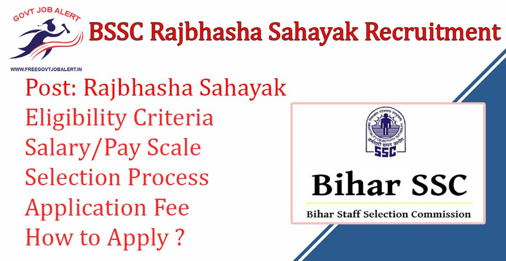
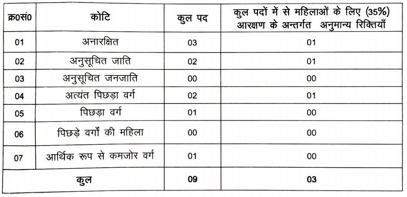

BSSC Rajbhasha Sahayak Recruitment 2019: Bihar Staff Selection Commission has Released Notification for the recruitment of the Rajbhasha Sahayak. BSSC Invites online Application From Eligible Candidates to Fill up BSSC Rajbhasha Sahayak Vacancy. As per Bihar SSC Vacancy notification, a Total of 09 Vacancies Are There. Bihar SSC online form 2019 Has Been Starting on 05-11-2019 at bssc.bih.nic.in.

## **BSSC Rajbhasha Sahayak Recruitment 2019**

<table style="border-collapse: collapse; width: 100%;"><tbody><tr><td style="width: 50%; background-color: #2a5a8e; text-align: center;" colspan="2"><strong>Bihar SSC Recruitment 2019</strong></td></tr><tr><td style="width: 50%; text-align: center;">Job Recruitment Board</td><td style="width: 50%; text-align: center;">Bihar Staff Selection Commission</td></tr><tr><td style="width: 50%; text-align: center;">Notification No.</td><td style="width: 50%; text-align: center;">Advertisement 03/2019</td></tr><tr><td style="width: 50%; text-align: center;">Post</td><td style="width: 50%; text-align: center;">Rajbhasha Sahayak</td></tr><tr><td style="width: 50%; text-align: center;">Vacancies</td><td style="width: 50%; text-align: center;">09</td></tr><tr><td style="width: 50%; text-align: center;">Job Location</td><td style="width: 50%; text-align: center;">Bihar State</td></tr><tr><td style="width: 50%; text-align: center;">Job Type</td><td style="width: 50%; text-align: center;"><a href="https://freegovtjobalert.in/bihar-govt-job/" target="_blank" rel="noopener noreferrer">Bihar Govt Jobs</a></td></tr><tr><td style="width: 50%; text-align: center;">Application Mode</td><td style="width: 50%; text-align: center;">Online</td></tr></tbody></table>

Bihar SSC Rajbhasha Sahayak Recruitment Notification 2019 Publish on his Official website. Applicants Should Have PG Degree with Urdu and Age Between 21 to 37 Years. Selected Candidates will be Placed in Bihar State. Good Chance for Those Candidates Who Looking for Govt Jobs in Bihar. To Know More Details About BSSC Rajbhasha Sahayak vacancy Like Education Qualification, Age limits, Salary, Selection Process, How to apply, etc. — given below on this page.

<table style="border-collapse: collapse;"><tbody><tr><td style="width: 50%; background-color: #2a5a8e; text-align: center;" colspan="2"><h3><strong>Important Dates</strong></h3></td></tr><tr><td style="width: 50%; text-align: center;">Starting Date of Online Application</td><td style="width: 50%; text-align: center;">05-11-2019</td></tr><tr><td style="width: 50%; text-align: center;">Last Date of Online Application</td><td style="width: 50%; text-align: center;">04-12-2019</td></tr><tr><td style="width: 50%; text-align: center;">Application Fee Payment&nbsp;</td><td style="width: 50%; text-align: center;">05-11-2019 to 04-12-2019</td></tr></tbody></table>

### **BSSC Rajbhasha Sahayak Vacancy Details**

- Rajbhasha Sahayak: 09 Posts

**Category Wise Bihar SSC Rajbhasha Sahayak Vacancy Details**

### **BSSC Rajbhasha Sahayak Recruitment Eligibility Criteria**

Education Qualification

- Candidates Should have Post Graduation/Degree With Urdu Subject from a recognized board.

Age Limits

- Minimum Age: 21 Years
- Maximum Age:
    - General Candidates: 37 Years
    - Women Candidates: 40 Years
    - OBC Candidates: 40 Years
    - ST/SC Candidates: 42 Years

### **BSSC Rajbhasha Sahayak Salary/Pay Scale**

- Pay Scale Level-06

### **Selection Process For BSSC Urdu Translator Post**

1. Written Test
2. Interview

### **BSSC Rajbhasha Sahayak Application Fee**

- Check Official Notification For Application Fee

### **How to Apply For BSSC Rajbhasha Sahayak Recruitment 2019**

1. Applicants Go to Bihar SSC Oficial Website: http://www.bssc.bih.nic.in
2. Go to Notice Section 
3. Find & Click on Advertisement For the post of Rajbhasha Sahayak
4. Click on Apply Now and Fill up Application Form 
5. Pay Application Fee Via Online
6. Preview & Download Bihar SSC Rajbhasha Sahayak Application Form For Future Use
7. Done

### **Important Links For BSSC Rajbhasha Sahayak Recruitment**

- Bihar SSC Rajbhasha Sahayak Online Form 2019: [Registration](https://bssc.bihar.gov.in/anuvadak/registration.php "BSSC") | [Login](https://bssc.bihar.gov.in/anuvadak/ "BSSC")
- Download 09 BSSC Sahayak Rajbhasha Sahayak Recruitment Notification 2019:  [Click Here](http://www.bssc.bih.nic.in/Advertisement/2727-19.pdf)
- Staff Selection Commission Official Website: [Click Here](http://www.bssc.bih.nic.in/)

Candidates can visit www.bssc.bih.nic.in to get more details about Bihar Staff Selection Commission recruitment 2019-20. Full information will be updated in Some time. To More Information About Upcoming Vacancy in Bihar SSC 2019-20, Bihar SSC vacancy latest Updates, Admit Card, Syllabus, Result, Etc. It will be published on Official website. Also, visit Regularly our website [www.freegovtjobalert.in](https://freegovtjobalert.in) for getting the Latest job Updates.

Other Bihar Jobs:

- [Bihar SSC 1294 Sahayak Urdu Anuwadak Vacancy Details](https://freegovtjobalert.in/bssc-sahayak-urdu-anuwadak-recruitment/)
- [Bihar SSC 202 Urdu Anuwadak Vacancy Details](https://freegovtjobalert.in/bssc-urdu-anuwadak-recruitment/)
