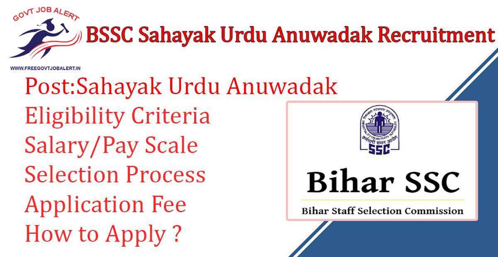
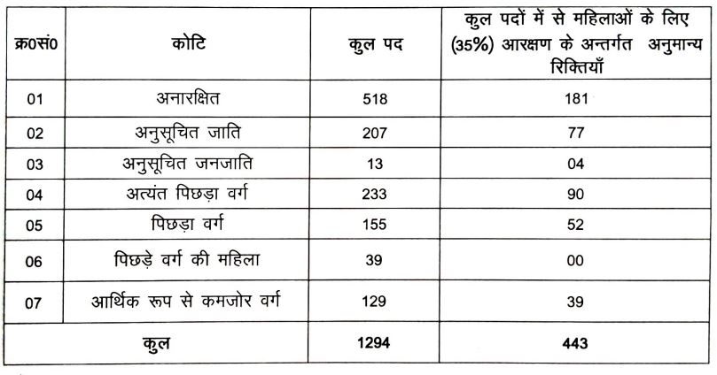

BSSC Sahayak Urdu Anuwadak Recruitment 2019: Bihar Staff Selection Commission has Released Notification for the recruitment of the Sahayak Urdu Anuwadak. BSSC Invites online Application From Eligible Candidates to Fill up BSSC Sahayak Urdu Anuwadak Vacancy. As per Bihar SSC Vacancy notification, a Total of 1294 Vacancies Are There. Bihar SSC online form 2019 Has Been Starting on 05-11-2019 at bssc.bih.nic.in.

## **BSSC Sahayak Urdu Anuwadak Recruitment 2019**

<table style="border-collapse: collapse; width: 100%;"><tbody><tr><td style="width: 50%; background-color: #2a5a8e; text-align: center;" colspan="2"><strong>Bihar SSC Recruitment 2019</strong></td></tr><tr><td style="width: 50%; text-align: center;">Job Recruitment Board</td><td style="width: 50%; text-align: center;">Bihar Staff Selection Commission</td></tr><tr><td style="width: 50%; text-align: center;">Notification No.</td><td style="width: 50%; text-align: center;">Advertisement 01/2019</td></tr><tr><td style="width: 50%; text-align: center;">Post</td><td style="width: 50%; text-align: center;">Sahayak Urdu Anuwadak</td></tr><tr><td style="width: 50%; text-align: center;">Vacancies</td><td style="width: 50%; text-align: center;">1294</td></tr><tr><td style="width: 50%; text-align: center;">Job Location</td><td style="width: 50%; text-align: center;">Bihar State</td></tr><tr><td style="width: 50%; text-align: center;">Job Type</td><td style="width: 50%; text-align: center;"><a href="https://freegovtjobalert.in/bihar-govt-job/" target="_blank" rel="noopener noreferrer">Bihar Govt Jobs</a></td></tr><tr><td style="width: 50%; text-align: center;">Application Mode</td><td style="width: 50%; text-align: center;">Online</td></tr></tbody></table>

Bihar SSC Sahayak Urdu Anuwadak Recruitment Notification 2019 Publish on his Official website. Applicants Should Have 12th Pass and Age Between 18 to 37 Years. Selected Candidates will be Placed in Bihar State. Good Chance for Those Candidates Who Looking for 12th Pass Jobs in Bihar. To Know More Details About BSSC Urdu translator vacancy Like Education Qualification, Age limits, Salary, Selection Process, How to apply, etc. — given below on this page.

<table style="border-collapse: collapse;"><tbody><tr><td style="width: 50%; background-color: #2a5a8e; text-align: center;" colspan="2"><h3><strong>Important Dates</strong></h3></td></tr><tr><td style="width: 50%; text-align: center;">Starting Date of Online Application</td><td style="width: 50%; text-align: center;">05-11-2019</td></tr><tr><td style="width: 50%; text-align: center;">Last Date of Online Application</td><td style="width: 50%; text-align: center;">04-12-2019</td></tr><tr><td style="width: 50%; text-align: center;">Application Fee Payment&nbsp;</td><td style="width: 50%; text-align: center;">05-11-2019 to 04-12-2019</td></tr></tbody></table>

### **BSSC Sahayak Urdu Anuwadak Vacancy Details**

- Sahayak Urdu Anuwadak: 1294 Posts

**Category Wise Bihar SSC Sahayak Urdu Anuwadk Vacancy Details**

### **BSSC Sahayak Urdu Anuwadak Recruitment Eligibility Criteria**

Education Qualification

- Candidates Should have 12th Pass from a recognized board

Age Limits

- Minimum Age: 18 Years
- Maximum Age:
    - General Candidates: 37 Years
    - Women Candidates: 40 Years
    - OBC Candidates: 40 Years
    - ST/SC Candidates: 42 Years

### **BSSC Sahayak Urdu Anuwadak Salary/Pay Scale**

- Pay Scale Level-05

### **Selection Process For BSSC Sahayak Urdu Anuwadak Post**

1. Written Test
2. Interview

### **BSSC Sahayak Urdu Anuwadak Application Fee**

- Check Official Notification For Application Fee

### **How to Apply For BSSC Sahayak Urdu Anuwadak Recruitment 2019**

1. Applicants Go to Bihar SSC Oficial Website: http://www.bssc.bih.nic.in
2. Go to Notice Section 
3. Find & Click on Advertisement For the post of Sahayak Urdu Anuwadak
4. Click on Apply Now and Fill up Application Form 
5. Pay Application Fee Via Online
6. Preview & Download Bihar SSC Sahayak Urdu Anuwadak Application Form For Future Use
7. Done

### **Important Links For BSSC Sahayak Urdu Anuwadak Recruitment**

- Bihar SSC Sahayak Urdu Anuwadak Online Form 2019: [Registration](https://bssc.bihar.gov.in/anuvadak/registration.php "BSSC") | [Login](https://bssc.bihar.gov.in/anuvadak/ "BSSC")
- Download 1294 BSSC Sahayak Urdu Anuwadak Recruitment Notification 2019:  [Click Here](https://freegovtjobalert.in/wp-content/uploads/2019/11/1294-BSSC-Sahayak-Urdu-Anuwadak-Recruitment-Notification.pdf)
- Staff Selection Commission Official Website: [Click Here](http://www.bssc.bih.nic.in/)

Candidates can visit www.bssc.bih.nic.in to get more details about Bihar Staff Selection Commission recruitment 2019-20. Full information will be updated in Some time. To More Information About Upcoming Vacancy in Bihar SSC 2019-20, Bihar SSC vacancy latest Updates, Admit Card, Syllabus, Result, Etc. It will be published on Official website. Also, visit Regularly our website [www.freegovtjobalert.in](https://freegovtjobalert.in) for getting the Latest job Updates.

Other Bihar Jobs:

- [Bihar SSC 202 Urdu Anuwadak Vacancy Details](https://freegovtjobalert.in/bssc-urdu-anuwadak-recruitment/)
- [Bihar SSC 09 Rajbhasha Sahayak Vacancy Details](https://freegovtjobalert.in/bssc-rajbhasha-sahayak-recruitment/)
