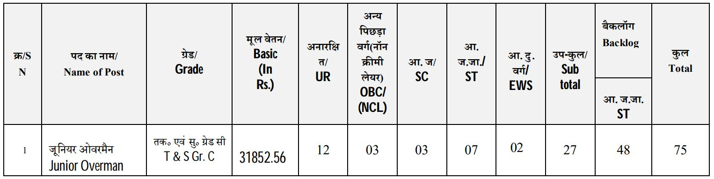

CCL Junior Overman Recruitment 2019: Central Coalfields Limited has invited online application from Eligible candidates for the post of Junior Overman. as Per CCL Recruitment notification 2019 Total of 75 Vacancies for Junior Overman post. Interested and Eligible candidates can fill up CCL Junior Overman Recruitment Online Form Through online, from 11-10-2019 to 10-11-2019.

## CCL Recruitment 2019-75 Junior Overman Post Details

<table style="border-collapse: collapse; width: 100%;"><tbody><tr><td style="width: 50%; background-color: #2a5a8e; text-align: center;" colspan="2"><h3>CCL Recruitment 2019</h3></td></tr><tr><td style="width: 50%; text-align: center;">Job Recruitment Board</td><td style="width: 50%; text-align: center;">Central Coalfields Limited(CCL)</td></tr><tr><td style="width: 50%; text-align: center;">Post</td><td style="width: 50%; text-align: center;">Junior Overman</td></tr><tr><td style="width: 50%; text-align: center;">Vacancies</td><td style="width: 50%; text-align: center;">75 Post</td></tr><tr><td style="width: 50%; text-align: center;">Job Location</td><td style="width: 50%; text-align: center;">Posted in any Area/Unit/ Project of CCL</td></tr><tr><td style="width: 50%; text-align: center;">Application Mode</td><td style="width: 50%; text-align: center;">Online</td></tr></tbody></table>

The Central Coalfields Limited, a Mini Ratna Company in energy sector of the country, Ranchi has published notification for filling up Junior Overman post on his official website. The selected candidates can be posted in any Area/Unit/ Project of CCL. to know about CCL Vacancy Details Like Education Qualification, age limits, Salary, Selection Process, Application Fee, How to Apply, Etc Given Below in this page.

<table style="border-collapse: collapse; width: 100%;"><tbody><tr><td style="width: 50%; background-color: #2a5a8e;" colspan="2"><h3 style="text-align: center;">Important Dates</h3></td></tr><tr><td style="width: 50%; text-align: center;">Starting Date of online application</td><td style="width: 50%; text-align: center;">11-10-2019</td></tr><tr><td style="width: 50%; text-align: center;">Last Date of online application</td><td style="width: 50%; text-align: center;">10-11-2019</td></tr><tr><td style="width: 50%; text-align: center;">Last date of receipt of the printout of Online applications along with supporting documents sent preferably by Registered Post/Speed Post</td><td style="width: 50%; text-align: center;">20-11-2019</td></tr></tbody></table>

### CCL Vacancy Details

- Junior Overman: 75 Vacancies

**CCL junior overman Category wise Vacancy Details**

### CCL Recruitment Eligible Criteria

**Education Qualification**

Junior Overman:

- Valid Overman’s Certificate of Competency from DGMS under Coal Mines Regulation 1957 or any other certificate in Mining which entitle to work as Overman as per Coal Mine Regulation 1957
- Valid Gas Testing Certificate
- Valid First-Aid Certificate

**Age Limits:**

- Minimum 18 Years
- Maximum 30 Years 

**Age Relaxation:**

- SC/ST Candidates: 05 Years
- OBC Candidates: 03 Years

### CCL Junior Overman Salary

- Rs. 31852.56/- Per Month

### Application Fee

- General/OBC Candidates: Rs. 200/-
- SC/ST Candidates: Nil

### Selection process

- The selection of the above post will be based on the performance in the written test.

### Health/Medical fitness

- Appointment of the above post will be subject to the candidate being medically fit as per the standards prescribed for the post by the company.
- The selected candidates will have to undergo medical examination by the company’s Authorized Medical Board & the final Appointment / Joining will be subject to the Medical Fitness Certificate so issued by company’s Authorized Medical Board only.

### How to apply for CCL Junior overman Post

1. Candidates First Goto: [www.centralcoalfields.in](http://www.centralcoalfields.in)
2. Click on “Online Services” in the CCL Homepage and thereafter go to “Online Recruitment
3. Click on Login Button and enter the E-mail id and password as used during registration in the pop-up window box.
4. After successfully logging in to the online recruitment portal, the site will display the current openings and posts applied so far and the option for making payment of Application Fee.
5. For filling the application form, click on Current Opening on the left side and check for the advertisement and the posts against the advertisement.
6. Please click on the relevant post for which you are going to apply.
7. Fill up application form
8. Upload Image/Signature Image
9. After completion of filling of applications, the system generates the application ID along with filled application (PDF), which should be printed. A copy of the filled-in application form will be sent to your registered e-mail ID
10. Print the application form, paste recent color passport size self-attested photograph (if not uploaded already) and sign at the required place. Please attach all relevant documents.
11. Candidates should send the Print-out of the application form submitted Online along with all the relevant documents in a sealed envelope to **“The General Manager (Recruitment), Recruitment Department, 2nd Floor, Damodar Building, Central Coalfields Limited, Darbhanga House, Ranchi-834001”**

### CCL Recruitment Important Links

- Direct Apply Oline For CCL Junior Overman Post: [Click Here](http://210.212.20.47:50002/OurPeople/OnlineApplications/welcome1.php) (11-10-2019)
- CCL Junior Overman Recruitment Notification 2019 PDF: [Click Here](https://freegovtjobalert.in/wp-content/uploads/2019/10/Notification-Central-Coalfields-Limited-Jr-Overman-Posts.pdf)
- CCL Official website: [Click Here](http://www.centralcoalfields.in)
