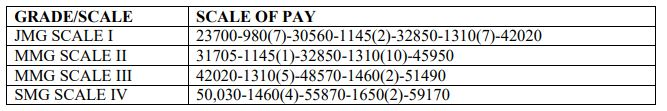

Central Bank of India specialist officer recruitment 2019: Central Bank of India has Released Notification for the Recruitment of the Specialist Officier. Central Bank of India Invites Online Application From Eligible Candidates of India. Central Bank of India Recruitment Notification 2019 For Various Vacancies in Specialist Officer Post. As Per the central bank of India job notification, a total of 74 Vacancies are there. Good Chance for those candidates who are finding Bank Jobs 2019. The Central bank of India recruitment 2019 applies online Before 21-11-2019.

## **Central Bank of India specialist officer recruitment 2019**

<table style="border-collapse: collapse; width: 100%;"><tbody><tr><td style="width: 100%; background-color: #2a5a8e; text-align: center;" colspan="2"><strong>Central Bank of India recruitment 2019</strong></td></tr><tr><td style="width: 50%; text-align: center;">Job Recruitment Board</td><td style="width: 50%; text-align: center;">Central Bank of India</td></tr><tr><td style="width: 50%; text-align: center;">Post</td><td style="width: 50%; text-align: center;">Specialist Officer</td></tr><tr><td style="width: 50%; text-align: center;">Vacancies</td><td style="width: 50%; text-align: center;">74</td></tr><tr><td style="width: 50%; text-align: center;">Job Location</td><td style="width: 50%; text-align: center;">Across India</td></tr><tr><td style="width: 50%; text-align: center;">Job Type</td><td style="width: 50%; text-align: center;">Bank Jobs</td></tr><tr><td style="width: 50%; text-align: center;">Application Mode</td><td style="width: 50%; text-align: center;">Online</td></tr></tbody></table>

The Central Bank of India Recruitment Notification 2019 Published on his Officiel website at www.centralbankofindia.co.in. In Central Bank of India Vacancy for the Post of Information Technology, Security Officer, Risk Manager, Financial Analyst/Credit Officer, Economics, CDO, Analytics Senior Manager. Candidates Should Have a Degree of MBA/ MCA/ B.Tech/ Engineering/ Post Graduation. Applicants Must Have an Age Between 21 to 45 Years. To know About Central Bank of India specialist officer recruitment Details Like Education Qualification, Experience, Age Limits, Salary/Pay Scale, Selection Process, Exam Pattern, How to apply, etc. — given below on this page.

<table style="border-collapse: collapse;"><tbody><tr><td style="width: 50%; background-color: #2a5a8e; text-align: center;" colspan="2"><h3><strong>Central Bank of India specialist officer Exam Important Dates</strong></h3></td></tr><tr><td style="width: 50%; text-align: center;">Starting Date of Online Application</td><td style="width: 50%; text-align: center;">30-10-2019</td></tr><tr><td style="width: 50%; text-align: center;">Last Date of Online Application</td><td style="width: 50%; text-align: center;">21-11-2019</td></tr><tr><td style="width: 50%; text-align: center;">Download Admit Card For Test</td><td style="width: 50%; text-align: center;">11-12-2019</td></tr><tr><td style="width: 50%; text-align: center;">Online Exam Date</td><td style="width: 50%; text-align: center;">21-12-2019 (Tentative)</td></tr></tbody></table>

### **Central Bank of India Vacancy 2019 Details**

- Information Technology: 26 Posts
- Security Officer: 1
- Security Officer: 09 Posts
- Risk Manager: 06 Posts
- Risk Manager: 06 Posts
- Financial Analyst/Credit Officer: 10 Posts
- Economist: 01 Posts
- CDO/Chief Data Scientist: 01 Posts
- Data Analyst: 03 Posts
- Analytics-Senior Manager: 02 Posts
- Data Engineer: 02 Posts
- Data Architect: 02 Posts
- CA/Credit Officer: 05 Posts

**Category Wise Central Bank of India specialist officer Vacancy Details**

### **Eligibility Criteria for Central Bank of India specialist officer recruitment**

<table style="border-collapse: collapse; width: 100%; height: 391px;"><tbody><tr style="height: 20px;"><td style="width: 26.8722%; height: 20px; text-align: center; background-color: #2a5a8e;"><strong>Post Name</strong></td><td style="width: 34.141%; height: 20px; text-align: center; background-color: #2a5a8e;"><strong>Qualification</strong></td><td style="width: 25.2203%; height: 20px; text-align: center; background-color: #2a5a8e;"><strong>Experience</strong></td><td style="width: 13.7665%; height: 20px; text-align: center; background-color: #2a5a8e;"><strong>Age(Years)</strong></td></tr><tr style="height: 42px;"><td style="width: 26.8722%; height: 16px; text-align: center;">Information Technology JMGS I</td><td style="width: 34.141%; height: 16px; text-align: center;">Engineering/PG Degree/</td><td style="width: 25.2203%; height: 16px; text-align: center;">-</td><td style="width: 13.7665%; height: 16px; text-align: center;">21 to 28</td></tr><tr style="height: 42px;"><td style="width: 26.8722%; height: 10px; text-align: center;">Security Officer MMGS III</td><td style="width: 34.141%; height: 10px; text-align: center;">Graduate</td><td style="width: 25.2203%; height: 10px; text-align: center;">&nbsp;Ten years</td><td style="width: 13.7665%; height: 10px; text-align: center;">26 to 45</td></tr><tr style="height: 42px;"><td style="width: 26.8722%; height: 10px; text-align: center;">Security officer JMGS I</td><td style="width: 34.141%; height: 10px; text-align: center;">Graduate/ Computer Knowledge</td><td style="width: 25.2203%; height: 10px; text-align: center;">Minimum of 5 years</td><td style="width: 13.7665%; height: 10px; text-align: center;">26 to 45</td></tr><tr style="height: 42px;"><td style="width: 26.8722%; height: 10px; text-align: center;">Risk Manager MMGS III</td><td style="width: 34.141%; height: 10px; text-align: center;">MBA/PG Diploma in Banking</td><td style="width: 25.2203%; height: 10px; text-align: center;">Minimum of two years post qualification experience</td><td style="width: 13.7665%; height: 10px; text-align: center;">21 to 35</td></tr><tr style="height: 42px;"><td style="width: 26.8722%; height: 10px; text-align: center;">Risk Manager MMGS II</td><td style="width: 34.141%; height: 10px; text-align: center;">B.Tech/MCA/M.Sc/ MBA</td><td style="width: 25.2203%; height: 10px; text-align: center;">-</td><td style="width: 13.7665%; height: 10px; text-align: center;">21 to 30</td></tr><tr style="height: 42px;"><td style="width: 26.8722%; height: 10px; text-align: center;">Financial Analyst MMGS II</td><td style="width: 34.141%; height: 10px; text-align: center;">CA/MBA</td><td style="width: 25.2203%; height: 10px; text-align: center;">3 Years</td><td style="width: 13.7665%; height: 10px; text-align: center;">21 to 30</td></tr><tr style="height: 42px;"><td style="width: 26.8722%; height: 14px; text-align: center;">Economist MMGS II</td><td style="width: 34.141%; height: 14px; text-align: center;">PG Degree in Economist</td><td style="width: 25.2203%; height: 14px; text-align: center;">Three years of Experience</td><td style="width: 13.7665%; height: 14px; text-align: center;">21 to 30</td></tr><tr style="height: 42px;"><td style="width: 26.8722%; height: 24px; text-align: center;">CDO /Chief Data Scientist SMGS IV</td><td style="width: 34.141%; height: 24px; text-align: center;">Bachelor‟s degree in Engineering/Science/Advanced degree</td><td style="width: 25.2203%; height: 24px; text-align: center;">8-10 Years</td><td style="width: 13.7665%; height: 24px; text-align: center;">28 to 35</td></tr><tr style="height: 64px;"><td style="width: 26.8722%; height: 64px; text-align: center;">Data Analyst MMGS III&nbsp;</td><td style="width: 34.141%; height: 64px; text-align: center;">Bachelor‟s degree in Engineering/Science/Advanced degree</td><td style="width: 25.2203%; height: 64px; text-align: center;">5 Years</td><td style="width: 13.7665%; height: 64px; text-align: center;">26 to 35</td></tr><tr style="height: 42px;"><td style="width: 26.8722%; height: 64px; text-align: center;">Analytics-Senior Manager MMGS III&nbsp;</td><td style="width: 34.141%; height: 64px; text-align: center;">Bachelor‟s degree in Engineering/Science/Advanced degree</td><td style="width: 25.2203%; height: 64px; text-align: center;">5 Years</td><td style="width: 13.7665%; height: 64px; text-align: center;">26 to 35</td></tr><tr style="height: 42px;"><td style="width: 26.8722%; height: 64px; text-align: center;">Data Engineer MMGS III&nbsp;</td><td style="width: 34.141%; height: 64px; text-align: center;">Bachelor‟s degree in Engineering/Science/Advanced degree</td><td style="width: 25.2203%; height: 64px; text-align: center;">5 Years</td><td style="width: 13.7665%; height: 64px; text-align: center;">26 to 35</td></tr><tr style="height: 42px;"><td style="width: 26.8722%; height: 42px; text-align: center;">Data Architect MMGS III&nbsp;</td><td style="width: 34.141%; height: 42px; text-align: center;">Bachelor‟s degree in Engineering/Science/Advanced degree</td><td style="width: 25.2203%; height: 42px; text-align: center;">5 Years</td><td style="width: 13.7665%; height: 42px; text-align: center;">26 to 35</td></tr><tr style="height: 42px;"><td style="width: 26.8722%; height: 33px; text-align: center;">Credit officers MMGS III&nbsp;</td><td style="width: 34.141%; height: 33px; text-align: center;">CA/CFA/ACMA/MBA</td><td style="width: 25.2203%; height: 33px; text-align: center;">CA/CFA/ACMA- 2 Years

MBA- 4 Years</td><td style="width: 13.7665%; height: 33px; text-align: center;">26 to 35</td></tr></tbody></table>

### **Central Bank of India specialist officer Job salary/Pay Scale**

### **Selection Process For Central Bank of India specialist officer Post**

1. Online Exam
2. Personal Interview

### **Central Bank of India specialist officer Online Exam Pattern**

<table style="border-collapse: collapse; width: 100%; height: 100px;"><tbody><tr style="height: 20px;"><td style="width: 8.10571%; text-align: center; height: 20px; background-color: #2a5a8e;"><strong>Sr. No</strong></td><td style="width: 47.3129%; text-align: center; height: 20px; background-color: #2a5a8e;"><strong>Name of the Test</strong></td><td style="width: 13.5022%; text-align: center; height: 20px; background-color: #2a5a8e;"><strong>Questions</strong></td><td style="width: 17.577%; text-align: center; height: 20px; background-color: #2a5a8e;"><strong>Maximum Marks</strong></td><td style="width: 13.5022%; text-align: center; height: 20px; background-color: #2a5a8e;"><strong>Duration</strong></td></tr><tr style="height: 20px;"><td style="width: 8.10571%; text-align: center; height: 20px;">1</td><td style="width: 47.3129%; text-align: center; height: 20px;">Stream/Category Specific Questions (Security)</td><td style="width: 13.5022%; text-align: center; height: 20px;">60</td><td style="width: 17.577%; text-align: center; height: 20px;">60</td><td style="width: 13.5022%; text-align: center; height: 60px;" rowspan="3">Composite time of 60 minutes</td></tr><tr style="height: 20px;"><td style="width: 8.10571%; text-align: center; height: 20px;">2</td><td style="width: 47.3129%; text-align: center; height: 20px;">Computer Knowledge</td><td style="width: 13.5022%; text-align: center; height: 20px;">20</td><td style="width: 17.577%; text-align: center; height: 20px;">20</td></tr><tr style="height: 20px;"><td style="width: 8.10571%; text-align: center; height: 20px;">3</td><td style="width: 47.3129%; text-align: center; height: 20px;">Banking, Present Economic Scenario &amp; General Awareness</td><td style="width: 13.5022%; text-align: center; height: 20px;">20</td><td style="width: 17.577%; text-align: center; height: 20px;">20</td></tr><tr style="height: 20px;"><td style="width: 55.4186%; text-align: center; height: 20px;" colspan="2">Total</td><td style="width: 13.5022%; text-align: center; height: 20px;">100</td><td style="width: 17.577%; text-align: center; height: 20px;">100</td><td style="width: 13.5022%; text-align: center; height: 20px;"></td></tr></tbody></table>

The Test Will be Available in English and Hindi. All questions will be objective type with five options.  There will be a penalty for wrong answers marked in the Online Test. For each question for which a wrong answer has been given by the candidate one fourth or 0.25 of the mark(s) assigned to that question will be deducted as penalty to arrive at corrected score. If a question is left blank, i.e. no answer is marked by the candidate, there will be no penalty for that question.

### **Central Bank of India specialist officer Admit Card 2019**

All eligible candidates will be required to download their call letter for online examination and the Information Handout from the Bank‟s website tentatively from 11/12/2019. Date of commencement of downloading interview call letters for all the posts will be intimated by way of a separate notice on the Bank‟s website. Hence, candidates are advised to visit the bank‟s website frequently for the date of commencement of downloading of on-line examination/interview call letters. Candidates should note that the call letters will not be sent through any other mode.

### **Central Bank of India specialist officer Application Fee**

<table style="border-collapse: collapse; width: 100%;"><tbody><tr><td style="width: 38.1058%; text-align: center; background-color: #2a5a8e;"><strong>Category</strong></td><td style="width: 28.9647%; text-align: center; background-color: #2a5a8e;"><strong>Application fee</strong></td><td style="width: 18.6124%; text-align: center; background-color: #2a5a8e;"><strong>Intimation Charges</strong></td><td style="width: 14.3171%; text-align: center; background-color: #2a5a8e;"><strong>Total</strong></td></tr><tr><td style="width: 38.1058%; text-align: center;">Scheduled Caste/Scheduled Tribe candidates</td><td style="width: 28.9647%; text-align: center;">NIL</td><td style="width: 18.6124%; text-align: center;">Rs.50/-</td><td style="width: 14.3171%; text-align: center;">Rs.50/-</td></tr><tr><td style="width: 38.1058%; text-align: center;">All Other Candidates</td><td style="width: 28.9647%; text-align: center;">Rs. 500/-</td><td style="width: 18.6124%; text-align: center;">Rs. 50/-</td><td style="width: 14.3171%; text-align: center;">Rs.550/-</td></tr></tbody></table>

### **How to Apply Online for Central Bank of India Specialist Officer**

Applicants First Register Your Self:

1. Candidates are first required to go to [Here](https://ibpsonline.ibps.in/cbiisvpoct19/basic_details.php)
2. Fill up Basic Information
3. Upload Photo & Signature
4. Fillup Qualification Details
5. Preview & Check Application Details
6. Pay Application Fee

### **Important Links For Central Bank of India specialist officer recruitment** 

- Central Bank of India specialist officer Online Form 2019: [Registration](https://ibpsonline.ibps.in/cbiisvpoct19/basic_details.php "Central Bank of India") | [Login](https://ibpsonline.ibps.in/cbiisvpoct19/ "Central Bank of India")
- Download Central Bank of India 74 specialist officer Recruitment Notification 2019 PDF: [Click Here](https://freegovtjobalert.in/wp-content/uploads/2019/10/Central-Bank-of-India-74-specialist-officer-Recruitment-Notification.pdf)
- Central Bank of India Official Website: [Click Here](https://www.centralbankofindia.co.in/)
