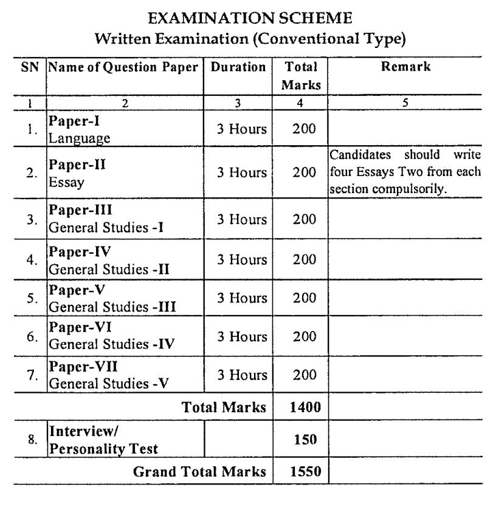

<table style="width: 100%;"><tbody><tr><td style="width: 100%; background-color: #2a5a8e; text-align: center;" colspan="2"><h3><strong>CGPSC Recruitment 2019</strong></h3></td></tr><tr><td style="width: 50%; text-align: center;">Job Recruitment Board</td><td style="width: 50%; text-align: center;">Chhattisgarh Public Service Commission</td></tr><tr><td style="width: 50%; text-align: center;">Notification No.</td><td style="width: 50%; text-align: center;">07/2019</td></tr><tr><td style="width: 50%; text-align: center;">Post</td><td style="width: 50%; text-align: center;">Various Posts</td></tr><tr><td style="width: 50%; text-align: center;">Vacancies</td><td style="width: 50%; text-align: center;">199</td></tr><tr><td style="width: 50%; text-align: center;">Job Location</td><td style="width: 50%; text-align: center;">Chhattisgarh State</td></tr><tr><td style="width: 50%; text-align: center;">Job Type</td><td style="width: 50%; text-align: center;">State Govt Jobs</td></tr><tr><td style="width: 50%; text-align: center;">Application Mode</td><td style="width: 50%; text-align: center;">Online</td></tr><tr><td style="width: 50%; text-align: center;">Prelims Exam Date</td><td style="width: 50%; text-align: center;">09-02-2020</td></tr><tr><td style="width: 50%; text-align: center;">Main Exam Date</td><td style="width: 50%; text-align: center;">17 to 20-06-2020</td></tr></tbody></table>

## **CGPSC State Service Exam Pattern 2019**

CGPSC State Service Exam Pattern 2019: Chhattisgarh Public Service Commission is set State Service Exam Pattern. CGPSC SSE Exam Pattern is important for those candidates who apply or preparing for CGPSC SSE 2019. Full Details are Mention Below

**CGPSC State Service Exam Pattern 2019 For Preliminary Exam (Objective Type)**

In the Preliminary Examinations, there will be **2 compulsory papers of 02 hours** duration each. Both the question papers will have objective type multiple-choice questions. There will be five choices of answers for each question out of which one is to be selected. There will be negative marking for the wrong answer.

First Question Paper:-

- General Studies (Question 100, Marks 200, Duration: 2.00 Hours)
- for each wrong answer, 1/3 marks of the correct answer will be deducted.

Second Question Paper:-

- Aptitude Test (Question 100, Marks 200, Duration: 2.00 Hours)
- for each wrong answer, 1/3 marks of the correct answer will be deducted.

Minimum Qualifying Marks:

- In each Question paper essential qualifying marks for the **unreserved category will be 33%,** and **23% for reserved categories** and handicapped candidates. Candidates will be shortlisted for the main examination on the basis of merit of First Question Paper.

**CGPSC State Service Exam Pattern 2019 For Main Exam**

> [CGPSC State Service Exam 2019 Online Form 199 CGPSC SSC Vacancy](https://freegovtjobalert.in/cgpsc-state-service-exam/)

- Question papers for Main Examination will be of Conventional nature i.e.: Short/ Medium/ Long answers Type.
- Candidates shortlisted for the Main Examination on the basis of Preliminary Examination (Screening Test) must appear for all the seven papers in Main Examination. Candidates selected for the Interview on the basis of Main Examination must appear in the Interview. Absence in any paper of Main Examination and Interview will be liable for disqualification.
- All the question papers except first -” Language” may be answered in Hindi or English was chosen by the candidates. However, a candidate will not be permitted to write part of the paper in Hindi and part of it in English.

**Paper-2 – Essay**

- There will be two sections in this paper. 1. National level Problems 2. Chhattisgarh State Problems. The Candidates will be given three options in each section and will have to write on one option from each section, the problem – solution (reason, present status including data and solution).

**Paper 3 to 7 will contain the questions as given below:**

**Section 01:-**

- In this section, there will be 22 compulsory questions from various parts of the syllabus of the paper concerned. Each question will carry 2 marks. Thus the maximum marks in this section will be 44. (Word limit for the answer to each question – about 30).

**Section-02:**\-

- In this section, there will be 13 compulsory questions from various parts of the syllabus of the paper concerned. Each question will carry 4 marks. Thus the maximum marks in this section will be 52. (Word limit for the answer to each question – about 60).

**Section 03:**\-

- In this section, there will be 08 compulsory questions from various parts of the syllabus of the paper concerned. Each question will carry 8 marks. Thus the maximum marks in this section will be 64. (Word limit for the answer to each question – about 100).

**Section 04:-**

- In this section, a total of 2 questions will be given from various parts of the syllabus of the paper concerned. Out of which 1 questions will have to be solved. Each question will carry 10 marks. Thus the maximum marks in this section will be 10. (Word limit for the answer to each question – about 125).

**Section 05:**\-

- In this section, There will be respectively 02-02 Questions From Various Syllabus. Out of which Candidates have to attempt respectively 01-01 questions Partwise. Each question will carry 15 marks. Thus the maximum marks in this section will be 30. (Word limit for the answer to the question – about 175).

**3\. Interview:**

- Interview/ Personality Test will carry 150 marks.

### **CGPSC State Service Exam 2019 Important Links**

- CGPSC State Service Exam 2019 Online Form: Click Here
- Download CGPSC State Service Exam 2019 Notification PDF: [Click Here](http://www.psc.cg.gov.in/pdf/Advertisement/ADV_SSE_2019.PDF)
- CGPSC Official Website: [Click Here](http://www.psc.cg.gov.in)
