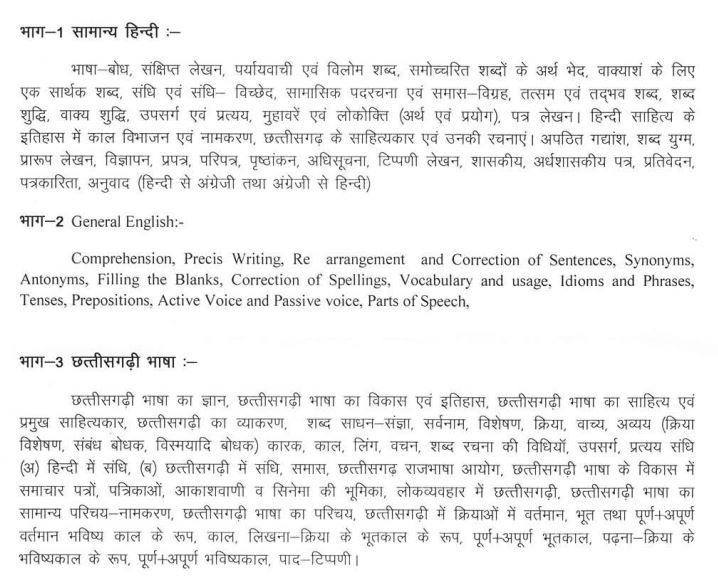

CGPSC State Service Exam Syllabus 2019: Chhattisgarh State Public Service Commission State Service Exam 2019 is on 9th Feb 2020. In Every Exam Preparation Need Syllabus and Exam Pattern. CGPSC SSE Exam Syllabus Is Here With PDF File. Candidates Can Easily Download CGPSC SSE Syllabus PDF 2019 without any Charges. CGPSC SSE Preliminary Exam Syllabus And CGPSC SSE Main Exam Syllabus is Mention Below...

## **CGPSC State Service Exam Syllabus 2019**

The question paper will be in Hindi and English both. In case of any doubt, the Hindi version will prevail.

**CGPSC SSE Preliminary Exam Syllabus 2019**

**Question Paper 1:** 

- General Studies (Questions 100, Marks 200), Time: 2 hours (There shall be 50 Questions from Part-’1′ & Part-’2′ each. Each question will carry 2 marks) 02 marks will be awarded for each right answer and for each wrong answer 1/3 marks of the correct answer will be deducted.

**PART- ’1′- General Studies:**

1\. History of India and Indian National Movement. 2\. Physical, Social & Economic Geography of India. 3\. Constitution of India & Polity. 4\. Indian Economy. 5\. General Science & Technology. 6\. Indian Philosophy, Art, Literature & Culture. 7\. Current Affairs & Sports. 8\. Environment

**PART-’2′:** **General Knowledge of Chhattisgarh:**

1\. History of Chhattisgarh, & Contribution of Chhattisgarh in the Freedom Movement. 2\. Geography, Climate, Physical status, Census, Archeological and Tourist Centres of Chhattisgarh. 3\. Literature, Music, Dance, Art and Culture, Idioms and Proverbs, Puzzle/riddle, Singing of Chhattisgarh. 4\. Tribes, Special Traditions, Teej and Festivals of Chhattisgarh. 5\. Economy, Forest, and Agriculture of Chhattisgarh. 6\. Administrative Structure, Local Government and Panchayati raj of Chhattisgarh. 7\. Industry in Chhattisgarh, Energy, Water and Mineral Resource of Chhattisgarh. 8\. Current Affairs of Chhattisgarh.

**Question Paper 2:**

- Aptitude Test (Questions 100, Marks 200), Time: 02 hours. 02 marks will be awarded for each right answer and for each wrong answer 1/3 marks of the correct answer will be deducted.

1\. Interpersonal skills including communication skills. 2\. Logical reasoning and Analytical ability. 3\. Decision making and problem-solving. 4\. General mental ability. 5\. Basic numeracy (numbers and their relations, orders of magnitude, etc.) (Class X level), Data interpretation (charts, graphs, tables, data sufficiency, etc. -Class X level). 6\. Knowledge of Hindi Language (Class X level). 7\. Knowledge of Chhattisgarhi Language.

Knowledge of Hindi Language and Chhattisgarhi Language will be tested in Hindi and Chhattisgarhi Language only, without providing a translation.

**CGPSC SSE Main Exam Syllabus 2019**

**Question Paper-1 (Marks 200/3 Hours)**

**Question Paper-2 Essay (Marks 200/3 Hours)**

PART 01: INTERNATIONAL AND NATIONAL LEVEL ISSUES

- Candidates will have to write two essays on issues (Reason, present status including data and solution) from this part. Four problems will be given in this part; the Candidate will have to write two essays on this part about 750-150 words. Each issue in this part will carry 50 marks.

PART 02: CHHATTISGARH STATE LEVEL ISSUES

- Candidates will have to write two essays on issues (Reason, present status including data and solution) from this par1. Four problems will be given in this part; the Candidate will have to write two essays on this part about 750-750 words. Each issue in this part will carry 50 marks.

**Question Paper-3 General Studies - I (Marks 200/3 Hours)**

- PART - 01 History of India
- PART - 02 Constitution & Public Administration
- PART - 03 History of Chhattisgarh

**Question Paper-4 General Studies - II  (Marks 200/3 Hours)**

- PART - 01 General Science
- PART - 02 Aptitude Test, Logical Reasoning, Mental Ability
- PART - 03 Applied & Behavioural Science

**Question Paper-5 General Studies - III (Marks 200/3 Hours)**

- PART - 01 Economics of India & Chhattisgarh
- PART - 02 Geography of India
- PART - 03 Geography of Chhattisgarh

**Question Paper-6 General Studies - IV (Marks 200/3 Hours)**

- PART - 01 Philosophy
- PART - 02 Sociology
- PART - 03 Social Aspect of Chhattisgarh

**Question Paper-7 General Studies - V (Marks 200/3 Hours)**

- PART - 01 Welfare, Development Programme & Laws
- PART- 02International & National Sports, Events & organisation
- PART - 03International & National Educational Institute & their Role of Human Development

> [Download CGPSC State Service Exam Syllabus 2019 PDF](http://www.psc.cg.gov.in/pdf/Advertisement/Syllabus_SSME.PDF)

### **CGPSC State Service Exam 2019 Important Links**

- CGPSC State Service Exam 2019 Online Form: [Click Here](https://freegovtjobalert.in/cgpsc-state-service-exam/)
- CGPSC State Service Exam Pattern 2019: [Click Here](https://freegovtjobalert.in/cgpsc-state-service-exam-pattern/)
- Download CGPSC State Service Exam 2019 Notification PDF: [Click Here](http://www.psc.cg.gov.in/pdf/Advertisement/ADV_SSE_2019.PDF)
- CGPSC Official Website: [Click Here](http://www.psc.cg.gov.in)
