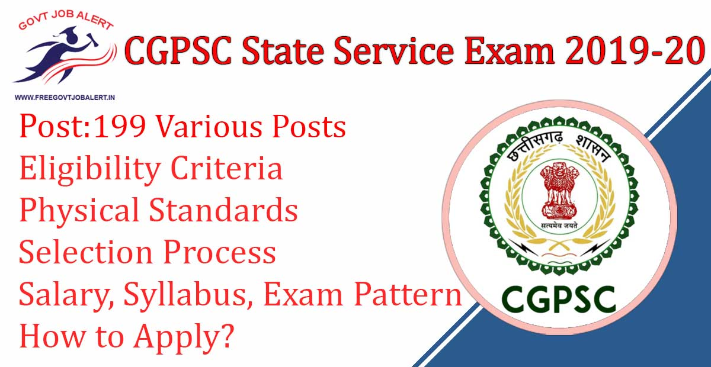
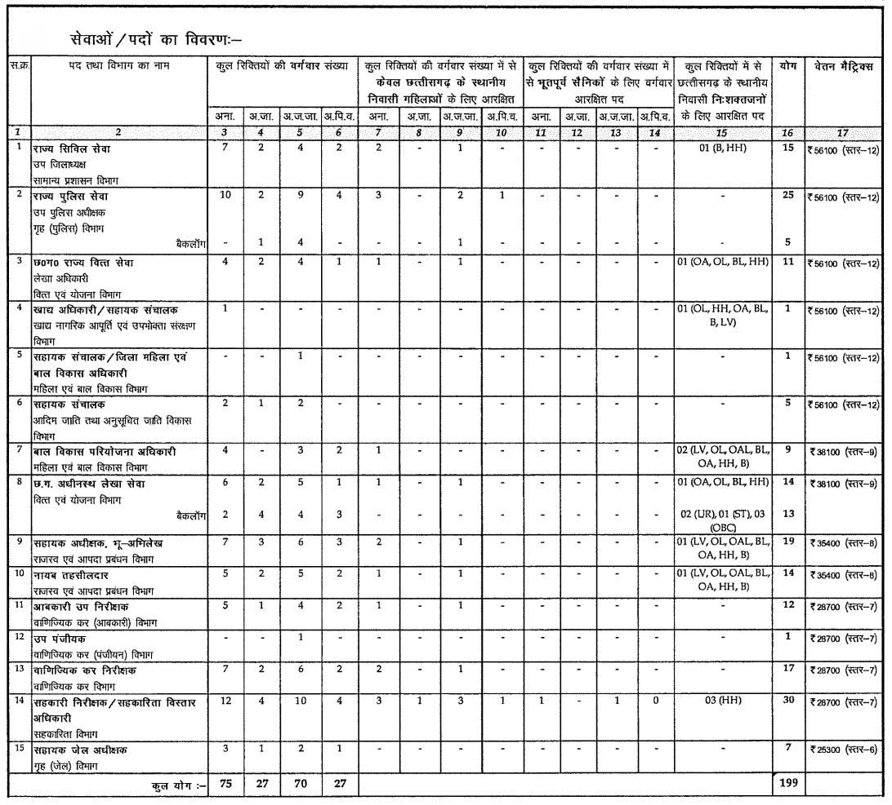
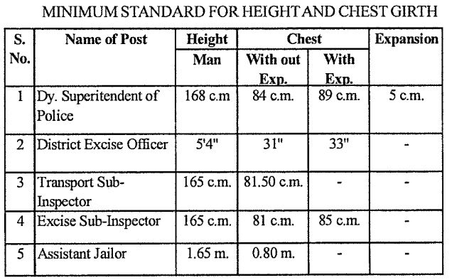

CGPSC State Service Exam 2019: The Chhattisgarh Public Service Commission, Raipur Has Conducted State Service Exam 2019 For Fill Up Vacancy. CGPSC Has Released Notification For Fill up the post of State Civil Services, State Police Service, Chhattisgarh State Finance Service, Asst Director, And Many More Posts. CGPSC SSE Various Vacancy Online Form 2019 will be Start on Date 06-12-2019.

## **CGPSC State Service Exam 2019**

<table style="border-collapse: collapse; width: 100%;"><tbody><tr><td style="width: 50%; background-color: #2a5a8e; text-align: center;" colspan="2"><h3><strong>CGPSC Recruitment 2019</strong></h3></td></tr><tr><td style="width: 50%; text-align: center;">Job Recruitment Board</td><td style="width: 50%; text-align: center;">Chhattisgarh Public Service Commission</td></tr><tr><td style="width: 50%; text-align: center;">Notification No.</td><td style="width: 50%; text-align: center;">07/2019</td></tr><tr><td style="width: 50%; text-align: center;">Post</td><td style="width: 50%; text-align: center;">Various Posts</td></tr><tr><td style="width: 50%; text-align: center;">Vacancies</td><td style="width: 50%; text-align: center;">199</td></tr><tr><td style="width: 50%; text-align: center;">Job Location</td><td style="width: 50%; text-align: center;">Chhattisgarh State</td></tr><tr><td style="width: 50%; text-align: center;">Job Type</td><td style="width: 50%; text-align: center;">State Govt Jobs</td></tr><tr><td style="width: 50%; text-align: center;">Application Mode</td><td style="width: 50%; text-align: center;">Online</td></tr></tbody></table>

Chhattisgarh PSC Recruitment Notification 2019 Published on his Official website. As Per CGPSC State Service Exam 2019 Notification A total of 199 Vacancies is there. The Candidates Must Have A Degree of Any university. Applicants Should Have Age Between 21 to 30 Years. Selected Candidates Will be Placed in Chhatisgarh State. Interested & Eligible Candidates Can Apply For CGPSC State Service Exam 2019.

<table style="border-collapse: collapse;"><tbody><tr><td style="width: 50%; background-color: #2a5a8e; text-align: center;" colspan="2"><h3><strong>CGPSC State Service Exam Dates</strong></h3></td></tr><tr><td style="width: 50%; text-align: center;">Starting Date of Online Application</td><td style="width: 50%; text-align: center;">06-12-2019</td></tr><tr><td style="width: 50%; text-align: center;">Last Date of Online Application</td><td style="width: 50%; text-align: center;">04-01-2020</td></tr><tr><td style="width: 50%; text-align: center;">Date For Errors Corrections</td><td style="width: 50%; text-align: center;">07-01-2020 to 13-01-2020</td></tr><tr><td style="width: 50%; text-align: center;">CGPSC SSE Prelims Exam Date</td><td style="width: 50%; text-align: center;">09-02-2020</td></tr><tr><td style="width: 50%; text-align: center;">CGPSC SSE Main Exam Date</td><td style="width: 50%; text-align: center;">17 to 20-06-2020</td></tr></tbody></table>

CGPSC SSE 2019 Notification Details Like Education Qualification, Age Limits, Physical Standards, Exam Pattern, Selection Process, How to apply, etc. Given Below.

### **CGPSC SSE 2019 Vacancy Details**

- State Civil Services: 15 Posts
- State Police Service: 30 Posts
- Chhattisgarh State Finance Service: 11 Posts
- Food Officer/ Asst Director: 01 Post
- Asst Director/ District Women & Child Development Officer: 01 Post
- Asst Director: 05 Posts
- Child Development Project Officer: 09 Posts
- Chhattisgarh Subordinate Service: 27 Posts
- Asst Superintended: 19 Posts
- Nayab Tahasildar: 14 Posts
- Exercise Sub Inspector: 12 Posts
- Deputy Register: 01 Post
- Commercial Tax Inspector: 17 Posts
- Cooperative Inspector/ Cooperative Extension Officer: 30 Posts
- Asst Jail Officer: 07 Posts

### **CGPSC State Service Exam 2019 Eligibility Criteria**

Education Qualification

- Candidates Must Have A Degree Form University

Age Limits

- Minimum: 21 Years
- Maximum: 30 Years
- Age Relaxation: Check Official CGPSC State Service Exam 2019 Notification.

### **CGPSC State Service Exam 2019 Physical Standards**

\[caption id="attachment\_1796" align="aligncenter" width="636"\] CGPSC State Service Exam 2019 Physical Standards\[/caption\]

### **CGPSC SSE Jobs Salary/Pay Scale**

<table style="border-collapse: collapse; width: 100%;"><tbody><tr><td style="width: 60.4626%; text-align: center; background-color: #2a5a8e;"><strong>Posts Name</strong></td><td style="width: 39.5374%; text-align: center; background-color: #2a5a8e;"><strong>Salary/ Pay Scale</strong></td></tr><tr><td style="width: 60.4626%; text-align: center;">State Civil Services</td><td style="width: 39.5374%; text-align: center;" rowspan="6">Rs. 56,100 Level-12</td></tr><tr><td style="width: 60.4626%; text-align: center;">State Police Service</td></tr><tr><td style="width: 60.4626%; text-align: center;">Chhattisgarh State Finance Service</td></tr><tr><td style="width: 60.4626%; text-align: center;">Food Officer/ Asst Director</td></tr><tr><td style="width: 60.4626%; text-align: center;">Asst Director/ District Women &amp; Child Development Officer</td></tr><tr><td style="width: 60.4626%; text-align: center;">Asst Director</td></tr><tr><td style="width: 60.4626%; text-align: center;">Child Development Project Officer</td><td style="width: 39.5374%; text-align: center;" rowspan="2">Rs. 38,100 Level-9</td></tr><tr><td style="width: 60.4626%; text-align: center;">Chhattisgarh Subordinate Service</td></tr><tr><td style="width: 60.4626%; text-align: center;">Asst Superintended</td><td style="width: 39.5374%; text-align: center;" rowspan="2">Rs. 35,400 Level-8</td></tr><tr><td style="width: 60.4626%; text-align: center;">Nayab Tahasildar</td></tr><tr><td style="width: 60.4626%; text-align: center;">Exercise Sub Inspector</td><td style="width: 39.5374%; text-align: center;" rowspan="4">Rs. 28,700 Level-7</td></tr><tr><td style="width: 60.4626%; text-align: center;">Deputy Register</td></tr><tr><td style="width: 60.4626%; text-align: center;">Commercial Tax Inspector</td></tr><tr><td style="width: 60.4626%; text-align: center;">Cooperative Inspector/ Cooperative Extension Officer</td></tr><tr><td style="width: 60.4626%; text-align: center;">Assistant Jail Officer</td><td style="width: 39.5374%; text-align: center;">Rs. 25,300 Level-6</td></tr></tbody></table>

### **Selection Process For CGPSC State Service Exam 2019**

1. Prelims Exam
2. Main Exam
3. Interview

### **CGPSC State Service Exam Pattern** 

**Prelims Exam**

- First Paper: General Studies 100 Questions/ 200 Marks- 2 Hours
- Second Paper: Aptitude Test 100 Questions/ 200 Marks- 2 Hours

**Main Exam**

- Paper 1: Language 200 Marks/3 Hours
- Paper 2: Essay 200 Marks/3 Hours
- Paper 3: General Studies-1 200 Marks/3 Hours
- Paper 4: General Studies-2 200 Marks/3 Hours
- Paper 5: General Studies-3  200 Marks/3 Hours
- Paper 6: General Studies-4  200 Marks/3 Hours
- Paper 7: General Studies-5 200 Marks/3 Hours

Interview/Personality Test: 150 Marks

Full Details About CGPSC SSE Exam Pattern: [Click Here](https://freegovtjobalert.in/cgpsc-state-service-exam-pattern/)

### **CGPSC State Service Exam 2019 Syllabus**

- CGPSC SSE 2019 Syllabus: [Click Here](https://freegovtjobalert.in/cgpsc-state-service-exam-syllabus/)

### **Application Fee For CGPSC State Service Exam 2019**

- Candidates out of Chhattisgarh: Rs. 400/-
- SC/ ST/ OBC Candidates of Chattisgarh: Rs. 300/-
- Payment Mode: Online

### **How to Apply For CGPSC State Service Exam 2019**

1. Applicants Go to CGPSC Official Website: www.psc.cg.gov.in
2. Find Notification of CGPSC SSE 2019-20.
3. Read Carefully and Follow Instructions.
4. Pay Application Fee.
5. Submit the Application Form.
6. Download & Save Application Form for Future Use.
7. Done.

### **CGPSC State Service Exam 2019 Important Links**

- CGPSC State Service Exam 2019 Online Form: Click Here
- Download CGPSC State Service Exam 2019 Notification PDF: [Click Here](http://www.psc.cg.gov.in/pdf/Advertisement/ADV_SSE_2019.PDF)
- CGPSC Official Website: [Click Here](http://www.psc.cg.gov.in)

Candidates can visit www.psc.cg.gov.in to get more details about CGPSC SSE 2019-20. To More Information About CGPSC upcoming vacancy 2019-20, latest Updates, Admit Card, Syllabus, Result, Etc. It will be published on the official website. Also, visit Regularly our website [www.freegovtjobalert.in](https://freegovtjobalert.in "Free Govt Job Alert") for getting the Latest job Updates.
