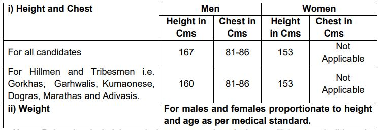
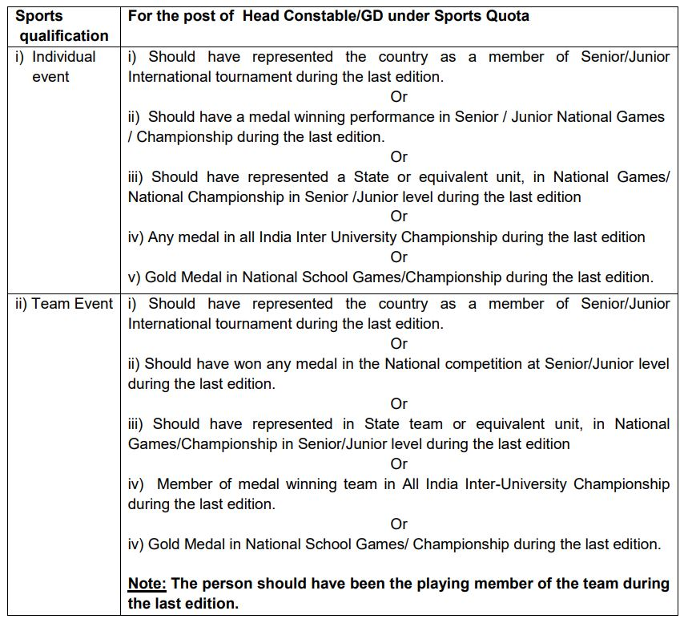

CISF Head Constable Eligibility Criteria 2019: CISF Recruitment Notification 2019 Published on his Official website with Offline Form. As per CISF Recruitment Notification 2019, A Total 300 Vacancies in Different Discipline/Specialty Are There. The Candidates Must Have Passed 12th Class. Applicants Should Have Age Between 18 to 23 Years. Good Chance for those Candidates Who Finding 12th Pass Jobs in CISF. The Selected Candidates Will be posted Across India. Interested Eligible Candidates Can Fill up CISF Head Constable Offline Form 2019 Before the Last date.

## **CISF Head Constable Eligibility Criteria 2019**

CISF Head Constable Recruitment 2019 Details Like Education Qualification, Age Limits, CISF Salary, Application Fee, Selection Process, How to apply, etc. are Given [Here](https://freegovtjobalert.in/cisf-head-constable-recruitment/)

CISF Head Constable Eligibility Criteria Full Details Given Below:-

- The candidates should be a citizen of India.

**Education Qualification**

- 12th pass from a recognized educational An institution with credit of representing State/ National/ International in games, Sports and Athletics.

**Age Limits**

- Minimum: 18 Years
- Maximum: 
    - General Candidates: 23 Years
    - OBC Candidates: 26 Years
    - SC/ST Candidates: 28 Years

**Physical Standards**

**Medical Standards**

Candidates must not have knock knee, flat foot, bow legs, squint eyes, inability to close that left eye, inability to flex the fingers often, varicose vein and any other obvious deformities and should bear good mental health.

**EyeSight**

- Visual Acuity unaided (Near vision) – Better eye – N6 / Worse eye – N9
- Uncorrected visual acuity (Distant vision) - Better eye – 6/6 / Worse eye – 6/9
- Refraction – Visual correction of any kind is not permitted even by glasses.
- Color vision – CP-III BY ISHIHARA
- In the right-handed person, the Right eye is a better eye and vice versa.
- Binocular vision is required.

**Weight**

- Weight will be recorded at the time of physical measurement but the decision on fitness on account of weight will be taken at the time of medical examination.

**Tattoo**

- Content: Being a secular country, the religious sentiments of our countrymen are to be respected and thus, tattoos depicting religious symbols or figures and the name, as followed in the Indian Army are to be permitted.
- Location: Tattoos marked on traditional sites of the body like inner aspect of forearm but only left forearm, being non-saluting limb or dorsum of the hands are to be allowed.
- Size: Size must be less than ¼ of the particular part (Elbow or Hand) of the body.

**Proficiency in Sports**

### **Important Links For CISF Head Constable Vacancy**

- CISF Head Constable (GD) Offline Form 2019: [Click Here](https://freegovtjobalert.in/wp-content/uploads/2019/11/Notification-CISF-Constable-General-Duty-Posts.pdf)
- Download CISF 300 Head Constable (General Duty) Recruitment Notification PDF: [Click Here](https://freegovtjobalert.in/wp-content/uploads/2019/11/Notification-CISF-Constable-General-Duty-Posts.pdf)
- CISF Official Website: [Click Here](https://cisfrectt.in/)
