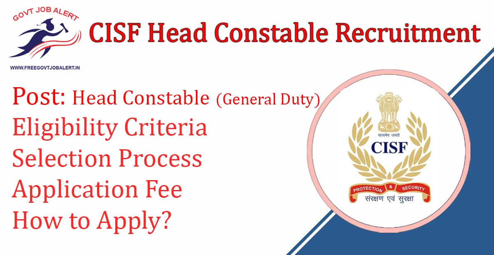
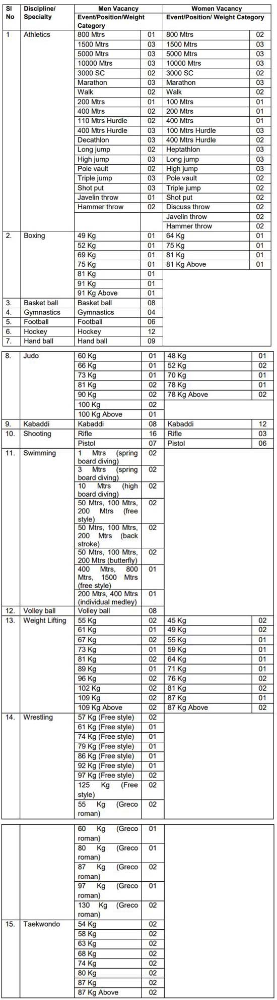

CISF Head Constable Recruitment 2019: Central Industrial Security Force has Released Notification Regarding Head Constable Vacancy. CSIF is invited from the Male/Female citizens of India to fill up 300 vacancies of HEAD CONSTABLE (GENERAL DUTY) in Central Industrial Security Force against SPORTS QUOTA for the year 2019. As per CISF Recruitment Notification 2019, A Total 300 Vacancies in Different Discipline/Specialty Are There. CISF HC Offline Form 2019 has Started.

## **CISF Head Constable Recruitment 2019-20**

<table style="border-collapse: collapse; width: 100%;"><tbody><tr><td style="width: 50%; background-color: #2a5a8e; text-align: center;" colspan="2"><h3><strong>CISF Recruitment 2019</strong></h3></td></tr><tr><td style="width: 50%; text-align: center;">Job Recruitment Board</td><td style="width: 50%; text-align: center;">Central Industrial Security Force</td></tr><tr><td style="width: 50%; text-align: center;">Post</td><td style="width: 50%; text-align: center;">Head Constable(GD)</td></tr><tr><td style="width: 50%; text-align: center;">Vacancies</td><td style="width: 50%; text-align: center;">300</td></tr><tr><td style="width: 50%; text-align: center;">Job Location</td><td style="width: 50%; text-align: center;">Across India</td></tr><tr><td style="width: 50%; text-align: center;">Job Type</td><td style="width: 50%; text-align: center;">Central Jobs</td></tr><tr><td style="width: 50%; text-align: center;">Application Mode</td><td style="width: 50%; text-align: center;">Offline</td></tr></tbody></table>

CISF Recruitment Notification 2019 Published on his Official website with Offline Form. The Candidates Must Have Passed 12th Class. Applicants Should Have Age Between 18 to 23 Years. Good Chance for those Candidates Who Finding 12th Pass Jobs in CISF. The Selected Candidates Will be posted in Across India. Interested Eligible Candidates Can Fill up Central Industrial Security Force Head Constable Offline Form 2019 Before the Last date.

<table style="border-collapse: collapse;"><tbody><tr><td style="width: 50%; background-color: #2a5a8e; text-align: center;" colspan="2"><h3><strong>CISF Head Constable Exam Date 2019</strong></h3></td></tr><tr><td style="width: 50%; text-align: center;">Starting Date of&nbsp; Offline Registration</td><td style="width: 50%; text-align: center;">17-12-2019</td></tr><tr><td style="width: 50%; text-align: center;">Last Date of Offline Registration For North-East Region</td><td style="width: 50%; text-align: center;">24-12-2019</td></tr></tbody></table>

CISF Head Constable Recruitment Details Like Education Qualification, Age Limits, Application Fee, Selection Process, How to apply, etc. are given below.

### **CISF Head Constable Vacancy Details**

- CISF Head Constable (General Duty): 300 Posts

### **CISF Head Constable** **Eligibility Criteria**

- The candidates should be a citizen of India.

Education Qualification

- 12th pass from a recognized educational An institution with credit of representing State/ National/ International in games, Sports and Athletics.

Age Limits

- Minimum: 18 Years
- Maximum: 
    - General Candidates: 23 Years
    - OBC Candidates: 26 Years
    - SC/ST Candidates: 28 Years

CISF Head Constable Physical Standards: [Click Here](https://freegovtjobalert.in/cisf-head-constable-eligibility-criteria/)

### **CISF Salary/Pay Scale**

- Pay Matrix Level-4 (Rs.25,500-81,100/-) plus usual allowances as admissible to the Central Government employees from time to time.

### **CISF HC** **Selection Process**

1. Trial Test in Sports Events
2. Proficiency Test
3. Final Selection
4. Medical Examination

### **Application Fee For** **CISF Head Constable Offline Form 2019**

- General Candidates: Rs. 100/-
- SC/ST/Women Candidates: Nil
- Payment Mode: Postal Order/ Demand Draft

### **How to Apply For** **CISF HC Recruitment 2019**

1. Applicants Download CISF HC Form & Printout
2. Fill up Application Form
3. Application Sent Address Given Below With Discipline

### **Important Links For CISF Head Constable Vacancy**

- CISF Head Constable (GD) Offline Form 2019: [Click Here](https://freegovtjobalert.in/wp-content/uploads/2019/11/Notification-CISF-Constable-General-Duty-Posts.pdf)
- Download CISF 300 Head Constable (General Duty) Recruitment Notification PDF: [Click Here](https://freegovtjobalert.in/wp-content/uploads/2019/11/Notification-CISF-Constable-General-Duty-Posts.pdf)
- CISF Official Website: [Click Here](https://cisfrectt.in/)

Candidates can visit https://cisfrectt.in to get more details about CISF Jobs 2019. Applicants can get all information CISF HC Jobs latest Updates, Admit Card, Result, Etc. It will be published on the official website. Also, visit Regularly our website [www.freegovtjobalert.in](https://freegovtjobalert.in) for getting the Latest job Updates.
