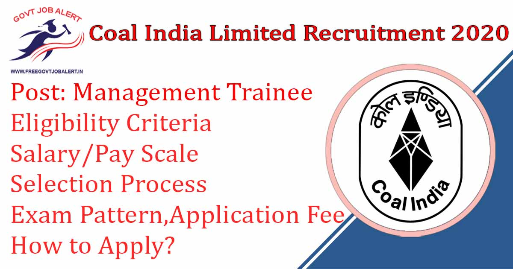
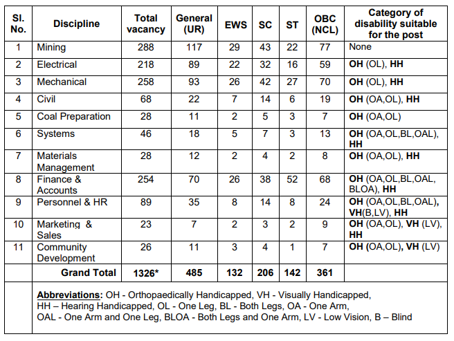

Coal India MT Recruitment 2020: Coal India Limited has Going to Fill up Management Trainee Posts. Coal India MT Recruitment 2020 Notification Released for recruitment of the Management Trainee Post. Coal India Limited invites applications from young, energetic and dynamic persons for recruitment Through Online Application Mode only for the post of Management Trainee post in different disciplines. Coal India Limited Management Trainee Online Form 2020 starts on date 21-12-2019.

## **Coal India MT Recruitment 2020**

<table style="border-collapse: collapse; width: 100%;"><tbody><tr><td style="width: 50%; background-color: #2a5a8e; text-align: center;" colspan="2"><h3><strong>Coal India Recruitment 2020</strong></h3></td></tr><tr><td style="width: 50%; text-align: center;">Job Recruitment Board</td><td style="width: 50%; text-align: center;">Coal India Limited</td></tr><tr><td style="width: 50%; text-align: center;">Notification No.</td><td style="width: 50%; text-align: center;">01/2019</td></tr><tr><td style="width: 50%; text-align: center;">Post</td><td style="width: 50%; text-align: center;">Management Trainee</td></tr><tr><td style="width: 50%; text-align: center;">Vacancies</td><td style="width: 50%; text-align: center;">1326</td></tr><tr><td style="width: 50%; text-align: center;">Job Location</td><td style="width: 50%; text-align: center;">Anywhere in India</td></tr><tr><td style="width: 50%; text-align: center;">Job Type</td><td style="width: 50%; text-align: center;">Govt Jobs</td></tr><tr><td style="width: 50%; text-align: center;">Application Mode</td><td style="width: 50%; text-align: center;">Online</td></tr></tbody></table>

Coal India MT Recruitment 2020 Notification Published on his Official Website. As Per Coal India MT Recruitment Notification 2020 A Total of 1326 Vacancies are There. Good Chance for Those Candidates who are Finding jobs in coal India limited for freshers. Those Candidates Are Eligible to apply who completed B.E/ B.Tech/ B.Sc/ Electrical/ Mechanical/ CA/ Graduate Degree/ PG Diploma. Applicants Must Age Not More Than 30 Years. Selected Candidates may be posted anywhere in Subsidiary companies especially in Coalfield areas. Interested & Eligible Candidates Can Fill up Coal India MT Recruitment Online Application Form 2020 Before The Last Date.

<table style="border-collapse: collapse;"><tbody><tr><td style="width: 50%; background-color: #2a5a8e; text-align: center;" colspan="2"><h3><strong>Coal India MT Recruitment 2020 Exam Dates</strong></h3></td></tr><tr><td style="width: 50%; text-align: center;">Starting Date of Online Application</td><td style="width: 50%; text-align: center;">21-12-2019</td></tr><tr><td style="width: 50%; text-align: center;">Last Date of Online Application With Fee</td><td style="width: 50%; text-align: center;">19-01-2020</td></tr><tr><td style="width: 50%; text-align: center;">Tentative dates of Computer Based Online Test</td><td style="width: 50%; text-align: center;">27, 28-02-2020</td></tr></tbody></table>

coal India recruitment 2019 for management trainee Post Details Like Education Qualification, Age Limits, Selection Process, Application Fee, How to Apply, etc. - Given Below.

### **Coal India Limited Vacancy Details**

- Coal India Management Trainee Vacancy: 1326 Posts

### **Eligibility Criteria For Coal India MT Recruitment 2020**

Age Limits

Maximum:

- General/EWS Category: 30 Years
- OBC Candidates: 33 Years
- SC/ST Candidates: 35 Years
- PWD Candidates: 40 Years

Education Qualification

<table style="border-collapse: collapse; width: 100%; height: 350px;"><tbody><tr style="height: 25px;"><td style="width: 9.84337%; text-align: center; height: 25px; background-color: #2a5a8e;"><strong>Post Code</strong></td><td style="width: 17.3751%; text-align: center; height: 25px; background-color: #2a5a8e;"><strong>Name of Discipline</strong></td><td style="width: 72.7814%; text-align: center; height: 25px; background-color: #2a5a8e;"><strong>Minimum Qualification</strong></td></tr><tr style="height: 25px;"><td style="width: 9.84337%; text-align: center; height: 25px;">11</td><td style="width: 17.3751%; text-align: center; height: 25px;">Mining</td><td style="width: 72.7814%; text-align: center; height: 100px;" rowspan="4">BE/ B.Tech/ B.Sc (Engg.) in a relevant branch of Engineering with a minimum of 60% marks.</td></tr><tr style="height: 25px;"><td style="width: 9.84337%; text-align: center; height: 25px;">12</td><td style="width: 17.3751%; text-align: center; height: 25px;">Electrical</td></tr><tr style="height: 25px;"><td style="width: 9.84337%; text-align: center; height: 25px;">13</td><td style="width: 17.3751%; text-align: center; height: 25px;">Mechanical</td></tr><tr style="height: 25px;"><td style="width: 9.84337%; text-align: center; height: 25px;">14</td><td style="width: 17.3751%; text-align: center; height: 25px;">Civil</td></tr><tr style="height: 25px;"><td style="width: 9.84337%; text-align: center; height: 25px;">15</td><td style="width: 17.3751%; text-align: center; height: 25px;">Coal Preparation</td><td style="width: 72.7814%; text-align: center; height: 25px;">BE/ B.Tech/ B.Sc (Engg.) in Chemical/Mineral Engineering with minimum 60% marks.</td></tr><tr style="height: 25px;"><td style="width: 9.84337%; text-align: center; height: 25px;">16</td><td style="width: 17.3751%; text-align: center; height: 25px;">Systems</td><td style="width: 72.7814%; text-align: center; height: 25px;">BE/ B.Tech/ B.Sc (Engg) in Computer Science/ Computer Engg. / IT or MCA with minimum 60% marks.</td></tr><tr style="height: 50px;"><td style="width: 9.84337%; text-align: center; height: 50px;">17</td><td style="width: 17.3751%; text-align: center; height: 50px;">Materials Management</td><td style="width: 72.7814%; text-align: center; height: 50px;">Engineering Degree in Electrical or Mechanical Engineering with 2 years full-time MBA/ PG Diploma in Management with minimum 60% marks.</td></tr><tr style="height: 25px;"><td style="width: 9.84337%; text-align: center; height: 25px;">18</td><td style="width: 17.3751%; text-align: center; height: 25px;">Finance &amp; Accounts</td><td style="width: 72.7814%; text-align: center; height: 25px;">Qualified CA / ICWA</td></tr><tr style="height: 50px;"><td style="width: 9.84337%; text-align: center; height: 50px;">19</td><td style="width: 17.3751%; text-align: center; height: 50px;">Personnel &amp; HR</td><td style="width: 72.7814%; text-align: center; height: 50px;">Graduates with at least two years of full-time Post Graduate Degree/ PG Diploma/ Post Graduate Program in Management with specialization in HR.</td></tr><tr style="height: 25px;"><td style="width: 9.84337%; text-align: center; height: 25px;">20</td><td style="width: 17.3751%; text-align: center; height: 25px;">Marketing &amp; Sales</td><td style="width: 72.7814%; text-align: center; height: 25px;">Recognized Degree with 2 years full-time MBA / PG Diploma in Management with specialization in Marketing.</td></tr><tr style="height: 25px;"><td style="width: 9.84337%; text-align: center; height: 25px;">21</td><td style="width: 17.3751%; text-align: center; height: 25px;">Community Development</td><td style="width: 72.7814%; text-align: center; height: 25px;">Minimum of two years full-time Post-Graduate Degree or Post Graduate Diploma of two-year duration from a recognized University.</td></tr></tbody></table>

### **Salary/Pay Scale For Coal India MT Recruitment 2020**

- Selected candidates will be placed as Management Trainee in E-2 Grade in the scale of pay of \` 50,000 – 1,60,000/- at the initial Basic of \` 50,000/- per month during the training period.
- On successful and satisfactory completion of 1-year training period and passing the test conducted for the purpose, regularization will be in E-3 Grade in the scale of pay of \` 60,000 – 1,80,000/- at the initial Basic of \` 60,000/- with probation for 1 year.

### **Coal India MT Recruitment 2020 Selection Process**

1. Computer-Based Online Test
2. Personal Interview

### **Computer-Based Online** **Exam Pattern For Coal India MT Vacancy**

- The duration of the Computer Based Online Test will be for 3 hours (in one sitting) consisting of two papers.
- 100 marks each.
- Paper-I will consist of General Knowledge/Awareness, Reasoning, Numerical Ability, and General English.
- Paper-II will consist of Professional Knowledge (Discipline related) with 100 multiple-choice questions (MCQ) in each paper.
- Each question will carry 1 mark and there is no penalty for the wrong answer.
- No marks will be awarded for un-attempted questions.
- The question paper shall be bilingual i.e. in English and Hindi only.

### **Coal India MT Recruitment 2020 Application Fee**

- General/OBC/EWS Candidates: Rs. 1000/-
- ST/SC/PWD Candidates: No Fee
- Payment Mode: Online

### **How to Apply For Coal India MT Recruitment 2020**

The candidates shall apply through online mode available on CIL website www.coalindia.in only under Career with CIL >>>> Jobs at Coal India >>>> Current Job Notifications section as per the qualification and eligibility criteria indicated above.

### **Coal India MT Recruitment 2020 Important Links**

- Coal India Limited MT Recruitment Online Form 2020: [Click Here](https://www.coalindia.in/career/en-us/managementtrainee201920.aspx)
- Download Coal India 1326 MT Recruitment Notification PDF: [Click Here](https://www.coalindia.in/Portals/13/PDF/mt2019_detailed.pdf)
- Coal India Limited Official Website: [Click Here](https://www.coalindia.in/)

Candidates can visit www.coalindia.in to get more details about Coal India MT Recruitment 2019-20. To More Information About Coal India upcoming vacancies 2020, latest Updates, Syllabus, Admit Card, Result, Etc. It will be published on the official website. Also, visit Regularly our website [www.freegovtjobalert.in](https://freegovtjobalert.in) for getting the Latest job Updates.
