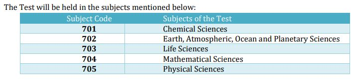

**CSIR NET Exam Pattern & Syllabus 2019**: Joint CSIR-UGC NET Examination would be conducted by NTA on Sunday, 15 December, 2019 for determining the eligibility of Indian Nationals for the award of Junior Research Fellowships (JRF) and for determining eligibility for Lectureship (LS)/Assistant Professorship in certain subject areas falling under the faculty of Science & Technology. CSIR UGC NET December 2019 Eligibility, Stipend, Application Fee All Details Check Here or CSIR UGC NET December 2019 Exam Pattern and Syllabus Given in this page Below.

## CSIR UGC NET Exam Pattern & Syllabus Details

- The Test will consist of three parts.
- All the parts will consist of objective type, multiple-choice questions
- The Examination shall be conducted as a Computer Based Test (CBT) only.
- The test will be in Hindi and English version. In case of any ambiguity between Hindi and English version due to translation, the English version would be treated as final.
- If a candidate attempts more than the required no. of questions then only the First Set of required questions will be considered for scoring.
- Negative marking for each incorrect answer

**CSIR UGC NET Exam Pattern**

The Test will consist of three parts. All the parts will consist of objective type, Multiple Choice questions. There will be no break between papers. The subject-wise scheme of examination is as per details below:

**Chemical Sciences Paper Pattern:**

<table style="border-collapse: collapse; width: 67.4127%; height: 243px;"><tbody><tr><td style="width: 53.1909%; text-align: center; background-color: #2a5a8e;">CHEMICAL SCIENCES</td><td style="width: 12.6001%; text-align: center; background-color: #2a5a8e;">PART A</td><td style="width: 11.7831%; text-align: center; background-color: #2a5a8e;">PART B</td><td style="width: 11.7831%; text-align: center; background-color: #2a5a8e;">PART C</td><td style="width: 10.6426%; text-align: center; background-color: #2a5a8e;">TOTAL</td></tr><tr><td style="width: 53.1909%; text-align: center;">Total questions</td><td style="width: 12.6001%; text-align: center;">20</td><td style="width: 11.7831%; text-align: center;">40</td><td style="width: 11.7831%; text-align: center;">60</td><td style="width: 10.6426%; text-align: center;">120</td></tr><tr><td style="width: 53.1909%; text-align: center;">Max No of Questions to attempt</td><td style="width: 12.6001%; text-align: center;">15</td><td style="width: 11.7831%; text-align: center;">35</td><td style="width: 11.7831%; text-align: center;">25</td><td style="width: 10.6426%; text-align: center;">75</td></tr><tr><td style="width: 53.1909%; text-align: center;">Marks for each correct answer</td><td style="width: 12.6001%; text-align: center;">2</td><td style="width: 11.7831%; text-align: center;">2</td><td style="width: 11.7831%; text-align: center;">4</td><td style="width: 10.6426%; text-align: center;">200</td></tr><tr><td style="width: 53.1909%; text-align: center;">Marks for each incorrect answer (Negative marking)</td><td style="width: 12.6001%; text-align: center;">0.5</td><td style="width: 11.7831%; text-align: center;">0.5</td><td style="width: 11.7831%; text-align: center;">1</td><td style="width: 10.6426%; text-align: center;">-</td></tr></tbody></table>

**Chemical Sciences Details**: The candidate is required to answer a maximum of 15, 35 and 25 questions from Part-A, Part-B, and Part-C respectively. If more than required number of questions are answered, only the first 15, 35 and 25 questions in Part A, Part B and Part C respectively will be taken up for evaluation. Below each question in Part A, Part B, and Part C, four alternatives or responses are given. Only one of these alternatives is the "correct" option to the question. The candidate has to find, for each question, the correct or the best answer

**Earth Sciences Paper Pattern:**

<table style="border-collapse: collapse; width: 67.4127%; height: 243px;"><tbody><tr><td style="width: 53.1909%; text-align: center; background-color: #2a5a8e;">EARTH, ATMOSPHERIC, OCEAN AND PLANETARY SCIENCES</td><td style="width: 12.6001%; text-align: center; background-color: #2a5a8e;">PART A</td><td style="width: 11.7831%; text-align: center; background-color: #2a5a8e;">PART B</td><td style="width: 11.7831%; text-align: center; background-color: #2a5a8e;">PART C</td><td style="width: 10.6426%; text-align: center; background-color: #2a5a8e;">TOTAL</td></tr><tr><td style="width: 53.1909%; text-align: center;">Total questions</td><td style="width: 12.6001%; text-align: center;">20</td><td style="width: 11.7831%; text-align: center;">50</td><td style="width: 11.7831%; text-align: center;">80</td><td style="width: 10.6426%; text-align: center;">150</td></tr><tr><td style="width: 53.1909%; text-align: center;">Max No of Questions to attempt</td><td style="width: 12.6001%; text-align: center;">15</td><td style="width: 11.7831%; text-align: center;">35</td><td style="width: 11.7831%; text-align: center;">25</td><td style="width: 10.6426%; text-align: center;">75</td></tr><tr><td style="width: 53.1909%; text-align: center;">Marks for each correct answer</td><td style="width: 12.6001%; text-align: center;">2</td><td style="width: 11.7831%; text-align: center;">2</td><td style="width: 11.7831%; text-align: center;">4</td><td style="width: 10.6426%; text-align: center;">200</td></tr><tr><td style="width: 53.1909%; text-align: center;">Marks for each incorrect answer (Negative marking)</td><td style="width: 12.6001%; text-align: center;">0.5</td><td style="width: 11.7831%; text-align: center;">0.5</td><td style="width: 11.7831%; text-align: center;">1.32</td><td style="width: 10.6426%; text-align: center;">-</td></tr></tbody></table>

**Earth Sciences Details**: The candidate is required to answer a maximum of 15, 35 and 25 questions from Part-A, Part-B, and Part-C respectively. If more than required number of questions are answered, only the first 15, 35 and 25 questions in Part A, Part B and Part C respectively will be taken up for evaluation. Below each question in Part A, Part B, and Part C, four alternatives or responses are given. Only one of these alternatives is the "correct" option to the question. The candidate has to find, for each question, the correct or the best answer.

**Life Sciences Paper Pattern:**

<table style="border-collapse: collapse; width: 67.4127%; height: 243px;"><tbody><tr><td style="width: 53.1909%; text-align: center; background-color: #2a5a8e;">LIFE SCIENCES</td><td style="width: 12.6001%; text-align: center; background-color: #2a5a8e;">PART A</td><td style="width: 11.7831%; text-align: center; background-color: #2a5a8e;">PART B</td><td style="width: 11.7831%; text-align: center; background-color: #2a5a8e;">PART C</td><td style="width: 10.6426%; text-align: center; background-color: #2a5a8e;">TOTAL</td></tr><tr><td style="width: 53.1909%; text-align: center;">Total questions</td><td style="width: 12.6001%; text-align: center;">20</td><td style="width: 11.7831%; text-align: center;">50</td><td style="width: 11.7831%; text-align: center;">75</td><td style="width: 10.6426%; text-align: center;">145</td></tr><tr><td style="width: 53.1909%; text-align: center;">Max No of Questions to attempt</td><td style="width: 12.6001%; text-align: center;">15</td><td style="width: 11.7831%; text-align: center;">35</td><td style="width: 11.7831%; text-align: center;">25</td><td style="width: 10.6426%; text-align: center;">75</td></tr><tr><td style="width: 53.1909%; text-align: center;">Marks for each correct answer</td><td style="width: 12.6001%; text-align: center;">2</td><td style="width: 11.7831%; text-align: center;">2</td><td style="width: 11.7831%; text-align: center;">4</td><td style="width: 10.6426%; text-align: center;">200</td></tr><tr><td style="width: 53.1909%; text-align: center;">Marks for each incorrect answer (Negative marking)</td><td style="width: 12.6001%; text-align: center;">0.5</td><td style="width: 11.7831%; text-align: center;">0.5</td><td style="width: 11.7831%; text-align: center;">1</td><td style="width: 10.6426%; text-align: center;">-</td></tr></tbody></table>

**Life Sciences Details**: The candidate is required to answer a maximum of 15, 35 and 25 questions from Part-A, Part-B, and Part-C respectively. If more than required number of questions are answered, only the first 15, 35 and 25 questions in Part A, Part B and Part C respectively will be taken up for evaluation. Below each question in Part A, Part B, and Part C, four alternatives or responses are given. Only one of these alternatives is the "correct" option to the question. The candidate has to find, for each question, the correct or the best answer.

**Mathematical Sciences Paper Pattern**

<table style="border-collapse: collapse; width: 67.4127%; height: 243px;"><tbody><tr><td style="width: 53.1909%; text-align: center; background-color: #2a5a8e;">MATHEMATICAL SCIENCES</td><td style="width: 12.6001%; text-align: center; background-color: #2a5a8e;">PART A</td><td style="width: 11.7831%; text-align: center; background-color: #2a5a8e;">PART B</td><td style="width: 11.7831%; text-align: center; background-color: #2a5a8e;">PART C</td><td style="width: 10.6426%; text-align: center; background-color: #2a5a8e;">TOTAL</td></tr><tr><td style="width: 53.1909%; text-align: center;">Total questions</td><td style="width: 12.6001%; text-align: center;">20</td><td style="width: 11.7831%; text-align: center;">40</td><td style="width: 11.7831%; text-align: center;">60</td><td style="width: 10.6426%; text-align: center;">120</td></tr><tr><td style="width: 53.1909%; text-align: center;">Max No of Questions to attempt</td><td style="width: 12.6001%; text-align: center;">15</td><td style="width: 11.7831%; text-align: center;">25</td><td style="width: 11.7831%; text-align: center;">20</td><td style="width: 10.6426%; text-align: center;">60</td></tr><tr><td style="width: 53.1909%; text-align: center;">Marks for each correct answer</td><td style="width: 12.6001%; text-align: center;">2</td><td style="width: 11.7831%; text-align: center;">3</td><td style="width: 11.7831%; text-align: center;">4.75</td><td style="width: 10.6426%; text-align: center;">200</td></tr><tr><td style="width: 53.1909%; text-align: center;">Marks for each incorrect answer (Negative marking)</td><td style="width: 12.6001%; text-align: center;">0.5</td><td style="width: 11.7831%; text-align: center;">0.5</td><td style="width: 11.7831%; text-align: center;">0</td><td style="width: 10.6426%; text-align: center;">-</td></tr></tbody></table>

**Mathematical Sciences Details**: The candidate is required to answer a maximum of 15, 25 and 20 questions from Part-A, Part-B, and Part-C respectively. If more than required number of questions are answered, only the first 15, 25 and 20 questions in Part A, Part B and Part C respectively will be taken up for evaluation. Below each question in Part A, Part B, four alternatives or responses are given. Only one of these alternatives is the "correct" option to the question. The candidate has to find, for each question, the correct or the best answer. In Part C each question may have "ONE" or "MORE" correct options. Credit in a question shall be given only on identification of "ALL" the correct options in Part C.

**Physical Sciences Paper Pattern**

<table style="border-collapse: collapse; width: 67.4127%; height: 243px;"><tbody><tr><td style="width: 53.1909%; text-align: center; background-color: #2a5a8e;">PHYSICAL SCIENCES</td><td style="width: 12.6001%; text-align: center; background-color: #2a5a8e;">PART A</td><td style="width: 11.7831%; text-align: center; background-color: #2a5a8e;">PART B</td><td style="width: 11.7831%; text-align: center; background-color: #2a5a8e;">PART C</td><td style="width: 10.6426%; text-align: center; background-color: #2a5a8e;">TOTAL</td></tr><tr><td style="width: 53.1909%; text-align: center;">Total questions</td><td style="width: 12.6001%; text-align: center;">20</td><td style="width: 11.7831%; text-align: center;">25</td><td style="width: 11.7831%; text-align: center;">30</td><td style="width: 10.6426%; text-align: center;">75</td></tr><tr><td style="width: 53.1909%; text-align: center;">Max No of Questions to attempt</td><td style="width: 12.6001%; text-align: center;">15</td><td style="width: 11.7831%; text-align: center;">20</td><td style="width: 11.7831%; text-align: center;">20</td><td style="width: 10.6426%; text-align: center;">55</td></tr><tr><td style="width: 53.1909%; text-align: center;">Marks for each correct answer</td><td style="width: 12.6001%; text-align: center;">2</td><td style="width: 11.7831%; text-align: center;">3.5</td><td style="width: 11.7831%; text-align: center;">5</td><td style="width: 10.6426%; text-align: center;">200</td></tr><tr><td style="width: 53.1909%; text-align: center;">Marks for each incorrect answer (Negative marking)</td><td style="width: 12.6001%; text-align: center;">0.5</td><td style="width: 11.7831%; text-align: center;">0.875</td><td style="width: 11.7831%; text-align: center;">1.25</td><td style="width: 10.6426%; text-align: center;">-</td></tr></tbody></table>

**Physical Sciences Details**: The candidate is required to answer a maximum of 15, 20 and 20 questions from Part-A, Part-B, and Part-C respectively. If more than required number of questions are answered, only the first 15, 20 and 20 questions in Part A, Part B and Part C respectively will be taken up for evaluation. Below each question in Part A, Part B, and Part C, four alternatives or responses are given. Only one of these alternatives is the "correct" option to the question. The candidate has to find, for each question, the correct or the best answer.

**The Test will consist of three parts:**

- Part **'A'** shall be common to all subjects. This part shall contain questions pertaining to General Aptitude with emphasis on logical reasoning, graphical analysis, analytical and numerical ability, quantitative comparison, series formation, puzzles etc.
- Part **'B'** shall contain subject-related conventional Multiple Choice questions (MCQs), generally covering the topics given in the syllabus.
- Part **'C'** shall contain higher-order questions that may test the candidate's knowledge of scientific concepts and/or application of the scientific concepts. The questions shall be of analytical nature where a candidate is expected to apply scientific knowledge to arrive at the solution to the given scientific problem.

**CSIR NET Exam Paper Subjects Code:**

**CSIR UGC NET JRF Syllabus Details**

Syllabus & Scheme of Examination of the MCQ Paper may be seen at CSIR HRDG website: www.csirhrdg.res.in.

Note: National Testing Agency will not provide a copy of the syllabus to individual candidates.

> **CSIR UGC NET Syllabus For JRF/LS: [Click Here](http://www.csirhrdg.res.in/Home/Index/1/Default/834/78)**

**CSIR UGC NET Examination December 2019 Important Links**

- **CSIR UGC NET Examination December 2019 Online Form [Click Here](https://freegovtjobalert.in/csir-ugc-net-examination-december-2019-online-form/)**
- **CSIR UGC NET Exam Model Question Paper [Click Here](http://www.csirhrdg.res.in/Home/Index/1/Default/274/79)**
- **CSIR UGC NET Important Dates [Click Here](https://freegovtjobalert.in/wp-content/uploads/2019/09/Important-Dates-CSIR-UGC-NET-Dec-2019.pdf)**
- **CSIR UGC NET Examination December 2019 Notification PDF  [Click Here](https://freegovtjobalert.in/wp-content/uploads/2019/09/Information-Notification-CSIR-UGC-NET-Dec-2019.pdf)**
- **CSIR Official Website [Click Here](http://www.nta.ac.in)**
