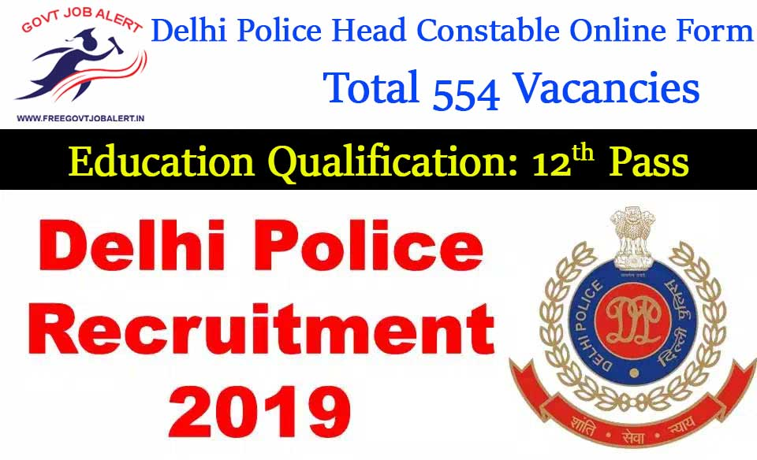

The Delhi Police has published notification for the recruitment of the post of Head Constable. Delhi Police has Invited online application From Male and Female Indian Citizens for Filling up the following Vacancy for the post of temporary Head Constable(Ministerial). As Per Delhi Police Head Constable Recruitment Notification, Total 554 Vacancies for Head Constable Post. Delhi Police Head Constable Online Form 2019 is Start on Date 01-10-2019. Interested and Eligible Candidates can apply online.

## Delhi Police Head Constable Recruitment 2019 | 554 HC Vacancies @delhipolice.nic.in

DP Department Latest Job Notification For 12th Pass Candidates. Latest Job in Delhi Police for 372 Male Head Constable and 182 Female Head Constable. Hence, Male & Female, Both can Fill up Delhi police HC Application Form 2019. There is a good chance for those candidates who want to the Police Jobs. Eligible Applicants can apply for Delhi Police Jobs 2019 before the Last date at the official website.

<table style="width: 87.988%; height: 140px;"><tbody><tr style="height: 20px;"><td style="width: 87.961%; height: 20px; background-color: #2a5a8e; text-align: center;" colspan="2"><h3><strong>Delhi Police Recruitment 2019</strong></h3></td></tr><tr style="height: 20px;"><td style="width: 50%; height: 20px; text-align: center;">Job Recruitment Board</td><td style="width: 37.961%; height: 20px; text-align: center;">Delhi Police Department</td></tr><tr style="height: 20px;"><td style="width: 50%; height: 20px; text-align: center;">Post</td><td style="width: 37.961%; height: 20px; text-align: center;">Head Constable (Ministerial)</td></tr><tr style="height: 20px;"><td style="width: 50%; height: 20px; text-align: center;">Vacancies</td><td style="width: 37.961%; height: 20px; text-align: center;">554</td></tr><tr style="height: 20px;"><td style="width: 50%; height: 20px; text-align: center;">Job Location&nbsp;</td><td style="width: 37.961%; height: 20px; text-align: center;">Delhi</td></tr><tr style="height: 20px;"><td style="width: 50%; height: 20px; text-align: center;">Job Category</td><td style="width: 37.961%; height: 20px; text-align: center;">Police Jobs</td></tr><tr style="height: 20px;"><td style="width: 50%; height: 20px; text-align: center;">Application Mode</td><td style="width: 37.961%; height: 20px; text-align: center;">Online</td></tr></tbody></table>

<table style="border-collapse: collapse; width: 93.2933%;"><tbody><tr><td style="width: 93.2819%; background-color: #2a5a8e; text-align: center;" colspan="2"><h3><strong>Delhi Police HC Post Important Date</strong></h3></td></tr><tr><td style="width: 50%; text-align: center;">Advertisement Date</td><td style="width: 43.2819%; text-align: center;">26-09-2019</td></tr><tr><td style="width: 50%; text-align: center;">Starting date of Online application</td><td style="width: 43.2819%; text-align: center;">01-10-2019</td></tr><tr><td style="width: 50%; text-align: center;">Last Date of Online Application</td><td style="width: 43.2819%; text-align: center;">30-10-2019</td></tr><tr><td style="width: 50%; text-align: center;">Last Date of fee Payment</td><td style="width: 43.2819%; text-align: center;">30-10-2019</td></tr></tbody></table>

### Delhi Police Vacancy 2019 Details

**Category Wise Vacancy**

<table style="border-collapse: collapse; width: 90.4905%;"><tbody><tr><td style="width: 25%; text-align: center; background-color: #2a5a8e;"><strong>Category&nbsp;</strong></td><td style="width: 25%; text-align: center; background-color: #2a5a8e;"><strong>Male Head Constable</strong></td><td style="width: 25%; text-align: center; background-color: #2a5a8e;"><strong>Female Head Constable</strong></td><td style="width: 15.4185%; text-align: center; background-color: #2a5a8e;"><strong>Total</strong></td></tr><tr><td style="width: 25%; text-align: center;">General</td><td style="width: 25%; text-align: center;">140</td><td style="width: 25%; text-align: center;">69</td><td style="width: 15.4185%; text-align: center;">209</td></tr><tr><td style="width: 25%; text-align: center;">EWS</td><td style="width: 25%; text-align: center;">37</td><td style="width: 25%; text-align: center;">18</td><td style="width: 15.4185%; text-align: center;">55</td></tr><tr><td style="width: 25%; text-align: center;">OBC</td><td style="width: 25%; text-align: center;">86</td><td style="width: 25%; text-align: center;">12</td><td style="width: 15.4185%; text-align: center;">128</td></tr><tr><td style="width: 25%; text-align: center;">SC</td><td style="width: 25%; text-align: center;">56</td><td style="width: 25%; text-align: center;">27</td><td style="width: 15.4185%; text-align: center;">83</td></tr><tr><td style="width: 25%; text-align: center;">ST</td><td style="width: 25%; text-align: center;">53</td><td style="width: 25%; text-align: center;">26</td><td style="width: 15.4185%; text-align: center;">79</td></tr><tr><td style="width: 25%; text-align: center;">Total</td><td style="width: 25%; text-align: center;">372</td><td style="width: 25%; text-align: center;">182</td><td style="width: 15.4185%; text-align: center;">554</td></tr></tbody></table>

### Delhi Police HC Recruitment Eligibility Criteria

**Age Limits**

- General/ EWS Category: 18 to 25 Years
- OBC Category: 18 to 28 Years
- SC/ ST Category: 18 to 30 Years
- PwD GEN/ EWS Category: 18 to 35 Years
- PwD OBC Category: 18 to 38 Years
- PwD SC/ ST Category: 18 to 40 Years
- Sportsmen/ Sportswomen of distinction and Sons/ Daughters of Serving, Deceased & Retired Police Personnel: 18 to 30 Years
- Divorced Women and Women judicially separated from husband and not remarried: 18 to 35 Years

**Education Qualification**

- 10+2 Pass From a Recognized Board.

**Professional Requirement**

- Speed in English Typing on Computer- 30 Word Per Minute
- Speed in Hindi Typing on Computer- 25 Word Per Minute

### Delhi Police Head Constable Selection Process

1. Computer-based Examination
2. Physical Endurance & Measurement Test
3. Typing Test on Computer
4. Computer (Formatting) Test

### Delhi Police Job Salary/Pay Scale

- Rs. 25,500 - 81,100 (Pay Matrix Level-4)

### Delhi Police HC Application Fee

- General Candidates: Rs. 100/-
- SC/ST/Women Candidates: None
- Payment Mode: Online through SBI Challan, Net Banking, Credit/Debit Card.
- Fee Once Paid Shall Not be Refuntble under any Circumstances nor will it be adjusted against any other examination or Selection.

### Delhi Police Exam Syllabus

- General Awareness
- Quantitative Aptitude
- General Intelligence
- English Language
- Computer Fundamentals, MS Excel, MS Word, Communication, Internet, WWW and Web Browsers, etc.

> Download Delhi Police HC Exam Syllabus PDF: [Click Here](https://freegovtjobalert.in/delhi-police-head-constable-syllabus/)

### How to fill up for Delhi Police Head Constable Online Form 2019

1. candidates First Goto Delhi Police Official Website: [www.delhipolice.nic.in](http://www.delhipolice.nic.in)
2. Goto **Recruitment** Section From Home page.
3. Find and click on _Apply online for the post of Head Constable(Ministerial) in Delhi Police Exam., 2019._
4. Fill Application Form Details Like Name, Qualification, Mobile Number, Email ID, Etc.
5. Upload Candidates Image, Candidates Signature, and Required Document.
6. Pay Application Fee.
7. Click on Submit Button.
8. Download & Save Application For Future Use.
9. Done.

### Delhi Police Head Constable Recruitment Important Links

- Delhi Police Head Constable Online Form 2019: **[Registration](https://delhip.azurewebsites.net/index_controller_DLP/register#no-back-button "Delhi Police") | [Login](https://delhip.azurewebsites.net/#no-back-button "Delhi Police")**
- Download Delhi Police Head Constable Syllabus PDF: [**Click Here**](https://freegovtjobalert.in/delhi-police-head-constable-syllabus/)
- Delhi Police Head Constable Eligibility: **[Click Here](https://freegovtjobalert.in/delhi-police-head-constable-eligibility/)**
- Download Delhi Police HC Official Notification 2019 PDF: [**Click Here**](https://freegovtjobalert.in/wp-content/uploads/2019/10/Delhi-Police-Head-Constable-Recruitment-Notification-2019-PDF.pdf)
- Delhi Police Official Website: **[Click Here](http://www.delhipolice.nic.in/index.html)**
