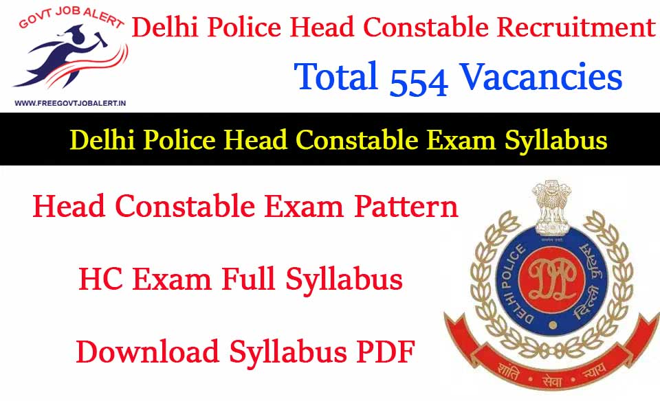

Delhi Police Head Constable Syllabus 2019: Delhi Police has Recently Announced For Fill up 554 Posts Of Head Constable (Ministerial) Group-C. Delhi Police HC Online Form 2019 Process is Online. DP Head Constable Vacancy is for males and Female Both. The Online Application Start on 01-10-2019 to 30-10-2019. Interested Candidates Can check Full Details About [Delhi Police Head Constable Recruitment 2019](https://freegovtjobalert.in/delhi-police-head-constable-recruitment/).

## Delhi Police Head Constable Syllabus 2019

A lot of Candidates Can Fill up Delhi Police Head Constable Application Form and Start Preparing For HC Exam. In Some Time Delhi Police Department will be Announced Delhi police Head Constable Exam Date. This time Every Student Preparing for Government Jobs, so Competition is very high. All Candidates Preparation with Perfect Syllabus with exam pattern. We Provide the determined latest scheme of examination and syllabus for your best preparation regards this.

### Delhi Police Head Constable Selection Process

1. Computer-based Examination
2. Physical Endurance & Measurement Test
3. Typing Test on Computer
4. Computer (Formatting) Test

### Delhi Police HC Exam Pattern

All the candidates shall be put through a Computer-based examination on a subject as mention in the below table.

<table style="border-collapse: collapse; width: 100%; height: 70px;"><tbody><tr style="height: 10px;"><td style="width: 53.6563%; height: 10px; text-align: center; background-color: #2a5a8e;" colspan="2"><strong>Subject(Not in Sequence)</strong></td><td style="width: 16.8063%; height: 10px; text-align: center; background-color: #2a5a8e;"><strong>No. of Questions</strong></td><td style="width: 13.8326%; height: 10px; text-align: center; background-color: #2a5a8e;"><strong>Max. Marks</strong></td><td style="width: 15.7048%; height: 10px; text-align: center; background-color: #2a5a8e;"><strong>Time Duration</strong></td></tr><tr style="height: 10px;"><td style="width: 9.64757%; height: 10px; text-align: center;">Part-A</td><td style="width: 44.0087%; height: 10px; text-align: center;">General Awareness</td><td style="width: 16.8063%; height: 10px; text-align: center;">20</td><td style="width: 13.8326%; height: 10px; text-align: center;">20</td><td style="width: 15.7048%; height: 60px; text-align: center;" rowspan="6">90 Minutes</td></tr><tr style="height: 10px;"><td style="width: 9.64757%; height: 10px; text-align: center;">Part-B&nbsp;</td><td style="width: 44.0087%; height: 10px; text-align: center;">Quantitative Aptitude</td><td style="width: 16.8063%; height: 10px; text-align: center;">20</td><td style="width: 13.8326%; height: 10px; text-align: center;">20</td></tr><tr style="height: 10px;"><td style="width: 9.64757%; height: 10px; text-align: center;">Part-C</td><td style="width: 44.0087%; height: 10px; text-align: center;">General Intelligence</td><td style="width: 16.8063%; height: 10px; text-align: center;">25</td><td style="width: 13.8326%; height: 10px; text-align: center;">25</td></tr><tr style="height: 10px;"><td style="width: 9.64757%; height: 10px; text-align: center;">Part-D</td><td style="width: 44.0087%; height: 10px; text-align: center;">English Language</td><td style="width: 16.8063%; height: 10px; text-align: center;">25</td><td style="width: 13.8326%; height: 10px; text-align: center;">25</td></tr><tr style="height: 10px;"><td style="width: 9.64757%; height: 10px; text-align: center;">Part-E</td><td style="width: 44.0087%; height: 10px; text-align: center;">Computer Fundamentals, MS Excel, MS Word, Communication, Internet, WWW and Web Browsers, etc.</td><td style="width: 16.8063%; height: 10px; text-align: center;">10</td><td style="width: 13.8326%; height: 10px; text-align: center;">10</td></tr><tr style="height: 10px;"><td style="width: 53.6563%; height: 10px; text-align: center;" colspan="2">Total</td><td style="width: 16.8063%; height: 10px; text-align: center;">100</td><td style="width: 13.8326%; height: 10px; text-align: center;">100</td></tr></tbody></table>

- There Will be No Negative Marks For Wrong Answer
- The Delhi Police HC Exam Question Paper in Will Be Five Parts.
- The Question Paper for Computer Based Examination Except Part D Will be Conducted in Hindi & English Only.

### Delhi Police Head Constable Exam Syllabus

**General Awareness :**

- Questions are designed to test the Candidate’s General Awareness around him/her and its application to society.
- Questions are also designed to test his/her knowledge of current events and of such matters of everyday observation and experience in their scientific aspect as may be expected of an educated person.
- The Test will also include questions relating to India and its neighboring Countries especially pertaining to History, Culture, Geography, Indian Economy, General Polity, Indian Constitution and Scientific Research.
- These Questions will be such that they do not require a special study of any discipline.

**Quantitative Aptitude :**

- Number Systems:
    - Computation of whole Number,
    - Decimals and Fractions and relationship between Numbers.
- Fundamental Arithmetical Operations:
    - Percentage, Ratio and Proportion,
    - Square roots,
    - Averages,
    - Interest (Single and Compound),
    - Profit and Loss, Discount,
    - Partnership Business,
    - Mixture and Allegation,
    - Time and Distance,
    - Time and Work.
- Algebra:
    - Basic algebraic identities of Scholl Algebra (and their simple applications) e.g. Formulas and Elementary surds (simple problems) and Graphs of Linear Equations.
- Geometry: Familiarity with elementary geometric figures and facts:
    - Triangle and its various kinds of centers.
    - centroid,
    - In-centric,
    - Ortho centric,
    - circumcentre Congruence and similarity of triangles Circle and its chords,
    - tangents,
    - angles subtended by chords of a circle,
    - common tangents to two or more circles.
- Mensuration:
    - Triangle,
    - Quadrilaterals Regular Polygons (sum of internal angles of a polygon) Circle Right Prism Right Circular Cone,
    - Right Circular Cylinder Sphere,
    - Hemispheres Rectangular Parallelepiped Regular Right Pyramid with triangular or square base.
- Trigonometry:
    - Trigonometric ratios Degree and Radian Measures,
    - Standard Identities. Complementary Angles,
    - Heights and Distances (simple problems only).
- Statistical Charts:
    - Use of Tables and Graphs: Histogram Frequency Polygon Bar-diagram,
    - Pie Chart.

**General Intelligence :**

- It Would Include Questions of Both Verbal and Non-Verbal type.
- The Test Will Include questions on Semantic Analogy,
- Symbolic Operations,
- Symbolic / Number Analogy,
- Trends,
- Figural Analogy,
- Space Orientation,
- Semantic Classification,
- Venn Diagrams,
- Symbolic/ Number Classification,
- Drawing Inferences,
- Figural Pattern-Folding & unfolding,
- Semantic Series,
- Figural Pattern-Folding & Completion,
- Number Series,
- Embedded Figures,
- Figural Series,
- Critical Thinking,
- Problem Solving,
- Emotional Intelligence,
- Word Building,
- Social Intelligence,
- Coding and De-Coding.

**English Language :**

- Spot the Error,
- Fill the Blanks,
- Synonyms/ Homonyms,
- Antonyms,
- Spellings/Detecting
- misspelled words,
- Idiom & Phrases,
- One Word Substitution,
- Improvement of Sentences,
- Active/ Passive Voice of Verbs,
- Conversion into Direct / Indirect Narration,
- Shuffling of Sentence Parts,
- Shuffling of Sentences in a Passage,
- Cloze Passage,
- Comprehension Passage.

**Computer Fundamentals :**

This Paper Will Include Questions on the following:

- Elements of Word Processing (Word Processing Basics, Opening and Closing Documents, Text Creation, Formatting the Text and Its Presentation Features).
- MS Excel (Elements of Spread Sheet, Editing of Cells, Function, and Formula).
- Communication (Basic of E-mail, Sending / Receiving of Emails and its related Functions).
- Internet, WWW and Web Browsers (Internet, Services on Internet, URL, HTTP, FTP, Web Sites, Blogs, Web Browsing Software, Search Engines, Chat, Video Conferencing, e-Banking) etc.

> ### Download Delhi Police Head Constable Exam Syllabus PDF [Click Here](https://freegovtjobalert.in/wp-content/uploads/2019/10/Delhi-Police-Head-Constable-Exam-Syllabus-PDF.pdf)

### Delhi Police Head Constable Recruitment Important Links

- Delhi Police Head Constable Online Form 2019: **[Click Here](http://www.delhipolice.nic.in/recruitment.html)** 
- Delhi Police Head Constable Eligibility: **[Click Here](https://freegovtjobalert.in/delhi-police-head-constable-eligibility/)**
- Download Delhi Police HC Official Notification 2019 PDF: [**Click Here**](https://freegovtjobalert.in/wp-content/uploads/2019/10/Delhi-Police-Head-Constable-Recruitment-Notification-2019-PDF.pdf)
- Delhi Police Official Website: **[Click Here](http://www.delhipolice.nic.in/index.html)**
