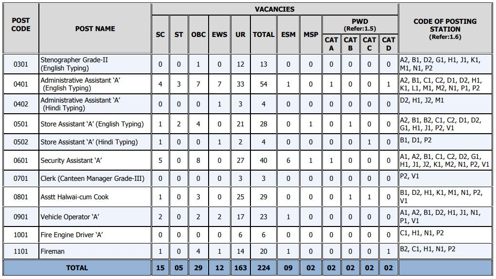

**DRDO CEPTAM Recruitment 2019**: Defence Research & Development Organization and Center for Personnel Talent Management has Published Notification For fill up various Vacancies. **DRDO CEPTAM Recruitment Notification 2019** For Recruit of Stenographer, Administrative Assistant, Store Assistant, Security Assistant, Clerk, Assistant Halwai cum Cook, Vehicle Operator, Fire Engine Driver, Fireman. As Per Notification total 224 Vacancies Available in DRDO & CEPTAM. Interested & Eligible Candidates Can Apply Online Before Last Date Has gone.to know About **DRDO Vacancy** Post Details Like Education Qualification, Age Limits, Pay Scale, Selection Process, Syllabus, Exam Center, Etc. Given in this Page Below.

## DRDO CEPTAM Recruitment 2019 | 224 Various Post  Details

<table style="height: 437px; width: 79.108%; border-collapse: collapse; border-style: double;"><tbody><tr style="height: 80px;"><td style="width: 100%; text-align: center; height: 50px;" colspan="2">Defence Research &amp; Development Organization

Center for Personnel Talent Management

DRDO CEPTAM Recruitment 2019

224 Vacancies</td></tr><tr style="height: 30px;"><td style="width: 100%; height: 30px; background-color: #2a5a8e; text-align: center;" colspan="2"><h3><strong>&nbsp;Important Dates</strong></h3></td></tr><tr style="height: 22px;"><td style="width: 50%; text-align: center; height: 22px;">Starting Date for Registration</td><td style="width: 50%; text-align: center; height: 22px;">21-09-2019</td></tr><tr style="height: 22px;"><td style="width: 50%; text-align: center; height: 22px;">Last Date for Registration</td><td style="width: 50%; text-align: center; height: 22px;">15-10-2019</td></tr><tr style="height: 30px;"><td style="width: 100%; height: 30px; background-color: #2a5a8e; text-align: center;" colspan="2"><h3><strong>&nbsp;Vacancy Details</strong></h3></td></tr><tr style="height: 22px;"><td style="text-align: center; height: 22px; width: 50%;">Job Recruitment Board</td><td style="text-align: center; width: 50%; height: 22px;">DRDO CEPTAM Recruitment</td></tr><tr style="height: 10px;"><td style="text-align: center; width: 50%; height: 10px;">Post</td><td style="text-align: center; width: 50%; height: 10px;">Various</td></tr><tr style="height: 14px;"><td style="text-align: center; width: 50%; height: 14px;">No of Vacancies</td><td style="text-align: center; width: 50%; height: 14px;">224 Posts</td></tr><tr style="height: 10px;"><td style="text-align: center; width: 50%; height: 10px;">Job Location</td><td style="text-align: center; width: 50%; height: 10px;">Across India</td></tr><tr style="height: 10px;"><td style="text-align: center; width: 50%; height: 10px;">Application Mode</td><td style="text-align: center; width: 50%; height: 10px;">Online</td></tr><tr style="height: 30px;"><td style="width: 100%; height: 30px; background-color: #2a5a8e; text-align: center;" colspan="2"><h3><strong>Eligibility Criteria&nbsp;</strong></h3></td></tr><tr style="height: 14px;"><td style="height: 14px; text-align: left; width: 100%;" colspan="2"><strong>Education Qualification:</strong>

<strong>Stenographer Grade-II (English Typing): POST CODE 0301</strong><ul><li>12th Class pass from a recognized Board or University.</li><li>Skill test norms Dictation: 10 minutes @ 80 words per minute. Transcription: 50 minutes (English) (only on computers).</li></ul><strong>Administrative Assistant ‘A’ (English Typing): POST CODE 0401</strong><ul><li>12th Class pass Or equivalent from a recognized Board or University.</li><li>Skill test norms on Computer: English Typing @ 35 words per minute (Time allowed -10 minutes.) (35 words per minute correspond to 10500 KDPH on an average of 5 key depressions for each word).</li></ul><strong>Administrative Assistant ‘A’ (Hindi Typing): POST CODE 0402</strong><ul><li>12th Class pass Or equivalent from a recognized Board or University.</li><li>Skill test norms on Computer: Hindi Typing @ 30 words per minute (Time allowed-10 minutes.) (30 words per minute correspond to 9000 KDPH on an average of 5 key depressions for each word).</li></ul><strong>Store Assistant ‘A’ (English Typing): POST CODE 0501</strong><ul><li>12th Class pass Or equivalent from a recognized Board or University.</li><li>Skill test norms on Computer: English Typing @ 35 words per minutes. (35 words per minutes correspond to 10500 KDPH on an average of 5 key depressions for each word). Time-10 minutes.</li></ul><strong>Store Assistant ‘A’ (Hindi Typing): POST CODE 0502</strong><ul><li>12th Class pass Or equivalent from a recognized Board or University.</li><li>Skill test norms on Computer: Hindi Typing @ 30 words per minutes. (30 words per minutes correspond to 9000 KDPH on an average of 5 key depressions for each word). Time-10 minutes.</li></ul><strong>Security Assistant ‘A’: POST CODE 0601</strong><ul><li>12th Class pass Or equivalent from a recognized Board or University or equivalent certificate awarded by Armed Forces in the case of Ex-servicemen.</li><li>Physical fitness and capability to undertake strenuous duties.</li></ul><strong>Clerk (Canteen Manager Grade-III): POST CODE 0701</strong><ul><li>Secondary School Certificate (10th Standard Pass under 10+2 System) recognized by the Central/State Governments.</li><li>(i) Accurate typing speed in English (minimum 30 words per minute) or in Hindi (minimum 25 words per minute) or 8000 key depressions per hour for data entry in the computer. (ii) Two years of experience in Canteen Management in a Government/Semi-Government/ Autonomous Organisation.</li></ul><strong>Asstt Halwai-cum Cook: POST CODE 0801</strong><ul><li>Secondary School Certificate (10th Standard Pass under 10+2 System).</li><li>Two years of experience in cooking in a Government/SemiGovernment/Autonomous Organisation.</li></ul><strong>Vehicle Operator ‘A’: POST CODE 0901</strong><ul><li>10th Standard Pass.</li><li>(i) Possession of a valid driving license for two or three-wheelers and light and heavy vehicles, and (ii) Knowledge of motor mechanism (The candidate should be able to remove minor defects in vehicle). (iii) Experience of driving a motor car for at least three years.</li></ul><strong>Fire Engine Driver ‘A’: POST CODE 1001</strong><ul><li>Pass in 10th Standard from a recognized Board.</li><li>(i) Possession of a valid driving license for two or three-wheelers&nbsp;and light and heavy vehicles, and (ii) Knowledge of Traffic regulations (iii) Physical fitness and capability for strenuous duties.</li></ul><strong>Fireman: POST CODE 1101</strong><ul><li>Secondary School Certificate (10th Standard pass under 10+2 System) recognized by the Central/State Government.</li><li>Physical fitness and capability to perform strenuous duties.</li></ul><strong>Age Limits:</strong><ul><li>Candidate must be between 18 and 27 Years of age.</li><li>Relaxable for SC/ST/OBC/ESM/PWD/WIDOWS/ DIVORCED WOMEN/ WOMEN JUDICIALLY SEPARATED FROM THEIR HUSBANDS WHO ARE NOT REMARRIED etc. as per Govt. of India rules.</li></ul></td></tr><tr><td style="background-color: #2a5a8e; text-align: left; width: 100%;" colspan="2"><h3 style="text-align: center;"><strong>Salary/Pay Scale</strong></h3></td></tr><tr><td style="width: 100%; text-align: left;" colspan="2">Pay at level 2 (Rs 19900-63200) for all postcodes except Stenographer Grade-II i.e. Pay at level 4 (Rs 25500-81100) as per 7th CPC Pay matrix and other benefits as per Govt. of India rules.</td></tr><tr style="height: 30px;"><td style="width: 100%; height: 30px; background-color: #2a5a8e; text-align: center;" colspan="2"><h3><strong>Application Fee&nbsp;</strong></h3></td></tr><tr style="height: 30px;"><td style="width: 100%; text-align: center; height: 30px;" colspan="2"><ul><li style="text-align: left;">General Candidates: Rs. 100/-</li><li style="text-align: left;">SC/ST/Woman/PWD/ESM Candidates: None</li><li style="text-align: left;">Payment Mode: Online (Non-Refundable)</li></ul></td></tr><tr style="height: 30px;"><td style="width: 100%; height: 30px; background-color: #2a5a8e; text-align: center;" colspan="2"><h3><strong>DRDO Recruitment 2019 Important Links&nbsp;</strong></h3></td></tr><tr style="height: 10px;"><td style="width: 50%; text-align: center; height: 10px;"><strong>Apply Online&nbsp;</strong></td><td style="width: 50%; text-align: center; height: 10px;"><strong><a href="https://www.drdo.gov.in/drdo/ceptam/ceptamnoticeboard.html" target="_blank" rel="noopener noreferrer">Click Here</a></strong></td></tr><tr style="height: 36px;"><td style="width: 50%; text-align: center; height: 23px;"><strong>Notification</strong></td><td style="width: 50%; text-align: center; height: 23px;"><a href="https://freegovtjobalert.in/wp-content/uploads/2019/09/Notification-DRDO-CEPTAM-Steno-Asst-Clerk-Other-Posts.pdf" target="_blank" rel="noopener noreferrer"><strong>Click Here</strong></a></td></tr><tr style="height: 10px;"><td style="width: 50%; text-align: center; height: 10px;"><strong>&nbsp;Official Website</strong></td><td style="width: 50%; text-align: center; height: 10px;"><a href="https://www.drdo.gov.in" target="_blank" rel="noopener noreferrer"><strong>Click Here</strong></a></td></tr></tbody></table>

**DRDO CEPTAM Category Wise Vacancy Details**

### **Selection Process**

The selection process will consist of:

1. Tier–I (CBT)
2. Tier-II (Trade/Skill/Physical Fitness and Capability Test, wherever applicable)

### **Syllabus & Exam Pattern**

- The Score of Tier-I (CBT) may be normalized as per requirement.
- The Tier-I (CBT) will consist of objective type multiple choice questions only.
- The syllabus of the examinations will be commensurate to EER and OER required for the postcode.
- The medium for examination will be Hindi and English.
- Tier-I examination is for Provisional selection and Tier-II (Trade/Skill/Physical Fitness and Capability Test, wherever applicable) is qualifying in nature.
- Document verification of provisionally shortlisted candidates will be done at the time of joining by concerned Laboratory/Establishment.

<table style="border-collapse: collapse; width: 61.7153%; height: 441px;"><tbody><tr style="height: 33px;"><td style="width: 10.7311%; text-align: center; height: 33px; background-color: #2a5a8e;"><strong>Exam</strong></td><td style="width: 10.8181%; text-align: center; height: 33px; background-color: #2a5a8e;"><strong>Post Code</strong></td><td style="width: 48.5404%; text-align: center; height: 33px; background-color: #2a5a8e;"><strong>Syllabus</strong></td><td style="width: 9.74089%; text-align: center; height: 33px; background-color: #2a5a8e;"><strong>Marks</strong></td><td style="width: 10.3199%; text-align: center; height: 33px; background-color: #2a5a8e;"><strong>Time</strong></td></tr><tr style="height: 210px;"><td style="width: 10.7311%; height: 398px; text-align: center;" rowspan="2">Tier 1.

CBT</td><td style="width: 10.8181%; text-align: center; height: 210px;">0301 0401 0402 0501 0502</td><td style="width: 48.5404%; text-align: left; height: 210px;"><strong>50 Questions</strong> on Quantitative ability/aptitude, General intelligence &amp; Reasoning ability, General Awareness, General Science, Arithmetic &amp; Numerical Ability

<strong>50 Questions</strong> on General English

<strong>50 Questions</strong> on Hindi or English Language</td><td style="width: 9.74089%; height: 398px; text-align: center;" rowspan="2">150</td><td style="width: 10.3199%; height: 398px; text-align: center;" rowspan="2">120 Min.</td></tr><tr style="height: 188px;"><td style="width: 10.8181%; text-align: center; height: 188px;">0601 0701 0801 0901 1001 1101</td><td style="width: 48.5404%; text-align: left; height: 188px;"><strong>100 Questions</strong> on Quantitative ability/aptitude, General intelligence &amp; Reasoning ability, General Awareness, General Science, Arithmetic &amp; Numerical Ability

<strong>25 Questions</strong> on General English

<strong>25 Questions</strong> related to Job</td></tr><tr style="height: 92px;"><td style="width: 10.7311%; text-align: center; height: 10px;">Tier 2.

Trade/Skill/Physical Fitness and Capability Test, wherever applicable</td><td style="width: 10.8181%; text-align: center; height: 10px;">All Post Codes</td><td style="width: 68.6012%; height: 10px; text-align: center;" colspan="3">It is also mandatory for shortlisted candidates to pass the prescribed Trade/Skill/Physical Fitness and Capability Tests as per the norms, wherever applicable.</td></tr></tbody></table>

### **Physical Fitness and Capability Test**

**1.Physical Measurements**

<table style="border-collapse: collapse; width: 78.0268%; height: 305px;"><tbody><tr><td style="width: 53.0166%; text-align: center; background-color: #2a5a8e;"><strong>Test</strong></td><td style="width: 24.0572%; text-align: center; background-color: #2a5a8e;"><strong>Male</strong></td><td style="width: 22.9261%; text-align: center; background-color: #2a5a8e;"><strong>Female</strong></td></tr><tr><td style="width: 53.0166%; text-align: center;">Height without shoes</td><td style="width: 24.0572%; text-align: center;">165 cm</td><td style="width: 22.9261%; text-align: center;">157 cm</td></tr><tr><td style="width: 53.0166%; text-align: center;">Chest (un Expanded)</td><td style="width: 24.0572%; text-align: center;">81 cm</td><td style="width: 22.9261%; text-align: center;">-</td></tr><tr><td style="width: 53.0166%; text-align: center;">Chest Expansion</td><td style="width: 24.0572%; text-align: center;">05 cm</td><td style="width: 22.9261%; text-align: center;">-</td></tr><tr><td style="width: 53.0166%; text-align: center;">Weight</td><td style="width: 24.0572%; text-align: center;">50KG</td><td style="width: 22.9261%; text-align: center;">45KG</td></tr><tr><td style="width: 53.0166%; text-align: center;" colspan="3"><ul><li style="text-align: left;">No physical deformity &amp; bow legs, knock knee and flat foot.</li><li style="text-align: left;">A maximum relaxation of 2.5 cms in height and/or in chest may be allowed for candidates belonging to hilly areas.</li></ul></td></tr></tbody></table>

**2\. Medical Standards**

Vision:

- Distant 6x6 without aids
- Near vision normal but with corrections for person above 40 years of age
- Each eye must have full field of vision
- No light and color blindness

**3.Physical Endurance Test**

<table style="border-collapse: collapse; width: 82.8004%; height: 330px;"><tbody><tr><td style="width: 50%; text-align: center; background-color: #2a5a8e;"><strong>Male Candidates</strong></td><td style="width: 50%; text-align: center; background-color: #2a5a8e;"><strong>Female Candidates</strong></td></tr><tr><td style="width: 50%; text-align: left;"><ul><li>Running a distance of 1600 meter in 07 minutes time</li><li>Carrying a weight of 63.5 kgs to a distance of 183 meters within 96 sec (Only for Fireman post)</li><li>03-meter vertical rope climbing (03 mtr foot above ground)</li><li>20 sit-ups</li><li>Clearing 2.7 mts wide ditch &amp; landing on both feet (long jump) (to achieve in any one of the 03 chance given)</li></ul></td><td style="width: 50%; text-align: left;"><ul><li>Running a distance of 800 meters in 05 minutes time</li><li>Carrying a weight of 63.5 kgs to a distance of 183 meters within 96 sec (Only for Fireman post)</li><li>2.5-meter vertical rope climbing (2.5 mtr foot above ground)</li><li>15 sit-ups</li><li>Long jump of 2.0 mts (to achieve in any one of the 03 chance given)</li></ul></td></tr></tbody></table>

**4\. Other relaxations**

- There shall be 10% relaxation in the performance standards for the candidates having age more than 40 years

### **How To Fill up DRDO CEPTAM Recruitment Online Form 2019?**

1. Candidates First Goto Here: [DRDO Registration](https://ceptam09.com/Home/registration)
2. Fill up Registration Form and Upload Candidates Image & Signature Image.
3. then Submit Application Form and Get User ID & Password.
4. Then [Login](https://ceptam09.com/Home/login) With Your User ID & Password.
5. Fill up Post Application Form.
6. Upload Required Documents (10th Certificate, EER Certificate,12th Certificate, Etc.)
7. Check All Details Again and Verify
8. Pay Application Fee Via Online.
9. Submit Application Form.
10. Download & Save Application Form.
