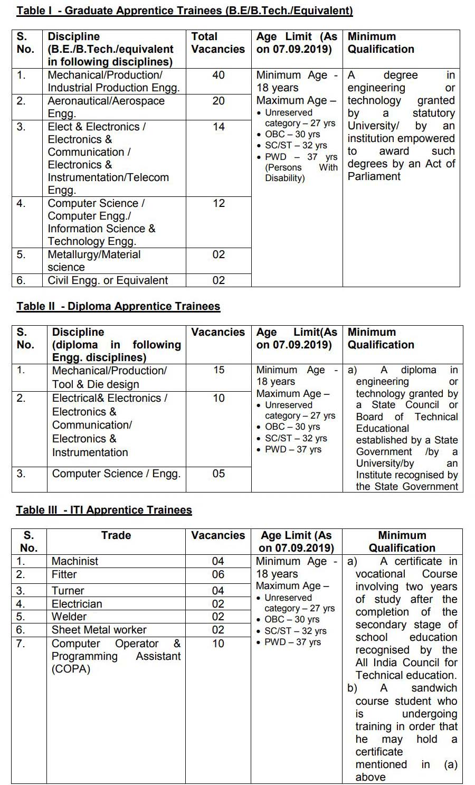

**DRDO Recruitment 2019**: Defence Research & Development Organization (DRDO) Has Recently Published **DRDO Trainee Post Recruitment Application Online Form**. Various Trainee Vacancies in Gas Turbine Research Establishment (GTRE) at Bangaluru for Eligibility Candidates in Graduate/Diploma/ITI Apprenticeship Training. Interested & Eligible Candidates Can Apply Online Form Before Date 7th September 2019. **DRDO Recruitment-GTRE Apprentice Trainee Posts Application Form** @rac.gov.in. **DRDO Recruitment Trainee Posts** Details Like Age Limits, Education Qualification, Stipend, Selection Process, Etc. Given This Page Below...

## GTRE Apprentice Trainee Various Posts Details

<table style="height: 654px; width: 84.9475%; border-collapse: collapse; border-style: double;"><tbody><tr style="height: 80px;"><td style="width: 100%; text-align: center; height: 50px;" colspan="2"><strong>Defence Research &amp; Development Organization</strong>

Gas Turbine Research Establishment

GTRE Apprentice Trainee 150 Posts</td></tr><tr style="height: 30px;"><td style="width: 100%; height: 30px; background-color: #2a5a8e; text-align: center;" colspan="2"><h3><strong>&nbsp;Important Dates</strong></h3></td></tr><tr style="height: 22px;"><td style="width: 50%; text-align: center; height: 22px;">Last date of submission of online application forms</td><td style="width: 50%; text-align: center; height: 22px;"><strong>07-09-2019</strong></td></tr><tr style="height: 22px;"><td style="width: 50%; text-align: center; height: 22px;">Publishing of shortlisted candidates for interview/written test in DRDO website</td><td style="width: 50%; text-align: center; height: 22px;">17-09-2019</td></tr><tr><td style="width: 50%; text-align: center;">Probable Date of Written test/interviews - for ITI apprenticeship</td><td style="width: 50%; text-align: center;">24-09-2019</td></tr><tr><td style="width: 50%; text-align: center;">Date of Written test/interviews - for Diploma apprenticeship</td><td style="width: 50%; text-align: center;">25-09-2019</td></tr><tr><td style="width: 50%; text-align: center;">Date of Written test/interviews - for Graduate apprenticeship</td><td style="width: 50%; text-align: center;">26-09-2019</td></tr><tr><td style="width: 50%; text-align: center;">Date of declaration of finally selected candidates – Graduate/Diploma/ITI apprenticeship (by E-mail/DRDO Website)&amp; GTRE Notice Board</td><td style="width: 50%; text-align: center;">30-09-2019</td></tr><tr><td style="width: 50%; text-align: center;">Date of joining at GTRE for Graduate/ Diploma/ITI Apprentices</td><td style="width: 50%; text-align: center;">01-10-2019 onwards</td></tr><tr style="height: 30px;"><td style="width: 100%; height: 30px; background-color: #2a5a8e; text-align: center;" colspan="2"><h3><strong>GTRE Apprentice Trainee&nbsp;Vacancy Details</strong></h3></td></tr><tr style="height: 22px;"><td style="text-align: center; height: 22px; width: 50%;">Job Recruitment Board</td><td style="text-align: center; width: 50%;"><strong>DRDO/GTRE</strong></td></tr><tr><td style="text-align: center; width: 50%;">Post Name</td><td style="text-align: center; width: 50%;">Apprentice Trainee Various Posts</td></tr><tr><td style="text-align: center; width: 50%;">No of Vacancies</td><td style="text-align: center; width: 50%;">150</td></tr><tr><td style="text-align: center; width: 50%;">Job Location</td><td style="text-align: center; width: 50%;">Bengaluru</td></tr><tr><td style="text-align: center; width: 50%;">Job State Category</td><td style="text-align: center; width: 50%;"><a href="https://freegovtjobalert.in/karnataka-govt-jobs/" target="_blank" rel="noopener noreferrer">Karnataka Govt Jobs</a></td></tr><tr><td style="text-align: center; width: 50%;">Application Mode</td><td style="text-align: center; width: 50%;">Online</td></tr><tr style="height: 30px;"><td style="width: 100%; height: 30px; background-color: #2a5a8e; text-align: center;" colspan="2"><h3><strong>GTRE Apprentice Trainee Eligibility Criteria</strong></h3></td></tr><tr style="height: 30px;"><td style="text-align: center; height: 30px; width: 100%;" colspan="2"></td></tr><tr><td style="width: 100%; background-color: #2a5a8e; text-align: center;" colspan="2"><h3><strong>Apprentice Trainee Stipend</strong></h3></td></tr><tr><td style="width: 100%; text-align: left;" colspan="2">Candidates finally selected for the apprenticeship training would be eligible for stipend as given below as per Govt. of India rules:<ul><li>B.E./B.Tech./Eqvt. : Rs.4984/-per month</li><li>Diploma: Rs.3542/-per month</li><li>ITI: 80% / 90% of the wages payable per month to the semiSkilled workmen as fixed by latest Karnataka Govt.Gazette Notification whichever is applicable.</li></ul></td></tr><tr><td style="width: 100%; background-color: #2a5a8e; text-align: center;" colspan="2"><h3><strong>GTRE Apprentice Trainee Selection Process</strong></h3></td></tr><tr><td style="width: 100%; text-align: left;" colspan="2"><ol><li>Graduate Apprentice Trainees (B.E/B.Tech./Equivalent); Diploma Apprentice Trainees/ ITI Apprentice Trainees: Depending upon the vacancies available in various disciplines, selection of candidates will be carried out by shortlisting on the basis&nbsp;of marks obtained in the qualifying exam followed by Screening test/Interview.</li><li>Details of shortlisted candidates for written test/interview will be published on the DRDO website. Candidates are advised to check regularly on the website for the exact date and time of interview/screening test.</li><li>Screening test / Interview (or) both may be conducted at GTRE, Bengaluru for Graduate/Diploma &amp; ITI apprentices as per dates announced in DRDO Website (www.drdo.gov.in) depending upon the number of applicants reporting for an interview at GTRE, Bengaluru.</li></ol></td></tr><tr style="height: 30px;"><td style="width: 100%; height: 30px; background-color: #2a5a8e; text-align: center;" colspan="2"><h3><strong>Application Fee&nbsp;</strong></h3></td></tr><tr style="height: 30px;"><td style="width: 100%; text-align: center; height: 30px;" colspan="2">None</td></tr><tr style="height: 30px;"><td style="width: 100%; height: 30px; background-color: #2a5a8e; text-align: center;" colspan="2"><h3><strong>Important Links&nbsp;</strong></h3></td></tr><tr style="height: 10px;"><td style="width: 50%; text-align: center; height: 10px;"><strong>Apply Online&nbsp;</strong></td><td style="width: 50%; text-align: center; height: 10px;"><strong><a href="https://rac.gov.in/cgibin/2019/advt_apprentice19/" target="_blank" rel="noopener noreferrer">Register</a> | <a href="https://rac.gov.in/cgibin/2019/advt_apprentice19/login.php?2d0c74813c274ea1aa68ceea5af702ed=1" target="_blank" rel="noopener noreferrer">Login</a></strong></td></tr><tr style="height: 36px;"><td style="width: 50%; text-align: center; height: 23px;"><strong>Notification</strong></td><td style="width: 50%; text-align: center; height: 23px;"><a href="https://freegovtjobalert.in/wp-content/uploads/2019/08/Notification-DRDO-GTRE-Apprentice-Trainee-Posts.pdf" target="_blank" rel="noopener noreferrer"><strong>Click Here&nbsp;</strong></a></td></tr><tr style="height: 10px;"><td style="width: 50%; text-align: center; height: 10px;"><strong>&nbsp;Official Website</strong></td><td style="width: 50%; text-align: center; height: 10px;"><a href="https://rac.gov.in" target="_blank" rel="noopener noreferrer"><strong>Click Here</strong></a></td></tr></tbody></table>

### How To Fill DRDO Apprentice Trainee Online Form 2019

1. First Eligible Candidates Goto: [https://rac.gov.in](https://rac.gov.in)
2. Find and Click on [**ADE, Bengaluru, and GTRE, Bengaluru invites applications from eligible candidates for Graduate / Diploma / ITI apprenticeship training.**](https://rac.gov.in/cgibin/2019/advt_apprentice19/)
3. Register your self With your Details(If You Have already Register then [login](https://rac.gov.in/cgibin/2019/advt_apprentice19/login.php?2d0c74813c274ea1aa68ceea5af702ed=1) with your Email & Password)
4. Then Fillup Your Biodata
5. Then Upload Your Documents.
6. Then Submit Application Form.
7. Done

> For More Govt Jobs: [FreeGovtJobAlert.in](https://freegovtjobalert.in)
