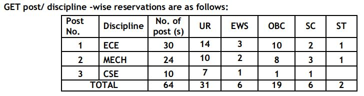
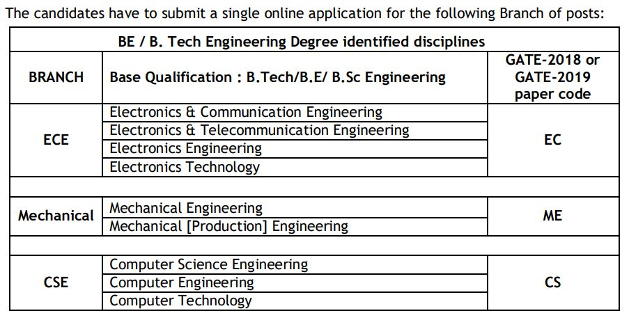

ECIL Recruitment 2019: Electronics Corporation of India Limited has Released Notification for Recruitment of Graduate Engineer Trainee Posts through Gate-2018 & 2019 Score. ECIL has openings for dynamic and result-oriented young engineers with post-training placements at ECIL Headquarters in Hyderabad or in any of Zonal/Branch/Site Offices located across India. The areas include Design & Development, Projects, Marketing, Production, QA and Field of Engineering. As Per ECIL Recruitment 2019 Notification A Total Of 64 Vacancies Are There. ECIL Graduate Engineer Trainee Online Form 2019 has Start on 06-12-2019.

## **ECIL Graduate Engineer Trainee 2019**

<table style="border-collapse: collapse; width: 100%;"><tbody><tr><td style="width: 50%; background-color: #2a5a8e; text-align: center;" colspan="2"><h3><strong>ECIL Recruitment 2019</strong></h3></td></tr><tr><td style="width: 50%; text-align: center;">Job Recruitment Board</td><td style="width: 50%; text-align: center;">Electronics Corporation of India Limited</td></tr><tr><td style="width: 50%; text-align: center;">Notification No.</td><td style="width: 50%; text-align: center;">Advt. No.20/2019</td></tr><tr><td style="width: 50%; text-align: center;">Post</td><td style="width: 50%; text-align: center;">Graduate Engineer Trainee</td></tr><tr><td style="width: 50%; text-align: center;">Vacancies</td><td style="width: 50%; text-align: center;">64</td></tr><tr><td style="width: 50%; text-align: center;">Job Location</td><td style="width: 50%; text-align: center;">Hyderabad</td></tr><tr><td style="width: 50%; text-align: center;">Job Type</td><td style="width: 50%; text-align: center;">Engineering Jobs</td></tr><tr><td style="width: 50%; text-align: center;">Application Mode</td><td style="width: 50%; text-align: center;">Online</td></tr></tbody></table>

ECIL Hyderabad Recruitment 2019 Notification And Apply Online Link Available on his Official Website. The Candidates Must Have Complete Engineering Degree. Applicants Should Have Age Between 18 to 25 Years. Selected candidates may be posted anywhere in India. Interested & Eligible Candidates Fill up ECIL Graduate Engineer Trainee Application Form 2019 Before 04-01-2020.

<table style="border-collapse: collapse;"><tbody><tr><td style="width: 50%; background-color: #2a5a8e; text-align: center;" colspan="2"><h3><strong>Important Dates</strong></h3></td></tr><tr><td style="width: 50%; text-align: center;">Starting Date of Online Application</td><td style="width: 50%; text-align: center;">06-12-2019</td></tr><tr><td style="width: 50%; text-align: center;">Last Date of Online Application</td><td style="width: 50%; text-align: center;">04-01-2020</td></tr></tbody></table>

ecil.co.in recruitment 2019 Notification Details Like Education Qualification, Age Limits, Stipend, Bond, Selection Process, Application Fee, How to Apply, Etc. Given Below.

### **ECIL Vacancy 2019 Details**

- ECIL Graduate Engineer Trainee Posts: 64 Posts

### **ECIL Recruitment 2019- Eligibility Criteria**

Age Limits

- Maximum 25 Years

Education Qualification

- First Class Engineering Degree with minimum 65% marks in aggregate (Second Class with 55% for SC/STs) from AICTE approved Colleges / Recognized Indian Universities in the relevant discipline.

### **ECIL Graduate Engineer Trainee Stipend**

- The selected candidates will undergo training for a period of one year on a consolidated stipend of **Rs.48,160/-** per month during the Training Period. They are also entitled to Provident Fund and leave etc., as per rules of the Company.
- On successful completion of training, they will be appointed as Engineer for a period of three years with total emoluments of Rs.67,920/-p.m., during **1st year, Rs.69,960/-p.m**., during **2nd year & Rs.72,060/-p.m**., during 3rd year (for all Metros) which includes DA, HRA and fringe benefits under Cafeteria approach.
- Subsequently, they will be absorbed as Technical Officer in the scale of pay of Rs.40,000-3%-140,000/-(with DA, HRA & Fringe benefits under the Cafeteria approach) subject to satisfactory performance. Further, on completion of one year of service as Technical Officer, they will be considered for promotion to the post of Senior Technical Officer, in the scale of pay of Rs. 50,000-3%- 1,60,000/- depending on their performance and suitability.

### **Selection Process For ECIL Graduate Engineer Trainee**

1. GATE 2018 & GATE 2019 Score
2. Personal Interview

### **ECIL Graduate Engineer Trainee Application Fee**

- General/OBC Candidates: Rs. 500/-
- SC/ST/PWD Candidates: No Fee
- Payment Mode: Online/ Offline

### **How to Apply For ECIL Graduate Engineer Trainee**

- Eligible candidates have to apply ‘ON-LINE’ through the ECIL website “http://careers.ecil.co.in”. The on-line application process will be operational from 06.12.2019 (14:00 hrs.) to 04.01.2020 (16:00 hrs.).
- After applying on-line, the candidate is required to take the print out of registered on-line application form with system generated application serial number.
- Please note down your application serial number for the post applied, for future reference without fail.
- The candidate can take a re-print of his/her registered on-line application form before the last date for On-line registration.
- Write the system generated on-line application serial number on the Application Fee receipt for future reference.

### **ECIL Graduate Engineer Trainee Important Links**

- ECIL Graduate Engineer Trainee Online Form 2019: [Click Here](http://careers.ecil.co.in/login.php)
- Download ECIL Graduate Engineer Trainee Notification 2019 PDF: [Click Here](https://freegovtjobalert.in/wp-content/uploads/2019/12/ECIL-64-Graduate-Engineer-Trainee-Notification-2019.pdf)
- ECIL Official Website: [Click Here](http://www.ecil.co.in/)

Candidates can visit http://ecil.co.in to get more details about ECIL Graduate Engineer Trainee 2019. To More Information About ECIL upcoming vacancies 2020, latest Updates, Admit Card, Syllabus, Result, Etc. It will be published on the official website. Also, visit Regularly our website [www.freegovtjobalert.in](https://freegovtjobalert.in) for getting the Latest job Updates.
