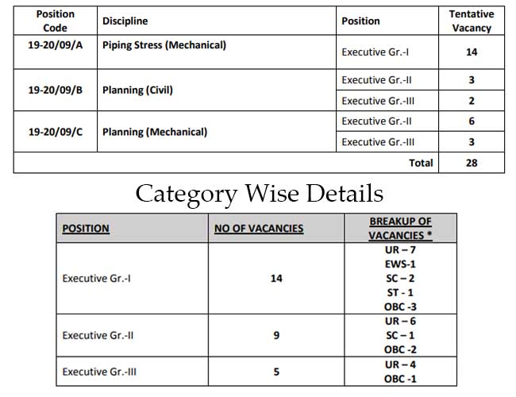

**EIL Full-Form - Engineers India Limited**

**EIL Recruitment 2019**: Engineers India Limited has published a notification for Dynamic Professionals Candidates who Complet his Engineering and Have work Experience. as per **eil recruitment 2019 notification** Total 28 Vacancies In Eil Company. Eligible & Interested Candidates for eil recruitment can apply online Before 23-09-2019. To know About **Eil Vacancy Details** Like **eil eligibility criteria**, Education Qualification, Age limits, Experience, **eil Salary,** How to Apply, Etc. Given In this Page Below.

## EIL Recruitment 2019 Apply Online 28 Engineers Vacancies

<table style="height: 654px; width: 84.9475%; border-collapse: collapse; border-style: double;"><tbody><tr style="height: 80px;"><td style="width: 100%; text-align: center; height: 50px;" colspan="2"><strong>Engineers India Limited</strong>

EIL Recruitment 2019

28 Vacancies</td></tr><tr style="height: 30px;"><td style="width: 100%; height: 30px; background-color: #2a5a8e; text-align: center;" colspan="2"><h3><strong>&nbsp;Important Dates</strong></h3></td></tr><tr style="height: 22px;"><td style="width: 50%; text-align: center; height: 22px;">Start Date of Application</td><td style="width: 50%; text-align: center; height: 22px;"><strong>06-09-2019</strong></td></tr><tr style="height: 22px;"><td style="width: 50%; text-align: center; height: 22px;">Last Date of Application</td><td style="width: 50%; text-align: center; height: 22px;"><strong>23-09-2019</strong></td></tr><tr style="height: 30px;"><td style="width: 100%; height: 30px; background-color: #2a5a8e; text-align: center;" colspan="2"><h3><strong>&nbsp;Vacancy Details</strong></h3></td></tr><tr style="height: 22px;"><td style="text-align: center; height: 22px; width: 50%;">Job Recruitment Board</td><td style="text-align: center; width: 50%;">Engineers India Limited</td></tr><tr><td style="text-align: center; width: 50%;">Post Name</td><td style="text-align: center; width: 50%;">Various Posts</td></tr><tr><td style="text-align: center; width: 50%;">No of Vacancies</td><td style="text-align: center; width: 50%;">28 Posts</td></tr><tr><td style="text-align: center; width: 50%;">Job Category</td><td style="text-align: center; width: 50%;">Engineering Jobs</td></tr><tr><td style="text-align: center; width: 50%;">Job Location</td><td style="text-align: center; width: 50%;">New Delhi or Across India</td></tr><tr><td style="text-align: center; width: 50%;">Application Mode</td><td style="text-align: center; width: 50%;">Online</td></tr><tr><td style="text-align: center; width: 50%;" colspan="2"></td></tr><tr style="height: 30px;"><td style="width: 100%; height: 30px; background-color: #2a5a8e; text-align: center;" colspan="2"><h3><strong>Eligibility Criteria&nbsp;</strong></h3></td></tr><tr style="height: 30px;"><td style="text-align: center; height: 30px;" colspan="2"><table style="border-collapse: collapse; width: 100%; height: 366px;"><tbody><tr style="height: 25px;"><td style="width: 25%; height: 25px;"><strong>Post</strong></td><td style="width: 25%; height: 25px;"><strong>Education</strong></td><td style="width: 25%; height: 25px;"><strong>Age Limits</strong></td><td style="width: 25%; height: 25px;"><strong>Experience</strong></td></tr><tr style="height: 100px;"><td style="width: 25%; height: 100px;">Executive Gr.I - Piping Stress (Mechanical)</td><td style="width: 25%; height: 100px;">BE/ B. Tech/ B.Sc. (Engg.) in Mechanical discipline with minimum 60% marks</td><td style="width: 25%; height: 100px;">37 Years</td><td style="width: 25%; height: 100px;">4 Years</td></tr><tr style="height: 54px;"><td style="width: 25%; height: 54px;">Executive Gr.II - Planning (Civil)</td><td style="width: 25%; height: 108px;" rowspan="2">BE/ B. Tech/ B.Sc. (Engg.) in Civil discipline with minimum 60% marks</td><td style="width: 25%; height: 54px;">41Years</td><td style="width: 25%; height: 54px;">8 Years</td></tr><tr style="height: 54px;"><td style="width: 25%; height: 54px;">Executive Gr.III - Planning (Civil)</td><td style="width: 25%; height: 54px;">45 Years</td><td style="width: 25%; height: 54px;">12 Years</td></tr><tr style="height: 66px;"><td style="width: 25%; height: 66px;">Executive Gr.II - Planning (Mechanical)</td><td style="width: 25%; height: 133px;" rowspan="2">BE/ B. Tech/ B.Sc. (Engg.) in Mechanical discipline with minimum 60% marks</td><td style="width: 25%; height: 66px;">41 Years</td><td style="width: 25%; height: 66px;">8 Years</td></tr><tr style="height: 67px;"><td style="width: 25%; height: 67px;">Executive Gr. III - Planning (Mechanical)</td><td style="width: 25%; height: 67px;">45 Years</td><td style="width: 25%; height: 67px;">12 Years</td></tr></tbody></table></td></tr><tr><td style="background-color: #2a5a8e; text-align: center;" colspan="2"><h3><strong>Eil Salary</strong></h3></td></tr><tr><td style="text-align: center;" colspan="2"><ul><li style="text-align: left;">Executive Gr.-I(Mechanical)&nbsp; -&nbsp; Rs. 72000 to Rs. 80000</li><li style="text-align: left;">Executive Gr.-II(Civil)(Mechanical)&nbsp; -&nbsp; Rs. 86400 to Rs. 96000</li><li style="text-align: left;">Executive Gr.-III(Civil)(Mechanical)&nbsp; -&nbsp; Rs. 100800 to Rs. 112000</li></ul></td></tr><tr><td style="background-color: #2a5a8e; text-align: center;" colspan="2"><strong>Mode of Selection</strong></td></tr><tr><td style="width: 50%; text-align: center;" colspan="2">The mode of selection for all the positions will be through Interview, preferably at Delhi.</td></tr><tr style="height: 30px;"><td style="width: 100%; height: 30px; background-color: #2a5a8e; text-align: center;" colspan="2"><h3><strong>Application Fee&nbsp;</strong></h3></td></tr><tr style="height: 30px;"><td style="width: 100%; text-align: center; height: 30px;" colspan="2">None</td></tr><tr style="height: 30px;"><td style="width: 100%; height: 30px; background-color: #2a5a8e; text-align: center;" colspan="2"><h3><strong>Important Links&nbsp;</strong></h3></td></tr><tr style="height: 10px;"><td style="width: 50%; text-align: center; height: 10px;"><strong>Apply Online&nbsp;</strong></td><td style="width: 50%; text-align: center; height: 10px;"><a style="color: #ff0000;" href="http://recruitment.eil.co.in/" target="_blank" rel="noopener noreferrer"><strong>Click Here</strong></a></td></tr><tr style="height: 36px;"><td style="width: 50%; text-align: center; height: 23px;"><strong>Notification</strong></td><td style="width: 50%; text-align: center; height: 23px;"><a style="color: #ff0000;" href="https://freegovtjobalert.in/wp-content/uploads/2019/09/eil-recruitment-2019-notification.pdf" target="_blank" rel="noopener noreferrer"><strong>Click Here</strong></a></td></tr><tr style="height: 10px;"><td style="width: 50%; text-align: center; height: 10px;"><strong>&nbsp;Official Website</strong></td><td style="width: 50%; text-align: center; height: 10px;"><a style="color: #ff0000;" href="https://engineersindia.com/" target="_blank" rel="noopener noreferrer"><strong>Click Here</strong></a></td></tr></tbody></table>

### How to Apply For EIL Recruitment Executive Engineers Vacancy?

1. Eligible candidates need to apply through the on-line registration system on EIL website. To apply to visit the career link in EIL website i.e. [www.engineersindia.com](http://www.engineersindia.com)
2. Read CAREFULLY all the instructions given on the website.
3. Fill in the online form with all the relevant correct details.
4. The candidate before starting online registration should keep the properly scanned copies (readable form), of the following documents/certificates ready for uploading during the registration of application: a) Latest Passport size color photograph in .jpg/.jpeg format of not more than 75 KB size b) Signature in .jpg/.jpeg format of not more than 25 KB size c) All qualifying degree certificates, all years/semester mark sheets and experience certificates of not more than 900 KB each in .jpg/.jpeg/.pdf format d) Disability certificate (PwD), if applicable, of not more than 500 KB each in .jpg/.jpeg/.pdf format e) Caste certificate (SC/ST/OBC Non-Creamy Layer), EWS (Economically weaker section) certificate, if applicable, of not more than 500 KB each in .jpg/.jpeg/.pdf format
5. The candidates are not required to send the print out of the registered application form filled online.
6. They need to retain a copy of the printout of the application form which will be required at the time of Personal Interview if shortlisted for.
7. Done.

> More Govt Job: [www.freegovtjobalert.in](https://freegovtjobalert.in)
