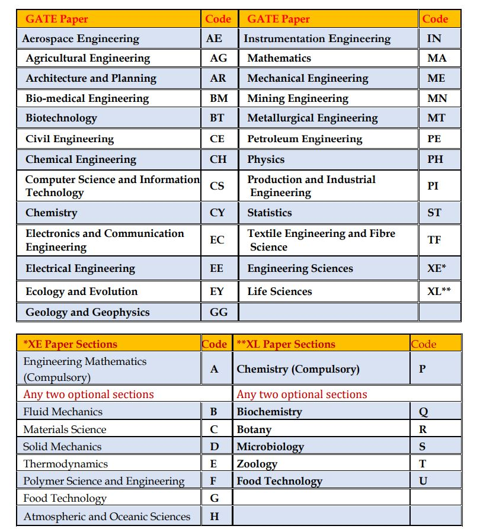

<table style="border-collapse: collapse; width: 44.254%; height: 45px;"><tbody><tr><td style="width: 100%; background-color: #2a5a8e;"><h2 style="text-align: center;"><strong>GATE 2020 Exam Full Details</strong></h2></td></tr></tbody></table>

### **GATE Full Form-About GATE**

GATE Full Form-Graduate Aptitude Test in Engineering (GATE) is basically an examination of the comprehensive understanding of the candidates in various undergraduate subjects in Engineering/Technology/Architecture and post-graduate level subjects in Science. GATE 2020 will be conducted for 25 subjects (also referred to as “papers”) and it would be distributed over 1st, 2nd, 8th & 9th of February 2020. The GATE examination centers are spread in different cities across India, as well as, in six cities outside India. The examination would be purely a Computer Based Test (CBT).

The GATE score would reflect the relative performance level of the candidate in a particular subject, which is quantified based on the several years of examination data. Note that the GATE 2020 score is valid for THREE YEARS from the date of the announcement of the results.

### **About GATE 2020**

- IIT Delhi is the organizing institute for GATE 2020.
- Information website for GATE 2020 is http://gate.iitd.ac.in
- GATE 2020 will be conducted on 25 subjects (also referred to as “papers”).
- Examination for all the 25 subjects (papers) will be conducted as an ONLINE Computer Based Test (CBT).
- The online examination paper will contain some questions for which numerical answers must be keyed in by the candidate using a virtual keypad. The rest of the questions will be of Multiple Choice Question (MCQ) types. The Candidates will use ONLY an on-screen virtual calculator provided for the examination.
- A candidate can appear only in ANY ONE paper of the GATE examination.
- GATE 2020 examinations will be held during the forenoon and afternoon sessions on 1st, 2nd, 8th& 9th of February 2020.
- Examination for some of the papers in GATE 2020 may be held in multiple sessions. However, a candidate can appear for the examination in one session ONLY.
- Exact details of the complete examination schedule will be notified later on the GATE 2020 website.
- Candidates have to register and fill the application via ONLINE mode ONLY at GATE Online Application Processing System (GOAPS). The link will be made available on GATE 2020 website http://appsgate.iitd.ac.in.
- The entire process of filling up of the application form and uploading of certificates/documents etc. is in online mode only. The candidates should not send any hard copy of his/her application form/documents etc. to IIT Delhi or any of the zonal GATE offices.
- The payment of application fees is through electronic mode.
- GATE 2020 Admit Card would be available only on the GOAPS website. Candidates can download their Admit Card from the GOAPS website. No printed copy of the Admit Cards will be posted to the candidates.
- The candidate has to appear at the GATE Examination Centre on the date and time specified in the Admit Card.

### **GATE 2020 Important Dates**

<table style="border-collapse: collapse; width: 71.3656%; height: 293px;"><tbody><tr><td style="width: 81.9017%; text-align: center;">GATE Online Application Processing System (GOAPS) Website Opens</td><td style="width: 18.0983%; text-align: center;"><strong>03-09-2019</strong></td></tr><tr><td style="width: 81.9017%; text-align: center;">Closing Date for Submission of (Online) Application (through Website)</td><td style="width: 18.0983%; text-align: center;"><strong>24-09-2019</strong></td></tr><tr><td style="width: 81.9017%; text-align: center;">Extended Closing Date for Submission of (Online) Application (through Website)</td><td style="width: 18.0983%; text-align: center;"><strong>01-10-2019</strong></td></tr><tr><td style="width: 81.9017%; text-align: center;">Last Date for Requesting Change of Examination City (an additional fee will be applicable)</td><td style="width: 18.0983%; text-align: center;"><strong>15-11-2019</strong></td></tr><tr><td style="width: 81.9017%; text-align: center;">Admit Card will be available in the Online Application Portal</td><td style="width: 18.0983%; text-align: center;"><strong>03-01-2020</strong></td></tr><tr><td style="width: 81.9017%; text-align: center;">GATE 2020 Examination Forenoon: 9:30 AM to 12:30 PM (Tentative) Afternoon: 2:30 PM to 5:30 PM (Tentative)</td><td style="width: 18.0983%; text-align: center;"><strong>1/2/8/9/-02-2020</strong></td></tr><tr><td style="width: 81.9017%; text-align: center;">Announcement of the Results in the Online Application Portal</td><td style="width: 18.0983%; text-align: center;"><strong>16-03-2020</strong></td></tr></tbody></table>

### **GATE 2020 Eligibility Criteria**

Interested Candidates, please Check Eligible Criteria Before Start Application Fillup Processes :

<table style="height: 883px; width: 100%; border-collapse: collapse;"><tbody><tr style="height: 33px;"><td style="width: 11.137%; text-align: center; height: 33px;"><strong>Qualifying Degree</strong></td><td style="width: 44.2892%; text-align: center; height: 33px;"><strong>Qualifying Degree/Examination</strong></td><td style="width: 16.904%; text-align: center; height: 33px;"><strong>Description of Eligible Candidates</strong></td><td style="width: 11.7717%; text-align: center; height: 33px;"><strong>Year of Qualification not later than</strong></td></tr><tr style="height: 100px;"><td style="width: 11.137%; text-align: center; height: 100px;">B.E./B.Tech./B.Pharm.</td><td style="width: 44.2892%; text-align: center; height: 100px;">Bachelor’s degree holders in Engineering/Technology (4 years after 10+2 or 3 years after B.Sc./Diploma in Engineering/Technology)</td><td style="width: 16.904%; text-align: center; height: 100px;">Currently in the final year or already completed</td><td style="width: 11.7717%; text-align: center; height: 100px;">2020</td></tr><tr style="height: 100px;"><td style="width: 11.137%; text-align: center; height: 100px;">B. Arch.</td><td style="width: 44.2892%; text-align: center; height: 100px;">Bachelor’s degree holders of Architecture (5 years course)/Naval Architecture (4 years course)/Planning (4 years course)</td><td style="width: 16.904%; text-align: center; height: 100px;">Currently in the final year or already completed</td><td style="width: 11.7717%; text-align: center; height: 100px;">2020</td></tr><tr style="height: 100px;"><td style="width: 11.137%; text-align: center; height: 100px;">B.Sc. (Research)/B.S.</td><td style="width: 44.2892%; text-align: center; height: 100px;">Bachelor’s degree in Science (Post-Diploma/4 years after 10+2)</td><td style="width: 16.904%; text-align: center; height: 100px;">Currently in the 4th year or already completed</td><td style="width: 11.7717%; text-align: center; height: 100px;">2020</td></tr><tr style="height: 100px;"><td style="width: 11.137%; text-align: center; height: 100px;">M. Sc./M.A./MCA or equivalent</td><td style="width: 44.2892%; text-align: center; height: 100px;">Master’s degree in any branch of Science/Mathematics/Statistics/Computer Applications or equivalent</td><td style="width: 16.904%; text-align: center; height: 100px;">Currently in the final year or already completed</td><td style="width: 11.7717%; text-align: center; height: 100px;">2020</td></tr><tr style="height: 100px;"><td style="width: 11.137%; text-align: center; height: 100px;">Int. M.E./M.Tech. (Post-B.Sc.)</td><td style="width: 44.2892%; text-align: center; height: 100px;">Post-BSc Integrated Master’s degree programs in Engineering/ Technology (4 years program)</td><td style="width: 16.904%; text-align: center; height: 100px;">Currently in the 2nd/3rd/4th year or already completed</td><td style="width: 11.7717%; text-align: center; height: 100px;">2022</td></tr><tr style="height: 100px;"><td style="width: 11.137%; text-align: center; height: 100px;">Int. M.E./M.Tech. or Dual Degree(after Diploma or 10+2)</td><td style="width: 44.2892%; text-align: center; height: 100px;">Integrated Master’s degree program or Dual Degree program in Engineering/Technology (5 years program)</td><td style="width: 16.904%; text-align: center; height: 100px;">Currently in the 4th/5th year or already completed</td><td style="width: 11.7717%; text-align: center; height: 100px;">2021</td></tr><tr style="height: 100px;"><td style="width: 11.137%; text-align: center; height: 100px;">Int. M.Sc./Int. B.S.-M.S.</td><td style="width: 44.2892%; text-align: center; height: 100px;">Integrated M.Sc. or 5 years integrated B.S.-M.S. program</td><td style="width: 16.904%; text-align: center; height: 100px;">Currently in the final year or already completed</td><td style="width: 11.7717%; text-align: center; height: 100px;">2020</td></tr><tr style="height: 150px;"><td style="width: 11.137%; text-align: center; height: 150px;">Professional Society Examinations (equivalent to B.E./B.Tech./B.Arch.)</td><td style="width: 44.2892%; text-align: center; height: 150px;">B.E./B.Tech./B.Arch. equivalent examinations of Professional Societies, recognized by MHRD/UPSC/AICTE (e.g., AMIE by Institution of Engineers-India, AMICE by the Institute of Civil Engineers-India and so on)</td><td style="width: 16.904%; text-align: center; height: 150px;">Completed Section A or Equivalent of such professional courses</td><td style="width: 11.7717%; text-align: center; height: 150px;">NA</td></tr></tbody></table>

- **Age Limits Criteria:** There is no age limit for GATE, candidates from any age group can apply for the exam.
- **Eligibility Documents:** the candidate has already passed (in 2019 or earlier) one of the qualifying examinations, he/she has to submit (i.e. upload) the degree certificate/provisional certificate/course completion certificate/professional certificate/membership certificate issued by the institute or society.
- Eligibility Document, as applicable, has to be uploaded only while filling the online application and NOT to be sent by post.

### **GATE 2020 Application Fee**

<table style="border-collapse: collapse; width: 84.9119%; height: 295px;"><tbody><tr><td style="width: 46.6926%; text-align: center;"><strong>Examination Centres in India</strong></td><td style="width: 26.8482%; text-align: center;"><strong>On or Before 24-09-2019</strong></td><td style="width: 26.4591%; text-align: center;"><strong>During the Extended Period</strong></td></tr><tr><td style="width: 46.6926%; text-align: center;">Female candidates</td><td style="width: 26.8482%; text-align: center;">Rs. 750/-</td><td style="width: 26.4591%; text-align: center;">Rs. 1250/-</td></tr><tr><td style="width: 46.6926%; text-align: center;">SC/ST/PwD* category candidates</td><td style="width: 26.8482%; text-align: center;">Rs. 750/-</td><td style="width: 26.4591%; text-align: center;">Rs. 1250/-</td></tr><tr><td style="width: 46.6926%; text-align: center;">All other candidates</td><td style="width: 26.8482%; text-align: center;">Rs. 1500/-</td><td style="width: 26.4591%; text-align: center;">Rs. 2000/-</td></tr><tr><td style="width: 46.6926%; text-align: center;"><strong>Examination Centres outside India (All Candidates)</strong></td><td style="width: 26.8482%; text-align: center;"></td><td style="width: 26.4591%; text-align: center;"></td></tr><tr><td style="width: 46.6926%; text-align: center;">Addis Ababa, Colombo, Dhaka, and Kathmandu</td><td style="width: 26.8482%; text-align: center;">US$ 50</td><td style="width: 26.4591%; text-align: center;">US$ 70</td></tr><tr><td style="width: 46.6926%; text-align: center;">Dubai and Singapore</td><td style="width: 26.8482%; text-align: center;">US$ 100</td><td style="width: 26.4591%; text-align: center;">US$ 120</td></tr></tbody></table>

- The application fee is NEITHER refundable NOR transferable.
- Payments have to be made online by using either net banking or debit card or credit card. As per the prevailing norms, additional online transaction charges or bank charges can be applied.
- These charges will be specified on the payment portal.
- The application fee mentioned above DOES NOT INCLUDE service charges, processing fees and any other charges that the banks may levy.
- \*PwD means Persons with Disability.

### **GATE 2020 Registration/GOAPS Registration**

A candidate must first register by providing Full Name (as per the qualifying degree certificate), a valid e-mail address, mobile number and by choosing a password. All communications from the GATE Offices will be sent to this e-mail address (ONLY ONE PERSON CAN REGISTER WITH ONE e-mail ADDRESS). Give the personal mobile number and e-mail address, because most of the communication will be through e-mail and/or SMS.

**GOAPS Enrollment ID**: Each GOAPS registered candidate will be provided with an Enrollment ID. Upon registration, an e-mail containing the GOAPS Enrollment ID will be sent to the candidate. This Enrollment ID will be the reference ID for all future communication.

**GOAPS Password**: The candidate has to choose a password during Enrollment at GOAPS. This password must be remembered along with the GOAPS Enrollment ID to login to GOAPS. It is strongly recommended to choose a password that cannot be guessed easily (it should not be the candidate’s name, date of birth, or some easily guessable string of numbers or letters like 12345 or abcd). Keep your password information safe, secure and confidential.

### **GATE 2020 Application Fillup Process**

1. Candidates First Goto: [http://appsgate.iitd.ac.in/](http://appsgate.iitd.ac.in/)
2. Login With Your Enrollment ID / Email Address & Password. (If You Don't Have Enrollment ID Then First Complet GOAPS Registration Processes)
3. For GATE 2020, all information related to the application process will be available on the GOAPS website. The photograph, signature, certificate of qualifying degree, category certificate (SC/ST/PwD) and/or Dyslexic certificate, wherever applicable, must be uploaded during the online application.
4. Candidates must enter the ID number specified in any one of the following IDs: Passport, PAN Card, Voter ID, Aadhaar-UID, College ID, Employee ID, and Driving License.

### **GATE 2020 Application Form Details**

1. Personal information (name, date of birth, personal mobile number, parents’ name, parents’ mobile number, etc.). Please note that the name of the candidate in the application form must exactly be the same as that in the qualifying degree certificate or the certificate issued by the Head of the Department/Institute in which the candidate is pursuing his/her study. GATE 2020 scorecard will be issued as per the name entered in the application form. Prefix/title such as Mr/Shri/Dr/Mrs/Smt, etc. should NOT be used before a name.
2. Address for Communication (including PIN code)
3. Eligibility degree details.
4. College name and address with PIN code.
5. GATE paper (subject)
6. Choice of GATE examination cities.
7. A high-quality image of the candidate’s photograph conforming to the requirements specified
8. Good quality image of candidate’s signature conforming to the requirements specified
9. Scanned copy of the Eligibility Certificate in pdf format (Degree Certificate or Provisional Certificate or Certificate from the Head of the Department/Institute.
10. Scanned copy of Category (SC/ST) certificate (if applicable) in pdf format
11. Scanned copy of PwD Certificate (if applicable) in pdf format
12. Scanned copy of Dyslexic Certificate (if applicable) in pdf format
13. Details of the valid Identity Document (ID)(The same ID, in original, should be carried to the examination hall)
14. Net-banking/debit card/credit card details for fee payment.

### **GATE 2020 Papers**

GATE 2020 will be conducted on 25 subjects (papers). A candidate is allowed to appear in ONLY ONE paper in any ONE SESSION. Paper Name And paper codes Are Given in below Table for GATE 2020 Exam.

### **GATE 2020 Examination Cities**

Choice of Examination City: The candidate can choose THREE cities from the list of examination cities given in Table Below. The first and second choices must be from the same GATE zone and the third choice can be from any GATE zone.

<table style="height: 1003px; width: 100%; border-collapse: collapse;"><tbody><tr><td style="width: 35.4785%; text-align: center;"><strong>Zonal GATE Office</strong></td><td style="width: 64.5215%; text-align: center;"><strong>Tentative List of Examination Cities/Towns*</strong></td></tr><tr><td style="width: 35.4785%; text-align: center;">IISc Bangalore Bengaluru - 560 012 Website: http://gate.iisc.ac.in</td><td style="width: 64.5215%; text-align: center;">Ananthapuramu, Angamaly, Bagalkot, Belagavi (Belgaum), Ballari(Bellary), Bengaluru South, Bengaluru North, Bidar, Chikkamagaluru, Davanagere, Kalaburagi (Gulbarga), Hassan, Hubballi (Hubli), Hyderabad, Kannur, Kasaragod, Kolar, Kozhikode, Kurnool, Malappuram, Mangaluru, Manipal, Mysuru (Mysore), Palakkad, Payyanur, Port Blair, Shivamogga (Shimoga), Thrissur, Tumakuru, Vatakara</td></tr><tr><td style="width: 35.4785%; text-align: center;">IIT Bombay, Powai, Mumbai - 400 076 Website: http://gate.iitb.ac.in</td><td style="width: 64.5215%; text-align: center;">Ahmedabad, Ahmednagar, Amravati, Anand, Aurangabad, Baramati, Bhavnagar, Bhuj, Gandhinagar, Goa, Jalgaon, Kolhapur, Mehsana, Mumbai-Navi Mumbai-Thane, Nagpur, Nanded, Nashik, Pune, Rajkot, Ratnagiri, Sangli, Satara, Solapur, Surat, Vadodara</td></tr><tr><td style="width: 35.4785%; text-align: center;">IIT Delhi, Hauz Khas, New Delhi – 110 016 Website: http://gate.iitd.ac.in</td><td style="width: 64.5215%; text-align: center;">Ajmer, Alwar, Bikaner, Faridabad-Palwal, Greater NOIDA, Gurugram, Hisar, Indore, Jaipur, Jammu-Samba, Jodhpur, Karnal, Kota, Mathura, New Delhi, Rohtak, Srinagar, Sikar, Udaipur, Ujjain</td></tr><tr><td style="width: 35.4785%; text-align: center;">IIT Guwahati, Guwahati – 781 039 Website: http://iitg.ac.in/gate-jam</td><td style="width: 64.5215%; text-align: center;">Agartala, Aizawl, Asansol-Durgapur, Bokaro Steel City, Burdwan, Dhanbad, Dibrugarh, Dimapur, Gangtok, Guwahati, Imphal, Itanagar, Jorhat, Kalyani, Muzaffarpur, Patna, Purnea, Shillong, Silchar, Siliguri, Tezpur</td></tr><tr><td style="width: 35.4785%; text-align: center;">IIT Kanpur, Kanpur – 208 016 Website: http://gate.iitk.ac.in</td><td style="width: 64.5215%; text-align: center;">Agra, Aligarh, Allahabad, Bareilly, Bhopal, Gorakhpur, Gwalior, Jabalpur, Kanpur, Lucknow, Varanasi</td></tr><tr><td style="width: 35.4785%; text-align: center;">IIT Kharagpur, Kharagpur – 721 302 Website: http://gate.iitkgp.ac.in</td><td style="width: 64.5215%; text-align: center;">Balasore, Berhampur (Odisha), Bhilai, Bhubaneswar, Bilaspur(CG), Cuttack, Eluru, Hooghly (WB), Jamshedpur, Kakinada (AP), Kharagpur, Kolkata, Raipur, Rajamahendravaram (Rajahmundry), Ranchi, Rourkela, Sambalpur, Srikakulam, Vizianagaram, Tadepalligudem, Vijayawada, Visakhapatnam</td></tr><tr><td style="width: 35.4785%; text-align: center;">IIT Madras, Chennai – 600 036 Website: http://gate.iitm.ac.in</td><td style="width: 64.5215%; text-align: center;">Alappuzha, Aluva-Ernakulam, Attingal, Chengannur, Chennai South,Chennai West, Chirala, Chittoor, Coimbatore, Cuddalore, Dindigul,Gudur, Guntur, ldukki, Kadapa, Kanjirapally, Kanyakumari-Nagercoil,Karimnagar, Khammam, Kodad, Kollam, Kothamangalam, Kottayam,Madurai, Muvattupuzha, Namakkal, Nellore, Ongole, Pala, Puducherry,Salem, Thanjavur, Thiruvananthapuram, Thoothukudi, Tiruchirapalli,Tirunelveli, Tirupati, Vellore, Villupuram, Virudhunagar, Warangal</td></tr><tr><td style="width: 35.4785%; text-align: center;">IIT Roorkee, Roorkee – 247 667 Website: http://gate.iitr.ac.in</td><td style="width: 64.5215%; text-align: center;">Ambala, Amritsar, Bathinda, Dehradun, Ghaziabad, Haldwani,Hamirpur-Una (HP), Jalandhar, Kurukshetra, Ludhiana, Meerut, MohaliChandigarh, Moradabad,NOIDA, Panipat, Pathankot, Patiala-Sangrur,Roorkee, Shimla-Solan, Sonepat, Yamunanagar</td></tr><tr><td style="width: 35.4785%; text-align: center;">International GATE, IIT Delhi</td><td style="width: 64.5215%; text-align: center;">Addis Ababa (Ethiopia), Colombo (Sri Lanka), Dhaka (Bangladesh), Dubai(UAE), Kathmandu (Nepal), Singapore</td></tr></tbody></table>

### **GATE 2020 Admit Card**

- A candidate has Download Admit Card From the GOAPS website. The Admit Card Would Be Available For Download From 03-01-2020 only on GOAPS Official Website.
- Candidates must bring a print-out of the downloaded Admit Card to the Examination for the verification along with the original and valid photo Identity Document (NO photocopy/scanned copy/NOT an expired document), which was specified during the filling up of the online application.
- The Admit Card is valid if and ONLY if the candidate's photograph and signature images are clear and legible.
- The photograph on the Admit Card and that in the valid photo identity document should match with the appearance of the candidate on the day of examination. To ensure this, print the Admit Card on an A4 sized paper using a laser printer, preferably a color printer. Both, the GATE 2020 Admit Card and the Original ID proof are essential for entry into the examination hall.

### **GATE 2020 Exam Pattern**

1. **Multiple Choice Questions** **(MCQ)** carrying 1 or 2 marks each in all the papers and sections. These questions are objective in nature, and each will have a choice of four answers, out of which the candidate has to select (mark) the correct answer. **Negative Marking for Wrong Answers:** For a wrong answer chosen in an MCQ, there will be negative marking. For 1-mark MCQ, 1/3 mark will be deducted for a wrong answer. Likewise, for 2-mark MCQ, 2/3 mark will be deducted for a wrong answer.
2. **Numerical Answer Type (NAT)** Questions carrying 1 or 2 marks each in all the papers and sections. For these questions, the answer is a signed real number, which needs to be entered by the candidate using the virtual numeric keypad on the monitor (keyboard of the computer will be disabled). No choices will be shown for these type of questions. **There is NO negative marking for a wrong answer in NAT questions.**

<table style="border-collapse: collapse; width: 71.3656%; height: 213px;"><tbody><tr><td style="width: 50%; text-align: center;" colspan="2"><strong>Paper Wise Exam Pattern</strong></td></tr><tr><td style="width: 50%; text-align: center;"><strong>Paper Code</strong></td><td style="width: 50%; text-align: center;"><strong>Exam Pattern</strong></td></tr><tr><td style="width: 50%; text-align: center;">AE, AG, BM, BT, CE, CH, CS, EC, EE, IN, ME, MN, MT, PE, PI, TF, XE</td><td style="width: 50%; text-align: center;">Engineering Mathematics -15%

General Aptitude -15%

The subject of the paper - 70%</td></tr><tr><td style="width: 50%; text-align: center;">AR, CY, EY, GG, MA, PH, ST, XL</td><td style="width: 50%; text-align: center;">General Aptitude - 15%

The subject of the paper - 85%</td></tr></tbody></table>

**Examination Duration:**

- All the papers of the GATE 2020 examination will be for 3 hours duration and they consist of 65 questions for a total of 100 marks. Since the examination is an ONLINE computer-based test, at the end of the stipulated time (3-hours), the computer will automatically close the screen inhibiting any further action.
- Candidates will be permitted to occupy their allotted seats 40 minutes before the scheduled start of the examination.
- Candidates can log in and start reading the instructions 20 minutes before the start of the examination.

### **GATE 2020 Exam Syllabus**

<table style="height: 754px; width: 100%; border-collapse: collapse;"><tbody><tr style="height: 22px;"><td style="width: 66.6666%; text-align: center; height: 22px;" colspan="2"><strong>GATE 2020 Exam Syllabus PDF - Click on Paper and Download</strong></td></tr><tr style="height: 25px;"><td style="width: 36.2058%; height: 25px; text-align: center;"><a href="http://gate.iitd.ac.in/Syllabus/AE.pdf" target="_blank" rel="noopener noreferrer">AE: Aerospace Engineering</a></td><td style="width: 30.4608%; height: 25px; text-align: center;"><a href="http://gate.iitd.ac.in/Syllabus/EC.pdf" target="_blank" rel="noopener noreferrer">EC: Electronics and Communication Engg.</a></td></tr><tr style="height: 22px;"><td style="width: 36.2058%; height: 22px; text-align: center;"><a href="http://gate.iitd.ac.in/Syllabus/AG.pdf" target="_blank" rel="noopener noreferrer">AG: Agricultural Engineering</a></td><td style="width: 30.4608%; height: 22px; text-align: center;"><a href="http://gate.iitd.ac.in/Syllabus/EE.pdf" target="_blank" rel="noopener noreferrer">EE: Electrical Engineering</a></td></tr><tr style="height: 22px;"><td style="width: 36.2058%; height: 22px; text-align: center;"><a href="http://gate.iitd.ac.in/Syllabus/AR.pdf" target="_blank" rel="noopener noreferrer">AR: Architecture and Planning</a></td><td style="width: 30.4608%; height: 22px; text-align: center;"><a href="http://gate.iitd.ac.in/Syllabus/EY.pdf" target="_blank" rel="noopener noreferrer">EY: Ecology and Evolution</a></td></tr><tr style="height: 22px;"><td style="width: 36.2058%; height: 22px; text-align: center;"><a href="http://gate.iitd.ac.in/Syllabus/BM.pdf" target="_blank" rel="noopener noreferrer">BM: Biomedical Engineering</a></td><td style="width: 30.4608%; height: 22px; text-align: center;"><a href="http://gate.iitd.ac.in/Syllabus/GG.pdf" target="_blank" rel="noopener noreferrer">GG: Geology and Geophysics</a></td></tr><tr style="height: 22px;"><td style="width: 36.2058%; height: 22px; text-align: center;"><a href="http://gate.iitd.ac.in/Syllabus/BT.pdf" target="_blank" rel="noopener noreferrer">BT: Biotechnology</a></td><td style="width: 30.4608%; height: 22px; text-align: center;"><a href="http://gate.iitd.ac.in/Syllabus/IN.pdf" target="_blank" rel="noopener noreferrer">IN: Instrumentation Engineering</a></td></tr><tr style="height: 22px;"><td style="width: 36.2058%; height: 22px; text-align: center;"><a href="http://gate.iitd.ac.in/Syllabus/CE.pdf" target="_blank" rel="noopener noreferrer">CE: Civil Engineering</a></td><td style="width: 30.4608%; height: 22px; text-align: center;"><a href="http://gate.iitd.ac.in/Syllabus/MA.pdf" target="_blank" rel="noopener noreferrer">MA: Mathematics</a></td></tr><tr style="height: 22px;"><td style="width: 36.2058%; height: 22px; text-align: center;"><a href="http://gate.iitd.ac.in/Syllabus/CH.pdf" target="_blank" rel="noopener noreferrer">CH: Chemical Engineering</a></td><td style="width: 30.4608%; height: 22px; text-align: center;"><a href="http://gate.iitd.ac.in/Syllabus/ME.pdf" target="_blank" rel="noopener noreferrer">ME: Mechanical Engineering</a></td></tr><tr style="height: 44px;"><td style="width: 36.2058%; height: 29px; text-align: center;"><a href="http://gate.iitd.ac.in/Syllabus/CS.pdf" target="_blank" rel="noopener noreferrer">CS: Computer Sc. and Information Technology</a></td><td style="width: 30.4608%; height: 29px; text-align: center;"><a href="http://gate.iitd.ac.in/Syllabus/MN.pdf" target="_blank" rel="noopener noreferrer">MN: Mining Engineering</a></td></tr><tr style="height: 22px;"><td style="width: 36.2058%; height: 22px; text-align: center;"><a href="http://gate.iitd.ac.in/Syllabus/CY.pdf" target="_blank" rel="noopener noreferrer">CY: Chemistry</a></td><td style="width: 30.4608%; height: 22px; text-align: center;"><a href="http://gate.iitd.ac.in/Syllabus/MT.pdf" target="_blank" rel="noopener noreferrer">MT: Metallurgical Engineering</a></td></tr><tr style="height: 22px;"><td style="width: 36.2058%; height: 22px; text-align: center;"><a href="http://gate.iitd.ac.in/Syllabus/PE.pdf" target="_blank" rel="noopener noreferrer">PE: Petroleum Engineering</a></td><td style="width: 30.4608%; height: 22px; text-align: center;"><a href="http://gate.iitd.ac.in/Syllabus/PH.pdf" target="_blank" rel="noopener noreferrer">PH: Physics</a></td></tr><tr style="height: 22px;"><td style="width: 36.2058%; height: 22px; text-align: center;"><a href="http://gate.iitd.ac.in/Syllabus/PI.pdf" target="_blank" rel="noopener noreferrer">PI: Production and Industrial Engineering</a></td><td style="width: 30.4608%; height: 22px; text-align: center;"><a href="http://gate.iitd.ac.in/Syllabus/ST.pdf" target="_blank" rel="noopener noreferrer">ST: Statistics</a></td></tr><tr style="height: 22px;"><td style="width: 36.2058%; height: 22px; text-align: center;"><a href="http://gate.iitd.ac.in/Syllabus/TF.pdf" target="_blank" rel="noopener noreferrer">TF: Textile Engineering and Fibre Science</a></td><td style="width: 30.4608%; height: 22px; text-align: center;"><a href="http://gate.iitd.ac.in/Syllabus/XE_A.pdf" target="_blank" rel="noopener noreferrer">XE-A: Engineering Mathematics</a></td></tr><tr style="height: 22px;"><td style="width: 36.2058%; height: 22px; text-align: center;"><a href="http://gate.iitd.ac.in/Syllabus/XE_B.pdf" target="_blank" rel="noopener noreferrer">XE-B: Fluid Mechanics</a></td><td style="width: 30.4608%; height: 22px; text-align: center;"><a href="http://gate.iitd.ac.in/Syllabus/XE_C.pdf" target="_blank" rel="noopener noreferrer">XE-C: Materials Science</a></td></tr><tr style="height: 22px;"><td style="width: 36.2058%; height: 22px; text-align: center;"><a href="http://gate.iitd.ac.in/Syllabus/XE_D.pdf">XE-D: Solid Mechanics</a></td><td style="width: 30.4608%; height: 22px; text-align: center;"><a href="http://gate.iitd.ac.in/Syllabus/XE_E.pdf">XE-E: Thermodynamics</a></td></tr><tr style="height: 22px;"><td style="width: 36.2058%; height: 22px; text-align: center;"><a href="http://gate.iitd.ac.in/Syllabus/XE_F.pdf" target="_blank" rel="noopener noreferrer">XE-F: Polymer Science and Engineering</a></td><td style="width: 30.4608%; height: 22px; text-align: center;"><a href="http://gate.iitd.ac.in/Syllabus/XE_G.pdf" target="_blank" rel="noopener noreferrer">XE-G: Food Technology</a></td></tr><tr style="height: 22px;"><td style="width: 36.2058%; height: 22px; text-align: center;"><a href="http://gate.iitd.ac.in/Syllabus/XE_H.pdf" target="_blank" rel="noopener noreferrer">XE-H: Atmospheric and Oceanic Sciences</a></td><td style="width: 30.4608%; height: 22px; text-align: center;"><a href="http://gate.iitd.ac.in/Syllabus/XL_P.pdf" target="_blank" rel="noopener noreferrer">XL-P: Chemistry</a></td></tr><tr style="height: 22px;"><td style="width: 36.2058%; text-align: center; height: 22px;"><a href="http://gate.iitd.ac.in/Syllabus/XL_Q.pdf" target="_blank" rel="noopener noreferrer">XL-Q: Biochemistry</a></td><td style="width: 30.4608%; text-align: center; height: 22px;"><a href="http://gate.iitd.ac.in/Syllabus/XL_R.pdf" target="_blank" rel="noopener noreferrer">XL-R: Botany</a></td></tr><tr style="height: 22px;"><td style="width: 36.2058%; text-align: center; height: 22px;"><a href="http://gate.iitd.ac.in/Syllabus/XL_S.pdf" target="_blank" rel="noopener noreferrer">XL-S: Microbiology</a></td><td style="width: 30.4608%; text-align: center; height: 22px;"><a href="http://gate.iitd.ac.in/Syllabus/XL_T.pdf" target="_blank" rel="noopener noreferrer">XL-T: Zoology</a></td></tr><tr style="height: 22px;"><td style="width: 36.2058%; text-align: center; height: 22px;"><a href="http://gate.iitd.ac.in/Syllabus/XL_U.pdf" target="_blank" rel="noopener noreferrer">XL-U: Food Technology</a></td><td style="width: 30.4608%; text-align: center; height: 22px;"></td></tr></tbody></table>

### **GATE 2020 Results**

GATE 2020 results will be announced on the 16th March 2020 and will be available on the GOAPS Website. GATE 2020 score is valid for THREE YEARS from the date of the announcement of the results.

### **GATE 2020 Scorecard**

After the declaration of results, the qualified candidates can download their GATE 2020 Scorecards (for the paper which candidates have taken the examination). The GATE 2020 scorecards can be downloaded between 20 March 2020 to 31 May 2020 from the GOAPS portal.

GATE qualified candidate requires the soft copy of his/her GATE Scorecard after 31 May 2020 and till 31 December 2020, should pay a fee of 500 (Rupees five hundred only) for obtaining the same.

> More **Govt Jobs:[www.freegovtjobalert.in](https://freegovtjobalert.in)**
