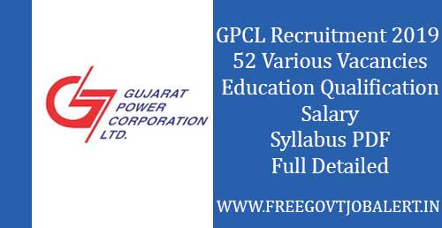

GPCL Recruitment 2019: The Gujarat Power Corporation Limited Has Released Advertisement in Newspaper, regarding for fill up Various Vacancies. GPCL Invites Online applications for the following contractual posts are invited from suitable candidates for Ghogha Surkha Lignite Mining Project, Bhavnagar. Eligible Candiaest can apply Before 22-10-2019.

## GPCL Recruitment 2019 for 52 Various Vacancies

<table style="border-collapse: collapse; width: 100%;"><tbody><tr><td style="width: 50%; background-color: #2a5a8e; text-align: center;" colspan="2"><h3>GPCL Recruitment 2019</h3></td></tr><tr><td style="width: 50%; text-align: center;">Job Recruitment Board</td><td style="width: 50%; text-align: center;">Gujarat Power Corporation Limited(GPCL)</td></tr><tr><td style="width: 50%; text-align: center;">Post</td><td style="width: 50%; text-align: center;">Various Post</td></tr><tr><td style="width: 50%; text-align: center;">Vacancies</td><td style="width: 50%; text-align: center;">52 Posts</td></tr><tr><td style="width: 50%; text-align: center;">Job Location</td><td style="width: 50%; text-align: center;">Gujarat</td></tr><tr><td style="width: 50%; text-align: center;">Application Mode</td><td style="width: 50%; text-align: center;">Online</td></tr></tbody></table>

GPCL recruitment Notification 2019 has published Notification & GPCL Recruitment Online Form on his Official website. As Per Notification a Total of 52 Vacancies are there. to Know About GPCL Jobs 2019 Details like Education Qualification, Experience, Salary/Pay Scale, Age Limits, Syllabus, How to Apply, Etc Given Below In this Page.

<table style="border-collapse: collapse; width: 100%;"><tbody><tr><td style="width: 50%; background-color: #2a5a8e;" colspan="2"><h3 style="text-align: center;">Important Dates</h3></td></tr><tr><td style="width: 50%; text-align: center;">Last Date of Online Application</td><td style="width: 50%; text-align: center;">22-10-2019</td></tr></tbody></table>

### GPCL Vacancy 2019 Details

1. Mines Manager: 1 (One) Post
2. Assistant Manager: (1st Class): 2 (Two) Posts
3. Assistant Manager (2nd class): 09 (Nine) Posts
4. Mines Surveyor: 02 (two) posts
5. Overman: 12(twelve) Posts
6. Mining Sirdar: 14 (fourteen) Posts
7. Colliery Engineer (Mechanical): 01 (One) Post
8. Colliery Engineer (Civil): 01 (One)Post (Non-Statutory)
9. Electrical Foreman/ Supervisor: Total 02 (Two) Posts
10. Mechanical Foreman/ Supervisor: Total 02 (Two) Posts
11. Electrician: 06(Six) posts

### GPCL Vacancy Eligibility Criteria

**Education Qualification & Experience**

<table style="border-collapse: collapse; width: 100%;"><tbody><tr><td style="width: 21.2188%; text-align: center; background-color: #2a5a8e;"><strong>Post Name</strong></td><td style="width: 35.646%; text-align: center; background-color: #2a5a8e;"><strong>Education Qualification</strong></td><td style="width: 29.1117%; text-align: center; background-color: #2a5a8e;"><strong>Experience</strong></td><td style="width: 14.0235%; text-align: center; background-color: #2a5a8e;"><strong>Maximum Age</strong></td></tr><tr><td style="width: 21.2188%; text-align: center;">Mines Manager</td><td style="width: 35.646%; text-align: center;">1st Class Coal Mines Manager's Competency Certificate under CMR-1957/2017 preferably having degree/ diploma in Mining Engineering</td><td style="width: 29.1117%; text-align: center;">At least 5 years of working experience in an Opencast Coal/Lignite mining project after obtaining 1st Class Coal Mines Manager's Competency Certificate under CMR-1957/2017</td><td style="width: 14.0235%; text-align: center;">55 Years</td></tr><tr><td style="width: 21.2188%; text-align: center;">Assistant Manager: (1st Class)</td><td style="width: 35.646%; text-align: center;">1st Class Coal Mines Manager's Competency Certificate under CMR-1957 /2017 preferably having degree/ diploma in Mining Engineering</td><td style="width: 29.1117%; text-align: center;">At least 2 years of working experience in an Opencast Coal/Lignite mining project, after obtaining 1st Class Coal Mines Managers Competency Certificate under-CMR-1957/2017</td><td style="width: 14.0235%; text-align: center;">55 Years</td></tr><tr><td style="width: 21.2188%; text-align: center;">Assistant Manager (2nd class)</td><td style="width: 35.646%; text-align: center;">2nd Class Coal Mines Manager's Competency Certificate under CMR-1957/2017 preferably having a degree/ diploma in Mining Engineering.</td><td style="width: 29.1117%; text-align: center;">At least 2 years of working experience in an Opencast coal/lignite mining project, after obtaining 2nd Class Coal Mines Manager's Competency Certificate under CMR-1957/2017.</td><td style="width: 14.0235%; text-align: center;">50 Years</td></tr><tr><td style="width: 21.2188%; text-align: center;">Mines Surveyor</td><td style="width: 35.646%; text-align: center;">Coal Mine Surveyor's Competency Certificate under CMR 1957/2017</td><td style="width: 29.1117%; text-align: center;">At least 2 years of working experience in opencast Coal/ Lignite mining project after obtaining Mines Surveyor's Competency Certificate under CMR-1957/2017</td><td style="width: 14.0235%; text-align: center;">50 Years</td></tr><tr><td style="width: 21.2188%; text-align: center;">Overman</td><td style="width: 35.646%; text-align: center;">Overman Competency Certificate under CMR 1957/2017</td><td style="width: 29.1117%; text-align: center;">At least 2 years of working experience in an opencast coal/lignite mining project after obtaining Overman's Competency Certificate under 1957/2017</td><td style="width: 14.0235%; text-align: center;">50 Years</td></tr><tr><td style="width: 21.2188%; text-align: center;">Mining Sirdar</td><td style="width: 35.646%; text-align: center;">Overman or Mining Sirdar Competency Certificate under CMR-1957/2017</td><td style="width: 29.1117%; text-align: center;">At least 1 year of working experience in an opencast coal/lignite mining project after obtaining Overman or Mining Sirdar Competency Certificate under CMR-1957/2017</td><td style="width: 14.0235%; text-align: center;">50 Years</td></tr><tr><td style="width: 21.2188%; text-align: center;">Colliery Engineer (Mechanical)</td><td style="width: 35.646%; text-align: center;">Degree Certificate in Mechanical Engineering</td><td style="width: 29.1117%; text-align: center;">at least 2 years of working experience in a mechanized opencast lignite/coal mining project after obtaining a Degree in Mechanical Engineering.</td><td style="width: 14.0235%; text-align: center;">50 Years</td></tr><tr><td style="width: 21.2188%; text-align: center;">Colliery Engineer (Civil): 01 (One)Post (Non-Statutory</td><td style="width: 35.646%; text-align: center;">Degree Certificate in Civil Engineering</td><td style="width: 29.1117%; text-align: center;">at least 2 years of working experience in civil works in any mechanized opencast coal/lignite mine</td><td style="width: 14.0235%; text-align: center;">50 Years</td></tr><tr><td style="width: 21.2188%; text-align: center;">Electrical Foreman/ Supervisor</td><td style="width: 35.646%; text-align: center;">Degree / Diploma in Electrical Engineering with Electrical Supervisor (Mines) Certificate from the authorized licensing board of the respective State</td><td style="width: 29.1117%; text-align: center;">-</td><td style="width: 14.0235%; text-align: center;">45 Years</td></tr><tr><td style="width: 21.2188%; text-align: center;">Mechanical Foreman/ Supervisor</td><td style="width: 35.646%; text-align: center;">Degree Certificate in Mechanical Engineering</td><td style="width: 29.1117%; text-align: center;">At least 1 year of working experience in mechanized coal/lignite mining project.</td><td style="width: 14.0235%; text-align: center;">45 Years</td></tr><tr><td style="width: 21.2188%; text-align: center;">Electrician</td><td style="width: 35.646%; text-align: center;">ITI in Electrical or Wireman with Wiremen Certificate issued by the authorized licensing board of the respective State</td><td style="width: 29.1117%; text-align: center;">At least 1 year of working experience after obtaining Wireman Certificate.</td><td style="width: 14.0235%; text-align: center;">35 Years</td></tr></tbody></table>

### GPCL Job 2019 Salary/Pay Scale

1. Mines Manager: Rs. 50,000/- to 1,00,000/-
2. Assistant Manager: (1st Class): Rs. Rs. 50,000/- to 1,00,000/-
3. Assistant Manager (2nd class): Rs. 40,000/- to 70,000/-
4. Mines Surveyor: Rs. 35,000/- to 60,000/-
5. Overman: Rs. 18,000/- to 40,000/-
6. Mining Sirdar: Rs. 12000/- to 27000/-
7. Colliery Engineer (Mechanical): Rs. 25,000/- to 50,000/-
8. Colliery Engineer (Civil): Rs. 25,000/- to 50,000/-
9. Electrical Foreman/ Supervisor: Rs. 18,000/- to 40,000/-
10. Mechanical Foreman/ Supervisor: Rs. 18,000/- to 40,000/-
11. Electrician: Rs. 20,000/- Fix

### GPCL Exam 2019 Syllabus

Download Post-Wise Syllabus PDF:

1. Mines Manager: [Download PDF](https://cdn.digialm.com/per/g01/pub/1258/EForms/image/SyllabusandElgibilityCriteria/MinesManager1stClass%20Syllabus.pdf)
2. Assistant Manager: [Download PDF](https://cdn.digialm.com/per/g01/pub/1258/EForms/image/SyllabusandElgibilityCriteria/AssistantMinesManager1stClassSyllabus.pdf)
3. Assistant Manager (2nd class): [Download PDF](https://cdn.digialm.com/per/g01/pub/1258/EForms/image/SyllabusandElgibilityCriteria/AssistantManager2ndClass.pdf)
4. Mines Surveyor: [Download PDF](https://cdn.digialm.com/per/g01/pub/1258/EForms/image/SyllabusandElgibilityCriteria/MinesSurveyorSyllabus.pdf)
5. Overman: [Download PDF](https://cdn.digialm.com/per/g01/pub/1258/EForms/image/SyllabusandElgibilityCriteria/OvermanSyllabus.pdf)
6. Mining Sirdar: [Download PDF](https://cdn.digialm.com/per/g01/pub/1258/EForms/image/SyllabusandElgibilityCriteria/MiningSirdarSyllabus.pdf)
7. Colliery Engineer (Mechanical): [Download PDF](https://cdn.digialm.com/per/g01/pub/1258/EForms/image/SyllabusandElgibilityCriteria/CollieryEngineerMechanicalSyllabus.pdf)
8. Colliery Engineer (Civil): [Download PDF](https://cdn.digialm.com/per/g01/pub/1258/EForms/image/SyllabusandElgibilityCriteria/CollieryEngineerCivilNonStatutorySyllabus.pdf)
9. Electrical Foreman/ Supervisor: [Download PDF](https://cdn.digialm.com/per/g01/pub/1258/EForms/image/SyllabusandElgibilityCriteria/ElectricalForemanSupervisorSyllabus.pdf)
10. Mechanical Foreman/ Supervisor: [Download PDF](https://cdn.digialm.com/per/g01/pub/1258/EForms/image/SyllabusandElgibilityCriteria/MechanicalForemanSupervisorSyllabus.pdf)
11. Electrician: [Download PDF](https://cdn.digialm.com/per/g01/pub/1258/EForms/image/SyllabusandElgibilityCriteria/ElectricianSyllabus.pdf)

### GPCL Application Fee

- General Candidates: Rs. 500/-
- SC/ST/OBS/EBC Candidates: Rs. 200/-
- Payment Mode: Payment Via Demand Draft

### How to Apply For GPCL Recruitment 2019

1. Candidates First Go to GPCL Official website:
2. Find And Click On "Online Applications for the Contractual Posts for Ghogha Surkha Lignite Mining Project Bhavnagar"
3. Click On New Registration (Login If You're Already Registered user)
4. Fill up Registration Form then click on submit Button
5. Get User ID & Password on Email
6. Then Login With your User ID & Password
7. Fill up Application Form
8. Upload Document Images
9. Pay Application Fee Via DD
10. Then Submit Application
11. Download & Save Application For Future Use
12. After making online applications, the candidates have to send their DDs by speed post/registered post to **“**Gujarat Power Corporation Limited**”**, 6th Floor, Block No.8, Udyog Bhavan, Sector-11, Gandhinagar-382011, Gujarat giving the details of their application on the back of the DDs.
13. Done.

### GPCL Recruitment 2019 Important Links

- GPCL Recruitment Online Form 2019: [Login](https://cdn4.tcsion.com/EForms/configuredHtml/2621/63060/login.html) | [Register](https://cdn4.tcsion.com/EForms/configuredHtml/2621/63060/Registration.html)
- GPCL Recruitment Notification 2019 For Various Post PDF: [Click Here](https://freegovtjobalert.in/wp-content/uploads/2019/10/apply-online-for-52-assistant-manager-overman-other-posts-advt-details.pdf)
- GPCL Official Website: [Click Here](https://gpcl.gujarat.gov.in)
