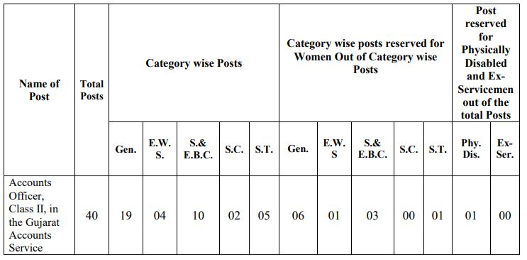

GPSC Accounts Officer Recruitment 2019: Gujarat Public Service Commission has published the notification for Accounts Officer, Class-II vacancies on the official website. GPSC invites Online applications are invited for the Post of Accounts Officer in Gujarat Accounts Service. (Advt.No. 27/2019-20)

## GPSC Accounts Officer Recruitment 2019 | 40 Posts

Gujarat Public Service Commission Recruitment Notification published on his official website. interested candidates in GPSC Jobs they can check the official website and get more information about GPSC Vacancy. as Per GPSC Recruitment notification 2019 total 40 vacancies in Accounts Officer post. Those candidates eligible for this post who complete a post-graduate degree of Commerce(B.com)/Chartered Accountant(C.A).

<table style="border-collapse: collapse; width: 100%;"><tbody><tr><td style="width: 100%; background-color: #2a5a8e; text-align: center;" colspan="2"><h3><strong>GPSC Recruitment Details</strong></h3></td></tr><tr><td style="width: 50%; text-align: center;">Job Recruitment Board</td><td style="width: 50%; text-align: center;">Gujarat Public Service Commission(GPSC)</td></tr><tr><td style="width: 50%; text-align: center;">Post</td><td style="width: 50%; text-align: center;">Accounts Officer</td></tr><tr><td style="width: 50%; text-align: center;">Department</td><td style="width: 50%; text-align: center;">Gujarat Accounts Service Department</td></tr><tr><td style="width: 50%; text-align: center;">Vacancies</td><td style="width: 50%; text-align: center;">40</td></tr><tr><td style="width: 50%; text-align: center;">Job Location</td><td style="width: 50%; text-align: center;">Gujarat</td></tr><tr><td style="width: 50%; text-align: center;">Job Category</td><td style="width: 50%; text-align: center;">State Jobs</td></tr><tr><td style="width: 50%; text-align: center;">Application Mode</td><td style="width: 50%; text-align: center;">Online</td></tr></tbody></table>

### **GPSC Exam Important Dates**

<table style="border-collapse: collapse; width: 100%; height: 116px;"><tbody><tr style="height: 24px;"><td style="width: 50%; text-align: center; height: 24px;">Starting Date for online application</td><td style="width: 50%; text-align: center; height: 24px;">24-09-2019</td></tr><tr style="height: 24px;"><td style="width: 50%; text-align: center; height: 24px;">Last Date for online application</td><td style="width: 50%; text-align: center; height: 24px;">09-10-2019</td></tr><tr style="height: 24px;"><td style="width: 50%; text-align: center; height: 10px;">Tentative date of Preliminary Test</td><td style="width: 50%; text-align: center; height: 10px;">05-01-2020</td></tr><tr style="height: 24px;"><td style="width: 50%; text-align: center; height: 10px;">Tentative date of Primary Test Result</td><td style="width: 50%; text-align: center; height: 10px;">February 2020</td></tr><tr style="height: 24px;"><td style="width: 50%; text-align: center; height: 24px;">Written Exam Date</td><td style="width: 50%; text-align: center; height: 24px;">03/09/10/-05-2019</td></tr><tr style="height: 24px;"><td style="text-align: center; height: 24px; width: 50%;">Written Exam Result Date</td><td style="text-align: center; width: 50%;">July 2020</td></tr><tr><td style="text-align: center; width: 50%;">Interview</td><td style="text-align: center; width: 50%;">September 2020</td></tr></tbody></table>

### **GPSC Vacancy 2019 Details**

GPSC Has Published notification for filling up 40 Accounts Officer. Good Chance for that's Candidates who looking for Govt jobs in Gujarat. Interested candidates can apply online on Official Before the Last date has gone. to know about GPSC Jobs Details Like Education Qualification, Age Limits, Salary/Pay Scale, GPSC Exam Syllabus, Application Fee, Etc. Given in this page below.

### **GPSC Exam Eligibility Criteria**

GPSC Accounts Officer Post Exam Conducted by GPSC. Gujarat Public Service Commission Board Set Minimum Criteria For This post. Candidates must Have Passed Minimum Criteria for applying for this post. Gpsc Eligible Criteria Given Below.

**Education Qualification**

- The Candidate shall possess the qualification of a bachelor’s degree in Commerce(B.com)/Chartered Accountant(C.A)/Institute of Costs and Work Accounts(I.C.W.A)/Cost and Management Accountant(CMA)/Company Secretary obtained from any of the Universities or institutions established or incorporated by or under the central or a state Act in India; or any other educational institution recognized as such or declared to be deemed as a University under section 3 of the University Grants Commission Act,1956
- possess the basic knowledge of computer application as prescribed in the Gujarat Civil Services Classification and Recruitment (General) Rules, 1967
- Possess adequate knowledge of Gujarati or Hindi or both.

**Age Limit**

- Minimum 20 Years
- Maximum 37 Years

**Age Relaxing**

- Male EWS/S.E.B.C/S.C/S.T Candidates: 5 Years
- Female EWS/S.E.B.C/S.C/S.T Candidates: 10 Years
- Woman Candidates belonging to Unreserved category: 5 Years
- Ex. Serviceman Including E.C.O. / S.S.C.O.: Length of Military Service plus three years.
- More Detail Check Notification

### **GPSC Jobs Salary/Pay Scale**

- Pay Matrix Level No: 8- Rs.44,900-1,42,400 and other allowances (According to 7th Pay Commission)

### **GPSC Selection Process**

1. Preliminary Exam
2. Written Exam
3. Interview

### **Application Fee**

- General Candidates: Rs. 100/-
- EWS/S.E.B.C/S.C/S.T Candidates: None
- Payment Mode: Online

### **GPSC Syllabus & Exam Pattern For Accounts Officer**

<table style="border-collapse: collapse; width: 100%;"><tbody><tr><td style="width: 100%; background-color: #2a5a8e; text-align: center;" colspan="5"><strong>1.Preliminary Exam</strong></td></tr><tr><td style="width: 20%; text-align: center;">Paper-1</td><td style="width: 20%; text-align: center;" rowspan="2">Objective</td><td style="width: 20.3304%; text-align: center;">General Studies</td><td style="width: 19.6696%; text-align: center;">200 Marks</td><td style="width: 20%; text-align: center;">3 Hours</td></tr><tr><td style="width: 20%; text-align: center;">Paper-2</td><td style="width: 20.3304%; text-align: center;">Accountancy and Auditing</td><td style="width: 19.6696%; text-align: center;">200 Marks</td><td style="width: 20%; text-align: center;">3 Hours</td></tr><tr><td style="width: 60.3304%; text-align: center;" colspan="3">Total Marks</td><td style="width: 19.6696%; text-align: center;">400</td><td style="width: 20%; text-align: center;"></td></tr></tbody></table>

 

<table style="border-collapse: collapse; width: 100%;"><tbody><tr><td style="width: 100%; background-color: #2a5a8e; text-align: center;" colspan="5"><strong>2.Written Exam Main Exam</strong></td></tr><tr><td style="width: 10.0881%; text-align: center;">Paper-1</td><td style="width: 33.4361%; text-align: center;" rowspan="5">All papers are descriptive (Conventional type)</td><td style="width: 22.0925%; text-align: center;">Gujarati Language</td><td style="width: 14.3833%; text-align: center;">150 Marks</td><td style="width: 20%; text-align: center;">3 Hours</td></tr><tr><td style="width: 10.0881%; text-align: center;">Paper-2</td><td style="width: 22.0925%; text-align: center;">English Language</td><td style="width: 14.3833%; text-align: center;">150 Marks</td><td style="width: 20%; text-align: center;">3 Hours</td></tr><tr><td style="width: 10.0881%; text-align: center;">Paper-3</td><td style="width: 22.0925%; text-align: center;">General Studies</td><td style="width: 14.3833%; text-align: center;">200 Marks</td><td style="width: 20%; text-align: center;">3 Hours</td></tr><tr><td style="width: 10.0881%; text-align: center;">Paper-4</td><td style="width: 22.0925%; text-align: center;">Accountancy and Auditing-I</td><td style="width: 14.3833%; text-align: center;">200 Marks</td><td style="width: 20%; text-align: center;">3 Hours</td></tr><tr><td style="width: 10.0881%; text-align: center;">Paper-5</td><td style="width: 22.0925%; text-align: center;">Accountancy and Auditing-II</td><td style="width: 14.3833%; text-align: center;">200 Marks</td><td style="width: 20%; text-align: center;">3 Hours</td></tr><tr><td style="width: 65.6167%; text-align: center;" colspan="3">Total Marks</td><td style="width: 14.3833%; text-align: center;">900</td><td style="width: 20%; text-align: center;"></td></tr></tbody></table>

### **How to apply for GPSC Accounts Officer Recruitment Online Form?**

1. Candidates Goto GPSC OJAS Official Website Here: [gpsc-ojas.gujarat.gov.in](https://gpsc-ojas.gujarat.gov.in)
2. Now Goto [Current Advertisement](https://gpsc-ojas.gujarat.gov.in/AdvtList.aspx?type=lCxUjNjnTp8=) Section.
3. Find Accounts Officer, Class-2, Gujarat Accounts Service
4. Choose and Click Apply Button in Green Color Click on.
5. Then See Details of Post and Click on **Apply Now** Button.
6. Then Registration Number and Birth Date. (If You Don't Have Registration number then Goto and See Full Registration Process and register on Ojas)
7. Enter Registration Number and Birth Date and Click on Apply With OTR.
8. Then you can see your Details Varifiy and Click On Save Button.
9. Goto Fee Section From Home Page
10. Select Your job, Enter Confirmation Number, Enter Birth Date and Click on ONLINE PAYMENT OF FEES Button.
11. Then Pay Application fee.
12. Now You Can Submit Application.
13. Save Your Application Number For Future Use.
14. Done.

### **GPSC Horticulture Officer Recruitment 2019 Important Links**

- Direct Apply For Accounts Officer: [**Click Here**](https://gpsc-ojas.gujarat.gov.in/AdvtDetails.aspx?sid=a2GSpnDbruI=&yr=87Q+A13CkoI=&ano=lzjgUBcnhV8=)
- GPSC Recruitment Accounts Officer Notification PDF**: [Click Here](https://freegovtjobalert.in/wp-content/uploads/2019/09/GPSC-Recruitment-Accounts-Officer-Notification-PDF.pdf)**
- GPSC Official Website: **[Click Here](https://gpsc.gujarat.gov.in)**
