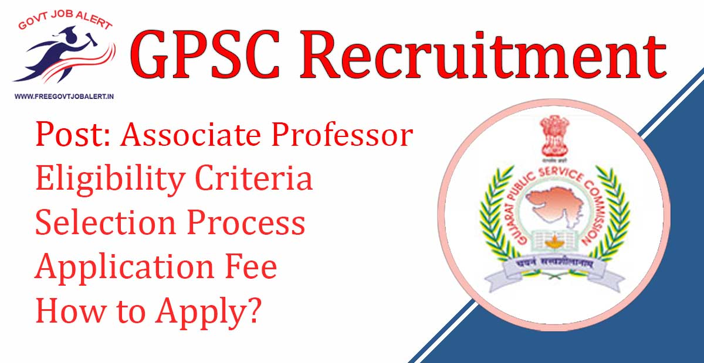
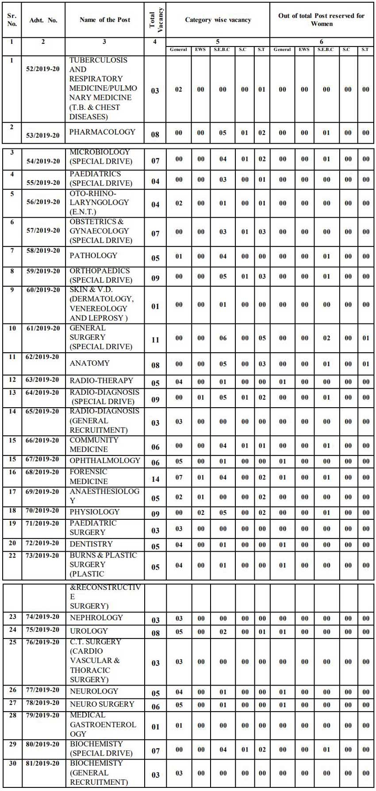
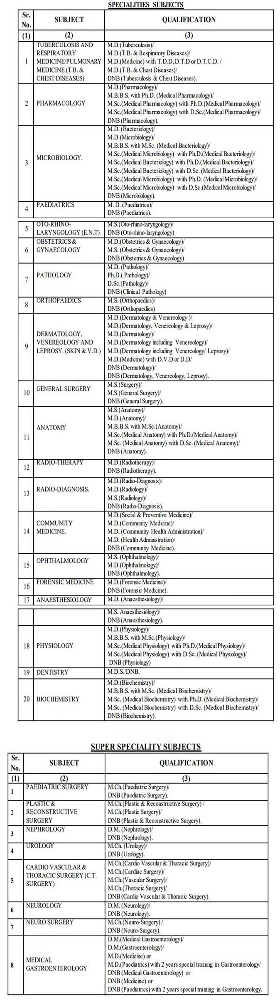

GPSC Associate Professor Recruitment 2019: Gujarat Public Service Commission has Released Notification Regarding Associate Professor Vacancy. GPSC online Application Are invited for the post of Associate Professor, General State Service, Class-I for various subjects in Government Medical Colleges, attached Medical hospitals and institutions under Health & Family Welfare Department. As Per GPSC recruitment 2019 notification A total of 173 Vacancies are there. GPSC Associate Professor Recruitment 2019 online form has been started on 15-11-2019 at gpsc-ojas.gujarat.gov.in 2019

## **GPSC Associate Professor Recruitment 2019-20**

<table style="border-collapse: collapse; width: 100%;"><tbody><tr><td style="width: 50%; background-color: #2a5a8e; text-align: center;" colspan="2"><strong>GPSC Recruitment 2019</strong></td></tr><tr><td style="width: 50%; text-align: center;">Job Recruitment Board</td><td style="width: 50%; text-align: center;">Gujarat Public Service Commission</td></tr><tr><td style="width: 50%; text-align: center;">Notification No.</td><td style="width: 50%; text-align: center;">Advt. No.: 52/2019-20 to Advt. No.: 81/2019-20</td></tr><tr><td style="width: 50%; text-align: center;">Post</td><td style="width: 50%; text-align: center;">Associate Professor</td></tr><tr><td style="width: 50%; text-align: center;">Vacancies</td><td style="width: 50%; text-align: center;">173</td></tr><tr><td style="width: 50%; text-align: center;">Job Location</td><td style="width: 50%; text-align: center;">Gujarat State</td></tr><tr><td style="width: 50%; text-align: center;">Job Type</td><td style="width: 50%; text-align: center;">State Govt Jobs</td></tr><tr><td style="width: 50%; text-align: center;">Application Mode</td><td style="width: 50%; text-align: center;">Online</td></tr></tbody></table>

GPSC Recruitment 2019 Notification pdf Published on his official website. Candidates should have a Master's Degree and Age not more than 43 years. Selected Candidates Will be Posted in Gujarat. Interested & Eligible Candidates Can Apply Online on OJAS GPSC Official website Before 30-11-2019.

<table style="border-collapse: collapse; width: 98%;"><tbody><tr><td style="width: 100%; background-color: #2a5a8e; text-align: center;" colspan="2"><h3><strong>GPSC Associate Professor Exam Dates</strong></h3></td></tr><tr><td style="width: 50%; text-align: center;">Starting Date of Online Application</td><td style="width: 50%; text-align: center;">07-11-2019</td></tr><tr><td style="width: 50%; text-align: center;">Last Date of Online Application</td><td style="width: 50%; text-align: center;">30-11-2019</td></tr><tr><td style="width: 50%; text-align: center;">Preliminary Test&nbsp;</td><td style="width: 50%; text-align: center;">March/ April/ May</td></tr><tr><td style="width: 50%; text-align: center;">Preliminary Test result</td><td style="width: 50%; text-align: center;">June to Aug 2020</td></tr><tr><td style="width: 50%; text-align: center;">Interview</td><td style="width: 50%; text-align: center;">Sept to November 2020</td></tr><tr><td style="width: 100%; text-align: center;" colspan="2">GPSC Associate Professor - Subject Wise Exam Date: <a href="https://freegovtjobalertdaily.blogspot.com/2019/11/gpsc-associate-professor-recruitment.html" target="_blank" rel="noopener noreferrer">Click Here</a></td></tr></tbody></table>

GPSC Associate Professor Recruitment 2019 Details like Education Qualification, Age Limits, Salary/Pay Scale, Experience, How to apply, etc. Given Below.

### **GPSC Vacancy 2019 Details**

- GPSC Associate Professor: 178 Posts

\[caption id="attachment\_1759" align="aligncenter" width="850"\] GPSC Associate Professor Vacancy Details\[/caption\]

### **GPSC Associate Professor Recruitment 2019 Eligibility Criteria**

Education Qualification

- The basic knowledge of Computer Application as prescribed in the Gujarat Civil Services Classification and Recruitment.
- Adequate knowledge of Gujarati or Hindi or Both.

Age Limits

- Maximum 43 Years
- Women: 5 years (Maximum Up to 45 Years)
- SC/ST: 5 years (Maximum Up to 45 Years)
- Physically Disabled: 10 Years (Maximum Up to 45 Years)

### **GPSC Associate Professor Salary/Pay Scale**

- Pay Scale: Rs.37,400-67,000/- (PB-4) Grade Pay: Rs.9,000/-

> [GPSC Professor Recruitment 2019 | 58 GPSC Jobs](https://freegovtjobalert.in/gpsc-professor-recruitment/)

### **Selection Process For GPSC Associate Professor Recruitment 2019**

1. Preliminary Exam
2. Interview

### **GPSC Associate Professor Preliminary Exam Pattern**

- A paper of concerned subject of 200 marks.
- Duration: 180 minutes.
- As per the Instruction/Provision of the Commission, the candidates who possess less than 25% marks in the Preliminary Test shall not be eligible for Interview.
- The candidates of SC & ST categories who possess less than 20% marks in the Preliminary Test shall not be eligible for Interview.

### **GPSC Associate Professor Recruitment 2019 Application Fee**

- General Candidates: Rs. 100/- + applicable postal charges.
- Reserved categories and Economically Weaker Section of Unreserved category, Ex-serviceman of Gujarat state and category who is physically disabled have not to pay application fees.

### **How to Apply For GPSC Associate Professor Recruitment 2019**

1. Candidates Go to GPSC OJAS Official website: https://gpsc-ojas.gujarat.gov.in
2. Find Advertisements
3. Click on **Apply** Button
4. Read Carefully Instructions
5. Fill up Application Form
6. Upload Photo & Signature Images
7. Pay Application Fee
8. Submit Application and Get Confirmation Number
9. Download & Save Application For Future Use.

### **GPSC Associate Professor Recruitment 2019 Important Links**

- GPSC Associate Professor Online Form 2019: [Click Here](https://gpsc-ojas.gujarat.gov.in/AdvtList.aspx?type=lCxUjNjnTp8= "GPSC Associate Professor")
- Download GPSC Associate Professor Recruitment Notification PDF: [Click Here](https://freegovtjobalert.in/wp-content/uploads/2019/11/Download-173-GPSC-Associate-Professor-Recruitment-Notification-PDF.pdf "Download")
- GPSC Exam Syllabus: [Download PDF](https://gpsc.gujarat.gov.in/StageDocument?name=syllabus)
- GPSC Official Website: [Click Here](https://gpsc.gujarat.gov.in/)

Candidates can visit https://gpsc.gujarat.gov.in to get more details about GPSC vacancy 2019-20. To More Information About Upcoming Vacancy in GPSC jobs 2019-20, latest Updates, Admit Card, Syllabus, Result, Etc. It will be published on the official website. Also, visit Regularly our website [www.freegovtjobalert.in](https://freegovtjobalert.in) for getting the Latest job Updates.
