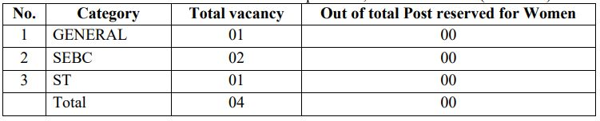

GPSC Project Manager Recruitment 2019: Gujarat Public Service Commission has published the notification for Project Manager, Class-I vacancies on the official website. GPSC invites Online applications are invited for the Post of Project Manager in the Commissionerate of Cottage and Rural Industries under Industries and Mines Department. (Advt.No. 29/2019-20)

## GPSC Project Manager Recruitment 2019 | 04 Posts

Gujarat Public Service Commission Recruitment Notification published on his official website. interested candidates in GPSC Jobs they can check the official website and get more information about GPSC Vacancy. as Per GPSC Recruitment notification 2019 total 04 vacancies in Project Manager post. Those candidates eligible for this post who complete Second Class Bachelor’s Degree in Engineering or Technology.

<table style="border-collapse: collapse; width: 100%;"><tbody><tr><td style="width: 100%; background-color: #2a5a8e; text-align: center;" colspan="2"><h3><strong>GPSC Recruitment Details</strong></h3></td></tr><tr><td style="width: 50%; text-align: center;">Job Recruitment Board</td><td style="width: 50%; text-align: center;">Gujarat Public Service Commission(GPSC)</td></tr><tr><td style="width: 50%; text-align: center;">Post</td><td style="width: 50%; text-align: center;">Project Manager</td></tr><tr><td style="width: 50%; text-align: center;">Department</td><td style="width: 50%; text-align: center;">Industries and Mines Department</td></tr><tr><td style="width: 50%; text-align: center;">Vacancies</td><td style="width: 50%; text-align: center;">04</td></tr><tr><td style="width: 50%; text-align: center;">Job Location</td><td style="width: 50%; text-align: center;">Gujarat</td></tr><tr><td style="width: 50%; text-align: center;">Job Category</td><td style="width: 50%; text-align: center;">State Jobs</td></tr><tr><td style="width: 50%; text-align: center;">Application Mode</td><td style="width: 50%; text-align: center;">Online</td></tr></tbody></table>

### **GPSC Exam Important Dates**

<table style="border-collapse: collapse; width: 100%; height: 116px;"><tbody><tr style="height: 24px;"><td style="width: 50%; text-align: center; height: 24px;">Starting Date for online application</td><td style="width: 50%; text-align: center; height: 24px;">24-09-2019</td></tr><tr style="height: 24px;"><td style="width: 50%; text-align: center; height: 24px;">Last Date for online application</td><td style="width: 50%; text-align: center; height: 24px;">09-10-2019</td></tr><tr style="height: 24px;"><td style="width: 50%; text-align: center; height: 10px;">Tentative date of Preliminary Test</td><td style="width: 50%; text-align: center; height: 10px;">05-01-2020</td></tr><tr style="height: 24px;"><td style="width: 50%; text-align: center; height: 10px;">Tentative date of Primary Test Result</td><td style="width: 50%; text-align: center; height: 10px;">March 2020</td></tr><tr><td style="text-align: center; width: 50%;">Interview</td><td style="text-align: center; width: 50%;">June 2020</td></tr><tr><td style="text-align: center; width: 50%;" colspan="2">Final result will be published during 10 working days after the last date of Interview.</td></tr></tbody></table>

### **GPSC Vacancy 2019 Details**

GPSC Has Published notification for filling up 04 Project Manager. Good Chance for that's Candidates who looking for Govt jobs in Gujarat. Interested candidates can apply online on Official Before the Last date has gone. to know about GPSC Jobs Details Like Education Qualification, Age Limits, Salary/Pay Scale, GPSC Exam Syllabus, Application Fee, Etc. Given in this page below.

### **GPSC Exam Eligibility Criteria**

GPSC Project Manager Post Exam Conducted by GPSC. Gujarat Public Service Commission Board Set Minimum Criteria For This post. Candidates must Have Passed Minimum Criteria for applying for this post. Gpsc Eligible Criteria Given Below.

**Education Qualification**

- Possess atleast Second Class Bachelor’s Degree in Engineering or Technology except Civil Engineering and a Post Graduate Degree or Diploma in Business Administration, Management, Rural Management or Entrepreneurship Development obtained from any of the Universities established or incorporated by or under the Central or a State Act in India
- Have about five years’ experience after obtaining the educational qualification on the post not below the rank of the Technical Assistant, Class III, in the subordinate service of the Commissionerate of Cottage and Rural Industries, Gujarat State.
- possess the basic knowledge of computer application as prescribed in the Gujarat Civil Services Classification and Recruitment (General) Rules, 1967
- Possess adequate knowledge of Gujarati or Hindi or both.

**Age Limit**

- Maximum 42 Years

**Age Relaxing**

- Male EWS/S.E.B.C/S.C/S.T Candidates: 5 Years
- Female EWS/S.E.B.C/S.C/S.T Candidates: 10 Years
- Woman Candidates belonging to Unreserved category: 5 Years
- Ex. Serviceman Including E.C.O. / S.S.C.O.: Length of Military Service plus three years.
- More Detail Check Notification

### **GPSC Jobs Salary/Pay Scale**

- Rs. 56,100 – Rs. 1,77,500 (Pay Level-10)

### **GPSC Selection Process**

1. Preliminary Exam
2. Interview

### **Application Fee**

- General Candidates: Rs. 100/-
- EWS/S.E.B.C/S.C/S.T Candidates: None
- Payment Mode: Online

### **GPSC Syllabus & Exam Pattern For Project Manager**

- Available Soon

### **How to apply for GPSC Project Manager Recruitment Online Form?**

1. Candidates Goto GPSC OJAS Official Website Here: [gpsc-ojas.gujarat.gov.in](https://gpsc-ojas.gujarat.gov.in)
2. Now Goto [Current Advertisement](https://gpsc-ojas.gujarat.gov.in/AdvtList.aspx?type=lCxUjNjnTp8=) Section.
3. Find Project Manager, Class-1, in the Commissionerate of Cottage and Rural Industries.
4. Choose and Click Apply Button in Green Color Click on.
5. Then See Details of Post and Click on **Apply Now** Button.
6. Then Registration Number and Birth Date. (If You Don't Have Registration number then Goto and See Full Registration Process and register on Ojas)
7. Enter Registration Number and Birth Date and Click on Apply With OTR.
8. Then you can see your Details Varifiy and Click On Save Button.
9. Goto Fee Section From Home Page
10. Select Your job, Enter Confirmation Number, Enter Birth Date and Click on ONLINE PAYMENT OF FEES Button.
11. Then Pay Application fee.
12. Now You Can Submit Application.
13. Save Your Application Number For Future Use.
14. Done.

### **GPSC Project Manager Recruitment 2019 Important Links**

- Direct Apply For Project Manager: [**Click Here**](https://gpsc-ojas.gujarat.gov.in/AdvtDetails.aspx?sid=a2GSpnDbruI=&yr=87Q+A13CkoI=&ano=Zdri+vNYhuQ=)
- GPSC Recruitment Project Manager Notification PDF**: [Click Here](https://freegovtjobalert.in/wp-content/uploads/2019/09/GPSC-Recruitment-Project-Manager-Notification-PDF.pdf)**
- GPSC Official Website: **[Click Here](https://gpsc.gujarat.gov.in)**
