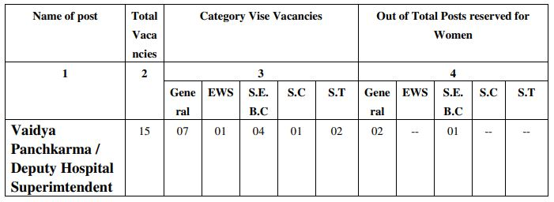

GPSC recruitment 2019: Gujarat Public Service Commission has published the notification for Vaidya Panchkarma / Deputy Hospital Superintendent post vacancies on the official website. GPSC invites online Application for those candidates who eligible for the post of Vaidya Panchkarma / Deputy Hospital Superintendent, Class-1. Gujarat Ayurveda Services (Advt. No.24/2019-20) under the Directorate of Indian System of Medicine and Homeopathy, Gujarat State.

## GPSC Exam For 15 Vacancies for Vaidya Panchkarma Deputy Hospital Superintendent

Gujarat Public Service Commission Recruitment Notification published on his official website. interested candidates in GPSC Jobs they can check the official website and get more information about GPSC Vacancy. as Per GPSC Recruitment notification 2019 total 15 vacancies in Vaidya Panchkarma / Deputy Hospital Superintendent post. Those candidates are eligible for this post who a complete a post-graduate degree in Ayurveda.

<table style="border-collapse: collapse; width: 100%;"><tbody><tr><td style="width: 100%; background-color: #2a5a8e; text-align: center;" colspan="2"><h3><strong>GPSC Recruitment Details</strong></h3></td></tr><tr><td style="width: 50%; text-align: center;">Job Recruitment Board</td><td style="width: 50%; text-align: center;">Gujarat Public Service Commission(GPSC)</td></tr><tr><td style="width: 50%; text-align: center;">Post</td><td style="width: 50%; text-align: center;">Hospital Superintendent</td></tr><tr><td style="width: 50%; text-align: center;">Department</td><td style="width: 50%; text-align: center;">Health and Family Welfare</td></tr><tr><td style="width: 50%; text-align: center;">Vacancies</td><td style="width: 50%; text-align: center;">15</td></tr><tr><td style="width: 50%; text-align: center;">Job Location</td><td style="width: 50%; text-align: center;">Gujarat</td></tr><tr><td style="width: 50%; text-align: center;">Job Category</td><td style="width: 50%; text-align: center;">State Jobs</td></tr><tr><td style="width: 50%; text-align: center;">Application Mode</td><td style="width: 50%; text-align: center;">Online</td></tr></tbody></table>

### **GPSC Exam Important Dates**

<table style="border-collapse: collapse; width: 100%;"><tbody><tr><td style="width: 50%; text-align: center;">Starting Date for online application</td><td style="width: 50%; text-align: center;">24-09-2019</td></tr><tr><td style="width: 50%; text-align: center;">Last Date for online application</td><td style="width: 50%; text-align: center;">09-10-2019</td></tr><tr><td style="width: 50%; text-align: center;">Tentative date of Preliminary Test</td><td style="width: 50%; text-align: center;">05-01-2020</td></tr><tr><td style="width: 50%; text-align: center;">Tentative date of Primary Test Result</td><td style="width: 50%; text-align: center;">April 2020</td></tr><tr><td style="width: 50%; text-align: center;">Tentative month of Interview</td><td style="width: 50%; text-align: center;">June 2020</td></tr><tr><td style="width: 50%; text-align: center;">Tentative month of Interview Result</td><td style="width: 50%; text-align: center;">The result will be published within 10 working days after Completion of Interviews</td></tr></tbody></table>

### **GPSC Vacancy 2019 Details**

GPSC Has Published the notification for filling up 15 Superintendent post. Good Chance for that's Candidates who looking for Govt jobs in Gujarat. Interested candidates can apply online on Official Before the Last date has gone. to know about GPSC Jobs Details Like Education Qualification, Age Limits, Salary/Pay Scale, GPSC Exam Syllabus, Application Fee, Etc. Given in this page below.

### **GPSC Exam Eligibility Criteria**

Vaidya Panchkarma / Deputy Hospital Superintendent Post Exam Conducted by GPSC. Gujarat Public Service Commission Board Set Minimum Criteria For This post. Candidates must Have Passed Minimum Criteria for applying for this post. Gpsc Eligible Criteria Given Below.

**Education Qualification**

- Possess a post-graduate degree in Ayurveda obtained from any of the Ayurveda Universities established or incorporated by or under the Central or State Act in India.
- Candidates Must have about Five years’ experience in the post not below the rank of Resident Medical Officer (Ayurveda), Class II, or Medical Officer (Ayurveda) Class II in the Gujarat Ayurveda Service in the Government Ayurveda Hospital or Dispensary.
- Possess the basic knowledge of computer application as prescribed in the Gujarat Civil Services Classification and Recruitment.
- Have adequate knowledge of Gujarati or Hindi or both.

**Age Limit**

- Maximum 42 Years

**Age Relaxing**

- EWS/S.E.B.C/S.C/S.T/Women Candidates: 5 Years

### **GPSC Jobs Salary/Pay Scale**

- Rs. 67700 - 208700 (Pay Matrix Level-11)

### **GPSC Selection Process**

1. Written Exam
2. Interview
3. Documents Verification

### **Application Fee**

- General Candidates: Rs. 100/-
- EWS/S.E.B.C/S.C/S.T Candidates: None
- Payment Mode: Online

### **How to apply For GPSC Exam Online Form?**

1. Candidates Goto GPSC OJAS Official Website Here: [gpsc-ojas.gujarat.gov.in](https://gpsc-ojas.gujarat.gov.in)
2. Now Goto [Current Advertisement](https://gpsc-ojas.gujarat.gov.in/AdvtList.aspx?type=lCxUjNjnTp8=) Section.
3. Find **Vaidya Panchkarma / Deputy Hospital Superintendent, Class-1, Gujarat Ayurveda Services.**
4. Now You Can see Apply Button in Green Color Click on.
5. Then See Details of Post and Click on **Apply Now** Button.
6. Then Registration Number and Birth Date. (If You Don't Have Registration number then Goto and See Full Registration Process and register on Ojas)
7. Enter Registration Number and Birth Date and Click on Apply With OTR.
8. Then you can see your Details Varifiy and Click On Save Button.
9. Goto Fee Section From Home Page
10. Select Your job, Enter Confirmation Number, Enter Birth Date and Click on ONLINE PAYMENT OF FEES Button.
11. Then Pay Application fee.
12. Now You Can Submit Application.
13. Save Your Application Number For Future Use.
14. Done.

### **GPSC Recruitment 2019 Important Links**

- **Vaidya Panchkarma / Deputy Hospital Superintendent** Direct Apply: **[Click Here](https://gpsc-ojas.gujarat.gov.in/AdvtDetails.aspx?sid=a2GSpnDbruI=&yr=87Q+A13CkoI=&ano=g9eXQthXVvc=) | [Click Here](https://gpsc-ojas.gujarat.gov.in/jobapply.aspx?sid=a2GSpnDbruI=&yr=87Q%20A13CkoI=&ano=g9eXQthXVvc=)**
- GPSC Recruitment **Superintendent** Notification PDF**: [Click Here](https://freegovtjobalert.in/wp-content/uploads/2019/09/GPSC-Recruitment-Superintendent-Notification-PDF.pdf)**
- GPSC Official Website: **[Click Here](https://gpsc.gujarat.gov.in)**
