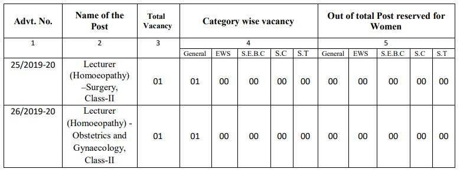

GPSC Exam recruitment 2019: Gujarat Public Service Commission has published the notification for Lecturer post vacancies on the official website. GPSC invites Online applications are invited for the Post of Lecturer in the Government Homoeopathy Colleges in the subject Homoeopathic Surgery, General State Service, Class-II (Advt. No.25/2019-20) and Homoeopathic Obstetrics and Gynaecology, General State Service, Class-II (Advt.No:26/2019-20) under the Director, AYUSH (Ayurveda, Yoga and Naturopathy, Unani, Siddha and Homoeopathy) of Health and Family welfare department, Gujarat State.

## GPSC Recruitment 2019: 02 Vacancies for Lecturer Post

Gujarat Public Service Commission Recruitment Notification published on his official website. interested candidates in GPSC Jobs they can check the official website and get more information about GPSC Vacancy. as Per GPSC Recruitment notification 2019 total 2 vacancies in Lecturer post. Those candidates eligible for this post who complete post-graduate degree in Homoeopathy.

<table style="border-collapse: collapse; width: 100%;"><tbody><tr><td style="width: 100%; background-color: #2a5a8e; text-align: center;" colspan="2"><h3><strong>GPSC Recruitment Details</strong></h3></td></tr><tr><td style="width: 50%; text-align: center;">Job Recruitment Board</td><td style="width: 50%; text-align: center;">Gujarat Public Service Commission(GPSC)</td></tr><tr><td style="width: 50%; text-align: center;">Post</td><td style="width: 50%; text-align: center;">Lecturer</td></tr><tr><td style="width: 50%; text-align: center;">Department</td><td style="width: 50%; text-align: center;">Health and Family Welfare</td></tr><tr><td style="width: 50%; text-align: center;">Vacancies</td><td style="width: 50%; text-align: center;">02</td></tr><tr><td style="width: 50%; text-align: center;">Job Location</td><td style="width: 50%; text-align: center;">Gujarat</td></tr><tr><td style="width: 50%; text-align: center;">Job Category</td><td style="width: 50%; text-align: center;">State Jobs</td></tr><tr><td style="width: 50%; text-align: center;">Application Mode</td><td style="width: 50%; text-align: center;">Online</td></tr></tbody></table>

### **GPSC Exam Important Dates**

<table style="border-collapse: collapse; width: 100%; height: 242px;"><tbody><tr style="height: 24px;"><td style="width: 50%; text-align: center; height: 24px;">Starting Date for online application</td><td style="width: 50%; text-align: center; height: 24px;">24-09-2019</td></tr><tr style="height: 24px;"><td style="width: 50%; text-align: center; height: 24px;">Last Date for online application</td><td style="width: 50%; text-align: center; height: 24px;">09-10-2019</td></tr><tr style="height: 89px;"><td style="width: 50%; text-align: center; height: 89px;">Tentative date of Preliminary Test</td><td style="width: 50%; text-align: center; height: 89px;"><ul><li style="text-align: left;">Lecturer - Surgery&nbsp;Class-II: 02-02-2020</li><li style="text-align: left;">Lecturer - Obstetrics and Gynaecology&nbsp;Class-II: 05-01-2020</li></ul></td></tr><tr style="height: 81px;"><td style="width: 50%; text-align: center; height: 81px;">Tentative date of Primary Test Result</td><td style="width: 50%; text-align: center; height: 81px;"><ul><li style="text-align: left;">Lecturer - Surgery: April 2020</li><li style="text-align: left;">Lecturer - Obstetrics and Gynaecology:&nbsp;March 2020</li></ul></td></tr><tr style="height: 24px;"><td style="width: 50%; text-align: center; height: 24px;">Tentative month of Interview</td><td style="width: 50%; text-align: center; height: 24px;">June 2020</td></tr></tbody></table>

### **GPSC Vacancy 2019 Details**

GPSC Has Published notification for filling up 02 Lecturer post. Good Chance for that's Candidates who looking for Govt jobs in Gujarat. Interested candidates can apply online on Official Before the Last date has gone. to know about GPSC Jobs Details Like Education Qualification, Age Limits, Salary/Pay Scale, GPSC Exam Syllabus, Application Fee, Etc. Given in this page below.

### **GPSC Exam Eligibility Criteria**

Lecturer (Homoeopathy) Post Exam Conducted by GPSC. Gujarat Public Service Commission Board Set Minimum Criteria For This post. Candidates must Have Passed Minimum Criteria for applying for this post. Gpsc Eligible Criteria Given Below.

**Education Qualification**

- Candidates Must Have A post-graduate degree in Homoeopathy.

<table style="border-collapse: collapse; width: 100%;"><tbody><tr><td style="width: 50%; text-align: center; background-color: #2a5a8e;"><strong>Subject</strong></td><td style="width: 50%; text-align: center; background-color: #2a5a8e;"><strong>Qualification</strong></td></tr><tr><td style="width: 50%; text-align: center;">Surgery</td><td style="width: 50%; text-align: center;">M.D. (Homoeopathy) Or M.S. (Surgery) Or M.S. (General Surgery)</td></tr><tr><td style="width: 50%; text-align: center;">Gynaecology and Obstetrics</td><td style="width: 50%; text-align: center;">M.D. (Homoeopathy) Or M.D. (Obstetrics and Gynaecology) Or M.S.( Obstetrics and Gynaecology)</td></tr></tbody></table>

- The basic knowledge of Computer Application as prescribed in the Gujarat Civil Services Classification
- Adequate knowledge of Gujarati or Hindi or Both.

**Age Limit**

- Maximum 40 Years

**Age Relaxing**

- EWS/S.E.B.C/S.C/S.T/Women Candidates: 5 Years
- Physically Disabled: 10 Years
- Ex. Serviceman Including E.C.O. / S.S.C.O.: Length of Military Service plus three years.

### **GPSC Jobs Salary/Pay Scale**

- Rs. 53100-167800/- (Pay Metrix Level-9 in 7th Pay Commission)

### **GPSC Selection Process**

1. Written Exam
2. Interview
3. Documents Verification

### **Application Fee**

- General Candidates: Rs. 100/-
- EWS/S.E.B.C/S.C/S.T Candidates: None
- Payment Mode: Online

### **GPSC Syllabus For Lecturer Post**

<table style="border-collapse: collapse; width: 100%;"><tbody><tr><td style="width: 50%; text-align: center; background-color: #2a5a8e;"><strong>Lecturer (Homoeopathic Surgery)</strong></td><td style="width: 50%; text-align: center; background-color: #2a5a8e;"><strong>Lecturer (Homoeopathy)-Obstetrics and Gynaecology</strong></td></tr><tr><td style="width: 50%; text-align: center;" colspan="2"><strong>Part - 1 (100 Marks/100 Questions, Medium: Gujarati)</strong></td></tr><tr><td style="width: 50%;"><ul><li>Geography of India</li><li>Cultural heritage of India</li><li>History of India with special reference to Gujarat</li><li>Indian Economy and Planning</li><li>Indian Polity and the Constitution of India</li><li>General Mental Ability</li><li>Daily events</li></ul></td><td style="width: 50%;"><ul><li>Geography of India</li><li>Cultural heritage of India</li><li>History of India with special reference to Gujarat</li><li>Indian Economy and Planning</li><li>Indian Polity and the Constitution of India</li><li>General Mental Ability</li><li>Daily events</li></ul></td></tr><tr><td style="width: 50%; text-align: center;" colspan="2"><strong>Part - 2 (200 Marks/200 Questions, Medium: English)</strong></td></tr><tr><td style="width: 50%;"><ul><li>Homoeopathic Philosophy</li><li>Anatomy</li><li>Physiology</li><li>Surgery</li><li>Research Methodology</li><li>Biostatistics</li><li>Legislations Relating to Medical Profession</li><li>Current Trends and Recent Advancements in the Field of Homeopathic Surgery</li></ul></td><td style="width: 50%;"><ul><li>Homoeopathic Philosophy</li><li>Anatomy</li><li>Physiology</li><li>Obstetrics</li><li>Gynaecology</li><li>Practice of Medicine</li><li>Surgery</li><li>Research Methodology</li><li>Biostatistics</li><li>Legislations Relating to Medical Profession</li><li>Current Trends and Recent Advancements in the Field of Homeopathy Obstetrics and Gynaecology</li></ul></td></tr></tbody></table>

### **How to apply For GPSC Exam Online Form?**

1. Candidates Goto GPSC OJAS Official Website Here: [gpsc-ojas.gujarat.gov.in](https://gpsc-ojas.gujarat.gov.in)
2. Now Goto [Current Advertisement](https://gpsc-ojas.gujarat.gov.in/AdvtList.aspx?type=lCxUjNjnTp8=) Section.
3. Find Lecturer (Homoeopathy) –Surgery, General State Service, Class-2 **OR** Lecturer (Homoeopathy) –Obstetrics and Gynaecology, General State Service, Class-2
4. Choose and Click Apply Button in Green Color Click on.
5. Then See Details of Post and Click on **Apply Now** Button.
6. Then Registration Number and Birth Date. (If You Don't Have Registration number then Goto and See Full Registration Process and register on Ojas)
7. Enter Registration Number and Birth Date and Click on Apply With OTR.
8. Then you can see your Details Varifiy and Click On Save Button.
9. Goto Fee Section From Home Page
10. Select Your job, Enter Confirmation Number, Enter Birth Date and Click on ONLINE PAYMENT OF FEES Button.
11. Then Pay Application fee.
12. Now You Can Submit Application.
13. Save Your Application Number For Future Use.
14. Done.

### **GPSC Recruitment 2019 Important Links**

- **Lecturer** Direct Apply: **[Surgery Lecturer](https://gpsc-ojas.gujarat.gov.in/AdvtDetails.aspx?sid=a2GSpnDbruI=&yr=87Q+A13CkoI=&ano=EH8a4Q03ASE=) | [Obstetrics and Gynaecology Lecturer](https://gpsc-ojas.gujarat.gov.in/AdvtDetails.aspx?sid=a2GSpnDbruI=&yr=87Q+A13CkoI=&ano=hLkb6T4awQw=)**
- Lecturer Exam Full Syllabus With PDF: [**Click Here**](https://freegovtjobalert.in/gpsc-syllabus-for-lecturer-post/)
- GPSC Recruitment **Lecturer** Notification PDF**: [Click Here](https://freegovtjobalert.in/wp-content/uploads/2019/09/GPSC-Lecturer-Post.pdf)**
- GPSC Official Website: **[Click Here](https://gpsc.gujarat.gov.in)**
