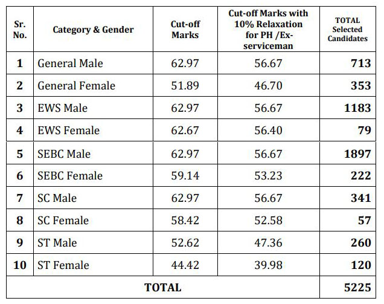

**GPSC State Tax Inspector Result 2019**: Check GPSC STI Results Now, Gujarat Public Service Commission has Released a Notification With State Tax Inspector Cut Off Marks, Eligible Candidates Roll Number and Main Exam Dates For Selected Candidates. **GPSC STI Preliminary Exam** on 09-06-2019 and **GPSC STI Preliminary Results now Available** on GPSC Official Website. A lot of Candidates Waiting for this Exam results and Selected candidates Ready & start Preparation for **GPSC STI Main Exam.**

> GPSC State Tax Inspector (STI) Result 2019 Cut Off Marks & Check Main Exam Date **[Here](https://freegovtjobalert.in/wp-content/uploads/2019/08/Prelims-Result-GPSC-State-Tax-Inspector-Posts.pdf)**

## GPSC State Tax Inspector Result 2019

<table style="border-collapse: collapse; width: 77.3128%; height: 353px;"><tbody><tr><td style="width: 50%; background-color: #2a5a8e;" colspan="2"><h3 style="text-align: center;"><strong>GPSC State Tax Inspector Exam Details</strong></h3></td></tr><tr><td style="width: 50%; text-align: center;">Job Recruitment Board</td><td style="width: 50%; text-align: center;">Gujarat Public Service Commission</td></tr><tr><td style="width: 50%; text-align: center;">Post Name</td><td style="width: 50%; text-align: center;">State Tax Inspector</td></tr><tr><td style="width: 50%; text-align: center;">No of Vacancies</td><td style="width: 50%; text-align: center;">424 Posts</td></tr><tr><td style="width: 50%; text-align: center;">Preliminary Exam Date</td><td style="width: 50%; text-align: center;">09-06-2019</td></tr><tr><td style="width: 50%; text-align: center;">Preliminary Exam Result &amp; Cut Off marks</td><td style="width: 50%; text-align: center;">Released</td></tr><tr><td style="width: 50%; text-align: center;">Main Exam Date</td><td style="width: 50%; text-align: center;">17 to 24-11-2019</td></tr><tr><td style="width: 50%; text-align: center;">Job Location</td><td style="width: 50%; text-align: center;">Gujarat</td></tr><tr><td style="width: 50%; text-align: center;">Job Category</td><td style="width: 50%; text-align: center;"><a href="https://freegovtjobalert.in/gujarat-govt-jobs/" target="_blank" rel="noopener noreferrer">Gujarat Govt Jobs</a></td></tr><tr><td style="width: 50%; text-align: center;">GPSC Official Website</td><td style="width: 50%; text-align: center;"><a href="https://gpsc.gujarat.gov.in/" target="_blank" rel="noopener noreferrer">https://gpsc.gujarat.gov.in/</a></td></tr></tbody></table>

### **GPSC STI Premilinary Exam Result @gpsc.gujarat.gov.in**

on 30th August 2019 Published GPSC State Tax Inspector Preliminary Exam Results Released on **GPSC Official Website**. Candidates can Direct Download Results From Here. Also, **Gujarat Public Service Commission Recruitment Notification** you can get **Free Govt Job Alert** For All Govt Jobs Across India. GPSC State Tax Inspector Results Notification 2019. A Total 5225 Candidates Qualified in **GPSC Prelims exam**. Candidates Can Download **GPSC State Tax Inspector Prelims Merit List** PDF Link Given in this Page Below. All Qualified Candidates Roll Numbers Mentioned in **GPSC STI Merit List**.

### **GPSC STI Result Cut Off Marks**

In this Page Mentioned, **Category Wise GPSC STI Cut Off Marks**. Cut off marks important For candidates because Candidates Qualified or not is dependent on Cut off marks. If candidates Qualified in this Exam then his Marks Higher then cut off marks. Candidates can Download & check Cut off marks Details from Official Site for **GPSC STI Cut Off Merit List Here.**

### **Category Wise GPSC STI Cut Off Marks**

### **How To Download GPSC State Tax Inspector Results**

1. First Candidates Goto GPSC Official Website: [gpsc.gujarat.gov.in](https://gpsc.gujarat.gov.in)
2. now you Can see LATEST NEWS/ EVENTS Section on GPSC Homepage.
3. Find **Result (Prelim) 80/2018-19 State Tax Inspector, Class-3** in Latest News/Events Section and Click on
4. Now Click on **View Attachment.**
5. Now You can see GPSC STI Advertisement Details
6. Click on [Result (Prelim) - 80/2018-19 List of Eligible Candidates appearing in the Main Written Examination - LECMWE-80-201819.pdf](https://gpsc.gujarat.gov.in/Documents/AdvertismentDocument/LECMWE-80-201819.pdf)
7. Download & Save.
8. Check [Your GPSC Preliminary Exam Results & Cut Off Marks, Merit List in PDF](https://freegovtjobalert.in/wp-content/uploads/2019/08/Prelims-Result-GPSC-State-Tax-Inspector-Posts.pdf)

> More [Govt Jobs](https://freegovtjobalert.in)
