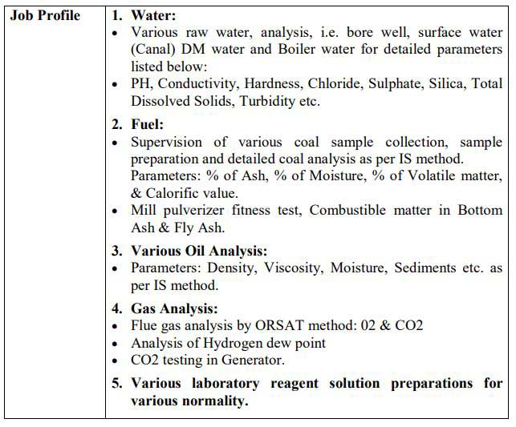

**GSECL Recruitment 2019**: Gujarat State Electricity Corporation Limited has Published notification For Lab Tester Vacancy. Good Chance For Those Candidates Who finding **Govt job in Gujarat**. To know About **GSECL vacancy 2019** Details Like Education Qualification, Age Limits, Salary, Exam Info, Etc. is Given in this page also, **GSECL Recruitment 2019 Notification PDF** Link is Available in This Page Below. **GSECL online registration** is Starts on 06-09-2019 to 26-09-2019. Interested & Eligible Candidates can apply online before the Last date is gone.

## GSECL Recruitment 2019 for 35 Lab Tester Post Vacancy @gsecl.in

<table style="height: 654px; width: 84.9475%; border-collapse: collapse; border-style: double;"><tbody><tr style="height: 80px;"><td style="width: 100%; text-align: center; height: 50px;" colspan="2">Gujarat State Electricity Corporation Limited

GSECL Recruitment 2019

Lab Tester Vacancy

Approx 35 Vacancies</td></tr><tr style="height: 30px;"><td style="width: 100%; height: 30px; background-color: #2a5a8e; text-align: center;" colspan="2"><h3><strong>GSECL Vacancy Important Dates</strong></h3></td></tr><tr style="height: 22px;"><td style="width: 50%; text-align: center; height: 22px;">Starting Date for GSECL online registration</td><td style="width: 50%; text-align: center; height: 22px;">06-09-2019</td></tr><tr style="height: 22px;"><td style="width: 50%; text-align: center; height: 22px;">Last Date for GSECL online registration</td><td style="width: 50%; text-align: center; height: 22px;">26-09-2019</td></tr><tr style="height: 30px;"><td style="width: 100%; height: 30px; background-color: #2a5a8e; text-align: center;" colspan="2"><h3><strong>&nbsp;Lab Tester Vacancy Details</strong></h3></td></tr><tr style="height: 22px;"><td style="text-align: center; height: 22px; width: 50%;">Job Recruitment Board</td><td style="text-align: center; width: 50%;">Gujarat State Electricity Corporation Limited</td></tr><tr><td style="text-align: center; width: 50%;">Post</td><td style="text-align: center; width: 50%;">Lab Tester</td></tr><tr><td style="text-align: center; width: 50%;">No of Vacancies</td><td style="text-align: center; width: 50%;">35</td></tr><tr><td style="text-align: center; width: 50%;">Job Location</td><td style="text-align: center; width: 50%;">Gujarat</td></tr><tr><td style="text-align: center; width: 50%;">Application Mode</td><td style="text-align: center; width: 50%;">Online</td></tr><tr><td style="text-align: center; width: 100%;" colspan="2"></td></tr><tr style="height: 30px;"><td style="width: 100%; height: 30px; background-color: #2a5a8e; text-align: center;" colspan="2"><h3><strong>GSECL Recruitment Eligibility Criteria&nbsp;</strong></h3></td></tr><tr style="height: 14px;"><td style="width: 50%; text-align: center; height: 14px;"><strong>Education Qualification</strong></td><td style="width: 50%; text-align: center; height: 14px;"><strong>Age Limits</strong></td></tr><tr style="height: 30px;"><td style="width: 50%; text-align: center; height: 30px;">Full time /Regular B.Sc.(Chemistry) with minimum Second Class from recognized University.</td><td style="width: 50%; text-align: center; height: 30px;">For Unreserved Category: 35 years For SC, ST, SEBC and EWS category: 40 years on 06.09.2019.</td></tr><tr><td style="width: 100%; background-color: #2a5a8e; text-align: center;" colspan="2"><h3><strong>Lab Tester Salary/Pay Scale</strong></h3></td></tr><tr><td style="width: 100%; text-align: center;" colspan="2">Rs.25000-55800 (Revised) plus other allowances as per Company’s rules.</td></tr><tr style="height: 30px;"><td style="width: 100%; height: 30px; background-color: #2a5a8e; text-align: center;" colspan="2"><h3><strong>Lab Tester Application Fee&nbsp;</strong></h3></td></tr><tr style="height: 30px;"><td style="width: 100%; text-align: center; height: 30px;" colspan="2"><ul><li style="text-align: left;">SEBC, EWS and UR Candidates: Rs. 500/-</li><li style="text-align: left;">SC/ST Candidates: Rs. 250/-</li><li style="text-align: left;">Payment Mode: Online</li></ul></td></tr><tr style="height: 30px;"><td style="width: 100%; height: 30px; background-color: #2a5a8e; text-align: center;" colspan="2"><h3><strong>GSECL Recruitment Important Links&nbsp;</strong></h3></td></tr><tr style="height: 10px;"><td style="width: 50%; text-align: center; height: 10px;"><strong>Apply Online&nbsp;</strong></td><td style="width: 50%; text-align: center; height: 10px;"><strong><a href="https://gsecl3.onlineregistrationform.org/GSECL/" target="_blank" rel="noopener noreferrer">Click Here</a></strong></td></tr><tr><td style="width: 50%; text-align: center;"><strong>Syllabus &amp; Exam Pattern</strong></td><td style="width: 50%; text-align: center;"><a href="https://freegovtjobalert.in/gsecl-lab-tester-exam-syllabus-exam-pattern/" target="_blank" rel="noopener noreferrer"><strong>Click Here</strong></a></td></tr><tr style="height: 36px;"><td style="width: 50%; text-align: center; height: 23px;"><strong>Notification</strong></td><td style="width: 50%; text-align: center; height: 23px;"><a href="https://freegovtjobalert.in/wp-content/uploads/2019/09/GSECL-Recruitment-Lab-Tester-Vacancy-Notification.pdf" target="_blank" rel="noopener noreferrer"><strong>Click Here</strong></a></td></tr><tr style="height: 10px;"><td style="width: 50%; text-align: center; height: 10px;"><strong>&nbsp;Official Website</strong></td><td style="width: 50%; text-align: center; height: 10px;"><a href="http://www.gsecl.in" target="_blank" rel="noopener noreferrer"><strong>Click Here</strong></a></td></tr></tbody></table>

### How to Apply For GSECL Recruitment 2019 For Lab Tester Post?

1. Candidates are required to apply On-line Application only through [www.gsecl.in](http://www.gsecl.in)
2. The candidates shall have to generate application number by registering On-line by filling up the Online Application Form and follow step by step instructions.
3. The link for Online Application will open from 06.09.2019. Interested candidates meeting with above criteria may apply “On-line” on or before 26.09.2019 before 06.00 P.M
4. Candidates are requested to apply only if they are fulfilling requisite criteria. Since we are not seeking all the documents at the time of application; the candidate has to doubly ensure that he fulfills all the requisite criteria. All the documents of selected Candidates shall be verified at the appropriate stage and if found not fulfilling any criteria, his candidature shall be canceled immediately and his shortlisting in selection list shall not be a ground for claiming employment/ recruitment.
5. Candidates who have completed all the tasks of the On-line Application process shall only be considered for further selection process.
6. Done
