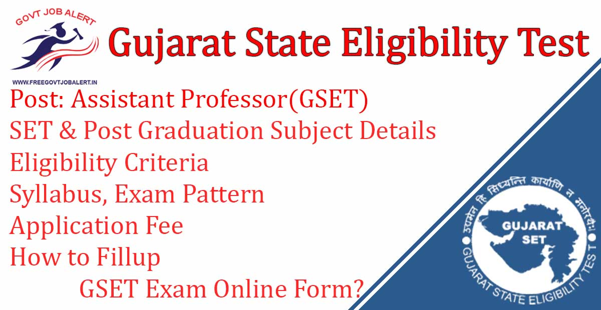
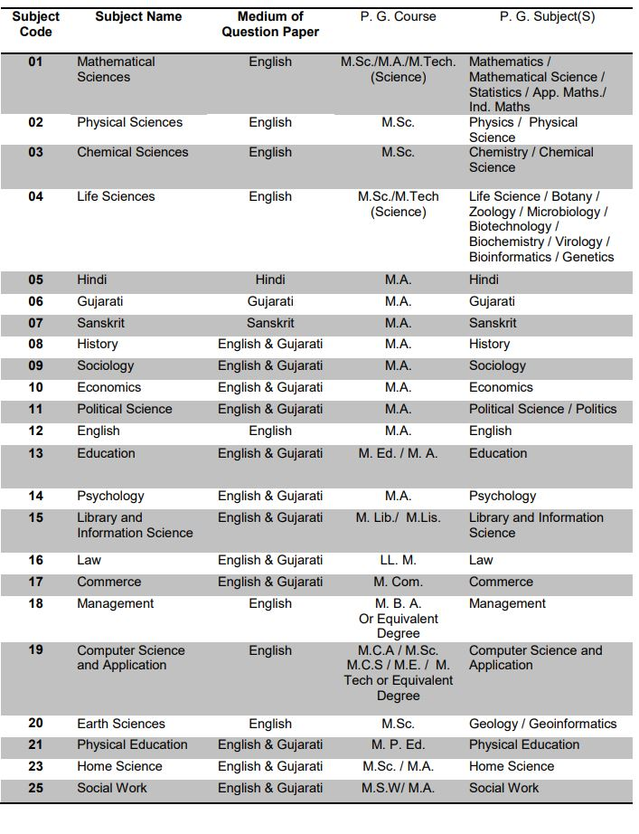
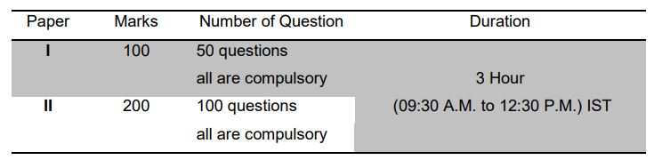
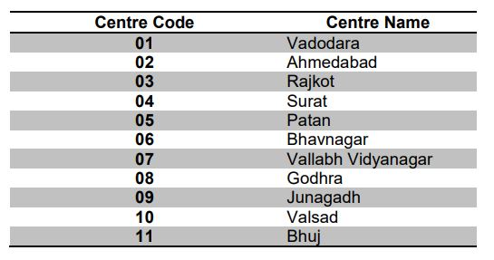

\[caption id="attachment\_1641" align="aligncenter" width="1200"\] GSET Exam for Assistant Professor\[/caption\]

GSET Exam 2019: The Maharaja Sayajirao University of Baroda, Vadodara Has Released Notification Regarding GSET Exam 2019. The Maharaja Sayajirao University of Baroda, Vadodara, the Nodal Agency announces holding of the 14th Gujarat State Eligibility Test (GSET) for determining the Eligibility of Gujarat state’s Candidates for Assistant Professor in universities and colleges of Gujarat State. The Maharaja Sayajirao University of Baroda, Vadodara, State Agency will conduct GSET in 23 subjects at 11 Centres spread across the Gujarat state.

## **GSET Exam 2019**

<table style="border-collapse: collapse; width: 100%;"><tbody><tr><td style="width: 50%; background-color: #2a5a8e; text-align: center;" colspan="2"><strong>Gujarat SET 2019</strong></td></tr><tr><td style="width: 50%; text-align: center;">Exam Board</td><td style="width: 50%; text-align: center;">Maharaja Sayajirao University of Baroda, Vadodara</td></tr><tr><td style="width: 50%; text-align: center;">Exam Name</td><td style="width: 50%; text-align: center;">Gujarat State Eligibility Test</td></tr><tr><td style="width: 50%; text-align: center;">Post</td><td style="width: 50%; text-align: center;">Assistant Professor</td></tr><tr><td style="width: 50%; text-align: center;">Job Location</td><td style="width: 50%; text-align: center;">Gujarat</td></tr><tr><td style="width: 50%; text-align: center;">Job Type</td><td style="width: 50%; text-align: center;">State Eligibility Test</td></tr><tr><td style="width: 50%; text-align: center;">Application Mode</td><td style="width: 50%; text-align: center;">Online</td></tr></tbody></table>

Gujarat SET Exam Notification 2019 Published on His Official Website. The Candidates Should Have a Master's Degree. Interested & Eligible Candidates Can Fill Up GSET Exam 2019 Application Form. GSET Exam 2019 Online Form Has to Started From 04-11-2019 to 30-11-2019 at Gujaratset.in

<table style="border-collapse: collapse;"><tbody><tr><td style="width: 50%; background-color: #2a5a8e; text-align: center;" colspan="2"><h3><strong>GSET Exam Date 2019</strong></h3></td></tr><tr><td style="width: 50%; text-align: center;">Starting Date of Online Application</td><td style="width: 50%; text-align: center;">04-11-2019</td></tr><tr><td style="width: 50%; text-align: center;">Last Date of Online Application</td><td style="width: 50%; text-align: center;">30-11-2019</td></tr><tr><td style="width: 50%; text-align: center;">Application Fee</td><td style="width: 50%; text-align: center;">04-11-2019 to 30-11-2019</td></tr><tr><td style="width: 50%; text-align: center;">GSET Admit Card Date</td><td style="width: 50%; text-align: center;">3rd Week of December 2019</td></tr><tr><td style="width: 50%; text-align: center;">GSET Exam Date</td><td style="width: 50%; text-align: center;">29-11-2019</td></tr></tbody></table>

To Know About GSET Exam 2019 Details Like Eligibility Criteria, Post Graduation Subject, Application Fee, GSET Exam Pattern, Syllabus of GSET Exam, Exam Centers, How to apply, etc. Given Below.

### **SET & Post Graduation Subject Details**

### **GSET Exam Eligibility Criteria**

Education Qualification

- The candidates must have a Master’s Degree recognized by U.G.C., in a subject of GSET.

### **GSET Exam Pattern**

GSET Examination will consist of two papers. Both the papers will consist of only objective type questions and will be held as under:

**Paper- I** shall consist of 50 objective type compulsory questions each carrying 2 marks. The questions which will be general, intended to assess the teaching/research aptitude of the candidate. It will primarily be designed to test reasoning ability, comprehension, divergent thinking and general awareness of the candidate.

**Paper-II** shall consist of 100 objective type compulsory questions each carrying 2 marks which will be based on the subject selected by the candidate.

- The questions in both the papers will appear in both Gujarati and English versions.
- The candidate will have to mark the responses for questions of Paper – I and Paper – II on the Optical Mark Reader (OMR) Sheet provided.
- There are no negative marks for incorrect answers.
- Candidates must appear in both the papers. A candidate who does not appear in Paper-I, will not be permitted to appear in Paper-II.
- The candidate shall have to return the original OMR Sheet of Paper - I and Paper - II to the Invigilator before leaving the examination hall/room. However, candidates are allowed to carry the Test Booklets of Paper - I and II along with a duplicate copy (carbonless copy) of the OMR Sheet on the conclusion of examination.
- There is no provision of re-evaluation/re-checking of results. No correspondence in this regard shall be entertained.

### **GSET Exam Syllabus**

- Applicants Can Download Subject Wise GSET Syllabus PDF From [Here](https://www.gujaratset.in/eng/03syllabus)

### **GSET Exam Admit Card 2019**

- GSET 2019 Admit Card Will be Released Before a Week of Exam.
- Candidates Can Download GSET 2019 Admit Card From Official Website.
- No GSET Exam hall ticket will be sent to the candidates by post.
- Candidates Should not Forget their Admit Card while Going to Attend Exam Otherwise he/She will not be allowed to seat in the exam.

### **GSET Examination Center**

### **GSET Selection Process**

- Candidates Selection Process will be based on the performance in the GSET Entrance Exam conducted by The Maharaja Sayajirao University of Baroda, Vadodara, State Agency.
- Candidates will be shortlisted based on marks scored in the Entrance Exam.

### **GSET Application Fee**

- General / Gen – EWS / SEBC (Non-creamy layer) Candidates: Rs. 900/- + Bank Charges
- SC / ST / Transgender Candidates: Rs. 700/- + Bank Charges
- PWD (PH/VH) Candidates: Rs. 100/- Bank Changes
- Payment Mode: Credit Card / Debit Card / Net Banking

### **How to Fillup GSET Exam Online Form 2019**

Candidates Fellow two Steps While Filling GSET Application Form:

1\. Pay Examination Fee

- Candidates visit GSET Official website and Pay Application Fee, Processing Changes as Applicable, can be paid only through online mode.
- After Payment Candidates Get Order Number and SBIepay Reference ID.
- Candidates Should Note Down their Order Number and SBIepay Reference ID For Next Step.

2\. Register Online for GSET

- Enter Candidates Order Number and SBIepay Reference ID to Login.
- Filling up Application Form for GSET.
- After the Fillup Submit Application form.
- After successful submission and confirmation, the candidate should take a printout of filled online Application Form for future use.

### **Important Links For GSET 2019**

- GSET Exam Application Online Form 2019: [Click Here](https://www.gujaratset.in/)
- Download GSET 2019 Exam Notification 2019 PDF: [Click Here](https://www.gujaratset.in/download/info_bulletin_2019.pdf)
- GSET Official Website: [Click Here](https://www.gujaratset.in/)

Candidates can visit www.gujaratset.in to get more details about Gujarat State Eligibility Test (GSET) for Assistant Professor. To More Information Gujarat State Eligibility Test (GSET) for Assistant Professor latest Updates, Admit Card, Old Question Papers, Old Answer Key, Syllabus, Result, Etc. It will be published on the official website. Also, visit Regularly our website [www.freegovtjobalert.in](https://freegovtjobalert.in) for getting the Latest job Updates.
